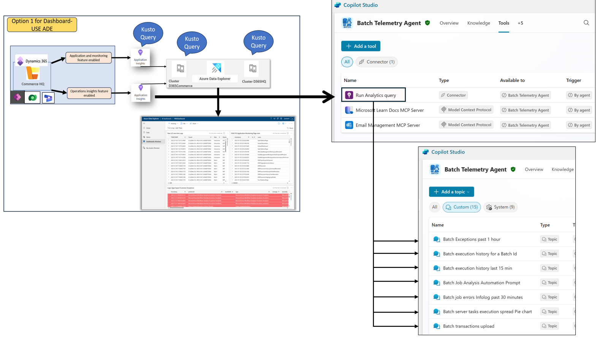
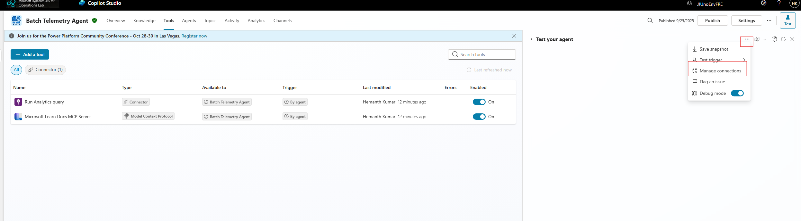

# Batch Framework Telemetry Agent

## 📚 Table of Contents
- [Overview](#-overview)
- [Key-Capabilities](#-key-capabilities)
- [Architecture](#-architecture)
- [Prerequisites](#-prerequisites)
- [Step-1---Telemetry-Configuration](#-step-1---telemetry-configuration)
- [Step-2---Agent-Deployment](#-step-2---agent-deployment)
- [Step-3---Knowledge-Source-Integration](#-step-3---knowledge-source-integration)
- [Usage](#-usage)
- [Resources](#-resources)
- [Contributors](#-contributors)

## 🧠 Overview

The Batch Telemetry Agent is an AI-powered monitoring and diagnostic solution designed to optimize batch job execution within Dynamics 365 SCM & Finance. It leverages telemetry streamed into Azure Application Insights and integrates with **Copilot Studio** to provide actionable insights, alerts, and automation capabilities.

## 🔧 Key Capabilities

- **Telemetry Collection**: Captures signals such as job start/end times, thread usage, throttling metrics, queue sizes, failures, and Infolog errors.
- **Prompt-Based Analysis**: Uses GPT-4o and GPT-5 models to interpret telemetry data via natural language prompts.
- **Anomaly Detection**: Applies Kusto (KQL) queries and AI models to detect performance degradation and scheduling inefficiencies.
- **Self-Healing Options**: Supports guided or autonomous remediation actions like restarting failed jobs.
- **Visualization & Reporting**: Offers dashboards for workload distribution, priority spread, throttling trends, and batch exceptions.

## 🏗️ Architecture

  

- **Telemetry Flow**: Batch Telemetry events from D365 F&O are streamed to Application Insights.
- **Agent Logic**: Queries telemetry periodically or on-demand, evaluates rules, and stores results in Dataverse.
- **User Interaction**: Users engage via Copilot chat, M365 chat, or Teams channels.
- **Remediation Execution**: Actions are triggered via MCP Server and verified through telemetry feedback loops.

## ✅ Prerequisites

- Dynamics 365 Finance & Supply Chain version 10.0.45(7.0.7690.21 PU69 or later
- Azure Application Insights configured for batch telemetry
- Access to Copilot Studio and Power Automate

## 🛠️ Step 1 - Telemetry Configuration

- Ensure batch telemetry is enabled in D365 F&O and connected to Application Insights  
  [Monitoring Telemetry](https://learn.microsoft.com/en-us/dynamics365/fin-ops-core/dev-itpro/monitoring-telemetry/)  
  [Getting Started](https://learn.microsoft.com/en-us/dynamics365/fin-ops-core/dev-itpro/monitoring-telemetry/monitoring-getting-started)

## 🛠️ Step 2 - Agent Deployment

### Import the agent Solution into maker portal.
- clone the repository or just download the solution from the repository.
- go to make.powerapps.com
- click on Import solution 

- While importing, the wizard will ask you to sign in to the connections required for the Batch Agent to work.
- Once you click 'Import', the solution will start importing. It will take a while to import and once done, you will see a banner indicating the importing is complete

- Once imported successfully, you will see a message like this:

- After successful import click on the imported solution and verify all the compoennts are installed

### Agent Verification.
- Once the solution is imported successfully, login to https://copilotstudio.preview.microsoft.com and ensure you are in the right environment. you should see the "Batch Agent"

- Go to Manage connections from the test pane

- Ensure that all the connections are showing as connected. if not, create connection. 

- For creating Application Insights connection you will need ApId and API Key for your application Insights instance. 

## 🛠️ Step 3 - Knowledge Source Integration

- Connect Microsoft Learn Docs MCP Server for contextual guidance.

## 🧪 Usage

### 💬 Prompt Examples

- Show me last 1 hour Priority distribution
- Were any of my batch jobs throttled recently?
- How many threads are currently available for batch jobs?
- Provide details about recent batch job failures.
- Show CPU, Memory, and SQL DTU metrics during batch throttling events.
- Batch Execution History for a Batch Job Id

### ⚙️ Further Automation Scenarios
- Restart failed jobs based on error codes.
- Notify admins via Teams when anomalies are detected.

## 📎 Resources

- [📦 Batch Telemetry Dashboard Release](https://github.com/microsoft/Dynamics-365-FastTrack-FSCM-Telemetry-Samples/releases/tag/Batch-1.0.0.0)
- [📘 Application Insights Documentation](https://learn.microsoft.com/en-us/dynamics365/fin-ops-core/dev-itpro/analytics/application-insights)

## 👥 Contributors

- Prashant Verma (AI Business Solutions)
- Hemanth Kumar

---

📬 For questions or support, contact the AI Business Solutions team or refer to the internal documentation shared via Teams and email.
