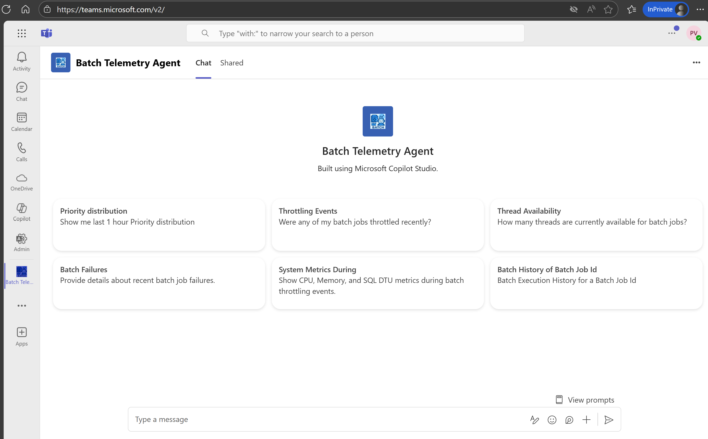
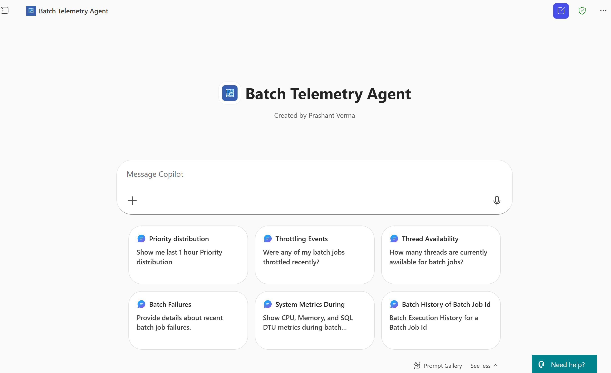
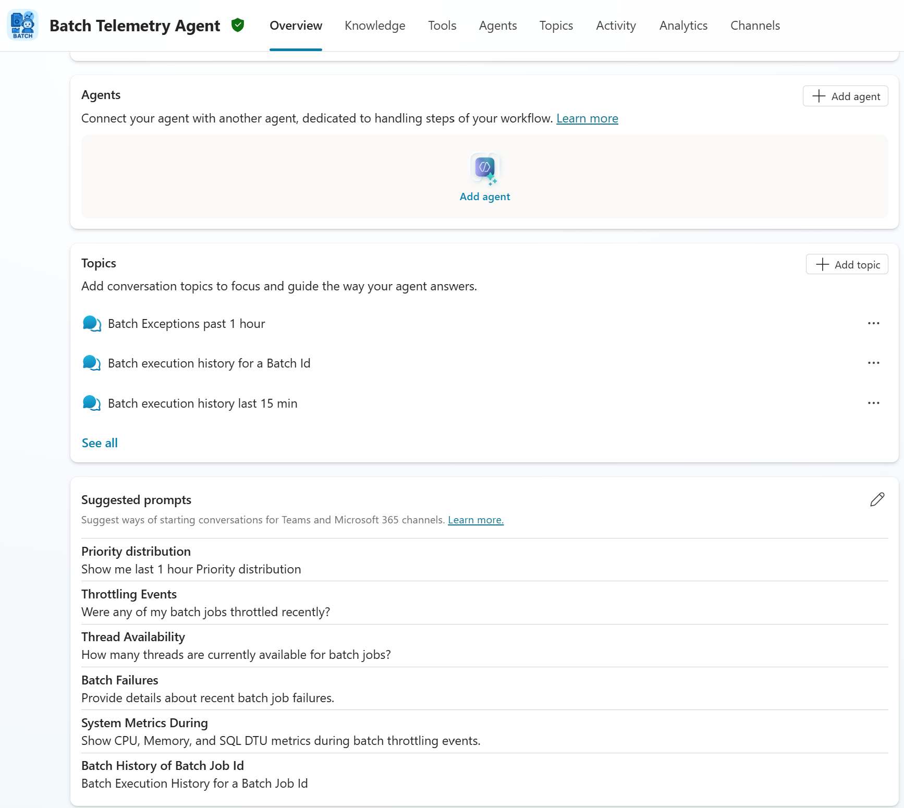
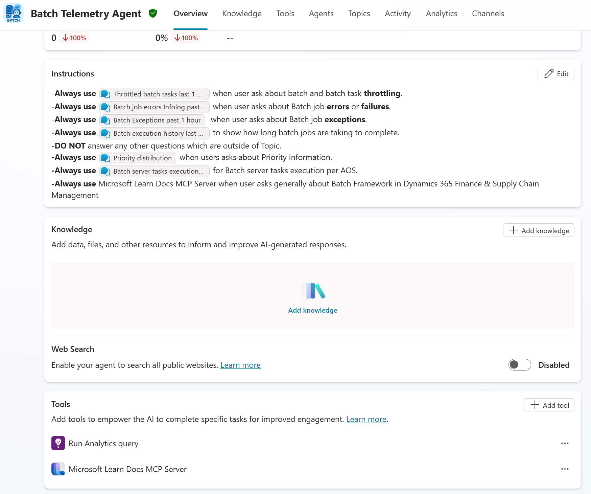
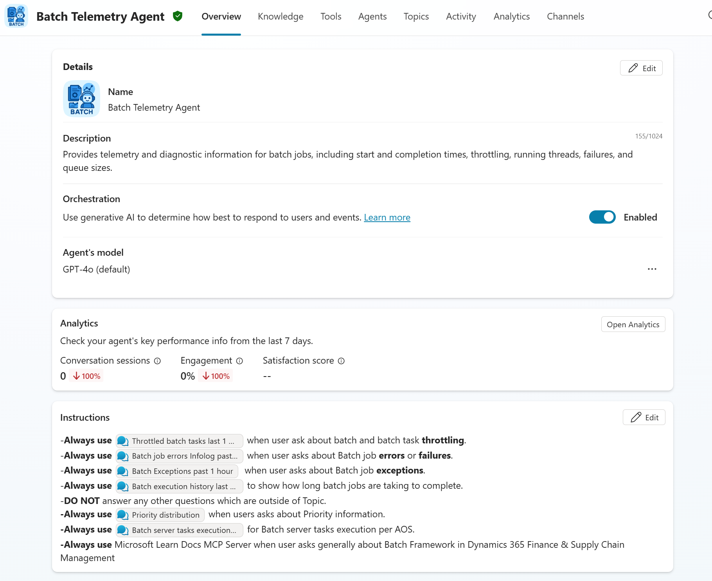
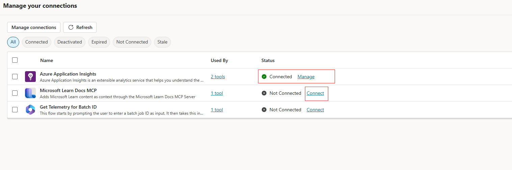

# Batch Framework Telemetry Agent

> AI-powered monitoring & diagnostics for D365 Finance & Supply Chain batch jobs, built with **Copilot Studio** and **Application Insights**.

 

## 📚 Table of Contents
- [Overview](#-overview)
- [Key Capabilities](#-key-capabilities)
- [Screenshots](#-screenshots)
- [Architecture](#-architecture)
- [Prerequisites](#-prerequisites)
- [Install & Configure](#-install--configure)
  - [1) Import Solution](#1-import-solution)
  - [2) Verify Agent & Connections](#2-verify-agent--connections)
  - [3) Knowledge Source (Optional)](#3-knowledge-source-optional)
- [Usage](#-usage)
- [Automation Ideas](#-automation-ideas)
- [Troubleshooting](#-troubleshooting)
- [FAQ](#-faq)
- [Resources](#-resources)
- [Contributors](#-contributors)

---

## 🧠 Overview
The **Batch Telemetry Agent** optimizes batch job execution in Dynamics 365 by combining **Application Insights telemetry** with Copilot Studio. It answers natural-language questions, surfaces anomalies, and can guide or automate remediations.

## 🔧 Key Capabilities
- **Telemetry collection** across job start/end, thread usage, throttling, queue sizes, failures, and Infolog errors.  
- **Prompt-based analysis** (GPT-4o / GPT-5 ready) to query and interpret telemetry using KQL.  
- **Anomaly detection** for throttling, long runtimes, and scheduling inefficiencies.  
- **Self-healing hooks** to trigger safe recovery steps (e.g., rerun failed jobs).  
- **Dashboards & reports** for priority distribution, throttling trends, exceptions, and history.

---

## 🖼️ Screenshots
> Add these right up front so users immediately see what they’re getting.

   
  Teams app home with quick prompts

   
  Copilot Studio chat with quick prompts

   
  Copilot Studio Overview & Topics

   
  Agent instructions and connected tools

   
  Agent details and orchestration model

---

## 🏗️ Architecture

  

**Flow**
1. D365 F&O emits batch telemetry → **Application Insights**.  
2. The agent runs KQL via a tool connection to App Insights.  
3. Users interact via **Teams / M365 Chat / Copilot Studio**.  
4. Optional remediation is invoked and validated via telemetry feedback.

---

## ✅ Prerequisites
- **D365 F&SCM** 10.0.45 (7.0.7690.21 / PU69) or later  
- **Application Insights** connected for batch telemetry  
- Access to **Copilot Studio** and **Power Automate**  
- **App Insights API Access** (Application ID + API Key) for query tool

---

## 🚀 Install & Configure

### 1) Import Solution
1. Clone or download this repository’s release **solution** file.  
2. Go to **make.powerapps.com** → **Solutions** → **Import**.  
   

3. The wizard prompts to **create/sign in** to required connections.  
4. Click **Import** and wait for completion.  
   

5. On success, you’ll see confirmation:  
   

   

6. Open the solution and verify components:  
   

### 2) Verify Agent & Connections
1. Open **copilotstudio.preview.microsoft.com** and select the correct environment.  
   You should see **“Batch Telemetry Agent.”**  
   

2. In the test pane, choose **Manage connections**.  
   

3. Ensure all are **Connected**; create missing ones if needed.  
   

4. For **Application Insights**, provide **Application (App) ID** and **API Key**.  
   

> **Note:** If your tenant/org enforces SSO/2FA, ensure your connections are authorized for the environment hosting the agent.

### 3) Knowledge Source (Optional)
- Add the **Microsoft Learn Docs MCP Server** (or other approved knowledge) to enrich answers to “how/why” questions about Batch Framework.

---

## 🧪 Usage

### Suggested Prompts (cards shown in UI)
- “Show me last 1 hour **Priority distribution**.” 
- “Were any of my batch jobs **throttled** recently?” 
- “How many **threads** are currently available for batch jobs?” 
- “Provide details about recent **batch job failures**.” 
- “Show **CPU, Memory, and SQL DTU** metrics during batch throttling events.” 
- “**Batch Execution History** for Batch Job Id `<ID>`.”

> Results are backed by KQL queries against your App Insights instance.

---

## ⚙️ Automation Ideas
- Auto-rerun failed jobs when the error code matches an approved policy.  
- Post anomaly digests to a **Teams** channel daily.  
- Trigger escalation if throttling breaches an agreed threshold.

---

## 🧩 Troubleshooting
- **Agent not visible in Copilot Studio:** Confirm environment, security roles, and solution import status.  
- **Query errors:** Verify App Insights **Application ID / API Key** and workspace mapping.  
- **No telemetry returned:** Check D365 → App Insights connection and time range.  
- **Connection shows “Not connected”:** Re-authenticate; some orgs require SSO **authorization per environment**.

---

## ❓ FAQ
**Q: Does this change batch schedules?**  
A: No—by default it is read-only. Optional flows can be enabled for safe actions.

**Q: Can we swap models?**  
A: Yes. The agent uses the environment’s default model (e.g., GPT-4o). You can change this in Copilot Studio.

**Q: Multi-environment support?**  
A: Yes. Create separate connections per environment and parameterize the workspace if needed.

---

## 📎 Resources
- 📦 [Batch Telemetry Dashboard Release](https://github.com/microsoft/Dynamics-365-FastTrack-FSCM-Telemetry-Samples/releases/tag/Batch-1.0.0.0)  
- 📘 [Monitoring telemetry overview](https://learn.microsoft.com/en-us/dynamics365/fin-ops-core/dev-itpro/monitoring-telemetry/)  
- 🚀 [Monitoring: getting started](https://learn.microsoft.com/en-us/dynamics365/fin-ops-core/dev-itpro/monitoring-telemetry/monitoring-getting-started)

---

## 👥 Contributors
- Prashant Verma (AI Business Solutions)  
- Hemanth Kumar