# Sales Order Processor Agent
# Table of contents
1. [Use Case](#usecase)
2. [Prerequisites](#prerequisites)
3. [Sales Order Agent Components](#salesorderagent)
4. [Install and configure the Sales Order Agent](#configuration)

# 🧩 Use Case 
Sales Order Agent is an autonomous agent for processing sales orders received via email attachments, validating customer and product data, and creating orders in Dynamics 365 finance and operation apps with minimal human intervention. 

1. Email received with attachments in personal or shared mailbox: 

2. Each attachment and the extracted data saves to Dataverse: 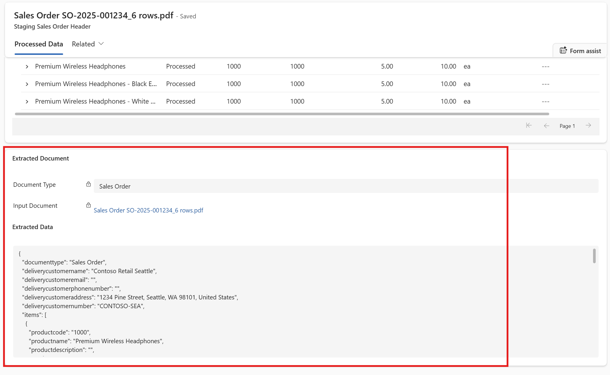 

    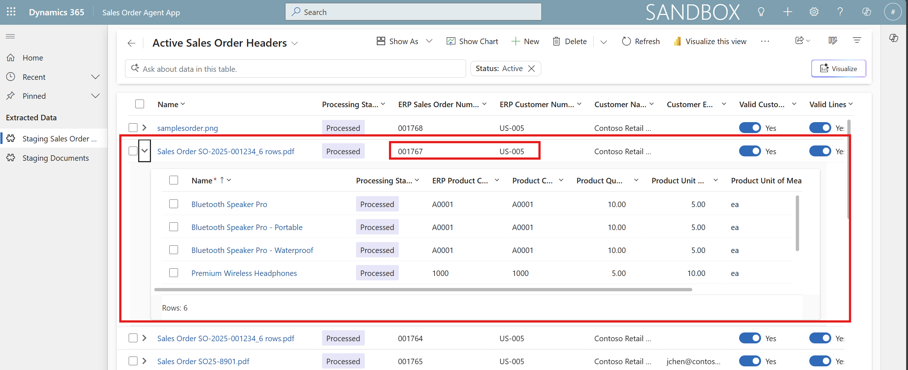
    

3. After validating the customer and products, the sales order gets created in Dynamics 365 and a notification is also sent:
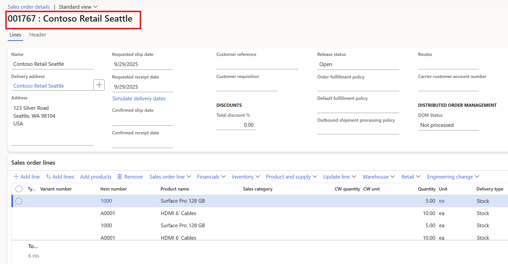

   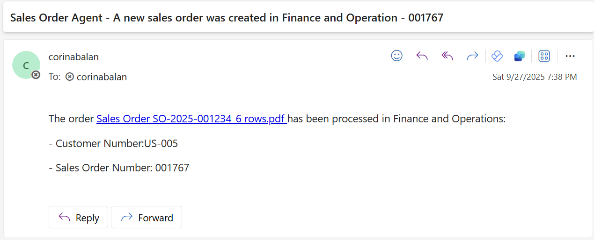

## Solution Capabilities
- **Autonomous Email Processing**: Monitors mailbox for email attachments
- **AI-Powered Document Parsing**: Extracts structured data from PDF/image attachments
- **ERP Integration**: Validates customers/products and creates orders in ERP
- **Exception Handling**: Routes items requiring manual review
-	**Automated Notifications**: Sends processing status updates
- **Supported File Types**: PDF documents, image files (JPG, PNG, etc.)

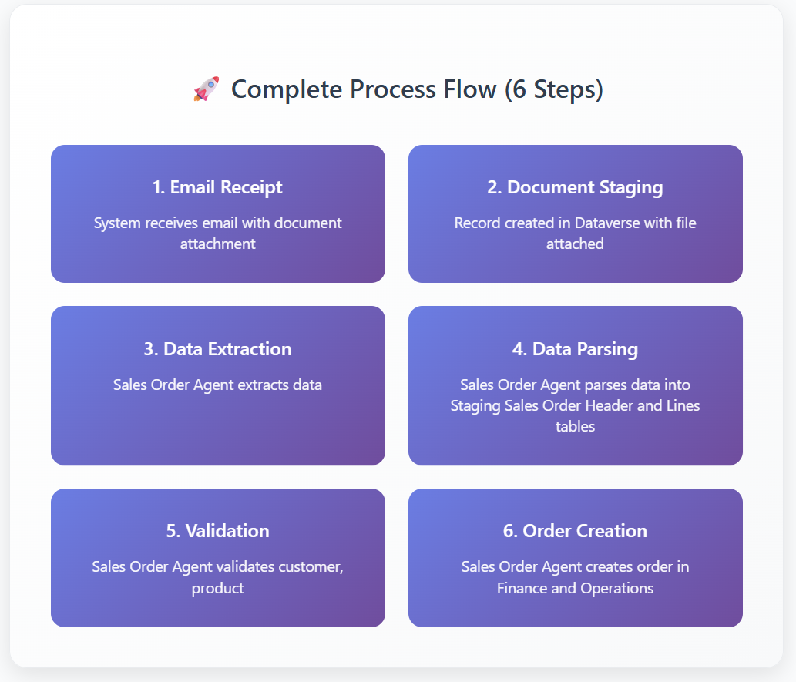

# ✅ Prerequisites for installing the Sales Order Agent solution
 - Connected Dataverse environment with an environment with  finance and operations apps. To confirm this, you can check in the Power Platform Admin Portal for a given environment that there is a corresponding link to Dynamics 365.
 - The user who installs the Sales Order Agent solution must be a licensed user in Dynamics 365.
 - Dataverse virtual tables enabled: Released products V2 (mserp), Customers V3 (mserp). Learn more about how to enable virtual tables in Dataverse at https://learn.microsoft.com/en-us/dynamics365/fin-ops-core/dev-itpro/power-platform/enable-virtual-entities.
 - Sales Order agent solution imported and agent configured as indicated in the next section.
 - System Administrator role for solution import and agent configuration.

# 🤖 Sales Order Agent Components
The agent orchestrates the entire sales order processing workflow, 
invokes appropriate agent flows based on the staging record processing status, and handles error scenarios and routing.
## Agent Instructions:
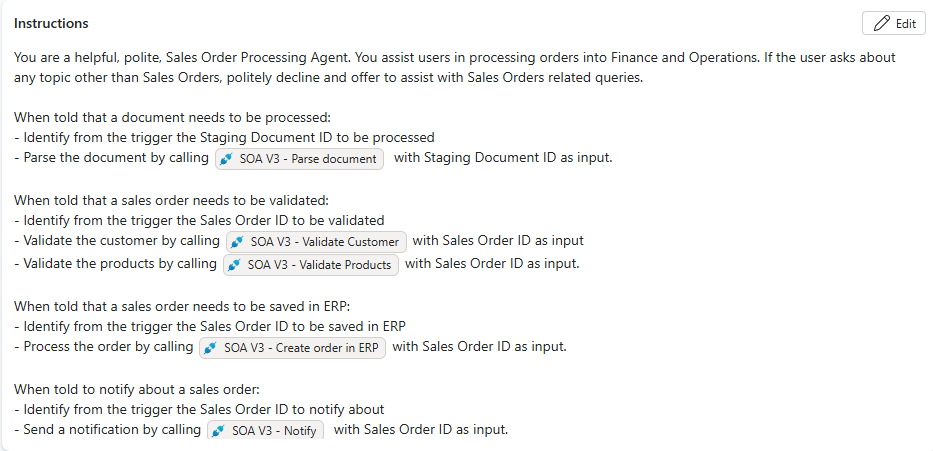

## Triggers:
-	Dataverse trigger for processing status updated
-	Office 365 triggers for new emails into personal and shared mailbox

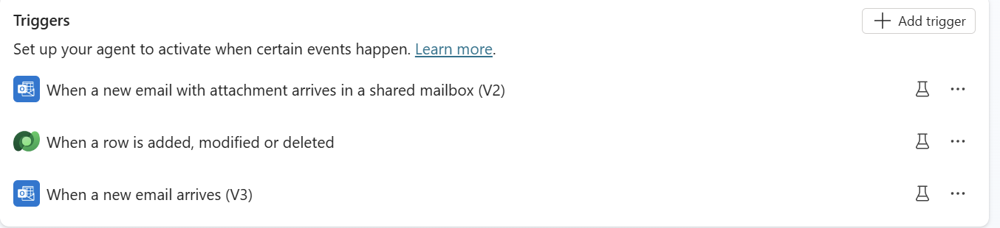

## Agent flows: 
For implementing deterministic sales order specific validation rules, as well as sales order header and lines creation, several agent flows have been created:

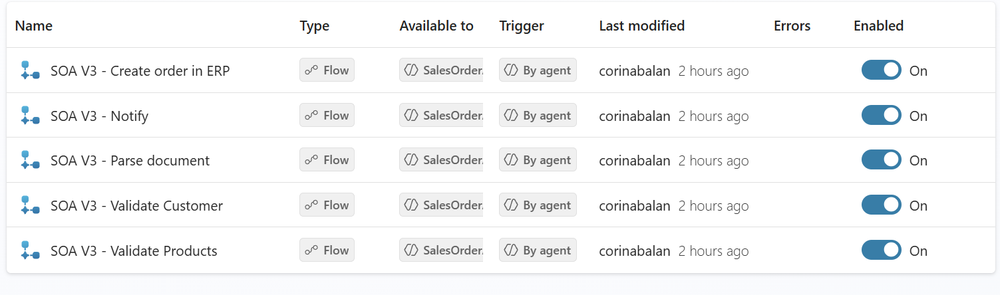

  - **Parse document** – agent flow which uses AI Builder custom prompt to extract data from email attachment in JSON format.
  - **Validate customer** – agent flow which tries to uniquely identify customer in Dynamics 365 using customer name or email.
  - **Validate products** –  agent flow which tries to uniquely identify the products in Dynamics 365 using product codes.
  - **Create order** – agent flow which creates the sales orders in Finance and Operations.
  - **Notify** – agent flow which sends emails when the sales orders are processed or need manual review.
  - **LoadSalesOrderData** - flow which splits the extracted JSON into dedicated Dataverse tables.
- **Update Processing Status to Valid** - flow which updates processing status.

## Dataverse tables
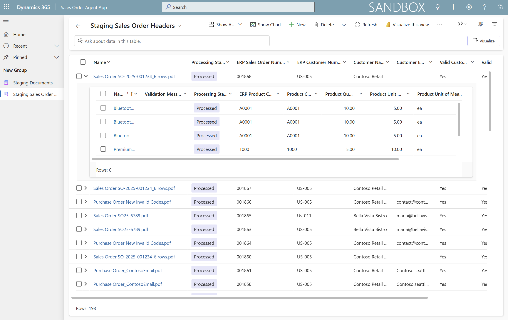
  - **Staging Document** – stores email attachments and extracted data. Key columns: 
    - **Extracted Data** - result of extraction in JSON format
    - **Input Document** - document received as email attachment

  - **Staging Sales Order Header** – stores header level data, customer information. Key columns:
    - **Processing Status** - The automatic successful status transition is New -> Valid -> Processed. For failures New -> Manual Review or New -> Valid -> Processing Failed. 
      - For a manual review scenario, the user can input manually the correct ERP Customer Numbe and ERP Product Codes and set both flags to Valid. When bot Valid Customer and Valid Products are updated to Valid, the processing status is reset to Valid and the agent tries to create the order in Finance and Operations.
    - **Valid Customer** - Automatically set by agent execution.  In case the customer  is not identified, the status is set to Manual Review and a notification is sent. A reviewer may do necessary corrections and set the flag Valid Customer to Valid.
    - **Valid Products** - Automatically set by agent execution.
    - **ERP Customer Number** - Automatically set during agent execution.
    - **ERP Sales Order Number** - Automatically set by agent execution.
    - **Customer Name** , **Customer Email** - Automatically set by agent execution. 
    - **Try again to process failed lines** - Relevent for partially created orders due to intermittent failures or after fixing data issues (e.g. products missing default site), the flag can be set to Yes to re-submit the failed lines.
    - **Validation Message** - Automatically set by agent execution.
    - **Company Code** - Automatically set by agent execution from environment variable value. For changing this behaviour and introduce multiple companies, you can extend the logic in the LoadSalesOrderData flow.
 
    
  - **Staging Sales Order Lines** –  stores line level data, product codes, product details.
    - **Processing Status** - Automatic status transitions similar to the header status transitions.
    - **Product Code**, **Product Description**, **Product Qty**, **Product uom'** - Automatically set by agent execution. 
    - **ERP Product Code** - Automatically set by agent execution. In case the product is not identified, the status is set to Manual Review and a notification is sent. A reviewer may do necessary corrections and set the flag Valid Lines to Valid.
    - **Validation Message** - Automatically set by agent execution. 
 
 If you require to capture additional fields e.g. VAT Number you'd need to update the AI Builder data extraction prompt, the header and/or lines tables depending on where the data should be stored and the LoadSalesOrderData flow to load the data from extracted JSON into the relevant Dataverse table.

## AI Builder Prompt
- **Extracts data from document** - prompt with input a file and JSON format output.
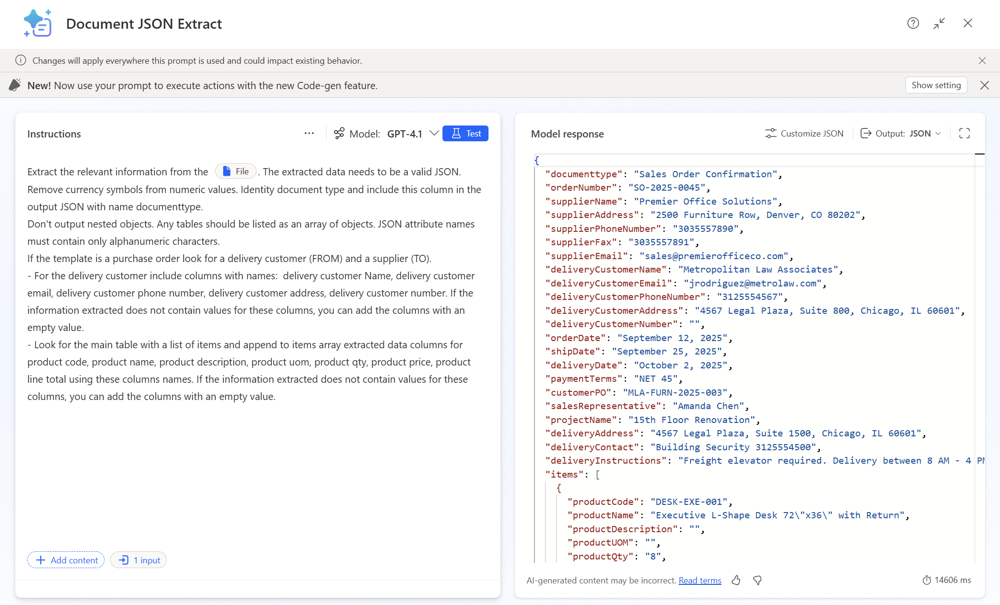

# ✅ Sales Order Agent configuration
Please consider the following to make the agent work for your specific needs and data:
 - **Update the environment variables** - when importing the solution you should provide a mailbox to monitor for incoming sales orders attachments. You can choose a shared and/or personal mailbox. Ensure to provide email for reviewer mailbox and company code. 
 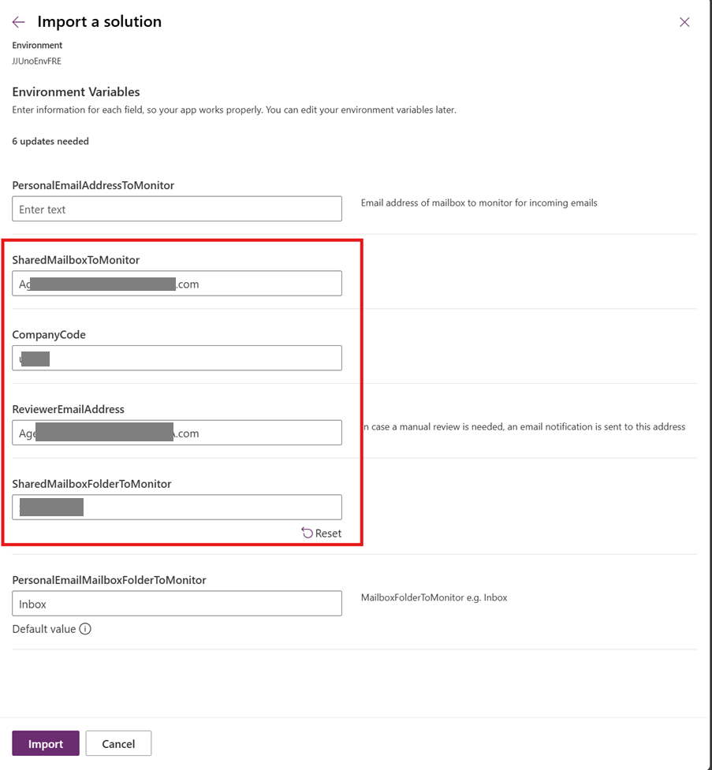

  - **Update the Finance and Operation connection** – Open the agent flows SOA V3 - Create order in ERP and update the URL in the creation action for the sales order header and sales order lines. After making the change, save and publish the agent flow.
   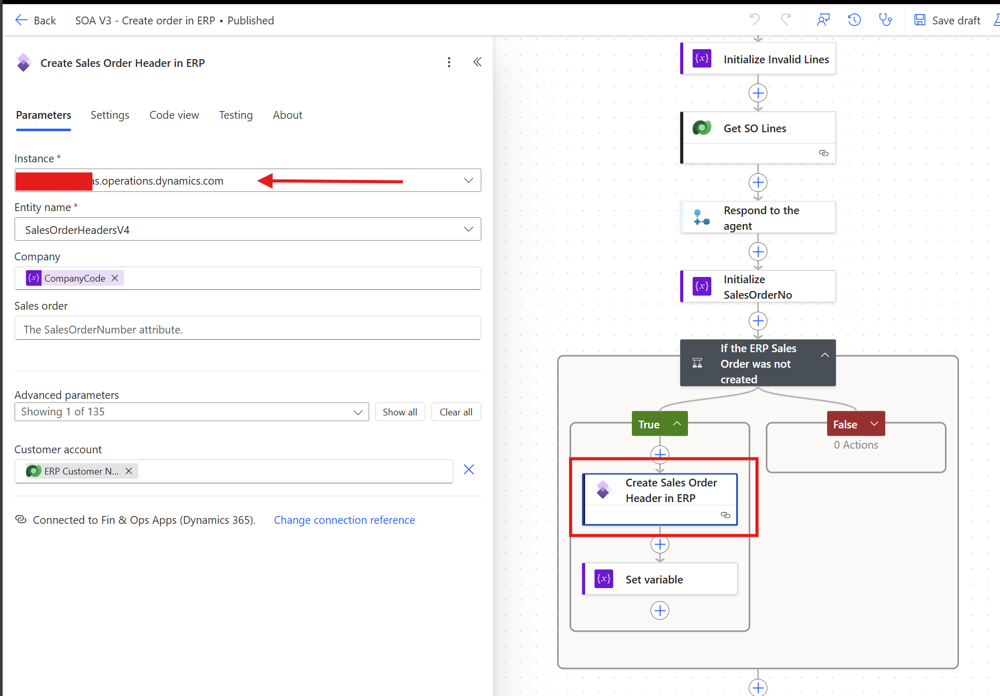
    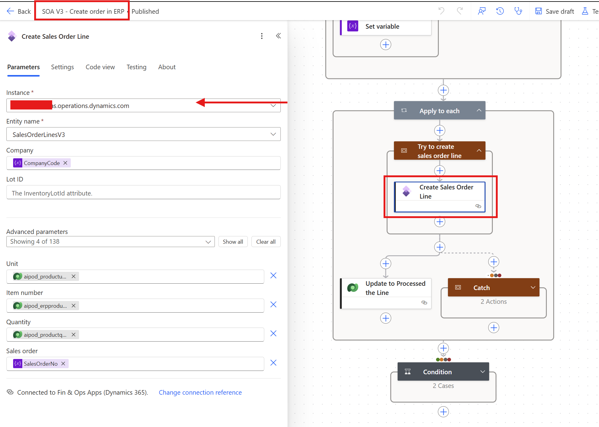

 - **Customer validation** - Sales order agent validates customer name, and if not found, will search using the email address if available in the document. The agent flows validating the customer depends on the json extracted to contain the column **deliveryCustomerName**. Consider if this is necessary for your organization, and update as needed e.g. identifying customer by VAT Number if its provided – if you'd like to change the customer validation criteria, ensure to update the AI Builder extraction prompt to collect the required fields, LoadSalesOrderData flow and SOA V3 - Validate Customer agent flow.

- **Products validation** – Sales order agent validates the product codes, and if found, when creating the sales order lines it will use the extracted product code, quantity, and unit of measure. The agent flows rely on the json extracted to contain columns **productcode, productqty, productuom**. Similarly with the customer extraction, if you need to capture different columns with your prompt, you will need to update the AI Builder extraction prompt and impacted flows: LoadSalesOrderData flow and SOA V3 - Validate Products agent flow.

- **Sample document** - You can use the attached test pdf document for testing if you have the sample data available in your Finance and Operations environment. Company Code should be usmf and the products 1000, A0001 should have  default order settings (Site and Warehouse) configured.

