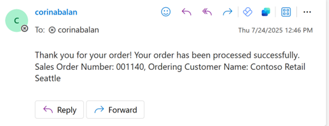
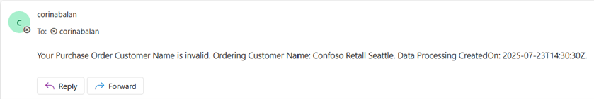
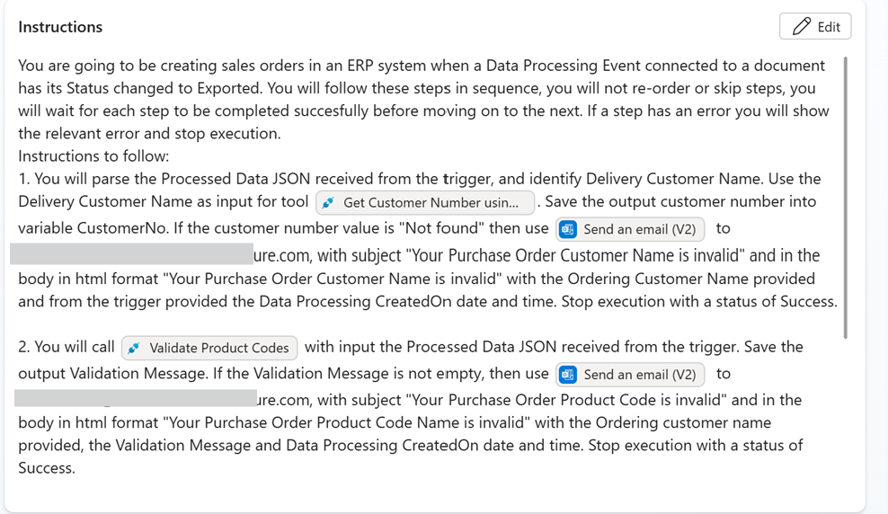
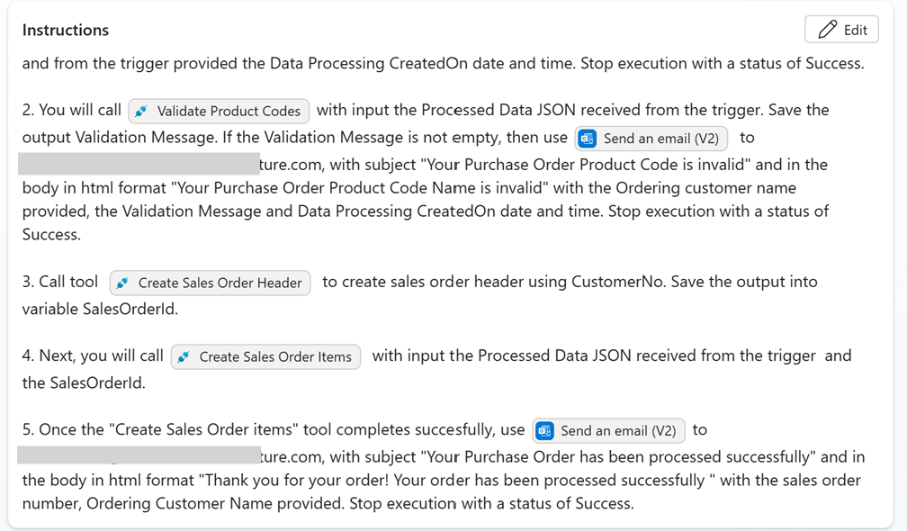
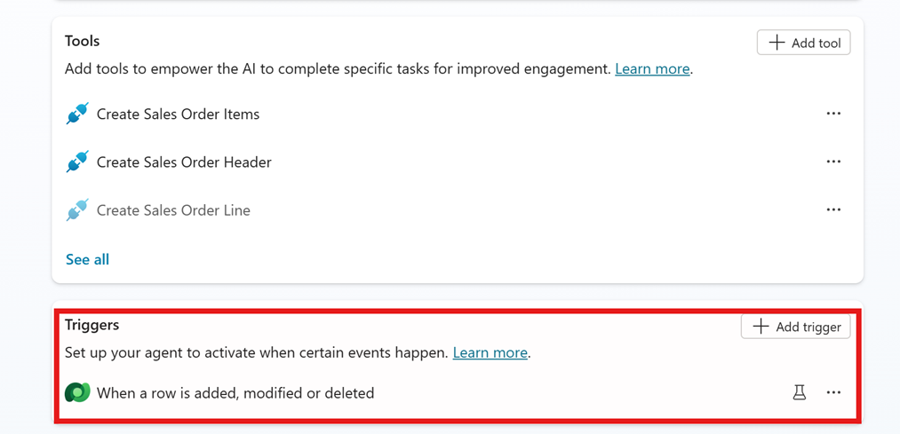
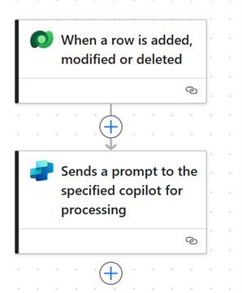
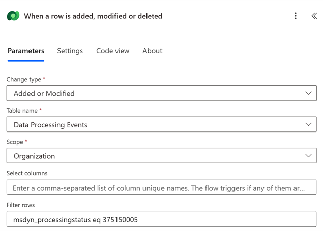

# Sales Order Processor Agent
# Table of contents
1. [Use Case](#usecase)
2. [Approach](#approach)
3. [Business Process Flow](#businessprocessflow)
4. [Document Processor Agent](#documentprocessoragent)
5. [Sales Order Processor Agent](#salesorderprocessoragent)
6. [Considerations](#considerations)
7. [Prerequisites](#prerequisites)

# 🧩 Use Case 
Streamlining and automating the intake of *sales orders* received as email attachments for seamless integration into Microsoft Dynamics 365.

# 🛠️ Approach 
The solution will lead with the built-in agent **Document Processor** for document extraction and content validation. Once the content is validated, we use a second agent to create the order and order lines into Dynamics 365.

**Step 1: Document Processor Agent**
- Monitors Exchange mailbox (personal or shared)

- When email is received, the agent persists the attachment in the Data Processing Event table in Dataverse – for each attachment a new record is created. It also parses the attachments into JSON format in the Processed Data column.

- Validates content as per validation rules which are configurable

- You can also add more advanced rules to validate content grounded in Dataverse knowledge:

- When invalid content is found, it brings human into the loop for manual review. The canvas app Validation Station helps the reviewer identify invalid content and allows to edit and make corrections as well as the option to manually approve a document.

**Step 2: Sales Order Processor Agent**
- Triggered when Document Processor Agent has completed processing and Processing Status value is Exported.

- Implements Sales Order input specific validation rules for customer and product data.
- If validation rules are not met, it emails a reviewer and stops execution.
- If validation rules are met, it executes Sales Order Header and Sales Order Lines creation.
- Sends acknowledgement email when the sales order is processed successfully or validation rules are not met.

## ⏳ Business Process Flow

## 📄 Document Processor Agent
**Document Processor Agent** is a robust managed agent, packaged solution for end-to-end document processing including **extraction, validation and human monitoring**. It does not require training custom models, instead a relevant sample document can be uploaded, and the maker can configure the attributes that should be extracted and if any validation rules to be applied. For more details please see: https://learn.microsoft.com/en-us/microsoft-copilot-studio/template-managed-document-processor.
### Configuration Wizard
When configuring the Document Processor Agent, to achieve a more deterministic JSON schema that you can leverage in the Sales Order agent to parse the data for the downstream systems, it is recommended to add to the Document Processor extraction rules a similar prompt: 

 Please note that the downstream agent flows have a dependency on these column names: **deliveryCustomername, productcode, productqty, productuom**. 

For your referencce, this is a prompt that can be **added** to the Document Processor out of the box instructions:
>If the template is a purchase order look for a delivery customer (FROM) and a supplier (TO). For the delivery customer include columns with names  delivery customer Name, delivery customer email, delivery customer phone number, delivery customer address, delivery  customer number. If the information extracted does not contain values for these columns, you can add the columns with an empty value.
Look for the main table with a list of items and append to items array extracted data columns for product code, product name, product description, product uom, product qty, product price, product line total using these columns names. If the information extracted does not contain values for these columns, you can add the columns with an empty value.

## 🤖 Sales Order Processor Agent
**Sales Order Processor Agent** is an agent template to help support an end-to-end document processing flow into downstream apps such as Dynamics 365 Finance or Supply Chain Management. The agent includes sales order input validations for customer name and product codes, creation of a sales order header and related lines, as well as acknowledgement emails.
### Components
- **Instructions** – the agent uses generative AI with the next instructions:

- **Trigger** : Dataverse trigger for the agent to run when Document Processor completed successfully

 

- **Tools**: For implementing deterministic sales order specific validation rules, as well as sales order header and lines creation, several agent flows have been created:

  - **Get Customer Number Using Name** – agent flow which receives as input customer name and company code and returns the customer number if it’s found in finance and operations.
  - **Validate Product Codes** – agent flow which receives as input a processed data JSON and company code and it checks if the product codes provided are valid. The JSON is the output of Document Processor and it’s received with the trigger body when the Sales Order Processor agent is triggered.
  - **Create Sales Order Header** – agent flow which receives the customer number and company code and creates the sales order in finance and operations and returns the sales order number.
  - **Create Sales Order Items** – agent flow which receives as input the processed data JSON, sales order number and a mailbox to communicate once creation is completed. It will iterate through the items array and create the sales order lines for the product code, quantity, and unit of measure provided.
  - **Send an email (V2)** – connector action which sends email with input as per agent instructions.

## ✅ Considerations for configuration
When instantiating the sales order agent template, consider the following to make the agent work for your specific needs and data:
 - **Update the agent instructions to email the relevant mailbox** – review agent instructions and the Create Sales Order Lines agent flow input parameter.
 - **Company Code** – the agent flows receiving this input parameter use a test value ‘usmf’. You may want to update this in the input parameters of all the agent flows within the agent in Copilot Studio.
 - **Customer** - Sales order processor validates customer name. The agent flows validating product codes rely on the json containg columns **deliveryCustomername**. Consider if this is necessary for your organization, and update as needed e.g. you may have done this validation in the Document Processor validation rules, or instead of identifying the customer by name, identifying customer by email if its provided – for this change, ensure to update: the document processor extraction prompt, sales order agent instructions, and the Get Customer Number agent flow filter criteria accordingly.
- **Products** – Sales order processor validates the product codes, and if found, it proceeds to create the lines using product code, quantity, and unit of measure. The agent flows validating product codes rely on the json containg columns **productcode, productqty, productuom**. If you capture different columns with your prompt, you may need to review the agent flow that validate and create sales order lines.
- **Acknowledgement email** - As you are testing the end-to-end flow initially you may choose to send the acknowledgement emails initially to an internal reviewer and then forward the email to the customer.

## ✅ Prerequisites
 - Connected environments with  Dataverse and finance and operations apps.
 - Dataverse virtual tables enabled: Released products V2 (mserp). For more details please see https://learn.microsoft.com/en-us/dynamics365/fin-ops-core/dev-itpro/power-platform/enable-virtual-entities.
 - Document Processor agent installed and configured. For setup details please use this document. For more details please see https://learn.microsoft.com/en-us/microsoft-copilot-studio/template-managed-document-processor.
 - Sales Order Processor agent installed and configured. For setup details please use this document.
 - System Administrator role for document processor agent installation and agents configuration.