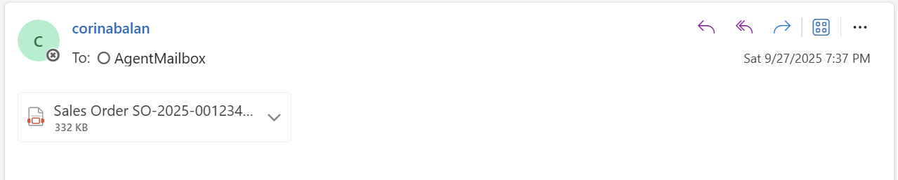

# Sales Order Processor Agent
# Table of contents
1. [Use Case](#usecase)
2. [Prerequisites](#prerequisites)
3. [Step 1- Install and configure the Document Processor Agent](#documentprocessoragent)
4. [Step 2- Install and configure the Sales Order Agent](#salesorderprocessoragent)

# 🧩 Use Case 
Streamlining and automating the intake of *sales orders* received as email attachments for seamless integration into Microsoft Dynamics 365.

The solution will lead with the built-in agent **Document Processor** for document extraction and content validation. Once the content is validated, we will use a second agent to create the order and order lines into Dynamics 365.

## ✅ Prerequisites
 - Connected Dataverse environment with a Finance and operations environment. To confirm this, you can check in the Power Platform Admin Portal for a given environment that there is a correspoding Finance and Operations URL.
 - The user who installs the Sales Order Create solution must be a licensed user in Dynamics 365 Finance and Operations.
 - Dataverse virtual tables enabled: Released products V2 (mserp), Customers V3 (mserp). For details on how to enable virtual tables in Dataverse with source Finance and Operations, please see https://learn.microsoft.com/en-us/dynamics365/fin-ops-core/dev-itpro/power-platform/enable-virtual-entities.
 - Document Processor agent installed and configured. For setup details please use this document. Dont forget to update the extraction prompt as indicated.
 - Sales Order agent solution imported and agent configured as indicated in the next section.
 - System Administrator role for document processor agent installation and agents configuration.

# 📄 Step 1: Install and configure Document Processor Agent
**Document Processor Agent** is a robust managed agent, packaged solution for end-to-end document processing including **extraction, validation and human monitoring**. It does not require training custom models, instead a relevant sample document can be uploaded, and the maker can configure the attributes that should be extracted and if any validation rules to be applied. For more details please see: https://learn.microsoft.com/en-us/microsoft-copilot-studio/template-managed-document-processor. 

## Features:
- Monitors Exchange mailbox (personal or shared)

- When email is received, the agent persists the attachment in the Data Processing Event table in Dataverse – for each attachment a new record is created. It also parses the attachments into JSON format in the Processed Data column.

- Validates content as per validation rules which are configurable

- You can also add more advanced rules to validate content grounded in Dataverse knowledge:

- When invalid content is found, the agent notified the configured reviewer and brings them into the loop for manual review. The canvas app Validation Station helps the reviewer identify invalid content, edit and make corrections, and manually approve a document.

##  Installation
Install the document processor agent as per guidance: https://learn.microsoft.com/en-us/microsoft-copilot-studio/template-managed-document-processor.

## Configuration Wizard
When configuring the Document Processor Agent, to achieve a more deterministic JSON schema that you can leverage in the Sales Order agent to parse the data for the downstream systems, it is recommended to add to the Document Processor extraction rules a similar prompt: 

 Please note that the downstream agent flows have a dependency on these column names: **deliveryCustomername, productcode, productqty, productuom**. 

For your referencce, this is a prompt that can be **added** to the Document Processor out of the box instructions:
>If the template is a purchase order look for a delivery customer (FROM) and a supplier (TO). For the delivery customer include columns with names delivery customer Name, delivery customer email, delivery customer phone number, delivery customer address, delivery  customer number. If the information extracted does not contain values for these columns, you can add the columns with an empty value.

>Look for the main table with a list of items and append to items array extracted data columns for product code, product name, product description, product uom, product qty, product price, product line total using these columns names. If the information extracted does not contain values for these columns, you can add the columns with an empty value.

# 🤖 Step 2: Install and Configure the Sales Order Agent
**Sales Order Agent** is an agent template to help support an end-to-end document processing flow into downstream apps such as Dynamics 365 Finance or Supply Chain Management. The agent includes validations for customer name and product codes, creation of a sales order header and related lines, as well as acknowledgement emails.
This agent will be triggered when the Document Processor Agent has completed and the Processing Status value of a document extracted is Exported.

Features:
- Implements validation rules for customer and product data.
- If validation rules are not met, it emails a reviewer and stops execution.
- If validation rules are met, it executes Sales Order Header and Lines creation.
- Sends acknowledgement email when the sales order is processed successfully or validation rules are not met.

## Components
- **Instructions** – the agent uses generative AI with the next instructions:

- **Trigger** : Dataverse trigger for the agent to run when Document Processor completed successfully

- **Tools**: For implementing deterministic sales order specific validation rules, as well as sales order header and lines creation, several agent flows have been created:

  - **Get Customer Number** – agent flow which returns the customer number if it’s found in finance and operations. It searches by name first, then email address.
  - **Validate Product Codes** – agent flow which checks if the product codes provided are valid. Returns the product codes which could not be found.
  - **Create Sales Order Header** – agent flow which creates the sales order in finance and operations and returns the sales order number.
  - **Create Sales Order Items** – agent flow which creates the sales order lines for the product code, quantity, and unit of measure provided.
  - **Notification Order Creation** – agent flow which sends email with input as per agent instructions.

## ✅ Sales Order Agent configuration
After importing the sales order agent solution, consider the following to make the agent work for your specific needs and data:
 - **Update the Tools inputs** – open the agent, and from the Tools tab open and review all the tools inputs: company code (by default usmf) and mailbox (test email address) must be updated.
 - Please ensure that all flows associated with the Sales Order Agent are reviewed to verify the Company Code and Email Address validations.

  - **Update the Finance and Operation connection** – Open the agent flows for creating sales order header and creating sales order lines and update the Finance and Operations URL. After making the change, save and publish the 2 agent flows.

 - **Customer validation** - Sales order processor validates customer name, and if not found, will search using the email address if available in the document. The agent flows validating the customer depends on the json extracted to contain the column **deliveryCustomername**. Consider if this is necessary for your organization, and update as needed e.g. identifying customer by VAT Number if its provided – if you'd like to change the customer validation criteria, ensure to update: the document processor extraction prompt to collect the required fields and the Get Customer Number agent flow filter criteria accordingly.

- **Products validation** – Sales order processor validates the product codes, and if found, when creating the sales order lines it will use the extracted product code, quantity, and unit of measure. The agent flows rely on the json extracted to contain columns **productcode, productqty, productuom**. If you capture different columns with your prompt, you will need to review the two agent flows that validate and create sales order lines.

- **Acknowledgement email** - As you are testing the end-to-end flow initially you may choose to send the acknowledgement emails initially to an internal reviewer and then forward the email to the customer.

- **Test** - You can test the agent's autonomous mode by sending an email with an attachment to the mailbox monitored by Document Processor and ensuring the document is approved/validated. You can also test the agent in the Test Pane with a similar statement "Process document with id: 20cvfg-2ddd..." with the id being a Data Processing Event record with a valid json exported. 

- **Sample document** - You can use the attached test pdf document for testing if you have the sample data available in your Finance and Operations environment. 

