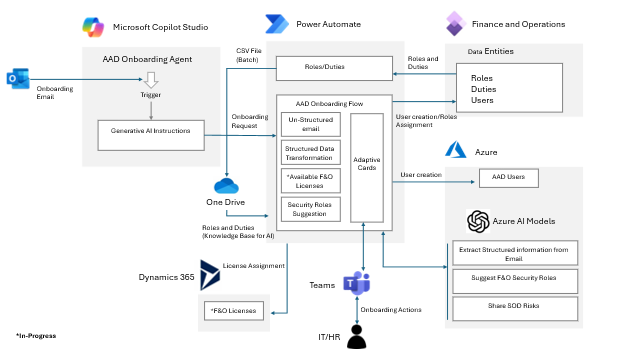
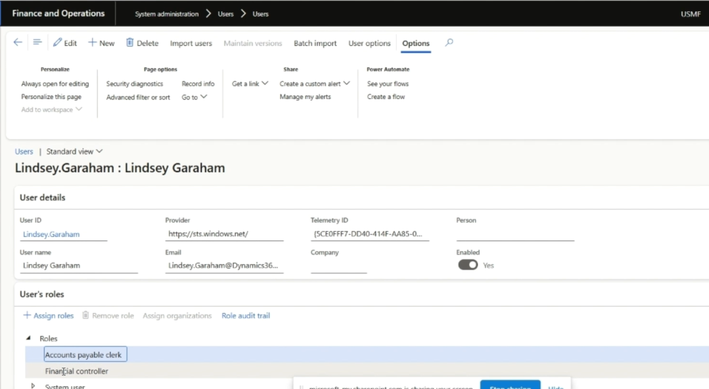
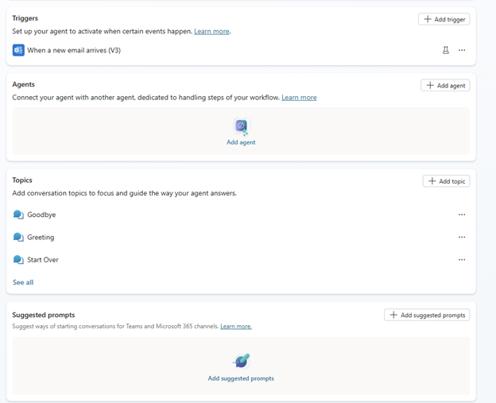

# 🧠 User Onboarding Agent  

## 1️⃣ Use Case  
The **User Onboarding Agent** is an autonomous solution that automates the process of onboarding new employees into **Microsoft Entra ID (Azure AD)** and **Dynamics 365 Finance and Operations (F&O)** with minimal human intervention.  

It monitors incoming onboarding requests (such as HR emails or future ServiceNow tickets), extracts employee data, validates job duties, and provisions users automatically using **Power Automate flows** and **Teams Adaptive Card approvals**.  



### Typical Workflow  
1. **Trigger** – HR sends an onboarding email containing new-hire details.
   
3. **Extraction** – The agent uses Azure OpenAI to parse the message, extracting name, title, department, and duties.  
4. **Processing** – Data is sent to the main Power Automate flow `D365OnboardingAgentV3` for user creation.  
5. **Approval** – Adaptive Cards are posted in Microsoft Teams for IT admins to review and approve.  
6. **Provisioning** – Upon approval, the agent:
   - Creates the user in Azure AD  
   - Assigns Microsoft 365 and F&O licenses (Future Release)  
   - Suggests D365 roles based on job duties using AI  
   - Assigns approved roles and completes onboarding  

   
   
   
   
   
 

---

## 2️⃣ Agent Components  

| Component | Purpose / Function |
|------------|-------------------|
| **Copilot Studio Agent (`UserOnboardingAgent`)** | Central conversational agent orchestrating the onboarding process. |
| **Power Automate Flows** | `WhenanewemailarrivesV3` (trigger), `D365OnboardingAgentV3` (main flow), and `D365OnboardingAgentChild` (subflow for approvals/role assignment). |
| **Azure OpenAI Service** | Extracts structured onboarding data and matches duties to D365 roles. |
| **Microsoft Teams Adaptive Cards** | Used to collect approval and additional role/license confirmation from IT. |
| **Azure AD Graph or Microsoft Graph API** | Handles user creation and license assignment in Azure AD. |
| **Dynamics 365 F&O OData API** | Assign roles in Dynamics 365 Finance and Operations. |
| **Environment Variables** | Manage secure configuration (tokens, URLs, app IDs, secrets, etc.). |
| **Knowledge Source** | `OnboardingAI` file and role-duty mapping CSV for AI decision support. |

---

## 3️⃣ Prerequisites  

### 1. Azure AD App Registration  
- Register **two applications**: one for Azure AD operations and one for F&O API access.  
- Grant permissions: `User.ReadWrite.All`, `Directory.ReadWrite.All`, `offline_access`.  
- Add to F&O via **System Administration → Azure Active Directory Applications**.  

### 2. Dynamics 365 Finance and Operations  
- Ensure valid URL and OData endpoints (`https://<tenant>.cloudax.dynamics.com/data`).  
- Create security role assignments via service principal.  

### 3. Microsoft Teams  
- Configure a Teams channel or user to receive Adaptive Cards.  
- Ensure the service account (`TeamsAccount` variable) has permissions to post.  

### 4. Azure OpenAI Resource  
- Deploy and configure an Azure OpenAI resource (e.g., GPT-4o).  
- Provide its endpoint and key in environment variables.  

### 5. Role/Duty Mapping CSV (Knowledge Source)  
- A sample CSV file (`D365FORoleMap.csv`) is included in this GitHub project.  
- Store a copy in OneDrive:  
  `OneDrive/Onboarding/RoleMaps/D365FORoleMap.csv`  
- This CSV helps the AI recommend roles based on duties.  
- A Power Automate flow to auto-generate and refresh this file will be released in the next version so custom roles remain synchronized.  

### 6. Power Platform Environment  
- Import the solution (`PackageName.zip`) into Power Apps.  
- Configure environment variables and authenticate all connectors (Outlook, Teams, HTTP, Dataverse).  

---

## 4️⃣ Environment Variables Setup  

After importing the solution, navigate to:  
**Power Apps → Solutions → UserOnboardingAgent → Environment Variables**

| Variable Name | Purpose / Description | Example / Value |
|----------------|----------------------|-----------------|
| **D365_URL** | URL of your Dynamics 365 F&O environment. | `https://<tenant>.cloudax.dynamics.com` |
| **OpenAI_Endpoint** | Endpoint of your Azure OpenAI resource. | `https://<your-openai-resource>.openai.azure.com/` |
| **OpenAI_Key** | API key for Azure OpenAI. | Key1 or Key2 |
| **TeamsAccount** | Teams user/service account posting Adaptive Cards. | `onboarding-bot@contoso.com` |
| **TokenClientID** | Client ID for Azure AD onboarding app registration. | GUID |
| **TokenClientIDFO** | Client ID for Dynamics 365 F&O app registration. | GUID |
| **TokenSecret** | Client Secret for Azure AD app. | Secret value |
| **TokenSecretFO** | Client Secret for F&O app. | Secret value |
| **TokenURL** | OAuth2 token URL for Azure AD app. | `https://login.microsoftonline.com/<tenantID>/oauth2/v2.0/token` |
| **TokenURLFO** | OAuth2 token URL for F&O app. | `https://login.microsoftonline.com/<tenantID>/oauth2/token` |

> **Notes:**  
> • Ensure all variables are set before enabling any flows.  
> • Maintain separate credentials for Azure AD and F&O if required by policy.  
> • Use **Azure Key Vault** for secret storage in production environments.  

---

## 5️⃣ Install and Configure the Agent  

1. **Import the Solution**  
   - Go to *Power Apps → Solutions → Import → Select `PackageName.zip`*.  

2. **Configure Environment Variables**  
   - Fill in all values listed above (URLs, tokens, keys, Teams account, etc.).  

3. **Set Up Copilot Studio Agent**  
   - Confirm the agent name: `UserOnboardingAgent`.  
   - Enable **Generative AI orchestration**.  
   - Add tool connection to `D365OnboardingAgentV3` flow.  

4. **Validate Connections**  
   - Edit each flow and re-authenticate all connectors (Outlook, HTTP, Dataverse, Teams).  

5. **Test the Agent**  
   - Send a sample email such as:  
     > “Please onboard John Smith, Finance Analyst, with duties related to reporting and reconciliation.”  
   - Verify Teams Adaptive Card delivery, approval, and Azure AD + F&O creation.  




---

## 6️⃣ Extensibility Guidelines and Setup Instructions  

Extension flows act as **modular entry points** that enable external systems such as **ServiceNow, Workday, or HR onboarding portals** to programmatically trigger the onboarding process through secure HTTP endpoints.  
Each extension flow functions as a lightweight integration layer — **receiving structured employee data**, performing basic validation, and **invoking the central Copilot-driven onboarding logic** within Power Automate.  

This design allows new systems to be integrated easily without modifying the core agent, ensuring **scalability, separation of concerns, and maintainability** across enterprise HR and IT ecosystems.  

---

### 🚀 Create the Main Flow – `OnboardingRequestExtension`  
This flow acts as the **external entry point** for onboarding requests.  

#### Steps  
1. Create a new **Instant Cloud Flow** using the **HTTP Request trigger**.  
2. Use the following **Request Body JSON Schema**:  

   ```json
   {
     "type": "object",
     "properties": {
       "fullName": { "type": "string" },
       "email": { "type": "string" },
       "jobTitle": { "type": "string" },
       "location": { "type": "string" },
       "startDate": { "type": "string" },
       "duties": { "type": "string" }
     }
   }
   ```

3. Under **Who can trigger the flow**, select **Anyone**  
   ⚠️ *This configuration is intended for **testing purposes only** (e.g., validation via Postman or internal test flows).*  
   In production, always follow Microsoft security guidelines and adopt the best practices below.  

4. Save and copy the **HTTP POST URL** — this will be used by external systems or test flows to trigger onboarding requests.  

---

### 🔒 Security and Access Best Practices  

| Area | Recommendation |
|------|----------------|
| **Authentication** | Use **Azure Active Directory (AAD)** authentication or **Power Platform Environment Access Policies** to restrict flow execution to trusted systems. Avoid “Anyone” for production. |
| **Environment Separation** | Use distinct environments for **Development**, **Testing**, and **Production** with separate flow URLs. |
| **IP Whitelisting** | Configure firewalls or API gateways to only allow inbound requests from trusted IP ranges (e.g., ServiceNow or internal subnets). |
| **Least Privilege Principle** | The connection used for Copilot execution should have the **minimum necessary permissions**. |
| **Auditing** | Enable **Dataverse** or **Application Insights logging** for request metadata (timestamp, source, requester). |
| **Key Rotation** | Regenerate HTTP trigger URLs periodically or upon ownership changes. |
| **Data Handling** | Validate and sanitize incoming payloads before processing to prevent injection or malformed input risks. |

---

### ⚙️ Add Step – Execute Agent  

Add the **Execute Copilot** connector (Microsoft Copilot Studio) with the following configuration:  

- **Agent Name:** `UserOnboardingAgent`  
- **Body / Message Example:**  

  ```
  User Onboarding request received through extension.

  User information is:
  Full Name: @{triggerBody()?['fullName']}
  Email: @{triggerBody()?['email']}
  Job Title: @{triggerBody()?['jobTitle']}
  Location: @{triggerBody()?['location']}
  Start Date: @{triggerBody()?['startDate']}
  Duties: @{triggerBody()?['duties']}
  ```

This step passes structured data to the Copilot Agent for further decision-making.  

---

### 🧠 Testing the Extension Flow  

1. Create a new flow named **`TestUserOnboardingAgentExtension`** to simulate external system calls.  
2. Add a **Manual Trigger**.  
3. Add an **HTTP action** configured as:  

   - **Method:** `POST`  
   - **URI:** *(Paste the HTTP POST URL of the `OnboardingRequestExtension` flow)*  
   - **Headers:**  
     `Content-Type: application/json`  
   - **Body Example:**  
     ```json
     {
       "fullName": "Lindsey Garaham",
       "email": "Lindsey.Garaham@Dynamics365SA.com",
       "jobTitle": "Finance Business Analyst",
       "location": "Redmond",
       "startDate": "",
       "duties": "Managing AP invoice reviews, preparing monthly financial reports, and collaborating with the operations team for budget forecasting."
     }
     ```

4. Publish and run the test flow to confirm Copilot execution.  

---

### 🔄 Extension Design Pattern  

| Component | Description |
|------------|-------------|
| **Trigger** | Any HTTP-capable system (ServiceNow, HR portal, custom app) can call the `OnboardingRequestExtension` endpoint. |
| **Schema** | The JSON payload standardizes onboarding attributes passed to Copilot. |
| **Copilot Invocation** | The “Execute Copilot” action routes data to `UserOnboardingAgent` for role analysis and user provisioning. |
| **Reusability** | Multiple systems can reuse the same endpoint and schema for modular integration. |

---

### 🧩 Adding New Extensions  

1. Duplicate the `OnboardingRequestExtension` flow and rename it (e.g., `OnboardingRequestExtension_ServiceNow`).  
2. Modify the input schema if additional parameters (e.g., department, managerID) are required.  
3. In the “Execute Copilot” action, update the body message accordingly.  
4. Publish and share the new flow URL with the target system team.  

---

### 🧱 Example Integrations  

- **ServiceNow:** Trigger Power Automate via *Flow Designer → REST Step* calling the HTTP URL.  
- **Email Parser:** Connect Power Automate’s Outlook trigger and pass parsed fields to the same schema.  
- **Teams Request:** Build an Adaptive Card form and use the same payload to trigger onboarding.  

---

## 7️⃣ Roadmap / Upcoming Enhancements  

| Feature | Description |
|----------|-------------|
| **Offboarding Functionality** | Automate user deactivation, license removal, and F&O role cleanup. |
| **License Suggestion and Assignment** | Introduce AI-based recommendations for M365 and D365 licenses based on department and duties. |
| **Auto-Generation of Role/Duty Mapping CSV** | A Power Automate flow to automatically refresh duties-to-roles mapping in OneDrive. |

> A sample CSV file is included in this GitHub project — use it as a template until automation is released.

---

## 📜 License  
This project is provided under the **MIT License** and is intended for educational and extensibility guidance purposes.
