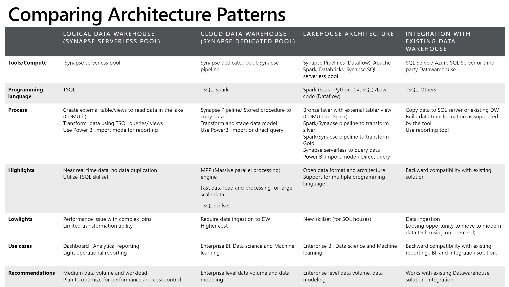
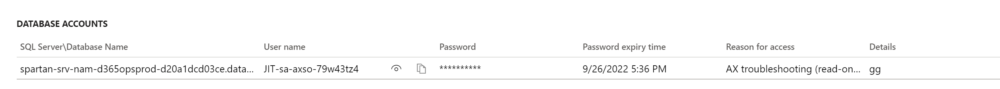
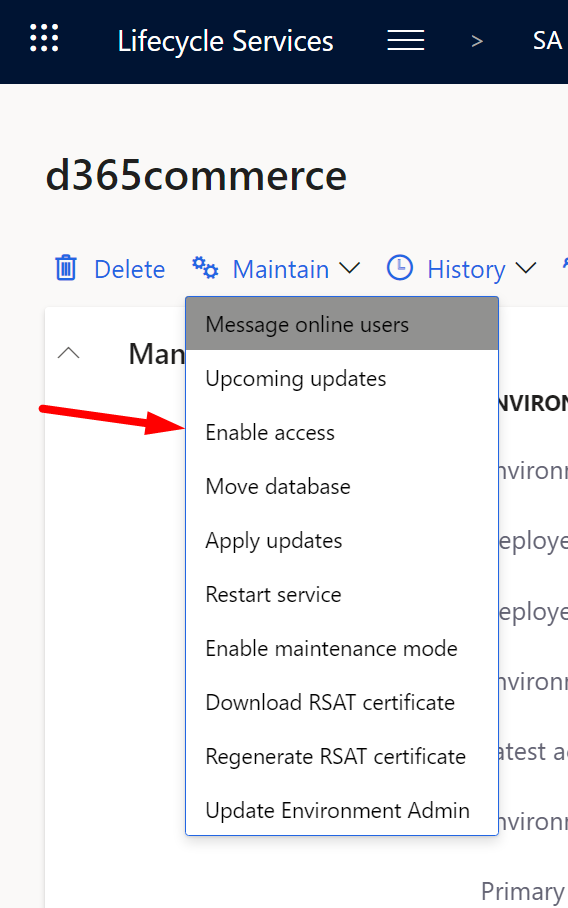
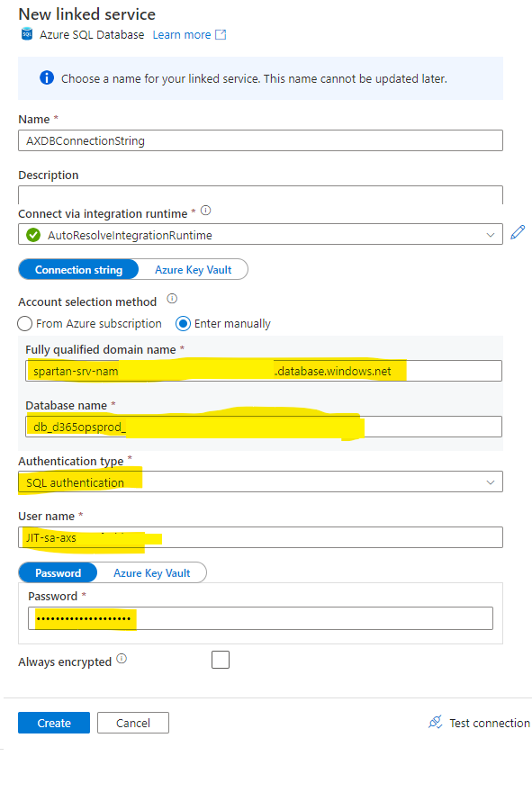
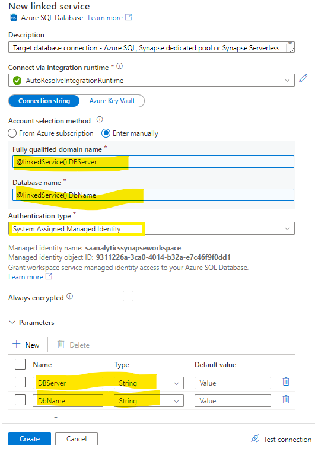
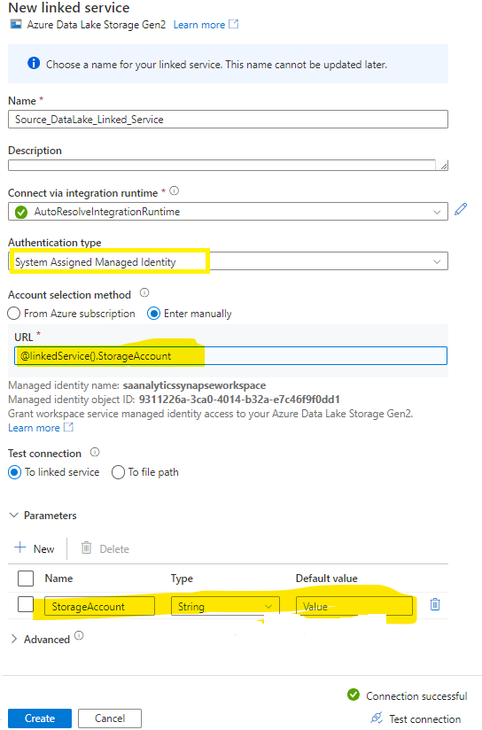
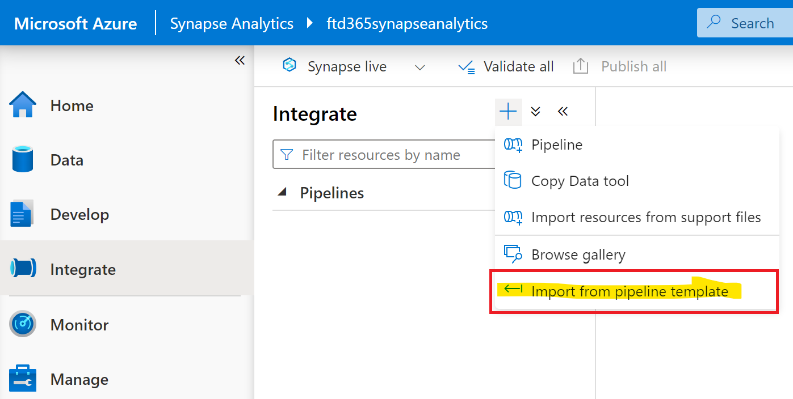
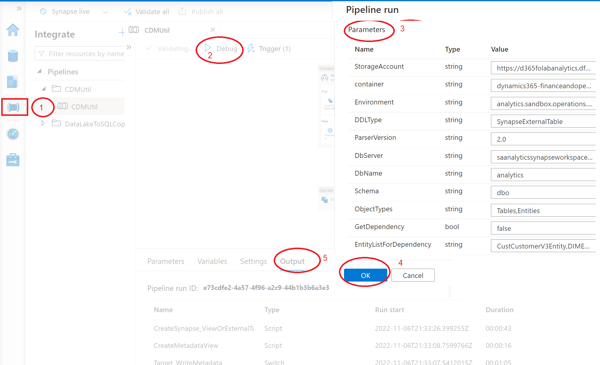
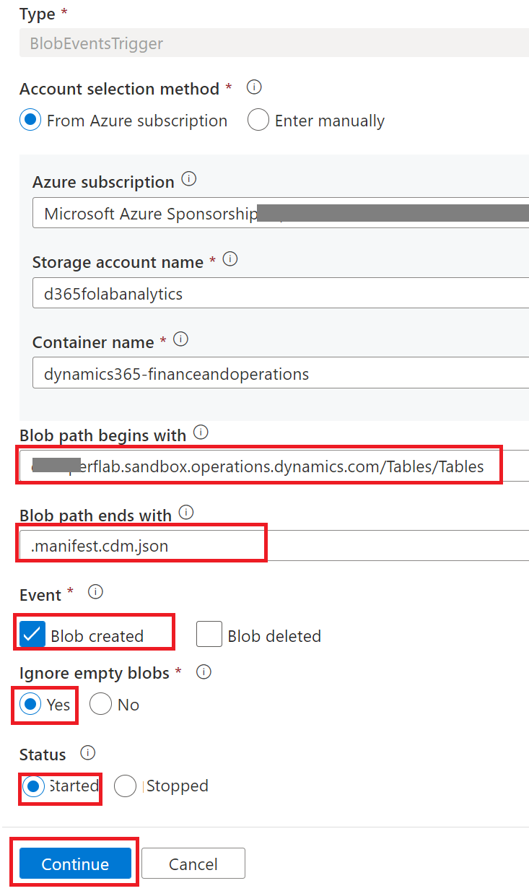
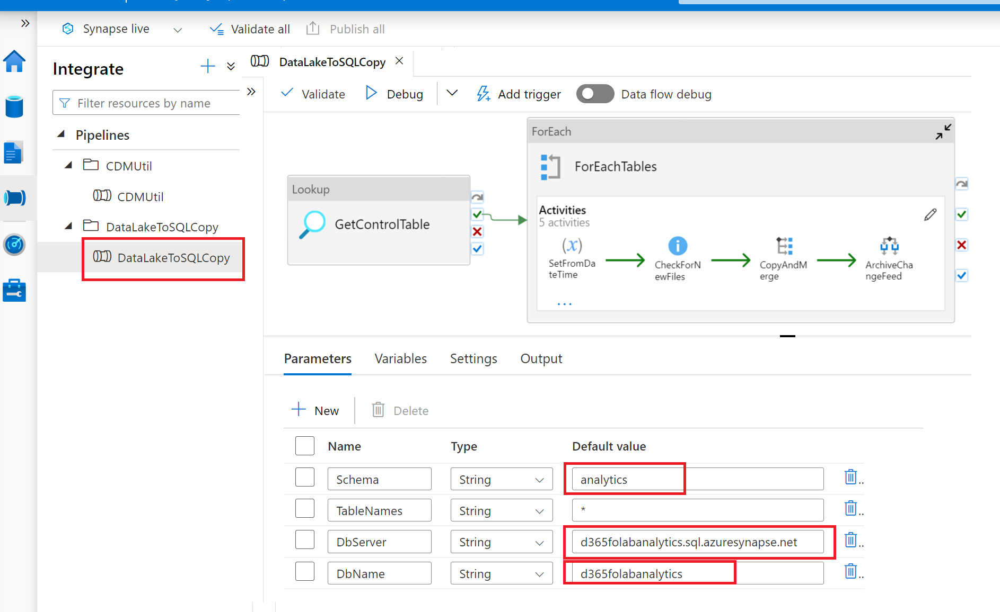

# Overview

Analytics for Dynamics 365 finance and operation apps requires few building blocks, that when connected together can enable your organization to build an Analytical and Integration solution. You take your data to your Data Lake and from there to Synapse data warehouse. You create what we call a modern data warehouse. This will also let you replace your BYOD entities, which have their challenges. 
	
The main building blocks are [Export to data lake service](https://learn.microsoft.com/en-us/dynamics365/fin-ops-core/dev-itpro/data-entities/azure-data-lake-ga-version-overview), CDMUtilPipeline, [Azure Data Lake](https://learn.microsoft.com/en-us/azure/storage/blobs/data-lake-storage-introduction) and [Azure Synapse Analytics](https://learn.microsoft.com/en-us/azure/synapse-analytics/overview-what-is).

Using above building blocks, an organization can come up with the right architecture for their analytical requirements. In below post, we will step through instructions on how you can setup a working solution using one of the above patterns as options. There are 4 patterns documented, that we also elaborated on in our previous TechTalk. The templates used to deploy the solution are provided below as links. 

The following diagram conceptualizes high level architecture of the 4 patterns/options: 


The following table compares the 4 patterns: 


# Foundational concepts

1. [Export to data lake service](https://learn.microsoft.com/en-us/dynamics365/fin-ops-core/dev-itpro/data-entities/azure-data-lake-ga-version-overview) - This feature lets you copy data and metadata from your Finance and Operations apps into your own data lake (Azure Data Lake Storage Gen2). 
Data that is stored in the data lake is organized in a folder structure that uses the Common Data Model format. 
Export to data lake feature exports data as headerless CSV files and metadata as [Cdm manifest](https://docs.microsoft.com/en-us/common-data-model/cdm-manifest). 

2. CDMUtilPipeline - converts CDM metadata in the lake to **Synapse Analytics** or **SQL metadata**. CDMUtilPipeline is a Synapse/ADF pipeline that reads [Common Data Model](https://docs.microsoft.com/en-us/common-data-model/) metadata and converts and executes  **Synapse Analytics SQL pools** or **SQL Server** DDL statements. **Note**: We also have [CDMUtil as an Azure Function or Console App](readme.md). This utility is developed in C# and utilizes the CDM SDK to read the CDM metadata and create Synapse metadata. Unlike CDMUtil as an Azure function and console App, the CDMUtil pipeline reads the json files directly and uses TSQL scripts to create the DDL statements required for Synapse Analytics. Since CDMUtil is just a pipeline within Synapse or Azure Data Factory, this approach simplifies the deployment and maintenance of the utilities.

3. [Azure Data Lake](https://learn.microsoft.com/en-us/azure/storage/blobs/data-lake-storage-introduction) - Data lake is a blob storage repository in the cloud. It can save any kind of object since it stores it as a blob. It is a popular form of cloud storage as is much cheaper compared to relational databases.

4. [Azure Synapse Analytics](https://learn.microsoft.com/en-us/azure/synapse-analytics/overview-what-is) - Synapse brings together the best of **SQL** and **Spark** technologies to work with your data in the data lake, provides **Pipelines** for data integration and ETL/ELT, and facilitates deep integration with other Azure services such as Power BI. 

5. Serverless pool - Serverless is an innovative concept as in this database, you don’t actually move data at all. Data still resides in a data lake, but on top of that we create a logical datawarehouse in Synpase. Its called serverless or virtualized as there is no upfront server provisioned. Its pay as you go. This method is cheap, quick and best for initial analysis of data. In our patterns, this is Option 1.

6. Dedicated pool - This is what used to be SQL Datawarehouse. It is cloud datawarehouse, uses multi parallel processing technology to process big data. Data is copied to the datawarehouse. Its fixed price as its infrasturtcure is dedicated. In our patterns, this is Option 2.

7. Lakehouse - This is Data Lake + Data Warehouse. This concept builds on Serverless and is an industry standard that takes data through three layers of Bronze, Silver and Gold. In our patterns, this is Option 3.
			
These architecture patterns are industry standard and have been covered in depth in an earlier TechTalk and GitHub, that are highly recommended. https://community.dynamics.com/365/dynamics-365-fasttrack/b/techtalks/posts/export-to-azure-data-lake---scenarios-and-architecture-patterns-april-26-27-2022

# Templates to download

1. [CDMUtilPipeline](https://github.com/microsoft/Dynamics-365-FastTrack-Implementation-Assets/blob/DataEntitiesHandling/Analytics/CDMUtilSolution/CDMUtilPipeline.zip)
2. [DataLakeToSQLCopy](https://github.com/microsoft/Dynamics-365-FastTrack-Implementation-Assets/blob/DataEntitiesHandling/Analytics/CDMUtilSolution/DataLakeToSQLCopy.zip)

# Pre-requisites
1. Dynamics 365 Finance and Operations with [Export to data lake feature](https://docs.microsoft.com/en-us/dynamics365/fin-ops-core/dev-itpro/data-entities/configure-export-data-lake) enabled with [*Enhanced metadata feature*](https://docs.microsoft.com/en-us/dynamics365/fin-ops-core/dev-itpro/data-entities/azure-data-lake-enhanced-metadata#enhanced-metadata-preview).
2. [Synapse Analytics Workspace created](https://docs.microsoft.com/en-us/azure/synapse-analytics/quickstart-create-workspace). 
3. [Synapse Analytics Workspace configured with managed identity, Blob data contributor access to data lake](https://docs.microsoft.com/en-us/azure/synapse-analytics/security/how-to-grant-workspace-managed-identity-permissions#grant-permissions-to-managed-identity-after-workspace-creation)

# Step by step instructions to deploy this solution

1. The main work involved is getting the pipelines imported and configured in Synapse. You are dealing with two pipelines, first is CDMUtilPipeline, which reads the metadata and creates the tables/entities views in Dedicated pool or Serverless pool or Azure SQL database. Second pipeline will copy data into that database/pool from Data lake. Second pipeline not needed for Serverless pool.

2. At this stage, before importing any pipelines, deploy a Dedicated pool or Serverless pool or Azure SQL database based on your choice of architecture pattern (you don't need all three). This is your target database or datawarehouse. In case of Serverless pool, you need to create a master key encryption on the database.
	```SQL
	-- create master key that will protect the credentials:
	CREATE MASTER KEY ENCRYPTION BY PASSWORD = <enter very strong password here>
 	```

3. ***Creating Linked Services***
Also, at this stage, before importing any pipelines, you will create a number of linked services. Synapse pipelines connect with external connectors through something called linked services. Linked services are very much like connection strings, which define the connection information needed to connect to external resources. Before you can import the pipeline template, you need to create few linked services. CDMUtilPipeline requires following linked services.


|LinkedService       | Type        |Purpose                                  |
|--------------------|:------------|:----------------------------------------|
|3.1 AXDBConnection      |Azure SQL Database |To connect to a Dynamics 365 F&O Tier1 or Tier 2 database and retrieve entity dependencies |
|3.2 Target database     |Azure SQL Database |Target database/pool to create the tables/views - Synapse serverless, Synapse Dedicated pool or SQL database|
|3.3 Source storage      |Azure Storage Gen 2|Storage account that is configured with "Export to data lake" service|

3.1. **Create *AXDB connection* linked service (Optional):** You must create a linked service to import the pipeline template, however retriving entity dependencies from AXDB is optional, if you do not have requirement to complex data entities/views, you may just create a dummy linked service to complete the pipeline import. For this connection, go to LCS page and enable JIT access and note the server name, db name, user and password. 



Go to Synapse workspace > Manage > Linked services and create a linked service that connects to the AXDB. In the linked service, click Test connection, it may error for some IP. You may need to allow connections from the IP to the AXDB to make this work. Go to LCS > "Enable access". Add the IP and try again. Tip - give a range for example 40.82.250.0/999, as next time, it will use a slight different IP.



Make sure Test connection is successful at this stage, before saving the linked service.



3.2. **Create *Target Database* linked service:** Create **Azure SQL Database** type linked service to connect target database/pool. 

a. Enter a **Name** for linked service

b. Create parameters **ServerName** and **DBName** 

c. On account selection method, select **Enter manually** 

d. **Fully qualified domain name** click add dynamic content and then select **ServerName** parameter

e. **Database name** click add dynamics content and select **DbName** from parameter

f. **Authentication type** select **System Assigned Managed Identity**

g. Make sure Test connection is successful at this stage, before saving the linked service.

- <JJ Text says ServerName but image says DBServer ? >
- <JJ is this below step needed?>
Next step only needed to copy data to SQL DB (not for Serverless or Dedicated Pool). Note the Managed identity name (this is usually same as the name of the Synapse workspace) and create a contained database user in Azure SQL DB. Follow this [docs](https://learn.microsoft.com/en-us/azure/data-factory/connector-azure-sql-database?tabs=synapse-analytics#managed-identity). Docs has instructions to add an AAD Admin to the SQL Server from Azure portal and creating a user in the SQL DB as below. Replace salabcommerce-synapse with your name.
	```SQL
	CREATE USER [salabcommerce-synapse] FROM  EXTERNAL PROVIDER;
	ALTER ROLE db_owner add member [salabcommerce-synapse];
	ALTER ROLE db_datareader add member [salabcommerce-synapse];
	ALTER ROLE db_datawriter add member [salabcommerce-synapse];
	```




3.3. **Create **Source storage** linked service:** Create **Azure Storage Account Gen 2** type linked service to connect source datalake and read cdm metadata.

a. Enter a **Name** for linked service

b. Create parameters **StorageAccount**  

c. On account selection method, select **Enter manually** 

d. **URL** click add dynamic content and then select **StorageAccount** parameter

e. **Authentication type** select **System Assigned Managed Identity**

f. Click **Create** to create the linked service.




4. In your Synapse Analytics Workspace, go to Integrate, Click + to Import the template 


5. Locate **CDMUtilPipeline.zip** from the local computer and select **Open**


6. Select all the above created **linked services** and click **Open pipeline**


7. Update **parameters** as below and click **Publish all** to deploy the pipeline 

<JJ - DDLType can be specified as below ?>
|Parameters                  |Value                                                                 |
|----------------------------|:---------------------------------------------------------            |
|StorageAccount              |https://*yourStorageAccountName*.dfs.core.windows.net/    |
|container                   |dynamics365-financeandoperations                          |
|Environment                 |*YourEnvironment.sandbox*.operations.dynamics.com       |
|DDLType              |SynapseView or SynapseExternalTable for serverless (Option1) **or** SynapseTable for dedicated pool (Option2) **or** SQLTable for copying data to a SQL Server database (Option4)|
|ParserVersion               |1.0 or 2.0                                                |
|DbServer                    |Fully qualified DB server name for example - *SynapseWorkspaceName*-ondemand.sql.azuresynapse.net **or** SynapseWorkspaceName.sql.azuresynapse.net **or** *AzureSQLDB*.database.windows.net|
|DbName                      |the name of the SQL Server database or dedicated/serverless pool|
|Schema                      |Schema name (Schema must exist in the database, you must use dbo schema if plan to create entities as views)|
|ObjectTypes                 |Tables,Entities,ChangeFeed (Comma seperated values to filter object type)       |
|GetDependency               |False/True - If true then connect to AXDB retrieve dependency |
|EntityListForDependency     |Comma seperated list of entities or views to retrieve dependency|

   


8. Your first pipeline is ready to go. You can execute it manually for now. Later we can setup to trigger it on an event or schedule. It may take few minutes first time. You will see a number of tables and views created in the target database including few tables to store metadata and a control table. At this stage, you have created a DB/pool with all tables and views with the same schema as AXDB, utilising the CDM metadata from data lake.

**Execute CDMUtilPipeline** 
***On-demand run***

a. Click on Integrate and then click **CDMUtil** to open pipeline

b. Click on **Debug**

c. Change pipeline run parameter or use default values and click **ok**

d. Pipeline will run and you can monitor the execution **Output**  



***Add schedule or storage events***

Setup trigger to automated CDMUtilPipeline execution. 

a. Create a new trigger , select **type** - you can use **schedule** trigger to run pipeline on schedule time or use **storage event** trigger when metadata change.

b. **For Schedule trigger**: 
    Select **Start date**, **Time zone** and **Recurrence** as appropriate.

c. **For Storage events**:
<JJ - is this trigger only for new tables schema, do we need another trigger definition for data copy?>
   c.1. Select **Storage account name**,  **Container**, **Blob path begins with**:yourenvironmentfolder.operations.dynamics.com/Tables/Tables and **Blob path ends with**:.manifest.cdm.json,**Event**: Blob created, **Ignore empty blobs**: Yes 

   

   c.2. Click next, for Data preview, This screen shows the existing blobs matched by your storage event trigger configuration. Click next

d. On the **Trigger Run Parameters** - override parameters or leave it blank and click next - pipeline default parameters are used when parameters are not provided on trigger. 

e. Create and publish the changes to deploy the trigger.

**DataLake To SQL - Incremental data copy pipeline**

9. Next step is to import another pipeline to copy data to the DB/pool created in previous steps. Note - in case of Serverless pool, there is no real data copy. Serverless pool directly accesses data in data lake via external tables/views using OPENROWSET technology. So you do not need this step for Serverless pool.

Single pipeline to copy full and incremental data from data lake to Synapse dedicated pool or Azure SQL database native tables 

a. Download [Datalake to SQL Copy(DataLakeToSQLCopy.zip)](/Analytics/CDMUtilSolution/DataLakeToSQLCopy.zip) to local computer   

b. Click **Import from pipeline template** open DataLakeToSQLCopy.zip file, select linked services for source data lake and target database connection 


c. Update parameters and execute DataLakeToSQLCopy pipeline to copy data to Synapse or SQL tables 



This pipeline reads control table to collect metadata and then uses either "DataFlow" to copy full and incremental data to a SQL database or "Copy Into" command to copy data to a dedicated pool.

