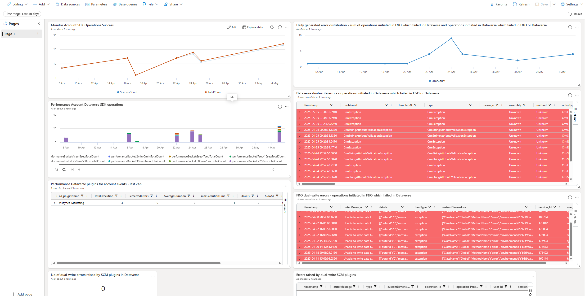

# Dual-write Application Insights Dashboard
This dashboard consists of a single page with different tiles visualizing different signals related to Dual-write

Using this dashboard, you can identify:

- Dataverse Dual-write errors
- FnO Dual-write errors
- Error count and details for errors raised by SCM PlugIns
- Dual-write daily generated error distribution
- Monitor Account SDK success rate
- Performance of Account SDK dataverse operations

## Dashboard overview

## Steps to import the sample dashboard:
  1. Import the file "dashboard-Power Automate Monitoring.json".
  
  

  2. Name the dashboard appropriately and then click to select datasources
  
  

  
  3. In the Datasource selection pane you have to put your Azure Application Insights subscriptionID in the placeholder .
  
  

  

  4. After updating the correct subscriptionID. click on connect.

  5. You will get a list of databases. Select your ApplicationInsights name from that list and save changes.

  6. your dashboard should have data now. Feel free to edit the queries to suit your needs. 
