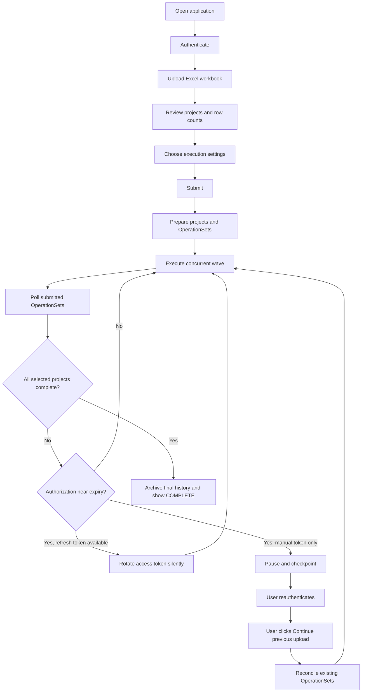
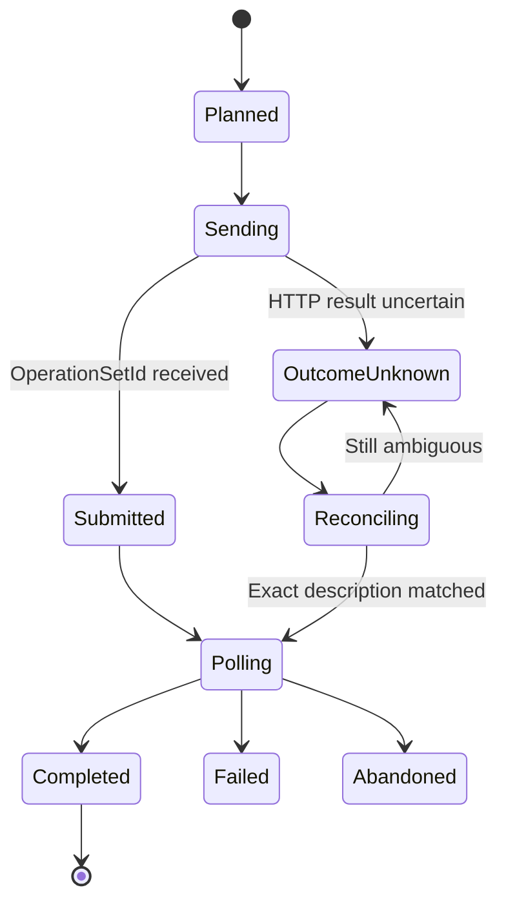
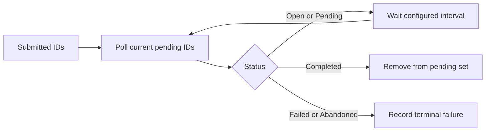

# Project Operations Schedule Import - Design

## 1. Purpose

This application imports large project schedules from Excel into Microsoft Dynamics 365 Project Operations through Dataverse Schedule APIs.

It supports:

- Multiple projects in one workbook
- Tasks and task hierarchy
- Resource assignments
- Task dependencies
- Concurrent OperationSet execution
- Long-running uploads
- User-requested safe stop and continuation
- Access-token rotation
- Interruption recovery
- Live execution status and activity logs
- Durable execution artifacts for audit and troubleshooting

## 2. User Workflow



## 3. Input Workbook

The workbook is a relational model split across four sheets.

| Sheet | Purpose | Relationship |
|---|---|---|
| Projects | Projects to create or reuse | `ProjectKey` maps to `msdyn_projectnumber`; required `ContractingUnit` maps by name to `msdyn_contractorganizationalunitid` |
| Tasks | Tasks and hierarchy | `ProjectKey` + `TaskKey` |
| Assignments | Resource assignments and team-member role | `ProjectKey` + `TaskKey`; optional `RoleName` maps to `msdyn_projectteam.msdyn_resourcecategory`, otherwise the resource default is used |
| Dependencies | Predecessor/successor links | Task keys within a project |

`ProjectKey` is the workbook relationship key and is sent to Dataverse as
`msdyn_projectnumber`. Existing projects are matched using that field.
`ContractingUnit` is required for every project. Live validation resolves each
distinct value against `msdyn_organizationalunits`, and project creation binds
the matching organizational unit as the project's contracting unit.

## 4. Main Components

| Component | Responsibility |
|---|---|
| `app.py` | Streamlit UI, authentication, controls, status, checkpoint/archive coordination |
| `excel_loader.py` | Parses and validates Excel sheets |
| `submit.py` | Builds projects and schedules OperationSet waves |
| `po_client.py` | Dataverse HTTP client, submission, polling, and recovery |
| `auth.py` | Token acquisition, refresh, and JWT expiry detection |
| `runtime_controller.py` | Keeps execution alive across Streamlit page reruns |
| `execution_records/` | Durable input, checkpoint, history, diagnostics, and activity logs |

## 5. Execution Model

### 5.1 OperationSet Planning

1. Create or reuse the Dataverse project.
2. Resolve the project's first bucket, or schedule creation of `Bucket 1` when
    the project has no bucket.
3. Resolve each explicit assignment `RoleName` to a bookable resource category,
    or use the matched bookable resource's active default category when blank,
    then create or reuse a project team member with matching project, resource,
    and `msdyn_resourcecategory`.
4. Generate stable task GUIDs before submission.
5. Build task, assignment, and dependency entities.
6. Split entities according to **Operations per set**.
7. Persist the complete execution plan before submitting work.

### 5.2 Rolling Concurrency

The scheduler maintains a rolling set of active projects.

Example with concurrency `2` and batch size `100`:

| Round | Slot 1 | Slot 2 |
|---|---|---|
| 1 | Project 1, operations 1-100; completes | Project 2, operations 1-100 |
| 2 | Project 2, operations 101-200; completes | Project 3, operations 1-100; completes |

A project that finishes releases its slot to the next waiting project in the following round.

The scheduler reads these values before every next wave:

- Operations per set
- Concurrent operation sets
- Polling wait

Changes apply only to future unsent work. Submitted OperationSets are immutable.

## 6. OperationSet State Model



Terminal states:

- `Completed`: successful
- `Failed`: Dataverse reported failure
- `Abandoned`: execution was cancelled

`Open` and `Pending` are non-terminal and continue polling.

## 7. Exactly-Once Recovery

Every OperationSet has a unique immutable description, for example:

```text
SP Project 164-schedule-20260825T163640285487Z-1
```

If a submission response is lost or uncertain:

1. Restore connectivity.
2. Search Dataverse using the exact description.
3. Record every lookup attempt, timestamp, match count, and result.
4. If one match is found, retain its ID and poll it.
5. If multiple matches are found, stop rather than guess.
6. If the earlier POST outcome remains unknown, do not resend automatically.

This prevents duplicate tasks from an ambiguous retry.

Completed and superseded records are always skipped during continuation.

## 8. Polling

Polling uses known OperationSet IDs.



Messages such as `waiting for 5 operation set(s)` mean the other OperationSets in that wave already reached terminal states and no longer need polling.

## 9. Authentication and Token Rotation

### Interactive Microsoft sign-in sessions

The app discovers the Microsoft Entra tenant from the configured Environment
URL and opens a secure browser-based sign-in. MFA is supported. The resulting
credential is cached in the running process and used to renew access tokens
silently before subsequent operation-set waves.

### Azure CLI sessions

The app discovers the Microsoft Entra tenant from the authentication challenge
returned by the configured Environment URL, then requests a delegated user
token from the account already authenticated with `az login` for that tenant.

- No UPN, password, or token copy/paste is required in the app.
- Before every new wave, the worker checks access-token expiry.
- At five minutes remaining, it obtains another token from Azure CLI and
    applies it to the main client and active project workers.
- The Azure CLI user must hold a Microsoft Project license.

### Username/password sessions

The initial delegated sign-in returns an access token and refresh token.

- Before every new wave, the worker checks access-token expiry.
- At five minutes remaining, it silently obtains a new access token.
- The new bearer token is applied to the main client and all active project workers.
- Rotation repeats as often as required until execution finishes.
- If refresh fails, the execution pauses safely.

### Pasted access tokens

A pasted token has no refresh credential available to the application.

- JWT expiry is detected locally when possible.
- At five minutes remaining, no new wave starts.
- In-flight work finishes or is reconciled and checkpointed.
- The user pastes a replacement token.
- Processing resumes only after the user clicks **Continue previous upload**.

Reauthentication never automatically restarts a paused upload.

### User-requested stop

The **Stop execution safely** button sets a thread-safe stop signal. No new
OperationSet is submitted after the signal is observed. Already submitted
OperationSets continue in Dataverse, while the local execution plan and known
IDs are checkpointed. The user can then correct input issues and either
continue the retained execution or discard it and start a corrected upload.

## 10. Persistence and Audit Files

Each run uses a timestamped directory under `execution_records`:

```text
execution_records/<run-id>/
  original-workbook.xlsx
  execution-history.csv
  execution-diagnostics.json
  activity-log.txt
```

During execution, `active-upload.json` stores the recoverable checkpoint.

Checkpoint writing uses:

- Unique temporary files
- Atomic replacement
- Coordinated reader/writer locking
- Windows file-lock retries
- Non-fatal persistence errors during active Dataverse processing

Interrupted, discarded, replaced, and completed checkpoints are archived rather than silently deleted.

## 11. UI Status

The authoritative run statuses are:

| Status | Meaning |
|---|---|
| IDLE | No active or retained execution |
| RUNNING | Worker is actively processing |
| PAUSED - AUTHORIZATION REQUIRED | New token is required |
| PAUSED - CONTINUATION REQUIRED | Durable checkpoint exists and user action is required |
| INCOMPLETE | Selected projects remain unfinished |
| FAILED | One or more OperationSets genuinely failed or were abandoned |
| COMPLETE | Every selected project and non-superseded OperationSet completed |

`COMPLETE` is authoritative and displayed in green. Stale worker flags do not override verified completion.

The live execution view shows:

- Round and slot
- Project name, key, and Dataverse ID
- Batch and operation count
- OperationSet ID and status
- Submission and polling timestamps
- Recovery attempts and latest recovery result
- Full copyable/downloadable activity log

The detailed historical Results table is intentionally omitted from the UI. Full history remains in `execution_records`.

## 12. Failure Handling

| Failure | Behavior |
|---|---|
| Local checkpoint file temporarily locked | Retry and continue Dataverse work |
| Lost submission HTTP response | Reconcile by exact description; never blindly resend |
| Polling connection loss | Reconnect and continue polling known IDs |
| Access token near expiry | Rotate silently or pause at wave boundary |
| Streamlit page rerun | Background runtime continues independently |
| Process restart | Load durable checkpoint; require explicit Continue click |
| OperationSet failed | Record real terminal failure and preserve diagnostics |
| New file selected | Clear old UI state; archive paused checkpoint |

## 13. Deployment

Customer prerequisites:

- Python 3.11 or later
- Packages from `requirements.txt`
- Network access to Microsoft Entra ID and the Dataverse environment
- A licensed Project Operations user
- A public-client app registration with delegated Dynamics CRM permission

Start the application:

```powershell
python -m pip install -r requirements.txt
python -m streamlit run app.py
```

Open:

```text
http://localhost:8501
```

## 14. Operational Recommendations

- Keep the original workbook and run folder for every production import.
- Use username/password refresh-token sessions only where tenant policy permits.
- Prefer a Microsoft-supported interactive MSAL flow for customer releases requiring MFA.
- Start with lower concurrency for a new customer environment, then increase after validation.
- Review failed OperationSets before retrying related project data.
- Never manually resend an outcome-unknown payload without description reconciliation.

## 15. Future Improvements

For stronger production isolation without adding a database dependency:

- Move execution into a separate bundled Python worker process.
- Store one immutable payload and small state file per OperationSet.
- Use an append-only JSONL event log.
- Add automated fault-injection tests for network loss, token expiry, process termination, and eventual consistency.
- Add a customer-friendly interactive MSAL login with persistent token cache and MFA support.
