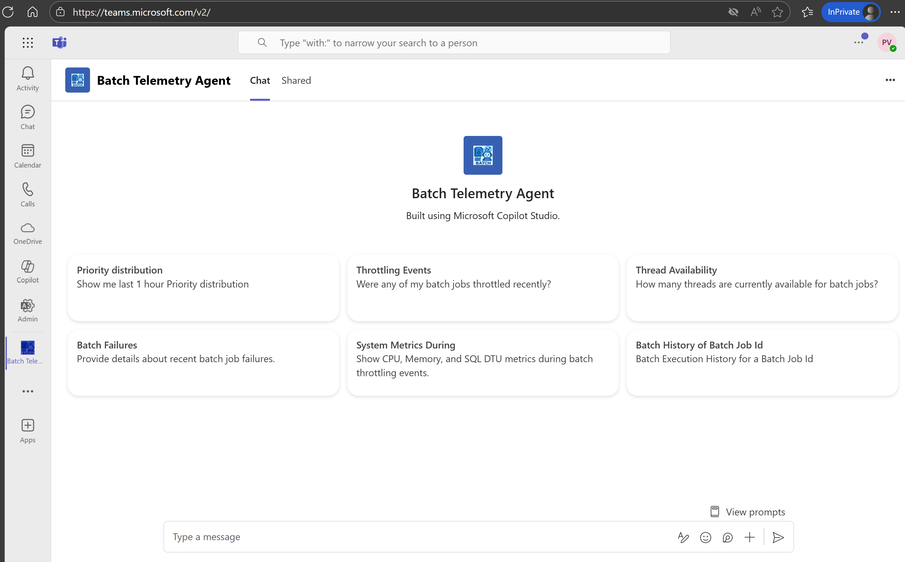
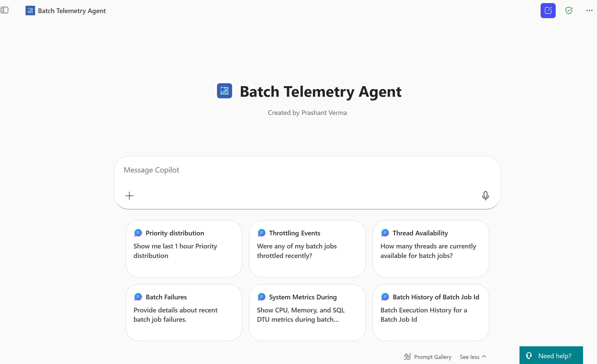
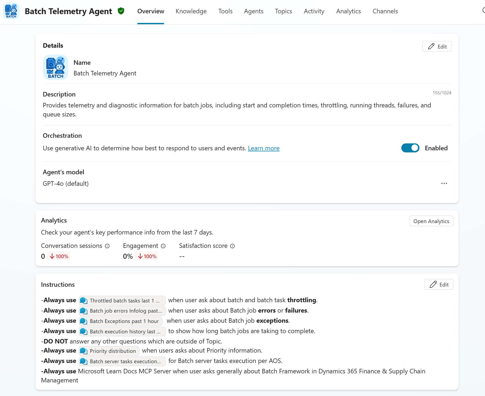
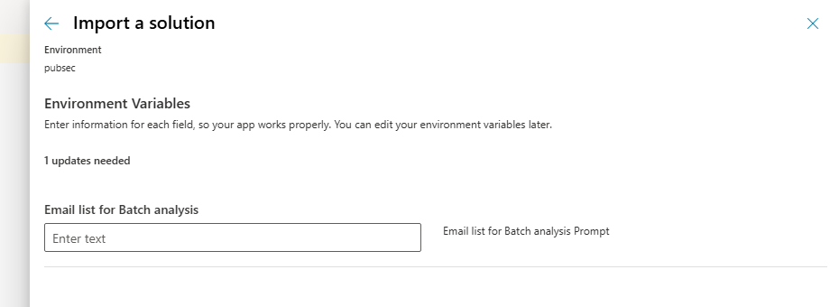
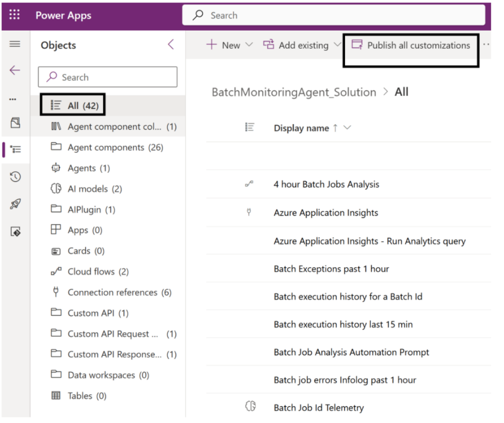
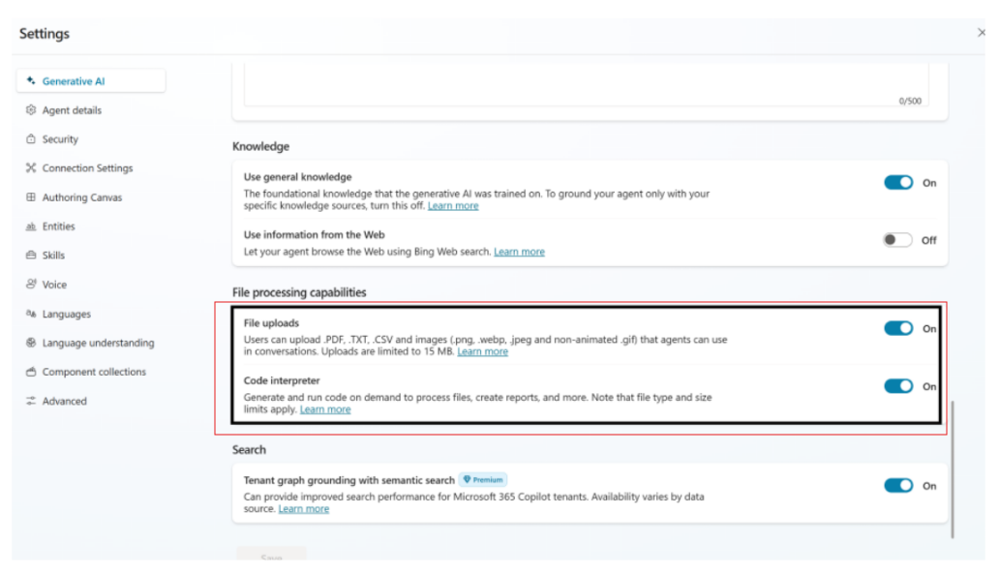
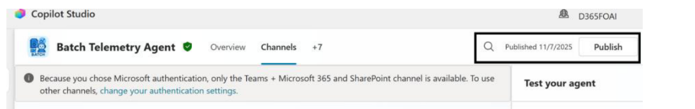

# Batch Framework Telemetry Agent

> AI-powered monitoring & diagnostics for D365 Finance & Supply Chain batch jobs, built with **Copilot Studio** and **Application Insights**.

 

## 📚 Table of Contents
- [Overview](#-overview)
- [Key Capabilities](#-key-capabilities)
- [Screenshots](#-screenshots)
- [Architecture](#-architecture)
- [Prerequisites](#-prerequisites)
- [Install & Configure](#-install--configure)
  - [1) Import Solution](#1-import-solution)
  - [2) Verify Agent & Connections](#2-verify-agent--connections)
  - [3) Knowledge Source (Optional)](#3-knowledge-source-optional)
- [Usage](#-usage)
- [Automation Ideas](#-automation-ideas)
- [Troubleshooting](#-troubleshooting)
- [FAQ](#-faq)
- [Resources](#-resources)
- [Contributors](#-contributors)

---

## 🧠 Overview
The **Batch Telemetry Agent** optimizes batch job execution in Dynamics 365 by combining **Application Insights telemetry** with Copilot Studio. It answers natural-language questions, surfaces anomalies, and can guide or automate remediations.

## 🔧 Key Capabilities
- **Telemetry collection** across job start/end, thread usage, throttling, queue sizes, failures, and Infolog errors.  
- **Prompt-based analysis** (GPT-4o / GPT-5 ready) to query and interpret telemetry using KQL.  
- **Anomaly detection** for throttling, long runtimes, and scheduling inefficiencies.  
- **Self-healing hooks** to trigger safe recovery steps (e.g., rerun failed jobs).  
- **Dashboards & reports** for priority distribution, throttling trends, exceptions, and history.

---

## 🖼️ Screenshots

   
  Teams app home with quick prompts

   
  Copilot Studio chat with quick prompts

   
  Copilot Studio Overview & Topics

   
  Agent instructions and connected tools

   
  Agent details and orchestration model

---

## 🏗️ Architecture

  

**Flow**
1. D365 F&O emits batch telemetry → **Application Insights**.  
2. The agent runs KQL via a tool connection to App Insights.  
3. Users interact via **Teams / M365 Chat / Copilot Studio**.  
4. Optional remediation is invoked and validated via telemetry feedback.

---

## ✅ Prerequisites
- **D365 F&SCM** 10.0.45 (7.0.7690.21 / PU69) or later  
- **Application Insights** connected for batch telemetry  
- Access to **Copilot Studio**,  **Power Automate**  and **Outlook** (Outlook is used to send email updated after the analysis.)
- **App Insights API Access** (Application ID + API Key) for query tool

---

## 🚀 Install & Configure

### 1) Import Solution
1. Download the zip file in this repository’s **solution** folder.  
2. Import the solution: Go to **make.powerapps.com** → **Solutions** → **Import** or directly clicking on **Import Agent** from Copilot studio.
   

3. The wizard prompts to **create/sign in** to required connections.

4. After this you will be prompted to add email list. Provide a valid email id where you would like to receive Batch Execution analysis emails from the agent.

5. Click **Import** and wait for completion. 
6. On success, you’ll see confirmation:  
   

   

7. Open the solution and verify components and environvent variables  
   

8. Then publish all customizations as indicated in the above image.

### 2) Verify Agent & Connections
1. Open **copilotstudio.preview.microsoft.com** and select the correct environment.  
   You should see **“Batch Telemetry Agent.”**  
   

2. In the test pane, choose **Manage connections**.  
   

3. Ensure all are **Connected**; create missing ones if needed.  
   

4. For **Application Insights**, provide **Application (App) ID** and **API Key**.  
   

### 3) Enable Code Interpreter and File processing
Go to settings and enable the File processing and code intreperter features. The File upload feature enables you to upload data and gain insights and the code interpreter feature helps in generating code on the fly to visualize and analyze the data returned in your chats.

### 4) Enable Channels
Go to **Channels** and enable Teams and Microsoft 365 channels.

### 5) Republish After Changes 
• If you modify any of the following, republish the agent (Do this any time you modify the agent): 
o Topics 
o Instructions 
o Switch model to Chat GPT-5 
o Add triggers 
o Add MCP tools or connectors

> **Note:** If your tenant/org enforces SSO/2FA, ensure your connections are authorized for the environment hosting the agent.

> Best Practices

   
  Teams app home with quick prompts

---

## 🧪 Usage

### Suggested Prompts (cards shown in UI)
- “Show me last 1 hour **Priority distribution**.”  
- “Were any of my batch jobs **throttled** recently?”  
- “How many **threads** are currently available for batch jobs?”  
- “Provide details about recent **batch job failures**.”  
- “Show **CPU, Memory, and SQL DTU** metrics during batch throttling events.”  
- “**Batch Execution History** for Batch Job Id `<ID>`.”

> Results are backed by KQL queries against your App Insights instance.

---

## ⚙️ Automation Ideas
- Auto-rerun failed jobs when the error code matches an approved policy.  
- Post anomaly digests to a **Teams** channel daily.  
- Trigger escalation if throttling breaches an agreed threshold.

---

## 🧩 Troubleshooting
- **Agent not visible in Copilot Studio:** Confirm environment, security roles, and solution import status.  
- **Query errors:** Verify App Insights **Application ID / API Key** and workspace mapping.  
- **No telemetry returned:** Check D365 → App Insights connection and time range.  
- **Connection shows “Not connected”:** Re-authenticate; some orgs require SSO **authorization per environment**.

---

## ❓ FAQ
**Q: Does this change batch schedules?**  
A: No—by default it is read-only. Optional flows can be enabled for safe actions.

**Q: Can we swap models?**  
A: Yes. The agent uses the environment’s default model (e.g., GPT-4o). You can change this in Copilot Studio.

**Q: Multi-environment support?**  
A: Yes. Create separate connections per environment and parameterize the workspace if needed.

---

## 📎 Resources
- 📦 [Batch Telemetry Dashboard Release](https://github.com/microsoft/Dynamics-365-FastTrack-FSCM-Telemetry-Samples/releases/tag/Batch-1.0.0.0)  
- 📘 [Monitoring telemetry overview](https://learn.microsoft.com/en-us/dynamics365/fin-ops-core/dev-itpro/monitoring-telemetry/)  
- 🚀 [Monitoring: getting started](https://learn.microsoft.com/en-us/dynamics365/fin-ops-core/dev-itpro/monitoring-telemetry/monitoring-getting-started)

---

## 👥 Contributors
- Prashant Verma (AI Business Solutions)  
- Hemanth Kumar