# Sales Order Processor Agent
# Table of contents
1. [Use Case](#usecase)
2. [Sales Order Agent Components](#salesorderagent)
3. [Prerequisites](#prerequisites)
4. [Dataverse Solution Import - Install and configure the Sales Order Agent](#configuration)
5. [Install from Store - Install and configure the Sales Order Agent](#store)
6. [Limitations and constraints](#limitations)
7. [Roadmap](#roadmap)
8. [Troubleshooting](#troubleshooting)
9. [Security Guide](#securityguide)
10. [Extensibility Guide](#extensibility)
11. [Uninstall / Rollback](#uninstall)
12. [Changelog](#changelog)

# 🧩 Use Case 
Sales Order Agent is an autonomous agent for processing sales orders received via email attachments, validating customer and product data, and creating orders in Dynamics 365 finance and operation apps with minimal human intervention. 

1. Email received with attachments in personal or shared mailbox: 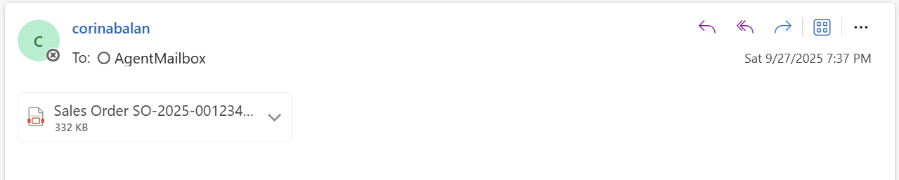

2. Each attachment and the extracted data saves to Dataverse: 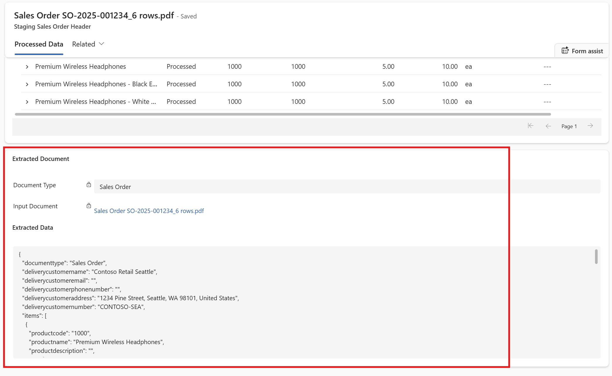 

    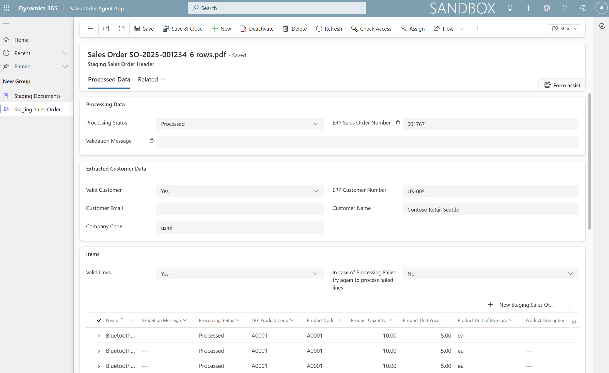
    

3. After validating the customer and products, the sales order gets created in Dynamics 365 and a notification is also sent:
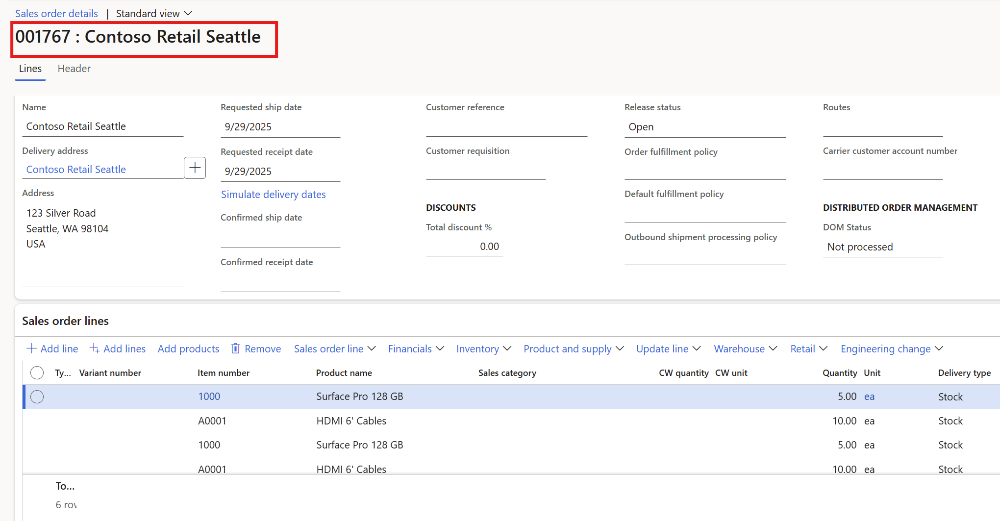

   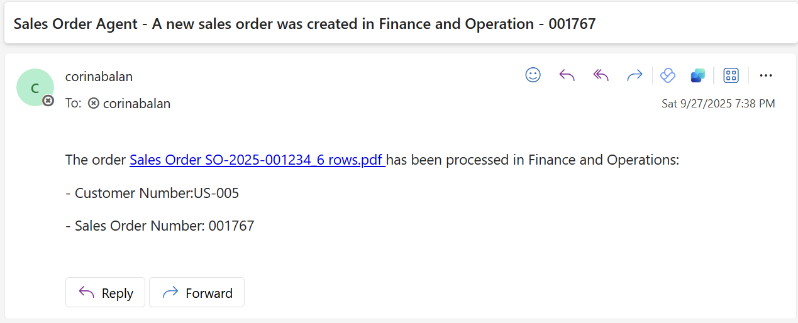

## Solution Capabilities
- **Autonomous Email Processing**: Monitors mailbox for email attachments
- **AI-Powered Document Parsing**: Extracts structured data from PDF/image attachments
- **ERP Integration**: Validates customers/products and creates orders in ERP
- **Exception Handling**: Routes items requiring manual review
-	**Automated Notifications**: Sends processing status updates
- **Supported File Types**: PDF documents, image files (JPG, PNG, etc.)

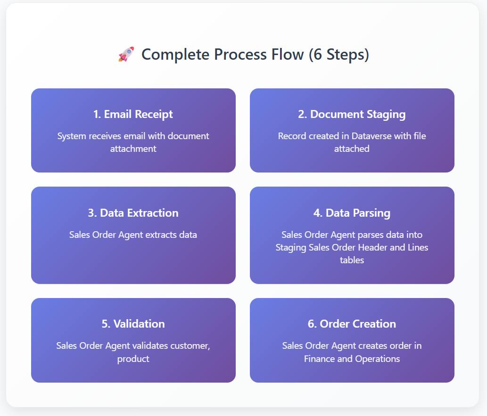

# 🤖 Sales Order Agent Components
The agent orchestrates the entire sales order processing workflow, 
invokes appropriate agent flows based on the staging record processing status, and handles error scenarios and routing.
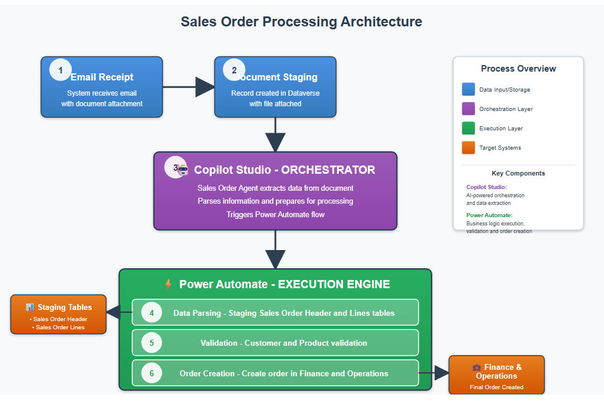

## Agent Instructions:
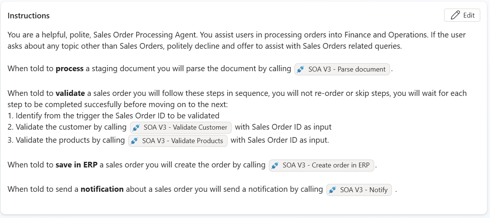

## Triggers:
-	Dataverse trigger for processing status updated
-	Office 365 triggers for new emails into personal and shared mailbox

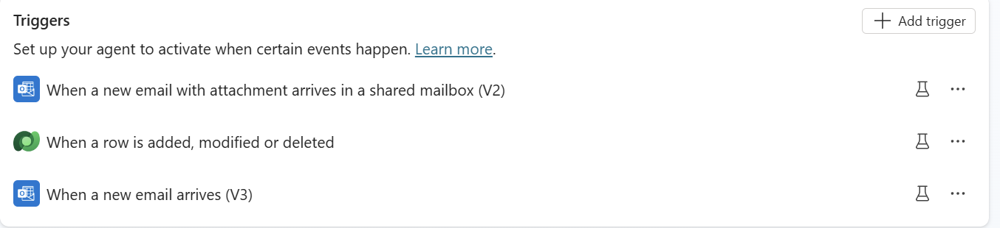

## Agent flows: 
For implementing deterministic sales order specific validation rules, as well as sales order header and lines creation, several agent flows have been created:

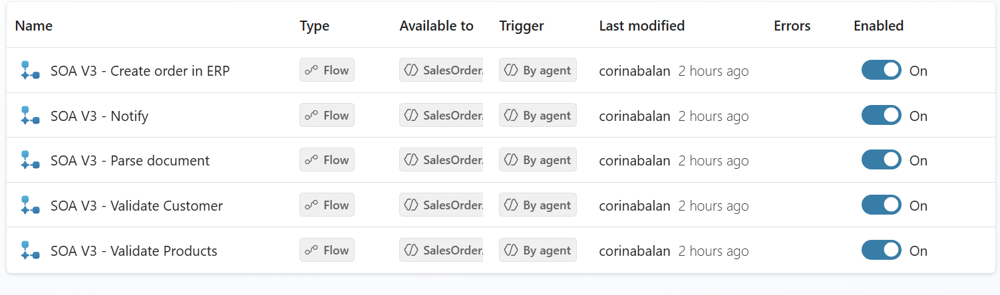

  - **Parse document** – agent flow which uses AI Builder custom prompt to extract data from email attachment in JSON format.
  - **Validate customer** – agent flow which tries to uniquely identify customer in Dynamics 365 using customer name or email.
  - **Validate products** –  agent flow which tries to uniquely identify the products in Dynamics 365 using product codes.
  - **Create order** – agent flow which creates the sales orders in Finance and Operations.
  - **Notify** – agent flow which sends emails when the sales orders are processed or need manual review.
  - **LoadSalesOrderData** - flow which splits the extracted JSON into dedicated Dataverse tables.
- **Update Processing Status to Valid** - flow which updates processing status.
- **Reprocess the not processed lines** - flow which re-tries to proces any failed order lines.

## Dataverse tables and custom app
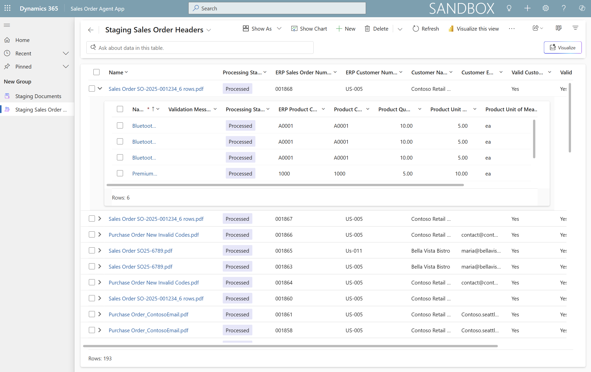
  - **Sales Order Agent App** - visible to users with **Sales Order  reviewer, sys admin or sys customizer** security roles.
  - **Staging Document** – stores email attachments and extracted data. Key columns: 
    - **Extracted Data** - result of extraction in JSON format
    - **Input Document** - document received as email attachment

  - **Staging Sales Order Header** – stores header level data, customer information. Key columns:
    - **Processing Status** - The automatic successful status transition is **New -> Valid -> Processed**. For failures **New -> Manual Review** or **New -> Valid -> Processing Failed**. 
      - For a **Manual Review** status, the reviewer can insert manually the correct ERP Customer Number and ERP Product Codes and set flags Valid Customer and Valid Lines to Yes. When both Valid Customer and Valid Lines are updated to Yes, the processing status is set to Valid and the agent tries to create the order in Finance and Operations.
      - For a **Processing Failed** status, the reviewer can analyze the validation messages for the failed lines, perform necessary updates either in the extracted data or in the ERP system, then retry to process those failed lines by setting the flag Try again to process failed lines to Yes.

    - **Valid Customer** - Automatically set by agent execution. If the customer is not identified, the status is set to Manual Review and a notification is sent. A reviewer may do necessary corrections and set the flag Valid Customer to Valid.
    - **Valid Lines** - Automatically set by agent execution. If the product is not identified, the status is set to Manual Review and a notification is sent. A reviewer may do necessary corrections and set the flag Valid Lines to Valid.
    - **ERP Customer Number** - Automatically set during agent execution. If the customer is not identified, the status is set to Manual Review and a notification is sent. A reviewer may insert manually the ERP Customer Number and set the flag Valid Customer to Valid.
    - **ERP Sales Order Number** - Automatically set by agent execution.
    - **Customer Name** , **Customer Email** - Automatically set by agent execution. 
    - **Try again to process failed lines** - Relevent for partially created orders due to intermittent failures or after fixing data issues (e.g. products missing default site), the flag can be set to Yes to re-submit the failed lines.
    - **Validation Message** - Automatically set by agent execution.
    - **Company Code** - Automatically set by agent execution from environment variable value. For changing this behaviour and introduce multiple companies, you can extend the logic in the LoadSalesOrderData flow.
 
    
  - **Staging Sales Order Lines** –  stores line level data, product codes, product details.
    - **Processing Status** - Automatic status transitions similar to the header status transitions.
    - **Product Code**, **Product Description**, **Product Quantity**, **Product Unit of Measure'** - Automatically set by agent execution. 
    - **ERP Product Code** - Automatically set by agent execution. In case the product is not identified, the status is set to Manual Review and a notification is sent. A reviewer may do necessary corrections insert the correct ERP Product Codes and set the flag Valid Lines to Yes.
    - **Validation Message** - Automatically set by agent execution. 
 
 If you require to capture additional columns e.g. VAT Number, you'd need to include the columns in the AI Builder data extraction prompt, also create a new Dataverse column in the staging sales order header and/or lines tables depending on where the data should be stored, and ensure to include in the LoadSalesOrderData flow an update to load the newly added columns from the extracted JSON into the relevant Dataverse table.

## AI Builder Prompt
- **Extracts data from document** - prompt with input a file or image and JSON format output.
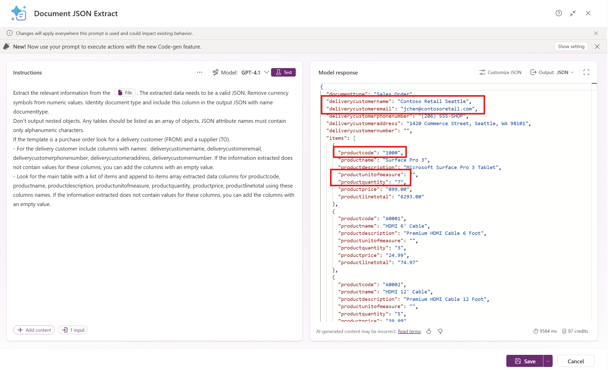

# ✅ Prerequisites for installing the Sales Order Agent solution
 - Connected Dataverse environment with an environment with  finance and operations apps. To confirm this, you can check in the Power Platform Admin Portal for a given environment that there is a corresponding link to Dynamics 365.
 - The user who installs the Sales Order Agent solution must be a licensed user in Dynamics 365.
 - Dataverse virtual tables enabled: Released products V2 (mserp), Customers V3 (mserp). Learn more about how to enable virtual tables in Dataverse at https://learn.microsoft.com/en-us/dynamics365/fin-ops-core/dev-itpro/power-platform/enable-virtual-entities.
 - Sales Order agent solution imported and agent configured as indicated in the next section.
 - System Administrator role for solution import and agent configuration.
 - Manual Reviewers should be assigned the Sales Order Agent Reviewer security role after the solution is imported.
 - During solution import, ensure to provide values for either **a personal mailbox or a shared mailbox to monitor, the mailbox folder to monitor, the company code (for the sample file you can use usmf) and a reviewer email address**. After solution import, the corresponding environment variables can be updated from the context of an unmanaged solution. 
 - Please ensure that the environment where the agent is running either has Copilot Studio credits assigned, or there is a pay as you go billing plan in place. For more details, please see https://learn.microsoft.com/en-us/power-platform/admin/manage-copilot-studio-messages-capacity?tabs=new.
 
 **TIP**: If you require to monitor other folders than Inbox, please ensure there is a rule in place to route the emails automatically to the respective folder. For example, for a subfolder SalesOrder, you'd need to provide the value Inbox/SalesOrder for the folder to monitor.

# ✅ Sales Order Agent installation with Dataverse solution import
Import the Sales Order Agent solution from the Solutions folder and please consider the following to make the agent work for your specific needs and data:
 - **Create the connections** for Power Automate flows access systems using the least privileged accounts or a service principal where possible.
 - **Update the environment variables** - when importing the solution you should provide a **mailbox to monitor** for incoming sales orders attachments. You can choose a shared and/or personal mailbox. Ensure to provide email address for the **reviewer mailbox** and the **company code**. 
 - By default only pdf attachments are processed. If you'd like to process images as well, set **ProcessImagesAttachments** variable to Yes. 

    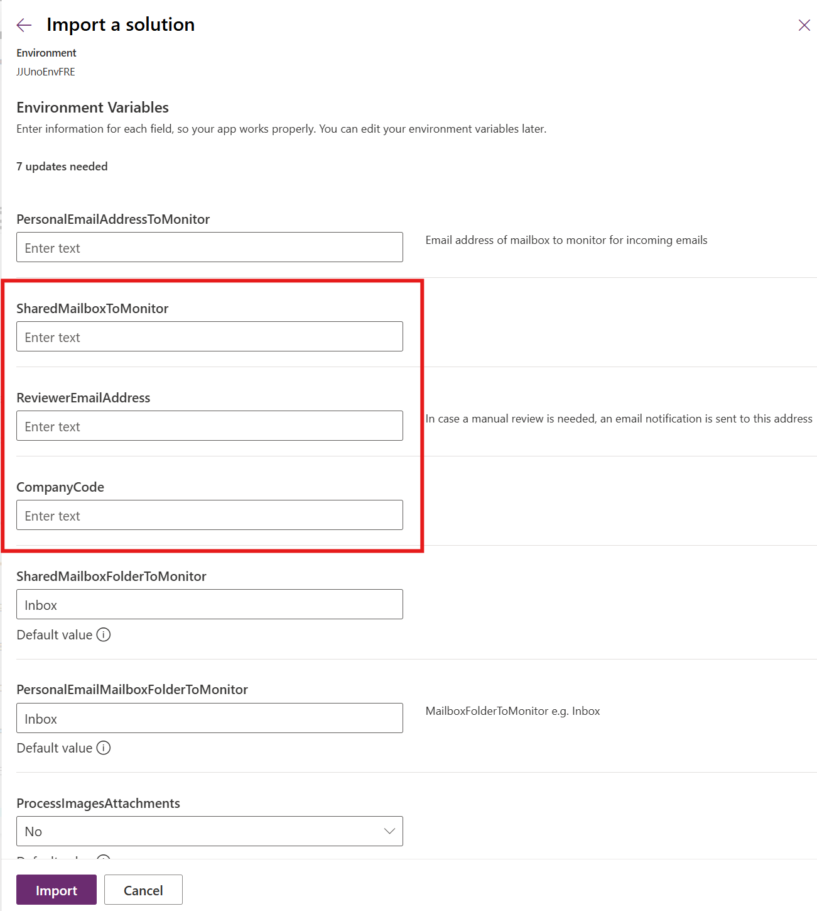

  - **Update the Finance and Operation instance** – This step is required for the flow to integrate with your ERP instance. Navigate to make.powerautomate.com, select the relevant environment and from the list of flows, open the flow SOA V3 – Create Order in ERP.
  - Click on the flow and then Edit – this should open the flow in the Power Automate designer. If enabled, disable New Designer when making this change. 
  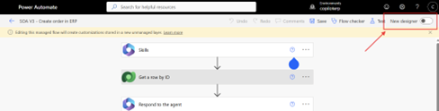
  - Open the condition if the ERP Sales Order was not created and edit the ERP instance for these 2 actions: Create Sales Order Header in ERP and Upload attachment
  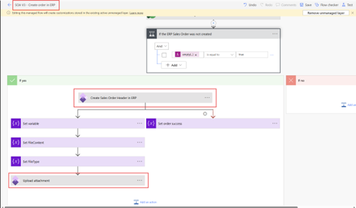
  - Change the instance and wait for a few seconds for the change to be processed. Please double-check post-change that the input parameters have kept their values and that you are indeed using the classic designer.
    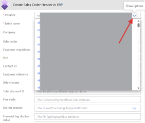
    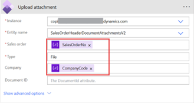
    
  - Open Apply to each- > Try to create sales order line and change the ERP instance for Create Sales Order Line action as well and wait for the ERP instance update to complete and to observe the input parameters keeping their values. 
  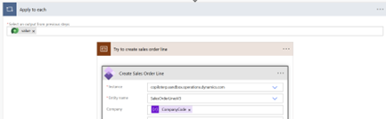
  - Save your flow changes.
  - **TIP – If the flow is not editable, go back to the Flow main page, refresh it, then try to open again the Editor Page.**

 - **Customer validation** - Sales order agent validates customer name, and if not found, will search using the email address if available in the document. The agent flows validating the customer depends on the json extracted to contain the column **deliverycustomername**, **deliverycustomeremail**. Consider if this is necessary for your organization, and update as needed e.g. identifying customer by VAT Number if its provided – if you'd like to change the customer validation criteria, ensure to update the AI Builder extraction prompt to collect the required fields,create Dataverse column to store the VAT Number in the Staging Sales Order Header table, update the LoadSalesOrderData flow to populate the new column from the extracted JSON, and SOA V3 - Validate Customer agent flow to use the VAT Number for customer identification.

- **Products validation** – Sales order agent validates the product codes, and if found, when creating the sales order lines it will use the extracted product code, quantity, and unit of measure. The agent flows depends on the json extracted to contain columns **productcode, productquantity, productunitofmeasure**. Similarly with the customer extraction, if you need to capture different columns with your prompt, you will need to update the AI Builder extraction prompt, create Dataverse columns in the Staging Sales Order Line table, and update LoadSalesOrderData flow and SOA V3 - Validate Products agent flow.

- **Sample document** - You can use the attached test pdf document for testing if you have the sample data available in your Finance and Operations environment. Company Code should be usmf and the products 1000, A0001 should have  default order settings (Site and Warehouse) configured.

# ✅ Sales Order Agent installation via store
After installing the solution containing the sales order agent and components in Dataverse, there are several post-installation and configuration steps necessary. If you face issues please dont hesitate to reach out by filling out this form https://forms.office.com/r/BzUfaL89da  :

 - **1. Create an unmanaged solution** - once the package from the store is succesfully deployed you will see two managed solutions installed in your Dataverse environment. Please proceed to create a new **unmanaged** solution to store the components which need to be configured. For step by step guidance, please see https://learn.microsoft.com/en-us/power-apps/maker/data-platform/create-solution. 

 - **2. Add environment variables to the unmanaged solution** - once you create your unmanaged solution, open it, and click Add Existing - > More - > Environment variable:
 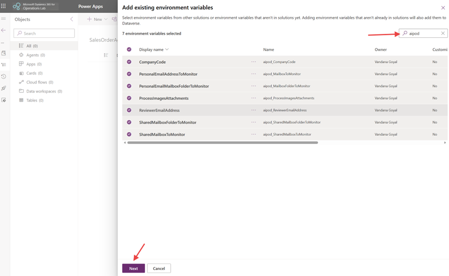
 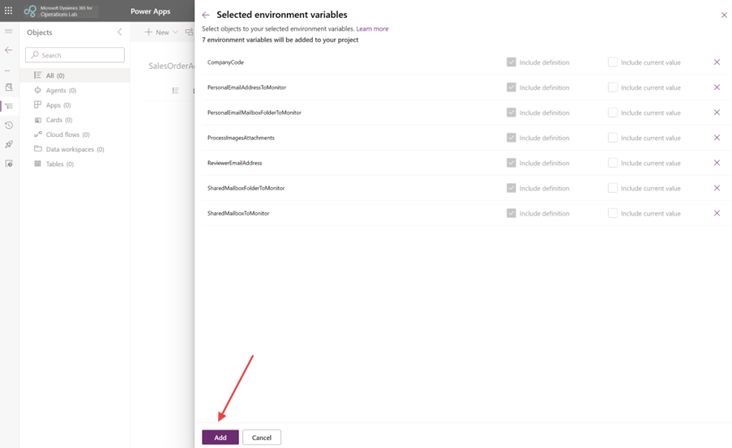

 - **3. Update environment variables** -  Provide values for the **CompanyCode** (for sample data you can use usmf), **SharedMailboxToMonitor** and/or **PersonalEmailAddressToMonitor** and the corresponding **SharedMailboxFolderToMonitor**, **PersonalEmailMailboxFolderToMonitor**, **ReviewerEmailAddress**. You can choose if you'd like to monitor a shared and/or personal mailbox. By default only pdf attachments are processed. If you'd like to process images as well, set **ProcessImagesAttachments** variable to Yes. 

 - **4. Update Connection References** - start by adding these 4 connection references to your unmanaged solution (Add existing -> More - > Connection references).
  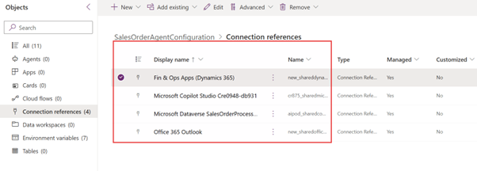
    - Open each connection reference (Edit) and update its related connection by creating either a new connection or by using an existing connection if available. See the [Security Guide](#securityguide) for least-privilege permission requirements for each connection reference.
    -	For example when trying to create a new Fin & Ops (Dynamics 365) connection for the Fin & Ops connection reference, a new Connection page is opened, type to search for Dynamics 365 and select the create Action. Afterwards, in the unmanaged solution, associate the newly created connection with your Connection Reference. 
    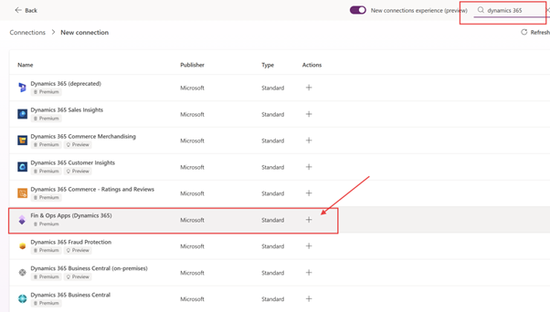
    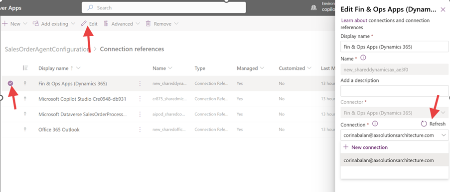
    - **Repeat** this process for the **Fin & Ops, Dataverse, Copilot Studio and Office 365 connection references**.

- **5. Enable flows** - as we didn’t have valid connection references previously, several flows are now disabled and need to be enabled – this can be achieved in multiple ways, an option is to open the managed solution imported when the package was installed from the store, the solution **Sales Order Agent Processing Template** and enable the flows:
    - Open the Managed Solution Sales Order Agent Processing Template and turn the status to On for all of the flows with status Off by selecting the flow, then pressing Turn on button. Unfortunately, you can only enable one flow at a time. 
    - Please note that if you didn’t provide values for shared mailbox address and folder to monitor via the respective environment variables, the flow “When a new email with attachment arrives in a shared mailbox (V2)” should remain disabled, otherwise the flow should be turned on as well.  Similarly, for the flow “When sales order email with attachment arrives” if you didn’t provide values for personal mailbox address and folder to monitor via the respective environment variables, the flow should be disabled.
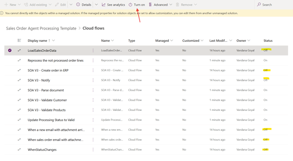
  - After enabling the flows, we should see a status of On (except for the mailbox trigger flow depending on if you use shared and/or personal mailbox for monitoring)
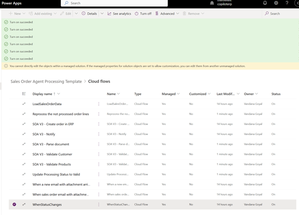

- **6. Confirm product and customers Dataverse virtual tables are enabled** - follow instructions detailed at this page https://learn.microsoft.com/en-us/dynamics365/fin-ops-core/dev-itpro/power-platform/enable-virtual-entities. In order to open the Classic Advanced Find, you can also open the Power Platform Environment Settings app, click on Search in the toolbar then click on “Search for rows in a table using advanced filters”:
  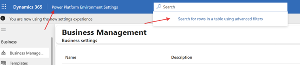
  - From the left corner, click on Switch to Classic
  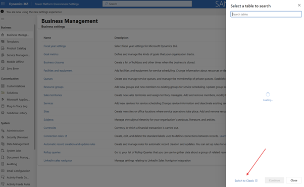
  - Look for Available Finance and Operations Entities and add in the criteria Name contains ReleasedProductV2Entity. Press Results, and open the record found, tick the Visible checkbox and save.
    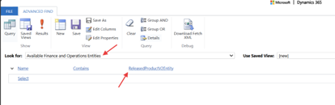
  - Repeat the process and change criteria for Name contains CustomerV3, press Results, open the record found, tick the Visible checkbox and save.

**7. Update the Finance and Operation instance** – this step is required for the flow to integrate with your ERP instance. 
  - Navigate to make.powerautomate.com, select the relevant environment and from the list of flows, open the flow SOA V3 – Create Order in ERP.
  - Click on the flow and then Edit – this should open the flow in the Power Automate designer. If enabled, disable New Designer when making this change. 
  
  - Open the condition if the ERP Sales Order was not created and edit the ERP instance for these 2 actions: Create Sales Order Header in ERP and Upload attachment
  
  - Change the instance and wait for a few seconds for the change to be processed. Please double-check post-change that the input parameters have kept their values and that you are indeed using the classic designer.
    
    
    
  - Open Apply to each - > Try to create sales order line and change the ERP instance for Create Sales Order Line action as well and wait for the ERP instance update to complete and to observe the input parameters keeping their values. 
  
  - Save your flow changes.
  - **TIP – If the flow is not editable, go back to the Flow main page, refresh it, then try to open again the Editor Page.**

**8. Publish the Sales Order Agent** - open copilotstudio.microsoft.com, select the environment, in the list of agents find SalesOrderAgent, open the agent and press Publish button
 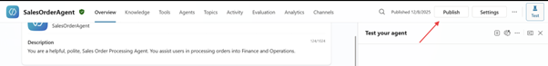

**9. Billing setup** – the agent is going to consume Copilot Studio credits – depending on the complexity and size of the documents parsed it can consume around 30 to 80 credits (1 credit = 0.01$) per attachment processed. Please ensure that the environment where the agent is running either has Copilot Studio credits assigned, or there is a pay as you go billing plan in place. For more details, please see https://learn.microsoft.com/en-us/power-platform/admin/manage-copilot-studio-messages-capacity?tabs=new. 

**10. Test the agent** - send an email with attachment to the configured mailbox address.

**11. Monitor the agent** using the Sales Order Agent App – in order to access the monitoring app, you can open make.powerapps.com, select the environment where you installed the Sales Order Agent solution, then select Apps from the left-side options, select Sales Order Agent App then Play button from the ribbon.
 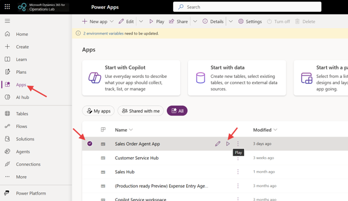

 - **Optional - Update Customer validation** - Sales order agent validates customer name, and if not found, will search using the email address if available in the document. The agent flows validating the customer depends on the json extracted to contain the column **deliverycustomername**, **deliverycustomeremail**. Consider if this is necessary for your organization, and update as needed e.g. identifying customer by VAT Number if its provided – if you'd like to change the customer validation criteria, ensure to update the AI Builder extraction prompt to collect the required fields,create Dataverse column to store the VAT Number in the Staging Sales Order Header table, update the LoadSalesOrderData flow to populate the new column from the extracted JSON, and SOA V3 - Validate Customer agent flow to use the VAT Number for customer identification.

- **Optional - Update Products validation** – Sales order agent validates the product codes, and if found, when creating the sales order lines it will use the extracted product code, quantity, and unit of measure. The agent flows depends on the json extracted to contain columns **productcode, productquantity, productunitofmeasure**. Similarly with the customer extraction, if you need to capture different columns with your prompt, you will need to update the AI Builder extraction prompt, create Dataverse columns in the Staging Sales Order Line table, and update LoadSalesOrderData flow and SOA V3 - Validate Products agent flow.

- **Optional - Sample document** - You can use the attached test pdf document for testing if you have the sample data available in your Finance and Operations environment. Company Code should be usmf and the products 1000, A0001 should have  default order settings (Site and Warehouse) configured.

# 🧩 Limitations and constraints

- The processing of email attachments, the extracted sales order data validations and processing are asynchronous operations.
- The agent is going to consume Copilot Studio credits. Depending on the complexity and size of the documents parsed it can consume around 30 to 80 credits (1 credit = 0.01$) per attachment processed. 
- The agent only processes the email attachments: pdf by default, and optionally also images (png,jpeg,jpg) (controlled with environment variable)
- The agent uses AI Builder custom GPT prompts for document extraction. The GPT prompts support documents with less than 50 pages, for the full list of limitations please see https://learn.microsoft.com/en-us/ai-builder/add-inputs-prompt#limitations 
- The agent uses Office 365 connectors for monitoring the mailboxes, please see the limitations https://learn.microsoft.com/en-us/connectors/office365/#limits 
- Other Copilot Studio limitations https://learn.microsoft.com/en-us/microsoft-copilot-studio/requirements-quotas 

# 🤖 Sales Order Agent Roadmap
For customers with larger documents where AI Builder custom GPT prompt is not feasible, we are planning to enhance the sales order agent document extraction with another method for document analysis using Azure AI services.

The following improvements are planned or recommended for future versions:

| Priority | Improvement | Notes |
|----------|-------------|-------|
| 🔴 High | Make ERP instance an environment variable | Eliminates the manual classic-designer flow edit step |
| 🔴 High | Duplicate order detection | Check for existing ERP orders before creating, using customer + order reference |
| 🟡 Medium | Extraction confidence scoring | Flag low-confidence extractions for human review before ERP submission |
| 🟡 Medium | Fuzzy customer name matching | Reduce manual review volume for near-matches (e.g. "Contoso Ltd" vs "Contoso Limited") |
| 🟡 Medium | Extended field extraction | Capture requested delivery date, unit price, discount, and payment terms |
| 🟡 Medium | Azure AI Document Intelligence | Support documents larger than 50 pages |
| 🟡 Medium | Unit of measure normalization | Map customer UoM codes to ERP equivalents (e.g. "EA" → "Each") |
| 🟢 Low | Multi-company routing | Determine company code from document content or sender domain |
| 🟢 Low | Additional file format support | Excel, CSV, EDI (X12/EDIFACT) input formats |
| 🟢 Low | Copilot Studio credit usage dashboard | Track and alert on consumption thresholds |
| 🟢 Low | Automated flow health alerting | Notify admins when flows fail or connections expire |

# 🔧 Troubleshooting

## General Approach
1. Open the **Sales Order Agent App** (make.powerapps.com → Apps → Sales Order Agent App → Play) to review the processing status and validation messages for each staging record.
2. Open **Power Automate** (make.powerautomate.com) and inspect the run history for the individual flows. Failed runs include detailed error messages.
3. Open **Copilot Studio** (copilotstudio.microsoft.com) and review the agent conversation history for the specific run.

## Common Issues and Resolutions

### Email not picked up / no staging record created
- Confirm the flow **"When a new email with attachment arrives..."** is turned **On** in Power Automate.
- Verify the environment variables `SharedMailboxToMonitor` / `PersonalEmailAddressToMonitor` and the corresponding folder variables are correctly set. Folder values are case-sensitive (e.g. `Inbox/SalesOrders`).
- Check that the mailbox connection reference is valid and not expired — open the flow, confirm the trigger connection is authenticated.
- Ensure the incoming email actually has a file attachment (not an embedded inline image). Only proper attachments are processed.

### Staging record created but status stays "New" / agent does not trigger
- Confirm the Dataverse trigger flow is turned **On** (`SOA V3 – Update Processing Status to Valid` and related status flows).
- Verify the **SalesOrderAgent** in Copilot Studio is **Published** (copilotstudio.microsoft.com → agent → Publish).
- Check that Copilot Studio credits are available or a pay-as-you-go billing plan is active.

### Customer validation fails (status = "Manual Review", Valid Customer = No)
- The agent searches by `deliverycustomername` and then by `deliverycustomeremail`. Verify the Dataverse virtual table **Customers V3 (mserp)** is enabled and accessible.
- Check the **Validation Message** column on the staging header record for the exact failure reason.
- If the customer name in the document does not match the ERP record exactly, manually enter the correct **ERP Customer Number** in the staging header, set **Valid Customer = Yes**, and save.
- Consider extending the **SOA V3 – Validate Customer** flow to support fuzzy matching or VAT Number lookups.

### Product validation fails (status = "Manual Review", Valid Lines = No)
- The agent looks up product codes in the virtual table **Released Products V2 (mserp)**. Confirm this virtual table is enabled.
- Check the **Validation Message** column on the failing staging lines for the exact product code that was not found.
- Manually correct the **ERP Product Code** on each failing staging line and set **Valid Lines = Yes** on the header to retry.

### Sales order creation fails (status = "Processing Failed")
- Open the run history for **SOA V3 – Create Order in ERP** in Power Automate and examine the error in the failed step.
- The most common cause is the Finance & Operations instance not being updated in the flow — see the [ERP instance update step](#configuration) in the installation guide.
- Verify the Fin & Ops connection reference is valid and the connected account has sufficient permissions (see [Security Guide](#securityguide)).
- After fixing the root cause, set **Try again to process failed lines = Yes** on the staging header to reprocess failed lines without duplicating successfully created lines.
- If a product line fails due to missing default site/warehouse in ERP, configure those defaults for the product in Dynamics 365, then retry.

### AI extraction produces empty or incorrect JSON
- The AI Builder custom prompt supports a maximum of **50 pages**. Documents exceeding this limit will not be processed correctly.
- Confirm the attachment is a valid, non-password-protected PDF or image file.
- Open AI Builder in Power Apps (make.powerapps.com → AI Hub → Models) and test the prompt directly with the failing document to diagnose extraction issues.
- If the document language is not English, the prompt may need to be updated to instruct the model to extract regardless of language.

### Flows cannot be edited (greyed out in designer)
- Go back to the Power Automate flow list page, refresh, and then reopen the flow editor. This resolves transient designer loading issues.
- If editing a managed solution flow, ensure you are working within an unmanaged solution layer (add the flow to an unmanaged solution and edit it from there).

### Connections expire or become invalid
- Connections based on user accounts will break when the user's password changes or the account is disabled. Use a dedicated service account or service principal where possible (see [Security Guide](#securityguide)).
- To renew a connection, navigate to Power Automate → Connections, find the expired connection, and re-authenticate.

# 🔒 Security Guide

## Least Privilege Requirements

Use dedicated service accounts or service principals rather than personal user accounts or sysadmin accounts for all connection references. The table below lists the minimum permissions required for each connector.

| Connection Reference | Connector | Minimum Required Permissions |
|---|---|---|
| Fin & Ops (Dynamics 365) | Dynamics 365 Finance & Operations | **Sales order clerk** role (or a custom role with: `SalesOrderCreate`, `SalesOrderLineCreate`, attachment upload). Read access to Customers V3 and Released Products V2 virtual tables is handled through Dataverse. |
| Dataverse | Microsoft Dataverse | **Basic User** + the **Sales Order Agent Service** security role (grants CRUD on staging tables, read on virtual tables). Do **not** use System Administrator. |
| Office 365 (mailbox monitoring) | Office 365 Outlook | Mailbox permissions on the monitored shared mailbox (or the personal account owning the personal mailbox). **No** broader Exchange admin rights are required. For shared mailboxes, grant `Full Access` or `Send As` to the service account. |
| Copilot Studio | Microsoft Copilot Studio | **Environment Maker** role is sufficient for agent publishing and operation. |

> **Note**: The Fin & Ops custom role permissions (`SalesOrderCreate`, `SalesOrderLineCreate`) can be granted by duplicating the standard **Sales Order Clerk** role and removing unneeded privileges. Always test the connection with the minimal role before deploying to production.

## Service Principal Authentication

Where possible, replace user-account-based connections with **service principal (app registration)** connections to avoid disruption when user accounts change.

### Steps to configure a service principal for Dataverse:
1. Register an application in **Microsoft Entra ID** (Azure AD) and note the Application (client) ID and tenant ID.
2. Create a client secret for the application registration.
3. In the Power Platform Admin Center, navigate to the environment settings and add the application user — assign it the **Sales Order Agent Service** security role.
4. When creating the Dataverse connection reference, choose **Service Principal** authentication and supply the client ID, tenant ID, and client secret.

### Steps to configure a service principal for Finance & Operations:
1. Register the same (or a separate) Entra ID application.
2. In Dynamics 365 Finance & Operations, navigate to **System Administration → Azure Active Directory Applications**, register the application, and assign it the least-privilege role described above.
3. When creating the Fin & Ops connection reference, use the **Service Principal** option.

## Reviewer Security Role Scope

Users assigned the **Sales Order Agent Reviewer** security role can:
- **Read, update** records in the **Staging Sales Order Header** and **Staging Sales Order Lines** tables.
- **Read** records in the **Staging Document** table (to view the original attachment and extracted JSON).
- **No access** to other Dataverse tables, environment variables, or flow configurations.

Do **not** grant reviewers the System Administrator or System Customizer roles, as these provide access to all environment configuration including connection credentials and environment variables.

## Additional Security Recommendations
- Enable **Dataverse auditing** on the staging tables to maintain a tamper-evident log of all reviewer corrections.
- Rotate service account passwords / client secrets on a regular schedule and update connection references promptly.
- Review the Office 365 connector's mailbox access periodically and remove access for deprovisioned accounts.
- Restrict the monitored mailbox to accept attachments only from known sender domains where possible, to reduce the risk of processing malicious documents.

# 🛠️ Extensibility Guide

This section documents common customization scenarios and the components that need to be updated for each.

## Adding ERP instance as an environment variable (recommended)

Currently, the Finance & Operations instance URL is hardcoded inside the **SOA V3 – Create Order in ERP** flow. To make this configurable without editing the flow:

1. Create a new **environment variable** of type `Text`, named `ERPInstanceURL`, with the base URL of your F&O environment (e.g. `https://mycompany.operations.dynamics.com`).
2. Add this environment variable to your unmanaged solution.
3. Edit **SOA V3 – Create Order in ERP**: replace the hardcoded instance URL in the **Create Sales Order Header in ERP**, **Upload attachment**, and **Create Sales Order Line** actions with the `ERPInstanceURL` environment variable value.

This eliminates the need for manual flow editing during deployment to new environments.

## Multi-company support

To route orders to different ERP company codes based on document content or sender:

1. Extend the AI Builder extraction prompt to extract a company indicator field (e.g. a "Ship To" legal entity, or a buyer code).
2. Add a **Company Code** column to the **Staging Sales Order Header** Dataverse table.
3. Update the **LoadSalesOrderData** flow to populate this column from the extracted JSON instead of using the environment variable.
4. Update **SOA V3 – Create Order in ERP** to use the staging header's company code column value when calling the ERP APIs.

## Duplicate order detection

To prevent creating duplicate ERP sales orders for the same incoming document:

1. Add a **Source Document Reference** column (type Text) to the **Staging Sales Order Header** table to store a unique key derived from the email subject or a purchase order number extracted from the document.
2. Extend the AI Builder prompt to extract this reference number.
3. Update **LoadSalesOrderData** to populate the column.
4. In **SOA V3 – Create Order in ERP** (before calling the ERP create action), add a step to query the **Staging Sales Order Header** table for any existing record with the same Source Document Reference and a status of `Processed`. If a match is found, skip creation and set the status to `Duplicate`.

## Adding extracted fields (price, delivery date, payment terms)

To capture additional fields from the document:

1. Update the **AI Builder custom prompt** to instruct the model to extract the new fields. Use descriptive field names (e.g. `requesteddeliverydate`, `unitprice`, `discountpercentage`, `paymentterms`).
2. Add corresponding columns to the **Staging Sales Order Header** and/or **Staging Sales Order Lines** Dataverse tables.
3. Update the **LoadSalesOrderData** flow to read the new JSON fields and write them to the new Dataverse columns.
4. Update **SOA V3 – Create Order in ERP** to pass the new field values when creating sales order headers and lines.

## Unit of Measure normalization

If customers use different UoM codes than those configured in ERP (e.g. "EA" vs "Each"):

1. Create a new Dataverse table **UoM Mapping** with columns: `CustomerUoM` (Text), `ERPUoM` (Text).
2. Populate it with your known mappings.
3. In the **SOA V3 – Create Order in ERP** flow, before creating each line, look up the extracted `productunitofmeasure` value in the mapping table and use the corresponding `ERPUoM` value. If no mapping is found, fall back to the extracted value and flag the line for review.

## Extending customer validation (fuzzy matching or VAT Number)

To reduce manual review volume:

1. Update the **AI Builder prompt** to also extract a `vatregistrationnumber` or similar unique identifier.
2. Add a `VAT Number` column to **Staging Sales Order Header**.
3. Update **LoadSalesOrderData** to populate it.
4. Update **SOA V3 – Validate Customer** to first attempt exact match, then fall back to VAT number lookup, and finally fall back to fuzzy name comparison (e.g. using a custom connector or Azure Cognitive Search).

## Operational monitoring and alerting

To add health monitoring for the agent:

- **Credit usage**: Use the Power Platform Admin Center's Copilot Studio capacity reports to monitor credit consumption. Set up a Power Automate flow to query the Admin Center APIs and send an email alert when remaining credits fall below a threshold.
- **Flow failure alerting**: In Power Automate, each flow supports email notification on failure. Open each flow → Settings → enable **Run failure notifications** and specify an admin email address.
- **Processing SLA metrics**: Create a scheduled Power Automate flow that queries the **Staging Sales Order Header** table and calculates: total records by status, average time from `createdon` to status `Processed`, and count of records stuck in `New` or `Manual Review` for more than a configurable threshold. Send a summary report to operations stakeholders.
- **Dead-letter handling**: Records in `Manual Review` status that are not actioned within a configurable number of days can be automatically escalated by a scheduled flow that updates the status to `Escalated` and sends a notification to a manager.

# 🗑️ Uninstall / Rollback

Follow these steps to cleanly remove the Sales Order Agent solution from a Power Platform environment.

> ⚠️ **Warning**: Uninstalling the managed solution will delete all Dataverse tables and their data (staging documents, staging headers, staging lines). Export any data you wish to retain **before** proceeding.

### Step 1 – Export staging data (optional)
1. Open make.powerapps.com, select the environment, navigate to **Dataverse → Tables**.
2. Open each of **Staging Document**, **Staging Sales Order Header**, and **Staging Sales Order Lines** and use **Export data** to download a CSV backup.

### Step 2 – Disable flows
1. Navigate to make.powerautomate.com, select the environment.
2. Open each of the Sales Order Agent flows and turn them **Off** to prevent them from triggering during removal.

### Step 3 – Remove the unmanaged solution layer
1. In make.powerapps.com, navigate to **Solutions**.
2. Open your **unmanaged** solution that contains the environment variables and connection references for the agent.
3. Remove the environment variable values (not the environment variables themselves — those are in the managed solution).
4. Delete the unmanaged solution.

### Step 4 – Uninstall the managed solution
1. In **Solutions**, locate **Sales Order Agent Processing Template** (and any related managed solutions installed from the store).
2. Select the solution and click **Delete**. Confirm the deletion.
3. If prompted about dependencies, resolve them before proceeding (e.g. remove any canvas apps or flows in other solutions that reference agent tables).

### Step 5 – Remove connection references and connections
1. Delete the Fin & Ops, Dataverse, Office 365, and Copilot Studio **connection references** if they are no longer used by other solutions.
2. Delete the underlying **Connections** from make.powerautomate.com → Connections if they were created exclusively for this agent.

### Step 6 – Revoke security role assignments
1. In the Power Platform Admin Center, navigate to the environment → Users.
2. Remove the **Sales Order Agent Reviewer** role from any users it was assigned to.

### Rollback to a previous solution version
If you need to revert to a previous version of the managed solution:
1. Download the older `.zip` solution file (refer to the [Changelog](#changelog) for version history).
2. Import it using the **Upgrade** or **Update** option in the Solutions import wizard. Choose **Update** to preserve existing data, or **Upgrade** to replace the solution and clean up obsolete components.

# 📋 Changelog

## Version 1.0.0.6 (current)
- Added **Reprocess failed lines** flow (`SOA V3 – Reprocess the not processed lines`) to allow retrying failed order lines without duplicating successfully created lines.
- Added `Try again to process failed lines` flag on **Staging Sales Order Header** to trigger the reprocess flow.
- Added `ProcessImagesAttachments` environment variable to control whether image attachments (PNG, JPG, JPEG) are processed in addition to PDFs.
- Improved validation messages to include details of which customer or product was not found.

## Version 1.0.0.5
- Added **shared mailbox monitoring** trigger (`When a new email with attachment arrives in a shared mailbox (V2)`) in addition to the existing personal mailbox trigger.
- Added `SharedMailboxToMonitor` and `SharedMailboxFolderToMonitor` environment variables.
- Updated **SOA V3 – Notify** flow to send distinct email notifications for processed orders and manual review cases.

## Version 1.0.0.4
- Initial public release with support for personal mailbox monitoring, AI Builder document extraction, customer and product validation, and sales order creation in Dynamics 365 Finance & Operations.
- Dataverse staging tables: **Staging Document**, **Staging Sales Order Header**, **Staging Sales Order Lines**.
- **Sales Order Agent App** (model-driven) for reviewer oversight.

👉 Want to explore how this can transform your document processing workflows? Fill out this form https://forms.office.com/r/BzUfaL89da to onboard into our Viva Engage community to connect with other users, share insights, and stay updated on the latest features.