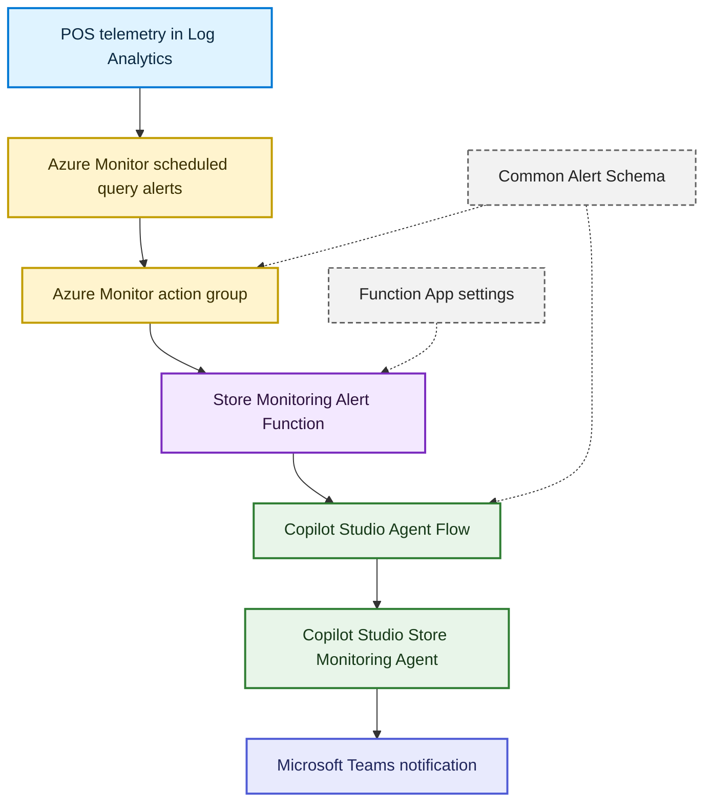

# Alert-Triggered Agent

This guide describes the current alert-triggered investigation pattern. Azure Monitor sends Common Alert Schema payloads to the Store Monitoring Alert Function, the Function authenticates to the Copilot Studio Agent Flow with a dedicated Microsoft Entra service principal, the Agent Flow invokes the Store Monitoring Agent, and the result is posted to Teams.

Scope clarification:

- This document applies only to alert-triggered automation.
- Interactive and scheduled Kusto query execution remains in Copilot Studio Agent Flows.
- The Store Monitoring Alert Function is the inbound alert relay and authentication boundary between Azure Monitor and the Copilot Studio Agent Flow.
- The Agent Flow is used for alert payload parsing, routing, Copilot Studio invocation, and notification.

## Current Architecture



## Request Flow

1. Azure Monitor evaluates a scheduled query alert rule.
2. The Azure Monitor action group sends the Common Alert Schema payload to the Store Monitoring Alert Function endpoint:

```text
https://<function-app-name>.azurewebsites.net/api/monitor-alert?code=<function-key>
```

3. The Function validates that the request body is JSON and detects whether it has the Common Alert Schema markers.
4. The Function acquires a Microsoft Entra access token using `AgentFlow__TenantId`, `AgentFlow__ClientId`, `AgentFlow__ClientSecret`, and `AgentFlow__TokenScope`.
5. The Function posts the original Azure Monitor alert body unchanged to `AgentFlow__FlowUrl` with `Authorization: Bearer <token>`.
6. The Agent Flow parses the Common Alert Schema payload, extracts `DeviceName` and alert metadata, and routes by `data.customProperties.alertType`.
7. The Agent Flow composes the matching investigation prompt and calls the Store Monitoring Agent using **Execute Agent and wait**.
8. The Agent Flow posts the agent investigation output and alert metadata to Teams.

## Supported Alert Types

The current deploy artifacts support these alert-triggered investigations:

- Device Offline
- Retail Server Performance
- Database Size

Alert type routing is based on `data.customProperties.alertType`.

The Device Offline deployment defaults to UTC business-hours evaluation from 8:00 AM UTC through 4:59 PM UTC. Use `BusinessHoursOnly`, `BusinessHoursStartHourUtc`, and `BusinessHoursEndHourUtc` in the Device Offline deployment artifacts to adjust or disable that window.

## Alert Deployment Artifacts

The [../alerts/deploy](../alerts/deploy) folder contains Azure deployment artifacts for Store Monitoring Agent Azure Monitor alerts. The current artifacts deploy Device Offline detection, Retail Server Performance detection, and Database Size detection.

| File                                                                                                                | Purpose                                                                                                                         |
| ------------------------------------------------------------------------------------------------------------------- | ------------------------------------------------------------------------------------------------------------------------------- |
| [device-offline-alert.kql](../alerts/deploy/device-offline-alert.kql)                                               | Standalone KQL used by the alert rule.                                                                                          |
| [device-offline-alert.bicep](../alerts/deploy/device-offline-alert.bicep)                                           | Creates an Azure Monitor scheduled query alert and, optionally, a webhook action group for the Alert Function relay.            |
| [device-offline-alert.parameters.json](../alerts/deploy/device-offline-alert.parameters.json)                       | Example deployment parameters.                                                                                                  |
| [Deploy-DeviceOfflineAlert.ps1](../alerts/deploy/Deploy-DeviceOfflineAlert.ps1)                                     | PowerShell wrapper around `az deployment group create`.                                                                         |
| [retail-server-performance-alert.kql](../alerts/deploy/retail-server-performance-alert.kql)                         | Standalone KQL used by the Retail Server Performance alert rule.                                                                |
| [retail-server-performance-alert.bicep](../alerts/deploy/retail-server-performance-alert.bicep)                     | Creates an Azure Monitor scheduled query alert for Retail Server requests over 10 seconds.                                      |
| [retail-server-performance-alert.parameters.json](../alerts/deploy/retail-server-performance-alert.parameters.json) | Example Retail Server Performance deployment parameters.                                                                        |
| [Deploy-RetailServerPerformanceAlert.ps1](../alerts/deploy/Deploy-RetailServerPerformanceAlert.ps1)                 | PowerShell wrapper around `az deployment group create` for the Retail Server Performance alert.                                 |
| [database-size-alert.kql](../alerts/deploy/database-size-alert.kql)                                                 | Standalone KQL used by the Database Size alert rule.                                                                            |
| [database-size-alert.bicep](../alerts/deploy/database-size-alert.bicep)                                             | Creates an Azure Monitor scheduled query alert for POS offline database size over 8 GB.                                         |
| [database-size-alert.parameters.json](../alerts/deploy/database-size-alert.parameters.json)                         | Example Database Size deployment parameters.                                                                                    |
| [Deploy-DatabaseSizeAlert.ps1](../alerts/deploy/Deploy-DatabaseSizeAlert.ps1)                                       | PowerShell wrapper around `az deployment group create` for the Database Size alert.                                             |
| [agent-flow-common-alert-schema.json](../alerts/deploy/agent-flow-common-alert-schema.json)                         | Request body JSON schema for the Agent Flow HTTP trigger. The Alert Function relays this Common Alert Schema payload unchanged. |

## What Gets Created

- Azure Monitor scheduled query alert: `Store Monitoring - Device Offline`
- Azure Monitor scheduled query alert: `Store Monitoring - Retail Server Performance`
- Azure Monitor scheduled query alert: `Store Monitoring - Database Size`
- Optional Azure Monitor webhook action group with Common Alert Schema enabled when `-AlertFunctionWebhookUri` is supplied. Use the Store Monitoring Alert Function endpoint for this URI.
- Device Offline dimensions split by `DeviceName`, so each offline device can be tracked independently
- Retail Server Performance dimensions split by `DeviceName`, so each affected device can be tracked independently
- Database Size dimensions split by `DeviceName`, so each affected device can be tracked independently

## Prerequisites

- Azure CLI installed and authenticated with `az login`
- Permission to deploy resources into the target resource group
- Log Analytics workspace receiving Azure Arc `Heartbeat` records from POS devices
- Optional: deployed Store Monitoring Alert Function from `alerts/StoreMonitoringAlertFunction`. The function receives Azure Monitor alert webhooks and calls the Agent Flow with service principal authentication.

## Store Monitoring Alert Function

The Store Monitoring Alert Function is a .NET 8 Azure Functions app that receives Azure Monitor alert HTTP POSTs and relays them to a Copilot Studio Agent Flow using service principal authentication.

Runtime:

- Azure Functions v4
- .NET isolated worker
- Target framework: `net8.0`
- Trigger: HTTP POST at `api/monitor-alert`

### Function App Configuration

Configure these app settings in Azure. For local development, copy `local.settings.json.sample` to `local.settings.json` and fill in local values.

| Setting                   | Description                                                                                                                                                                                        |
| ------------------------- | -------------------------------------------------------------------------------------------------------------------------------------------------------------------------------------------------- |
| `AgentFlow__FlowUrl`      | HTTP endpoint for the Agent Flow.                                                                                                                                                                  |
| `AgentFlow__TenantId`     | Microsoft Entra tenant ID for the service principal.                                                                                                                                               |
| `AgentFlow__ClientId`     | Application/client ID for the service principal.                                                                                                                                                   |
| `AgentFlow__ClientSecret` | Client secret for the service principal. Prefer a Key Vault reference in Azure instead of a plaintext app setting.                                                                                 |
| `AgentFlow__TokenScope`   | OAuth scope used when requesting the bearer token. Defaults to `https://service.flow.microsoft.com//.default` if not set. Adjust this if the flow endpoint is protected with a different audience. |

### Configure Function App Settings After Deployment

After deploying the Function App, configure the relay settings in Azure before connecting Azure Monitor alerts to the endpoint.

1. In the Azure portal, open the deployed Function App.
2. Go to **Settings** -> **Environment variables**. In some portal layouts this page is named **Configuration**.
3. Under **App settings**, add or update these settings:

- `AgentFlow__FlowUrl`
- `AgentFlow__TenantId`
- `AgentFlow__ClientId`
- `AgentFlow__ClientSecret`
- `AgentFlow__TokenScope`

4. Set `AgentFlow__TokenScope` to `https://service.flow.microsoft.com//.default` unless the flow endpoint is protected with a different audience.
5. Save the changes.
6. Restart the Function App so the worker process reads the updated settings.

Best practice: store secret values in Azure Key Vault and use Key Vault references in Function App app settings instead of storing plaintext secrets directly in environment variables. Keep non-secret values, such as `AgentFlow__TenantId`, `AgentFlow__ClientId`, `AgentFlow__FlowUrl`, and `AgentFlow__TokenScope`, as regular app settings. Store `AgentFlow__ClientSecret` in Key Vault.

To use a Key Vault reference for `AgentFlow__ClientSecret`:

1. Create or choose an Azure Key Vault in the same tenant as the Function App.
2. Add the Agent Flow caller client secret as a Key Vault secret.
3. Enable a system-assigned managed identity on the Function App.
4. Grant the Function App managed identity permission to read the secret. For role-based access control, assign **Key Vault Secrets User** scoped to the vault or the specific secret.
5. In the Function App app settings, set `AgentFlow__ClientSecret` to a Key Vault reference value:

```text
@Microsoft.KeyVault(SecretUri=https://<key-vault-name>.vault.azure.net/secrets/<secret-name>/<secret-version>)
```

Use a versionless secret URI if your rotation process should let the Function App pick up newer secret versions automatically:

```text
@Microsoft.KeyVault(SecretUri=https://<key-vault-name>.vault.azure.net/secrets/<secret-name>)
```

For local development only, copy `local.settings.json.sample` to `local.settings.json` and use the same `AgentFlow__*` values there. Do not commit `local.settings.json`; it can contain the Agent Flow URL and client secret.

### Create The Agent Flow Caller Service Principal

Create a dedicated Microsoft Entra app registration for the Function App to call the Agent Flow HTTP trigger.

1. In the Azure portal, open **Microsoft Entra ID**.
2. Go to **App registrations** -> **New registration**.
3. Name the app registration, for example `sp-store-monitoring-alert-flow`.
4. Set **Supported account types** to **Accounts in this organizational directory only**.
5. Select **Register**.
6. On the app registration **Overview** page, copy these values:

- **Application (client) ID** -> `AgentFlow__ClientId`
- **Directory (tenant) ID** -> `AgentFlow__TenantId`

7. Go to **Certificates & secrets** -> **Client secrets** -> **New client secret**.
8. Add a description, choose an expiration that matches your credential rotation policy, and select **Add**.
9. Copy the client secret **Value** immediately. Store it in Key Vault and reference it from `AgentFlow__ClientSecret`; it is not shown again after you leave the page.
10. Open **Enterprise applications**, find the same application, and copy its **Object ID**. Use this object ID in the Agent Flow HTTP trigger when the trigger asks which service principal is allowed to call it.

### Azure Monitor Action Group

Create or update an Azure Monitor action group with a webhook action that posts to:

```text
https://<function-app-name>.azurewebsites.net/api/monitor-alert?code=<function-key>
```

Enable the Azure Monitor common alert schema on the action group so the function and flow can read standard fields such as alert rule, severity, monitor condition, configuration items, fired time, dimensions, and custom properties. Use `data.customProperties` for the stable automation contract, such as `alertType` and thresholds. Use dimensions or `configurationItems` for dynamic alert target values emitted by Azure Monitor, such as the affected device.

### Restrict Inbound Access To Azure Monitor

The HTTP trigger uses a Function key. For Azure Monitor alert webhooks, use a key scoped to the `MonitorAlertRelay` function, not the Function App master key.

1. In the Azure portal, open the deployed Function App.
2. Go to **Functions** -> **MonitorAlertRelay** -> **Function Keys**.
3. Create a dedicated key, for example `azure-monitor-alerts`, or use the function-level `default` key.
4. Select **Get function URL** and choose that function-level key.
5. Use the copied URL as the action group webhook URL.

Add Function App access restrictions so only Azure Monitor Action Group infrastructure can reach the endpoint:

1. In the Azure portal, open the deployed Function App.
2. In the Function App left menu, go to **Settings** -> **Networking**.
3. Under the inbound or public network access section, set public access to allow selected sources only. In some portal layouts this appears as **Public network access** -> **Enabled from selected virtual networks and IP addresses**.
4. Add an inbound site access rule:
   - **Action**: `Allow`
   - **Priority**: `100`
   - **Type**: `Service Tag`
   - **Service Tag**: `ActionGroup`
   - **Name**: `Allow-AzureMonitor-ActionGroup`
5. Confirm unmatched inbound traffic is denied.
6. Save the networking changes.

### Local Test

Start the function app:

```powershell
func start
```

Send a sample alert:

```powershell
Invoke-RestMethod -Method Post `
  -Uri "http://localhost:7071/api/monitor-alert" `
  -ContentType "application/json" `
  -Body @'
{
  "data": {
    "essentials": {
      "alertRule": "StoreMonitoring-TestAlert",
      "severity": "Sev3",
      "signalType": "Metric",
      "monitorCondition": "Fired",
      "configurationItems": [
        "POS1"
      ],
      "firedDateTime": "2026-06-22T12:00:00Z",
      "description": "Sample Store Monitoring alert"
    },
    "alertContext": {
      "condition": {
        "allOf": [
          {
            "dimensions": [
              {
                "name": "Computer",
                "value": "POS1"
              }
            ]
          }
        ]
      }
    },
    "customProperties": {
      "alertType": "DeviceOffline",
      "offlineThresholdMinutes": "5",
      "performanceThresholdMs": "10000",
      "databaseSizeThresholdMB": "10240"
    }
  }
}
'@
```

### Build The Function App

```powershell
dotnet restore
dotnet build
```

## Agent Flow Setup For Alert-Triggered Monitoring

This runbook configures one Copilot Studio Agent Flow to handle all three Azure Monitor alerts:

- Device Offline
- Retail Server Performance
- Database Size

The Agent Flow receives Azure Monitor Common Alert Schema payloads from the Store Monitoring Alert Function relay, calls Copilot Studio (`Execute Agent and wait`), and posts to Teams.

### 1. Gather Required Values

- Copilot Studio environment with permission to create or update Agent Flows
- Copilot Studio agent name: `Store Monitoring Agent`
- Teams target (team and channel)
- Log Analytics workspace resource ID
- Store Monitoring Alert Function endpoint for Azure Monitor action groups

### 2. Create The Agent Flow

Note:Flow is already available in the Power platform solution.You can use that and skip this step.

### What The Alert Investigation Topics Do

The Azure Monitor alert rules decide when a condition is severe enough to fire. The Copilot Studio alert investigation topics retrieve supporting evidence for the affected device and alert window so the Teams notification includes useful diagnostic context.

| Topic                                       | Triggered by              | Evidence retrieved                                                                                                                                                                                                               | Purpose                                                                                                     |
| ------------------------------------------- | ------------------------- | -------------------------------------------------------------------------------------------------------------------------------------------------------------------------------------------------------------------------------- | ----------------------------------------------------------------------------------------------------------- |
| `DeviceOfflineAlertInvestigation`           | `DeviceOffline`           | Queries `Heartbeat` for the affected POS device, using the agent topic's 7-day heartbeat history window. Returns last heartbeat time, minutes since last heartbeat, formatted offline duration, and heartbeat count.             | Confirms whether the device stopped reporting heartbeat and shows how long it has been offline.             |
| `RetailServerPerformanceAlertInvestigation` | `RetailServerPerformance` | Queries recent Store Commerce Application events where `EventID == 40102` and the payload contains `ModelManagersRetailServerRequestFinished`. Returns request action, status code, execution time, request ID, and request URL. | Identifies which Retail Server request was slow and provides concrete request evidence for troubleshooting. |
| `DatabaseSizeAlertInvestigation`            | `DatabaseSize`            | Queries `DatabaseMetricsService` Application events where `EventID == 3000`. Extracts database name, server name, total database size, data file size, log file size, and unallocated space.                                     | Shows which offline database is large and which tables are contributing.                                    |

If a topic receives no rows from Log Analytics, it returns a no-evidence message instead of giving troubleshooting recommendations. The recommendations in the prompt should stay grounded in the returned data.

## Deploy Action Group And Alert Rules

Run the scripts below from repo root. Use the Store Monitoring Alert Function endpoint as the same webhook URL for all three alerts. For the default Function-key endpoint, do not pass AAD webhook parameters.

### Deploy Device Offline With The Alert Function Relay

Before deploying with `-AlertFunctionWebhookUri`, deploy the Store Monitoring Alert Function and configure its `AgentFlow__*` app settings. The Azure Monitor action group posts the Common Alert Schema payload to the function endpoint, and the function forwards the raw alert body unchanged to the Agent Flow with service principal authentication. The Agent Flow should use [agent-flow-common-alert-schema.json](../alerts/deploy/agent-flow-common-alert-schema.json) as its request schema.

```powershell
.\alerts\deploy\Deploy-DeviceOfflineAlert.ps1 `
  -ResourceGroupName '<resource-group>' `
  -WorkspaceResourceId '/subscriptions/<subscription-id>/resourceGroups/<workspace-resource-group>/providers/Microsoft.OperationalInsights/workspaces/<workspace-name>' `
  -BusinessHoursOnly $true `
  -BusinessHoursStartHourUtc 8 `
  -BusinessHoursEndHourUtc 17 `
  -AlertFunctionWebhookUri 'https://<function-app-name>.azurewebsites.net/api/monitor-alert?code=<function-key>'
```

This creates an action group named `store-monitoring-agent-alerts` and sends Azure Monitor Common Alert Schema payloads to the Alert Function by using a webhook receiver. The Device Offline query returns results only from 8:00 AM UTC through 4:59 PM UTC unless `-BusinessHoursOnly $false` is supplied. The function then authenticates to the Agent Flow.

### Deploy Retail Server Performance With The Same Alert Function Relay

```powershell
.\alerts\deploy\Deploy-RetailServerPerformanceAlert.ps1 `
  -ResourceGroupName '<resource-group>' `
  -WorkspaceResourceId '/subscriptions/<subscription-id>/resourceGroups/<workspace-resource-group>/providers/Microsoft.OperationalInsights/workspaces/<workspace-name>' `
  -AlertFunctionWebhookUri 'https://<function-app-name>.azurewebsites.net/api/monitor-alert?code=<function-key>'
```

This alert fires when a Store Commerce Retail Server `ModelManagersRetailServerRequestFinished` event has `executionTimeInMs` greater than `10000` ms for a device. It uses the same action group name by default, so the same Agent Flow can receive both alert types.

### Deploy Database Size With The Same Alert Function Relay

```powershell
.\alerts\deploy\Deploy-DatabaseSizeAlert.ps1 `
  -ResourceGroupName '<resource-group>' `
  -WorkspaceResourceId '/subscriptions/<subscription-id>/resourceGroups/<workspace-resource-group>/providers/Microsoft.OperationalInsights/workspaces/<workspace-name>' `
  -AlertFunctionWebhookUri 'https://<function-app-name>.azurewebsites.net/api/monitor-alert?code=<function-key>'
```

This alert fires when the latest `DatabaseMetricsService` EventID `3000` report in the last 24 hours shows `Total Database Size` greater than `8192` MB. The default `DatabaseMetricsService` collection interval is 6 hours, so the alert evaluates hourly but looks back 24 hours for the latest metric.

Notes:

- Scripts/templates use `AlertFunctionWebhookUri` for the Store Monitoring Alert Function endpoint.
- The Function App holds the Agent Flow URL and service principal settings.

### Deploy With An Existing Action Group

```powershell
.\alerts\deploy\Deploy-DeviceOfflineAlert.ps1 `
  -ResourceGroupName '<resource-group>' `
  -WorkspaceResourceId '/subscriptions/<subscription-id>/resourceGroups/<workspace-resource-group>/providers/Microsoft.OperationalInsights/workspaces/<workspace-name>' `
  -ActionGroupResourceIds '/subscriptions/<subscription-id>/resourceGroups/<resource-group>/providers/Microsoft.Insights/actionGroups/<action-group-name>'
```

For Retail Server Performance, use `Deploy-RetailServerPerformanceAlert.ps1` with the same `-ActionGroupResourceIds` parameter. For Database Size, use `Deploy-DatabaseSizeAlert.ps1`.

## Tune The Detection Window

The Device Offline alert checks every 5 minutes and returns devices whose last heartbeat is more than 5 minutes old. Its scheduled query alert lookback window is 5 minutes, and it scans 7 days to identify active devices:

```powershell
.\alerts\deploy\Deploy-DeviceOfflineAlert.ps1 `
  -ResourceGroupName '<resource-group>' `
  -WorkspaceResourceId '/subscriptions/<subscription-id>/resourceGroups/<workspace-resource-group>/providers/Microsoft.OperationalInsights/workspaces/<workspace-name>' `
  -OfflineThresholdMinutes 5 `
  -BusinessHoursOnly $true `
  -BusinessHoursStartHourUtc 8 `
  -BusinessHoursEndHourUtc 17 `
  -EvaluationFrequency 'PT5M' `
  -WindowSize 'PT5M'
```

`-ActiveDeviceLookbackDays` defaults to 7. Reduce it if retired devices should age out faster, or increase it if devices are expected to report less frequently. `-BusinessHoursOnly` defaults to `$true`, with an inclusive UTC start hour of `8` and an exclusive UTC end hour of `17`, so the default Device Offline alert returns results only from 8:00 AM UTC through 4:59 PM UTC. Set `-BusinessHoursOnly $false` to evaluate all day.

The Retail Server Performance alert evaluates every 5 minutes with a 10-minute trigger lookback:

```powershell
.\alerts\deploy\Deploy-RetailServerPerformanceAlert.ps1 `
  -ResourceGroupName '<resource-group>' `
  -WorkspaceResourceId '/subscriptions/<subscription-id>/resourceGroups/<workspace-resource-group>/providers/Microsoft.OperationalInsights/workspaces/<workspace-name>' `
  -PerformanceThresholdMs 10000 `
  -QueryLookback '10m' `
  -EvaluationFrequency 'PT5M' `
  -WindowSize 'PT10M'
```

The Database Size alert checks once per day with a 24-hour trigger lookback. This matches slower database metric collection and lets the query evaluate the latest metric per device/database:

```powershell
.\alerts\deploy\Deploy-DatabaseSizeAlert.ps1 `
  -ResourceGroupName '<resource-group>' `
  -WorkspaceResourceId '/subscriptions/<subscription-id>/resourceGroups/<workspace-resource-group>/providers/Microsoft.OperationalInsights/workspaces/<workspace-name>' `
  -DatabaseSizeThresholdMB 8192 `
  -QueryLookback '24h' `
  -EvaluationFrequency 'PT24H' `
  -WindowSize 'PT24H'
```

## Webhook Requirements

When deploying alerts with the Store Monitoring Alert Function relay:

- Use the Function endpoint as `AlertFunctionWebhookUri` in deployment scripts.
- Use an Azure Monitor action group **Webhook** receiver with Common Alert Schema enabled.
- Include a function-level key in the webhook URL, for example `https://<function-app-name>.azurewebsites.net/api/monitor-alert?code=<function-key>`.
- Restrict Function App inbound access to Azure Monitor Action Group infrastructure with the `ActionGroup` service tag.
- Store the Agent Flow HTTP trigger URL and service principal settings in the Function App configuration.

The deployment templates and scripts use `alertFunctionWebhookUri` for the Alert Function endpoint.

## Validation Checklist

- Store Monitoring Alert Function is deployed and has the `AgentFlow__*` app settings configured.
- Agent Flow HTTP trigger is saved and has a generated HTTP POST URL stored in `AgentFlow__FlowUrl`.
- Agent Flow trigger schema matches [alerts/deploy/agent-flow-common-alert-schema.json](../alerts/deploy/agent-flow-common-alert-schema.json).
- Agent Flow trigger authentication allows the service principal used by the Function App.
- Action group receiver is **Webhook** with Common Alert Schema enabled.
- Action group webhook URL uses the Store Monitoring Alert Function endpoint and a function-level key.
- If inbound restrictions are enabled, the Function App allows Azure Monitor Action Groups to call the endpoint.
- A test alert posts a Teams message with:
  - Alert metadata (rule, severity, fired time)
  - Agent investigation output from Execute Agent and wait

## Related Docs

- [docs/autonomous-proactive-monitoring.md](autonomous-proactive-monitoring.md)
- [docs/architecture.md](architecture.md)
