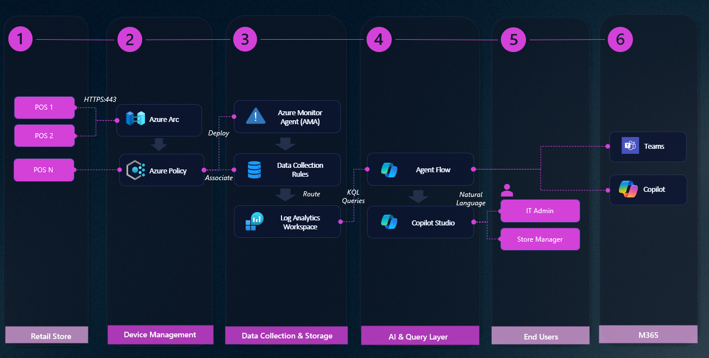
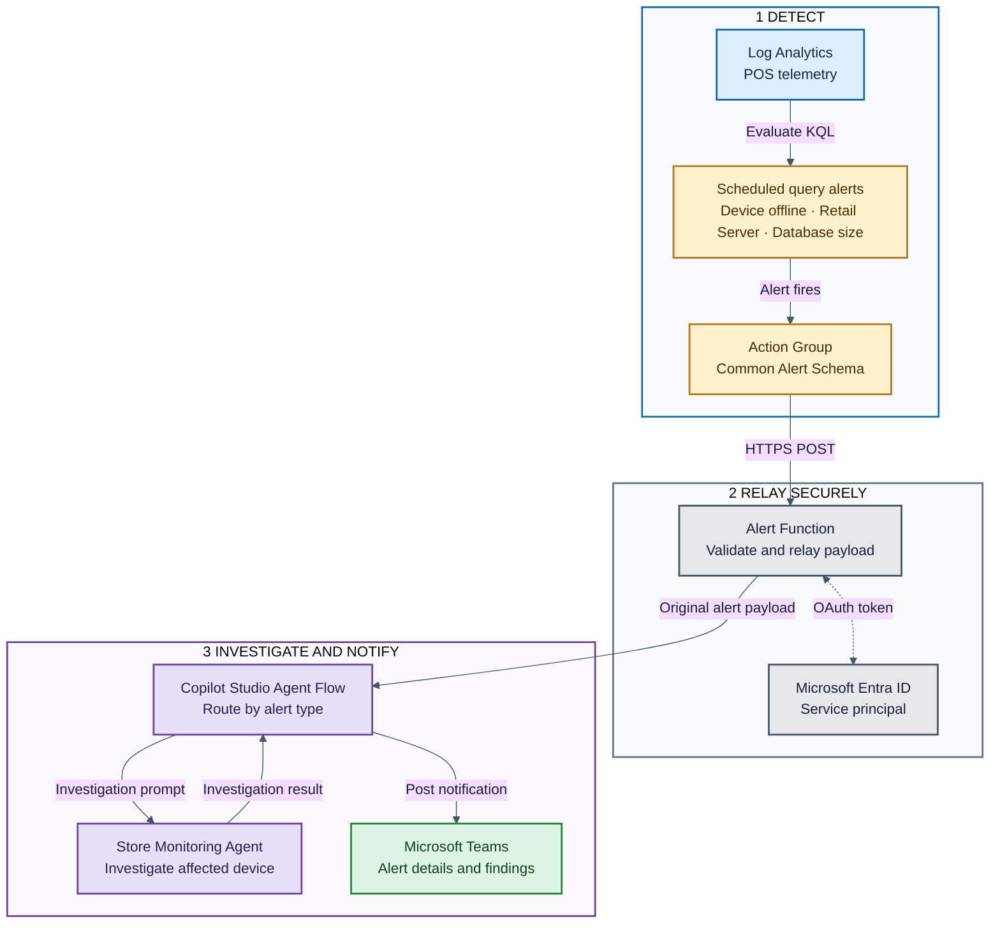

# Architecture Documentation

## Store Monitoring Agent Architecture

### Overview

The Store Monitoring Agent provides centralized monitoring and management of Windows-based Point-of-Sale (POS) devices across retail locations using Azure Arc, Azure Monitor Agent, Azure Monitor alerts, and Microsoft Copilot Studio. It supports both interactive investigations and alert-triggered automated investigations.

## High-Level Architecture



## Alert Mechanism

Azure Monitor continuously evaluates telemetry in Log Analytics. When an alert condition is met, the alert is relayed through an Azure Function to the Copilot Studio Agent Flow for investigation and notification.



1. Scheduled query alert rules evaluate Log Analytics data for device availability, Retail Server response time, and offline database size.
2. A triggered rule invokes an Azure Monitor action group that sends the Common Alert Schema payload to the Store Monitoring Alert Function over HTTPS.
3. The Function validates the JSON request, obtains a Microsoft Entra access token using its dedicated service principal, and relays the original payload unchanged to the Agent Flow.
4. The Agent Flow extracts the device and alert metadata, routes the request using `data.customProperties.alertType`, and invokes the Store Monitoring Agent with the matching investigation prompt.
5. The Agent Flow posts the investigation result and alert metadata to Microsoft Teams.

Alert rules are split by `DeviceName`, allowing each affected device to be tracked independently. For deployment, configuration, and security details, see [Alert-Triggered Agent](alert-triggered-agent.md).

## Component Details

### 1. POS Devices

**Components**:

- Windows 10/11 devices
- Azure Connected Machine Agent (AzCM)
- Azure Monitor Agent (AMA)

**Responsibilities**:

- Run POS applications
- Collect logs and performance metrics
- Send data to Azure (outbound only)
- Maintain heartbeat to Azure Arc

**Communication**:

- **Protocol**: HTTPS
- **Port**: 443 (outbound only)
- **Direction**: POS → Azure (no inbound)
- **Frequency**: Continuous (real-time events, periodic metrics)

### 2. Management & Governance Layer

#### Azure Arc

**Purpose**: Device lifecycle management and governance

**Capabilities**:

- Device registration and identity
- Centralized management
- Extension deployment (AMA)
- Policy enforcement
- Inventory and tagging

**Key Features**:

- Hybrid connectivity
- Projected as Azure resources
- RBAC integration
- Azure Resource Manager integration

#### Azure Policy

**Purpose**: Automated compliance and configuration management

**Policy Initiative Includes**:

1. Deploy AMA extension on Arc Windows machines
2. Associate DCR with Arc machines
3. Enable dependency agent (optional)

**Enforcement**:

- **Mode**: DeployIfNotExists
- **Scope**: Resource Group or Subscription
- **Remediation**: Automatic via managed identity

### 3. Data Collection Layer

#### Azure Monitor Agent (AMA)

**Purpose**: Unified agent for data collection

**Advantages over Legacy Agents**:

- Centralized configuration via DCR
- Support for multi-homing
- Enhanced security (managed identities)
- Better performance
- Azure Arc native

**Collection Methods**:

- Windows Event Logs (Application, System, Security)
- Performance Counters
- Custom logs (optional)

#### Data Collection Rules (DCR)

**Purpose**: Define what data to collect and where to send it

**DCR Components**:

- **Data Sources**: Event logs, performance counters
- **Destinations**: Log Analytics workspace(s)
- **Transformations**: KQL-based filtering (optional)
- **Data Flows**: Routing rules

**Solution DCRs**:

1. **dcr-windows-events**: General Windows events and performance

### 4. Storage & Analytics Layer

#### Log Analytics Workspace

**Purpose**: Centralized data repository and query engine

**Tables Used**:

- **Event**: Windows Event Logs
- **Perf**: Performance counters
- **Heartbeat**: Device availability
- **Custom tables**: (optional)

### 5. AI & Query Layer

#### Agent Flow

**Purpose**: Middleware for executing KQL queries against Log Analytics

### 6. User Interface Layer

#### Microsoft Copilot Studio

**Purpose**: Conversational AI interface for monitoring

**Components**:

- **Topics**: Predefined conversation flows (Device Health, Errors, Performance)
- **Actions**: Agent Flow integration

**Channels**:

- M365 Copilot
- Microsoft Teams

## Data Flow

### 1. Data Collection Flow

```
POS Device
  ↓ (Events occur)
Windows Event Log / Performance Counters
  ↓ (AMA reads)
Azure Monitor Agent
  ↓ (Filters per DCR)
Data Collection Endpoint (DCE)
  ↓ (Transforms if needed)
Log Analytics Ingestion API
  ↓ (Writes)
Log Analytics Workspace Tables
```
