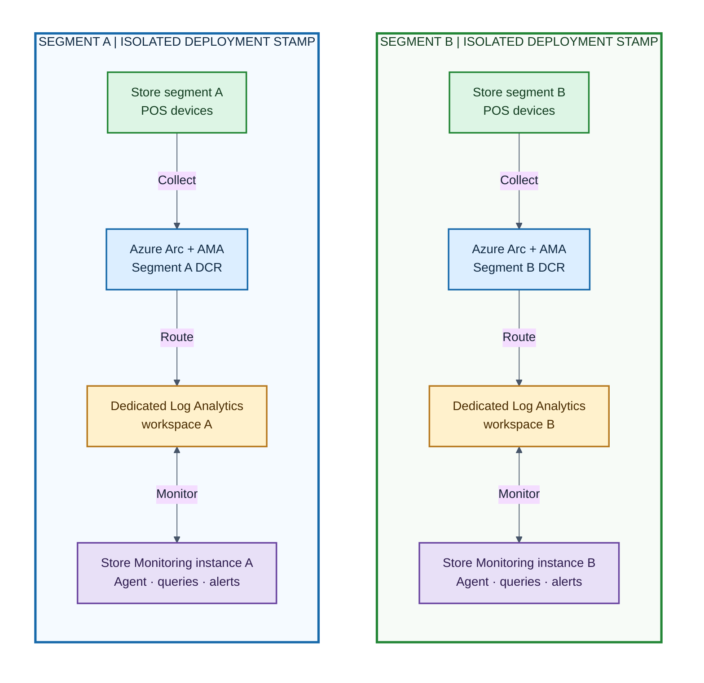

# Deploy One Store Monitoring Agent Instance per Store Segment

This guide describes a multi-instance Store Monitoring Agent (SMA) deployment in which each defined store segment runs its own isolated SMA instance. Every instance monitors only the stores and devices assigned to its segment, queries a dedicated Log Analytics workspace, and uses segment-specific connections, identities, alerts, and operational destinations.

Use this model when a single shared SMA deployment would not provide the required isolation or ownership boundaries. Common use cases include segmenting stores by region, country, legal entity, brand, franchise, business unit, production environment, or support organization. It is also appropriate when segments require different data residency, retention, access control, cost allocation, release schedules, alert routing, or incident-response processes.

Each segment is operated as an independent deployment stamp. Adding a segment means deploying another complete SMA instance and its supporting monitoring resources; it does not mean adding a logical filter to a shared agent. This separation prevents one segment's agent from querying another segment's telemetry and limits configuration errors, outages, permissions, and alert delivery to the affected segment.

## Architecture

Treat each segment as an independent deployment stamp. A stamp contains the Azure monitoring resources and Copilot Studio configuration for only that segment.



The DCR association on an Arc-enabled device controls where Azure Monitor Agent sends its collected events and performance counters. A store tag or naming convention identifies intended membership, but does not route telemetry by itself.

## Isolation Boundary

Create or configure the following resources for every segment.

| Component                 | Segment-specific configuration                                                                        |
| ------------------------- | ----------------------------------------------------------------------------------------------------- |
| Resource group            | Recommended: `rg-store-monitoring-<segment>-<region>`                                                 |
| Log Analytics workspace   | `law-store-monitoring-<segment>-<region>`                                                             |
| Data Collection Endpoint  | `dce-store-monitoring-<segment>-<region>`                                                             |
| Data Collection Rule      | `dcr-store-monitoring-<segment>-<region>` with only the segment workspace as its destination          |
| Arc machine assignment    | Only devices listed in the segment inventory                                                          |
| Azure Policy assignment   | Scope or resource selectors limited to the segment devices                                            |
| Copilot Studio deployment | A separately configured agent and `RunLogAnalyticsQuery` flow                                         |
| Query identity            | Log Analytics Reader on only the segment workspace                                                    |
| Scheduled query alerts    | Deployed with the segment workspace resource ID                                                       |
| Alert relay               | A segment-specific Function App and Agent Flow endpoint when alert-triggered investigation is enabled |

A dedicated resource group per segment is recommended because it provides a clear scope for Arc onboarding, policy assignment, RBAC, cost reporting, and resource lifecycle. Separate subscriptions may be used when governance or data residency requires a stronger boundary.

## Plan Store Segments

Create an authoritative segment inventory before deploying resources. Every device must have exactly one intended segment.

| Segment | Example stores | Region     | Resource group                        | Workspace                              | Power Platform environment |
| ------- | -------------- | ---------- | ------------------------------------- | -------------------------------------- | -------------------------- |
| `north` | Stores 001-099 | East US    | `rg-store-monitoring-north-eastus`    | `law-store-monitoring-north-eastus`    | `Store Monitoring North`   |
| `south` | Stores 100-199 | Central US | `rg-store-monitoring-south-centralus` | `law-store-monitoring-south-centralus` | `Store Monitoring South`   |

Record at least these values for each device:

- Store ID and device name
- Segment name
- Azure subscription and resource group
- Arc machine resource ID
- DCR resource ID
- Log Analytics workspace resource ID
- Deployment owner and support contact

Apply consistent Arc resource tags such as `StoreId`, `StoreSegment`, `Environment`, and `Owner`. Use tags for inventory, policy selection, and cost attribution. Do not rely on tags as proof of telemetry routing; validate the actual DCR association.

## Deploy a Segment

Repeat these steps for every segment. Complete and validate one pilot segment before deploying the next one.

### 1. Create the Segment Resources

Create the segment resource group, Log Analytics workspace, and Data Collection Endpoint. Follow the resource creation and network requirements in the [Quick Start Guide](quick-start-portal.md).

Choose workspace retention, commitment tier, data export, private connectivity, and region according to the segment's compliance and operating requirements. Apply tags that identify the segment and cost owner.

Record both of these workspace values because they are used in different configuration surfaces:

- **Workspace resource ID**: Used by DCR destinations and scheduled query alert deployments.
- **Workspace resource name**: Used by the `RunLogAnalyticsQuery` action in the imported Store Monitoring agent package.

### 2. Create the Segment DCR

Create a Windows DCR using the data sources documented in [Quick Start: Configure Data Collection](quick-start-portal.md#step-3-configure-data-collection-10-minutes):

- Store Commerce Windows Event Log providers and event IDs
- Retail Hardware Station events
- Database Metrics Service events
- EventLog Sink Config Service events
- `\Processor(_Total)\% Processor Time`
- `\Memory\Available Bytes`

Set the Azure Monitor Logs destination to the segment-specific workspace. Do not add another segment's workspace as a destination.

### 3. Assign Devices Exclusively

Onboard the segment's devices to its Arc resource group by using a segment-specific onboarding configuration. Associate only those Arc machines with the segment DCR.

Before bulk assignment, compare the selected Arc resource IDs with the segment inventory. A device associated with DCRs that send the same streams to different workspaces can duplicate telemetry and ingestion cost.

Use one of these scoping models:

1. **Resource group scope:** Place each segment's Arc machines in its segment resource group, then scope AMA deployment and DCR association policy to that resource group.
2. **Tag-based policy scope:** Keep devices in shared resource groups but use policy assignment filters or exemptions based on the authoritative `StoreSegment` tag. Review exceptions regularly.
3. **Explicit DCR associations:** Associate each Arc machine directly with the intended segment DCR. This is suitable for smaller estates but requires lifecycle automation at scale.

Resource group scope is the simplest model to audit. If centrally assigned Azure Policy can associate a shared or default DCR, add appropriate exclusions so it does not also target segmented devices.

### 4. Deploy the Segment Agent

Import and configure a separate Store Monitoring agent instance for the segment. A separate Power Platform environment per segment is the recommended isolation boundary because it separates connections, makers, runtime users, flow history, and agent lifecycle.

In the segment agent deployment:

1. Map the Azure Monitor Logs connection reference to the segment's connection.
2. Open the `RunLogAnalyticsQuery` cloud flow.
3. Edit **Run query and list results**.
4. Set **Subscription**, **Resource group**, and **Resource name** to the segment workspace location and name.
5. Keep **Resource type** set to `Log Analytics Workspace`.
6. Save and enable the flow.
7. Publish the segment's Store Monitoring Agent.

The exported workflow in this repository contains concrete values for a single deployment. Treat these fields as environment-specific settings during every import; do not allow a copied instance to retain another segment's subscription, resource group, or workspace name.

The query workflow identity must have **Log Analytics Reader** at the segment workspace scope. Do not grant it access to other segment workspaces unless cross-segment querying is an intentional, separately governed capability. See [Copilot Studio Agent and Log Analytics Workspace Access](copilot-studio-agent-log-analytics-access.md).

The current agent does not implement row-level filtering. Pointing multiple segment agents at one shared workspace does not provide equivalent data isolation.

### 5. Deploy Segment Alerts

If alert-triggered investigation is enabled, deploy each scheduled query alert with the segment workspace resource ID. The deployment scripts under `alerts/deploy` accept `WorkspaceResourceId` and scope each scheduled query rule to that workspace.

Use unique segment-qualified names for alert rules and action groups. For example:

```powershell
.\alerts\deploy\Deploy-DeviceOfflineAlert.ps1 `
  -ResourceGroupName 'rg-store-monitoring-north-eastus' `
  -WorkspaceResourceId '/subscriptions/<subscription-id>/resourceGroups/rg-store-monitoring-north-eastus/providers/Microsoft.OperationalInsights/workspaces/law-store-monitoring-north-eastus' `
  -AlertRuleName 'store-monitoring-north-device-offline' `
  -ActionGroupName 'store-monitoring-north-alerts' `
  -ActionGroupShortName 'SMNorth'
```

Repeat the same workspace binding and naming pattern for the Retail Server Performance and Database Size alert scripts.

The repository's Alert Function has one `AgentFlow__FlowUrl` setting. Deploy one Function App per segment so each segment's alerts are sent to its corresponding Agent Flow. A shared Function App would require custom routing logic that is not part of this repository.

Use a segment-specific function key, service principal, Agent Flow endpoint, action group, and Teams destination. Store `AgentFlow__ClientSecret` in Key Vault and grant the Function App managed identity only the required secret-read permission. Follow [Alert-Triggered Agent](alert-triggered-agent.md) for the complete relay configuration.

## Validate Isolation

Run this validation after each deployment and after any device reassignment.

### Resource Configuration

- The segment DCR has exactly the intended Log Analytics destination.
- Every segment device has the intended DCR association.
- No segment device has an overlapping DCR association that sends the same streams to another workspace.
- Policy assignments, remediation tasks, and exclusions resolve to the intended device set.
- The query identity has Log Analytics Reader only on the intended workspace.
- Scheduled query alerts have the intended workspace resource ID in their scope.
- The segment Function App points to the matching segment Agent Flow.

### Telemetry Validation

Run the following queries in each segment workspace. Compare the results with the authoritative inventory.

```kql
// Devices reporting to this workspace
Heartbeat
| where TimeGenerated > ago(24h)
| summarize LastHeartbeat = max(TimeGenerated) by Computer
| order by Computer asc
```

```kql
// Event and performance telemetry by device
union withsource=TableName Event, Perf
| where TimeGenerated > ago(24h)
| summarize RecordCount = count(), LastRecord = max(TimeGenerated)
    by TableName, Computer
| order by Computer asc, TableName asc
```

Confirm both conditions:

1. Every expected device appears in its segment workspace within the expected ingestion interval.
2. The same device does not appear with new telemetry in another segment workspace.

Historical records remain in the old workspace until its retention period expires, so use timestamps after the assignment change when checking for duplicates.

### Agent Validation

In each published agent:

1. Query a known device in that segment and confirm current results are returned.
2. Query a device from another segment and confirm it is not found.
3. Review the `RunLogAnalyticsQuery` run history and confirm the Azure Monitor Logs action used the intended subscription, resource group, and workspace.
4. Trigger or test each configured alert type and confirm the notification reaches only the segment's operational channel.

## Move a Store Between Segments

Use a controlled change to avoid prolonged duplicate ingestion or an unobserved device.

1. Approve the inventory change and define a migration window.
2. Record the old and new DCR, workspace, Arc resource group, policy scope, and agent ownership.
3. Remove the old DCR association or old policy applicability from each device.
4. Add the new segment DCR association and confirm AMA reports success.
5. Update the device's `StoreSegment` tag and inventory record.
6. If required, move or reconnect the Arc resource into the new segment resource group according to the organization's Arc lifecycle process.
7. Validate new `Heartbeat`, `Event`, and `Perf` records in the destination workspace.
8. Verify that records with timestamps after the migration no longer arrive in the old workspace.
9. Test the destination segment agent and alerts for the moved device.

Removing the old association before adding the new one minimizes duplicate ingestion but can create a short monitoring gap. Adding the new association first reduces the gap but can briefly duplicate records. Choose and document the order based on the organization's monitoring and cost requirements.

Do not delete the old workspace solely because stores moved. Preserve it according to retention, investigation, legal hold, and audit requirements.

## Operations and Governance

- Maintain one deployment manifest per segment with resource IDs, owners, workspace retention, Power Platform environment, and release version.
- Apply the same Store Monitoring agent and KQL version to all segments through a controlled release process, while preserving segment-specific connection values.
- Monitor workspace ingestion volume, retention cost, DCR health, Arc connectivity, query failures, flow failures, and alert delivery separately for each segment.
- Use Azure Policy and resource graph inventory to detect missing AMA extensions, missing DCR associations, and devices assigned to the wrong segment.
- Review workspace RBAC and Power Platform environment membership periodically.
- Keep secrets and function keys separate by segment and rotate them according to the [Periodic Maintenance Guide](periodic-maintenance.md).
- Use private connectivity per segment when required. Associate the segment workspace and DCE with the correct Azure Monitor Private Link Scope and verify store DNS and outbound HTTPS connectivity.
- Define whether a central operations team needs cross-segment access. Grant that access directly to approved operators or a separate aggregate reporting agent rather than weakening each segment agent's boundary.

## Related Documentation

- [Architecture Documentation](architecture.md)
- [Quick Start Guide - Azure Portal](quick-start-portal.md)
- [Device Onboarding Guide](device-onboarding.md)
- [Alert-Triggered Agent](alert-triggered-agent.md)
