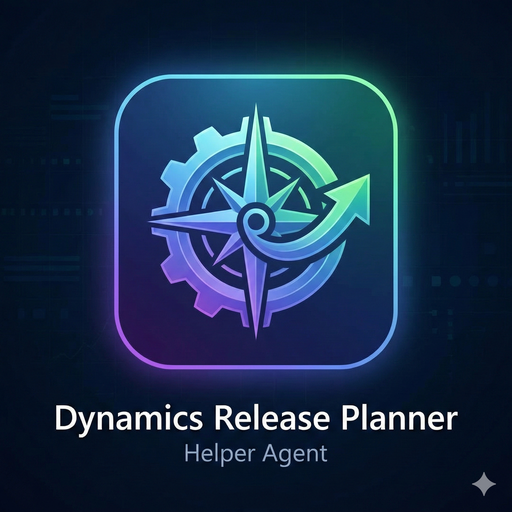

<p align="center">
  
</p>

# Release Planner Helper Agent

> AI-powered release planning for Dynamics 365, built with **Copilot Studio** and a **TypeScript MCP Server**.

[](#) [](#) [](#)

📖 [Microsoft Learn Documentation](https://learn.microsoft.com/en-us/dynamics365/guidance/agent-templates/release-planner-agent) · 📝 [Request Access Form](https://forms.cloud.microsoft/r/ZCSSSMhg40)

---

A TypeScript-based MCP (Model Context Protocol) server for querying Microsoft Release Planner API. Integrates with Copilot Studio agents to provide AI-powered access to Dynamics 365 and Power Platform release plans.

> **Disclaimer:** This repository is **sample/reference code only**. It is provided as-is for educational and demonstration purposes. Microsoft does not operate this server or any agents built with it. Customers are responsible for deploying, operating, and managing this code in their own environments. This code is not production-ready and comes with no guarantees of availability, reliability, or support.

> This project is part of the [Dynamics 365 FastTrack Implementation Assets](https://github.com/microsoft/Dynamics-365-FastTrack-Implementation-Assets) repository, located under `Agents/Implementation Agents/Release Planner/`.

## Copilot Studio Agent

The Copilot Studio agent solution is available in the [`Solutions/`](Solutions/) folder. See [`Solutions/readme.md`](Solutions/readme.md) for import instructions.

## Features

### 3 MCP Tools

1. **search_release_plans** - Search and filter release plans by product, wave, status, and keywords
2. **list_products** - List all available products with optional feature counts
3. **get_release_wave_summary** - Get release wave statistics and breakdowns by product and investment area

### Key Capabilities

- **1-Hour Caching**: Reduces API calls and improves performance
- **Type Safety**: Zod runtime validation with TypeScript
- **Public API**: No authentication required
- **Copilot Studio Ready**: Follows Microsoft's MCP server pattern
- **Comprehensive Filtering**: Filter by product, keywords, release wave, status, and investment area

## Quick Start

### Prerequisites

- Node.js 20 or higher
- npm

### Installation

```bash
# Install dependencies
npm install

# Build TypeScript
npm run build

# Start MCP server
npm start
```

The server starts on **port 3000** at `http://localhost:3000/mcp`

### Verify Server is Running

```bash
# Health check
curl http://localhost:3000/health

# List available tools
curl -X POST http://localhost:3000/mcp \
  -H "Content-Type: application/json" \
  -H "Accept: application/json, text/event-stream" \
  -d '{"jsonrpc":"2.0","id":1,"method":"tools/list"}'
```

## Copilot Studio Integration

You can connect this MCP server to a Copilot Studio agent using either an **Azure-deployed endpoint** (recommended for production) or a **VS Code Dev Tunnel** (for development/testing).

### Option A: Azure App Service (Recommended)

If you've deployed the server to Azure (see [MCP_SERVER_GUIDE.md](MCP_SERVER_GUIDE.md) Part 2), your MCP endpoint is already publicly accessible.

1. Go to https://copilotstudio.microsoft.com
2. Select your agent (or create a new one)
3. Go to **Tools** (left sidebar)
4. Click **"Add an MCP server"**
5. Fill in:
   ```
   Name: Microsoft Release Planner
   URL: https://rel-planner-mcp-server.azurewebsites.net/mcp
   Authentication: None
   ```
6. Click **Add**

> Replace `rel-planner-mcp-server` with your actual Azure App Service name.

### Option B: VS Code Dev Tunnel (Development)

For local development and testing without deploying to Azure:

1. Start the server locally: `npm start`
2. In VS Code, go to the **PORTS** panel (View > Ports)
3. Forward port **3000**
4. Right-click the forwarded port > **Port Visibility** > **Public**
5. Copy the tunnel URL (format: `https://xxxx-3000.devtunnels.ms`)
6. In Copilot Studio:
   - Go to **Tools** > **"Add an MCP server"**
   - Fill in:
     ```
     Name: Microsoft Release Planner
     URL: https://your-tunnel-3000.devtunnels.ms/mcp
     Authentication: None
     ```
   - Click **Add**

> Dev Tunnels are temporary and stop when VS Code closes. Use Azure App Service for persistent availability.

### Test Your Agent

Try these prompts in Copilot Studio:
- "What products are available in Release Planner?"
- "List features for Dynamics 365 Supply Chain Management 2025 release wave 1"
- "Show me Copilot and AI features in Sales"
- "What's in the 2025 release wave 2?"
- "Search for features related to warehouse management"

## Testing with cURL

### Search Release Plans

```bash
curl -X POST http://localhost:3000/mcp \
  -H "Content-Type: application/json" \
  -H "Accept: application/json, text/event-stream" \
  -d '{
    "jsonrpc":"2.0",
    "id":2,
    "method":"tools/call",
    "params":{
      "name":"search_release_plans",
      "arguments":{
        "product":"Dynamics 365 Supply Chain Management",
        "releaseWave":"2025 release wave 1",
        "limit":2
      }
    }
  }'
```

### List Products

```bash
curl -X POST http://localhost:3000/mcp \
  -H "Content-Type: application/json" \
  -H "Accept: application/json, text/event-stream" \
  -d '{
    "jsonrpc":"2.0",
    "id":3,
    "method":"tools/call",
    "params":{
      "name":"list_products",
      "arguments":{}
    }
  }'
```

### Get Release Wave Summary

```bash
curl -X POST http://localhost:3000/mcp \
  -H "Content-Type: application/json" \
  -H "Accept: application/json, text/event-stream" \
  -d '{
    "jsonrpc":"2.0",
    "id":4,
    "method":"tools/call",
    "params":{
      "name":"get_release_wave_summary",
      "arguments":{
        "releaseWave":"2025 release wave 1"
      }
    }
  }'
```

## API Information

- **Base URL**: `https://releaseplans.microsoft.com/en-US/allreleaseplans/`
- **Format**: JSON
- **Authentication**: Not required (public API)
- **Cache TTL**: 1 hour

## Project Structure

```
ReleasePlannerMCPServer/
├── src/
│   ├── index-mcp.ts       # Main MCP server (HTTP, production)
│   ├── index.ts           # Claude Desktop server (stdio)
│   ├── types.ts           # Zod schemas and type definitions
│   └── utils/
│       └── api.ts         # API utilities with caching
├── build/                 # Compiled JavaScript output
├── deploy.ps1             # Azure deployment script (PowerShell)
├── deploy.sh              # Azure deployment script (Bash)
├── config-example.json    # Claude Desktop configuration example
├── MCP_SERVER_GUIDE.md    # Complete deployment guide
├── TOOLS.md               # Tool reference documentation
├── LICENSE                # MIT License
├── package.json
├── tsconfig.json
└── README.md
```

## Development

### Scripts

```bash
npm run build      # Compile TypeScript to JavaScript
npm start          # Start MCP server on port 3000
npm run dev        # Build and start in one command
```

### Making Changes

1. Edit TypeScript files in `src/`
2. Run `npm run build` to compile
3. Test with `npm start`

## Troubleshooting

### Port Already in Use

```bash
# Windows - Kill all node processes
taskkill /F /IM node.exe

# Then restart
npm start
```

### TypeScript Build Errors

```bash
# Clean rebuild
npm run build
```

### Server Not Responding

```bash
# Check if server is running
curl http://localhost:3000/health

# Check which process is using port 3000
netstat -ano | findstr :3000
```

### API Connection Issues

```bash
# Test API accessibility
curl https://releaseplans.microsoft.com/en-US/allreleaseplans/
```

## Technical Details

This MCP server follows Microsoft's official MCP server pattern:

- Uses **StreamableHTTPServerTransport** for HTTP communication
- Manual JSON schema definitions (no `zod-to-json-schema`)
- Simple if-statement tool handlers
- Text-only responses for maximum compatibility
- Express.js server with `/mcp` endpoint

## Documentation

- **README.md** - This file (quick start and overview)
- **[MCP_SERVER_GUIDE.md](MCP_SERVER_GUIDE.md)** - Complete guide for creating and deploying MCP servers
- **[TOOLS.md](TOOLS.md)** - Detailed tool reference and examples
- **[CHANGELOG.md](CHANGELOG.md)** - Version history

## Responsible AI

### AI Scope

This MCP server acts as a **data retrieval layer** between an AI client (such as a Copilot Studio agent) and the public Microsoft Release Planner API. It does not contain, host, or execute any AI/ML models itself. The AI behavior is entirely determined by the LLM configured in the client application (e.g., Copilot Studio).

### Intended Use

- **Sample/reference pattern** for building MCP servers that connect Copilot Studio agents to external APIs
- Demonstrating how to expose a public REST API as MCP tools
- Educational material for developers learning MCP protocol, TypeScript server development, and Azure deployment

### Not Intended For

- Production workloads without additional hardening, monitoring, and error handling
- Making business-critical decisions based solely on the data returned by this server
- Use as a standalone AI agent - this server provides data tools, not AI reasoning

### AI Model Configuration

This server does **not** include or configure any LLM. The AI model is selected and configured by the customer within their own Copilot Studio environment (or other MCP client). Microsoft does not control which LLM is used or how it interprets the data returned by these tools.

### Known Limitations

- Data is sourced from the public Microsoft Release Planner API and cached for 1 hour; it may not reflect the latest updates
- The server returns plain text responses; formatting and interpretation depend on the AI client
- No authentication or rate limiting is implemented in this sample
- The API response schema may change without notice, which could cause runtime validation errors
- Search is case-insensitive substring matching, not semantic search

### Data and Privacy

- This server accesses only the **public** Microsoft Release Planner API (`https://releaseplans.microsoft.com`)
- No personal data is collected, stored, or transmitted
- No telemetry or usage tracking is implemented
- API responses are cached in-memory only (not persisted to disk) and expire after 1 hour

## License

MIT

## Keywords

- MCP (Model Context Protocol)
- Microsoft Dynamics 365
- Power Platform
- Release Planner
- Copilot Studio
- TypeScript
- Express.js
