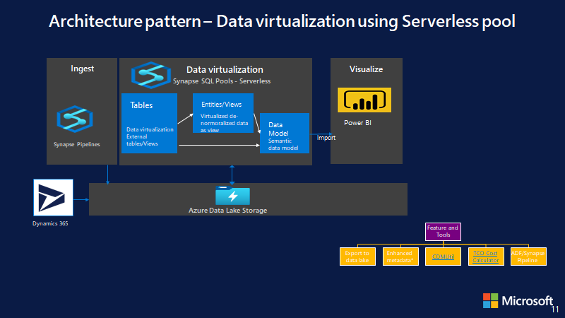

Dynamics 365 Finance and Operations Apps, [Export to data lake](https://docs.microsoft.com/en-us/dynamics365/fin-ops-core/dev-itpro/data-entities/finance-data-azure-data-lake) feature, lets you copy data and metadata from your Finance and Operations apps into your own data lake (Azure Data Lake Storage Gen2). 
Data that is stored in the data lake is organized in a folder structure in Common Data Model format, essentially data is stored in folders as headerless CSV and metadata as [Cdm manifest](https://docs.microsoft.com/en-us/common-data-model/cdm-manifest).  

With Dynamics 365 data in the lake, there are various architecture patterns that you can be utilized to build end to end BI and reporting and integration solution.
Following are some of the common architecture patterns including demo and solution template used in the demo to help you build your POC yourself.

# 1:Logical Data warehouse (virtualization) using Serverless pool

## Overview 

## Solution templates
1. [Use CDMUtil and configure to create External Table/Views on Serverless SQL Pool](../CDMUtilSolution/readme.md)
2. [Data model SQL View](DataVirtualization/LogicalDW_DataModelViews.sql) 
3. [Power Bi Report](DataVirtualization/GLReport_DataVirtualization.pbix) 

## Demo 
https://user-images.githubusercontent.com/65608469/165361941-dae756da-3d7e-453b-bfd8-2286b13f4715.mp4

# 2:Cloud data warehouse using Synapse Dedicated pool

## Overview 

## Solution templates

1. [Copy Synapse Table](CloudDatawarehouse/CopySynapseTable.zip)
2. [GL Data Materialize](CloudDatawarehouse/GLDataMaterialize.zip)

## Demo
https://user-images.githubusercontent.com/65608469/165362039-4def15b4-42a9-4c58-bc74-491529b98e2c.mp4

# 3:Lakehouse architecture 

## Lakehouse architecture overview

https://user-images.githubusercontent.com/65608469/164785280-40e34bf8-20a2-406b-8350-6d169a48b3c6.mp4

## Approach 1 - Lakehouse using Synapse pipeline and Serverless pool

### Synapse pipeline templates

1. [SQL Script to get table metadata](Lakehouse/GetTablesMetadata.sql)
2. [1 SilverCDMtoDelta](Lakehouse/1_Silver_CDMToDeltaLake.zip)
3. [2 GoldDimTransform](Lakehouse/3_GoldTransformation_Dim.zip)
4. [3 GoldFactTransform](Lakehouse/3_GoldTransformation_Fact.zip)

### Demo
https://user-images.githubusercontent.com/65608469/164779488-7edd01ca-da41-4da3-9ff2-53bd7203d3dc.mp4

## Approach 2 - Lakehouse using Databricks and PySpark

### Code templates
1. [Commerce_clickstream_fake_data.py](Lakehouse/Commerce_clickstream_fake_data.py)
2. [Commerce_clickstream_pipeline_share.ipynb](Lakehouse/Commerce_clickstream_pipeline_share.ipynb)

### Demo
https://user-images.githubusercontent.com/104534330/165651095-1321eaf8-8b1e-42cb-bbe8-0f5d10cef119.mp4

# 4:Integrating with existing DW (SQL Servers/ Azure SQL)

### Solution templates
1. [CDMToSQL](SQLIntegration/CDMToSQL.zip)
2. [SynapseToSQLFullExport](SQLIntegration/FullExport_SQL.zip)
3. [SynapseToSQLIncrementalExport](SQLIntegration/IncrementalExport_SQL.zip)

### Demo 
https://user-images.githubusercontent.com/65608469/165363220-bc855e56-1579-42cf-b588-43ba02c7e5ca.mp4

