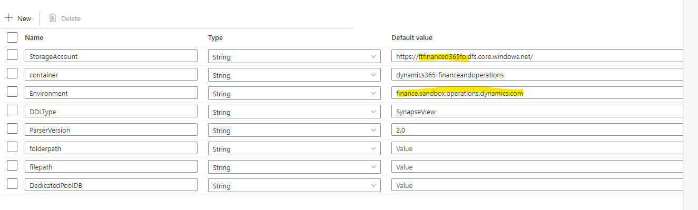
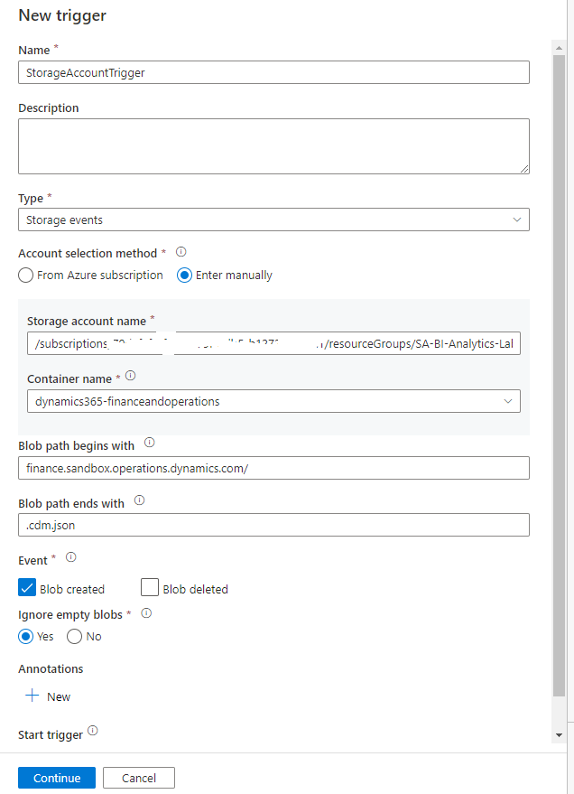
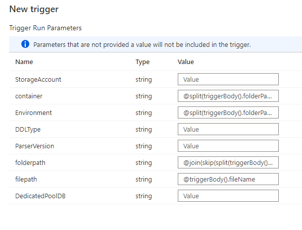

**Overview**

In Dynamics 365 Finance and Operations Apps, [Export to data lake](https://docs.microsoft.com/en-us/dynamics365/fin-ops-core/dev-itpro/data-entities/finance-data-azure-data-lake) feature, lets you copy data and metadata from your Finance and Operations apps into your own data lake (Azure Data Lake Storage Gen2). 
Data that is stored in the data lake is organized in a folder structure that uses Common Data Model format. 
Export to data lake feature, export data as headerless CSV and metadata as [Cdm manifest](https://docs.microsoft.com/en-us/common-data-model/cdm-manifest).  

Many Microsoft and third party tools such as Power Query, Azure Data Factory, Synapse Pipeline supports reading and writing CDM, 
however the data model from OLTP systems such as Finance Operations is highly normalized and hence must be transformed and optimized for BI and Analytical workload. 
[Synapse Analytics](https://docs.microsoft.com/en-us/azure/synapse-analytics/overview-what-is) brings together the best of **SQL**, **Spark** technologies to work with your data in the data lake, provides **Pipelines** for data integration and ETL/ELT, and deep integration with other Azure services such as Power BI. 

Using Synapse Analytics Dynamics 365 customers can un-lock following scenarios 

1. Data exploration and ad-hoc reporting using T-SQL 
2. Logical datawarehouse using lakehouse architecture 
3. Replace BYOD with Synapse Analytics
4. Data transfromation and ETL/ELT using Pipelines, T-SQL and Spark
5. Enterprise Datawarehousing
6. System integration using T-SQL

To get started with Synapse Analytics with data in the lake, you can use CDMUtil pipeline to convert CDM metadata in the lake to **Synapse Analytics** or **SQL metadata**. 
CDMUtil is a Synapse/ADF pipeline that reads [Common Data Model](https://docs.microsoft.com/en-us/common-data-model/) metadata and convert and execute  **Synapse Analytics SQL pools** or **SQL Server** DDL statements. 

Following diagram shows high level concept about the use of Synapse Analytics- 


**Note**: We also have [CDMUtil as Azure Function or Console App](readme.md), this utility is developed in C# and utilizes the CDM SDK to read the CDM metadata and create Synapse metadata. 
Unlike CDMUtil as Azure function and console App, CDMUtil pipeline, reads the json files directly and uses TSQL scripts to create the DDL statement required for Synapse Analytics.
Since CDUtil is just a pipeline within the Synapse or Azure Data Factory, this approach simplify the deployment and maitainance of the utilities.

Following features are not yet implemented in the CDMUtil pipeline. You should continue to use CDMUtil as console App or Function App if you have been using any of these features  
1. Enum translation 
2. Cleaning the Entity view definitions 
3. Overiding the string lenght properties 
4. AXDB connection string to retrive string length or view dependencies
             

**Pre-requisites**
1. Dynamics 365 Finance and Operations [Export to data lake feature](https://docs.microsoft.com/en-us/dynamics365/fin-ops-core/dev-itpro/data-entities/configure-export-data-lake) is configured with [*Enhanced metadata feature*](https://docs.microsoft.com/en-us/dynamics365/fin-ops-core/dev-itpro/data-entities/azure-data-lake-enhanced-metadata#enhanced-metadata-preview).
2. [Create Synapse Analytics Workspace](https://docs.microsoft.com/en-us/azure/synapse-analytics/quickstart-create-workspace). 
3. [Grant Synapse Analytics Workspace managed identify, Blob data contributor access to data lake](https://docs.microsoft.com/en-us/azure/synapse-analytics/security/how-to-grant-workspace-managed-identity-permissions#grant-permissions-to-managed-identity-after-workspace-creation)

***Serverless sql pool*** 
1. Create serverless database 
Use the following query, changing mydbname to a name of your choice
```SQL
CREATE DATABASE mydbname
```
2. Create a master key encryption on the database 
```SQL
-- create master key that will protect the credentials:
CREATE MASTER KEY ENCRYPTION BY PASSWORD = <enter very strong password here>
```
***Dedicated sql pool (optional)*** 
1. Create a Dedicated SQL pool if not already exists
Note: You do not have to create Dedicated SQL pool to deploy the pipeline if you do not plan to use dedicated SQL pool.

**Deploy CDMUtil pipeline**

1. Download [CDMUtil pipeline template](/Analytics/CDMUtilSolution/CDMUtilPipeline.zip)    
2. Import Synapse pipeline Template 
3. Create link service of type Azure SQL for **Synapse Serverless** or **Azure SQL** endpoint by specifying the **SQL endpoint** and **Database name** and **Authentication type**


      
4. Create or select **default workspace endpoint** for Dedicated SQL pool.
5. Create or Select **default workspace endpoint** for storage account.


Note: You do not have to create Dedicated SQL pool to deploy the pipeline if you do not plan to use dedicated SQL pool. Just select the default Synapse workspace linked service that named like **{WorkspaceName}-WorkspaceDefaultSqlServer**

6.Update following highlighted parameters  


7. Click **Publish all** to deploy the pipeline to Synapse workspace. 

Note: This pipeline template can be deployed on **Azure Data Factory** following the similar steps.

**Execute CDMUtil pipeline** 

***On-demand or scheduled execution*** 
To run the pipeline for all metadata that exists in the datalake (Tables, ChangeFeed and Entities), execute the CDMUtil pipeline with appropriate parameters and leave **datapath** and **filepath** parameters blank. 
Pipeline copies all the all metadata files (.cdm.json) under environment folder into a single metadata.parquet file in your data lake. 
Then it reads the metadata.parquet file, generate and execute DDL statement on the target database.    

***Trigger based run using storage events***
When using Synapse pipeline or Azure Data Factory pipelines you can, [create a trigger that runs a pipeline in response to a storage event](https://docs.microsoft.com/en-us/azure/data-factory/how-to-create-event-trigger?tabs=data-factory). 
With use of storage triggers, you can trigger the run of CDMUtil pipeline when new metadata files (.cdm.json) is created or updated. This automates the metadata creation on the synapse for new tables or schema updates. 

To setup the storage envent trigger on the CDMUtil pipeline do following 
1. Create a new trigger , select **type** as storage events
2. Select your storage account from the Azure subscription dropdown or manually using its Storage account resource ID. Choose which container you wish the events to occur on.  
3. Specify the **Blob path begins with**:yourenvironmentfolder.operations.dynamics.com/ and **Blob path ends with**:.cdm.json and select **Event**: Blob created and **Ignore empty blobs**: Yes 


4. Click next, for Data preview, This screen shows the existing blobs matched by your storage event trigger configuration. Click next
5. On the trigger run parameters tab provide following values. This is to retrieve the folderPath and filePath of the metadata file and pass values to pipeline parameters. 

|Parameters                  |Value                               |
|----------------------------|:-----------------------------------|
|container                   |@split(triggerBody().folderPath,'/')[0]|
|Environment                 |@split(triggerBody().folderPath,'/')[1]|
|folderpath                  |@join(skip(split(triggerBody().folderPath, '/'),2), '/')|
|filepath                    |@triggerBody().fileName|



3. Create and publish the changes to deploy storage events trigger. This action will create a storage event on the Azure storage account selected and associate with Synapse/ADF pipeline.
4. Now we want to update the Storage events so that it only trigger for the files that are relavant for CDMUtil pipeline. To do that go to storage account and click on events 
5. Click on **Events Subscriptions** and select the event subscription created by Synapse pipeline.    
6. Click on the filters tab add following addional filters 
**Key**:data.url 
**Operator**:String contains
**Value**: /resolved/ and -resolved. 
  


Above additional filters are applied so that storage events triggers only when a file ending with .cdm.json is created or updated under resolved folder or ends with -resolved.cdm.json.
The reason we are looking for resolved cdm json file is because resolved .cdm.json files respresents final metadata and have all dependencies resolved.
If the CDMUtil pipeline triggers on any other files that ends with .cdm.json but its not in the resolved file format, we may get error in the subsequent execution of the pipline activities.  

# CDMUtil common use cases 

Following are common use cases to use CDMutil with various configuration options.

## 1. Logical datawarehouse using serverless pool - Create tables as Openrowset views or External table and data entities as view on Synapse SQL serverless pool
Create Openrowset view or External tables and create data entities as view on serverless pool to represent logical datawarehouse. 

Following parameters are applicable for Synapse Serverless pool 

|Parameters                  |Value                               |
|----------------------------|:-----------------------------------|
|DDLType                     |SynapseView or SynapseExternalTable |
|ParserVersion               |1.0 or 2.0                          |
|Dbname                      |DBName of Synapse Serverless pool   |
|Schema                      |Schema name (Schema must exist in the database, you must use dbo schema if plan to create entities as views)|
|ObjectTypes                 |Tables,Entities,ChangeFeed (Comma seperated values to control to filter object type)       |

 
## 2. Create Staging tables in Synapse dedicated pool- Create tables(empty tables) to orchastrate data copy in dadicated pool 
Create Synapse columnstore staging tables and data entities as view on dedicated pool to orchastrate data copy. 

Following parameters are applicable for Synapse Dedicated pool 

|Parameters                  |Value                               |
|----------------------------|:-----------------------------------|
|DDLType                     |SynapseTable                        |
|Dbname                      |DBName of Synapse dedicated pool    |
|Schema                      |Schema name (Schema must exist in the database, you must use dbo schema if plan to create entities as views)|
|ObjectTypes                 |Tables,Entities,ChangeFeed (Comma seperated values to control to filter object type)       |

Dedicated pool endpoint is used from Linked services. 

Note: CDMUtil pipeline only create metadata (Tables) and populated metadata information in the control table. To copy data in Synapse tables ADF or Synapse pilelines can be used.   

#### Copy data in Synapse Staging Tables
1. Download [DataLakeToDedicatedPoolCopy template](/Analytics/ArchitecturePatterns/CloudDatawarehouse/DataLakeToDedicatedPoolCopy.zip)    
2. Import Synapse pipeline Template 
3. Provide parameters and execute DataLakeToDedicatedPoolCopy pipeline to copy data to Synapse tables 

DataLakeToDedicatedPoolCopy pipeline reads the control tables from Dedicated pool build dynamic TSQL script using copyInto statement for Full export or incremental export and execute on the dedicated pool.    

## 3. Create Staging Tables in Azure SQL Server- Create tables (empty tables) to orchastrate data copy in Azure SQL Server 
Create staging tables and data entities as view on SQL Server to orchastrate data copy. 

Following parameters are applicable for Azure SQL Table 

|Parameters                  |Value                               |
|----------------------------|:-----------------------------------|
|DDLType                     |SQLTable                            |
|Dbname                      |DBName                              |
|Schema                      |Schema name (Schema must exist in the database, you must use dbo schema if plan to create entities as views)|

Note: CDMUtil pipeline only create metadata ( empty Tables) and populated metadata information in the control tables to facilitate data copy activities.   

#### Copy data in SQL Tables
2. Download [DataLakeToSQLCopy template](/Analytics/ArchitecturePatterns/SQLIntegration/DataLakeToSQLCopy.zip)    
3. Import Synapsepipeline Template 
4. Provide parameters and execute DataLakeToSQLCopy pipeline to copy data to SQL tables.

DataLakeToSQLCopy reads control table to collect metadata and then use DataFlow to copy full and incremental data to SQL server.  
 
