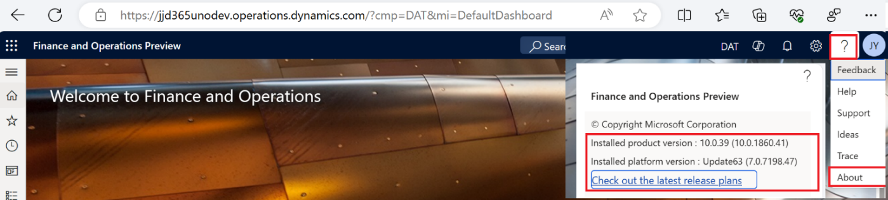
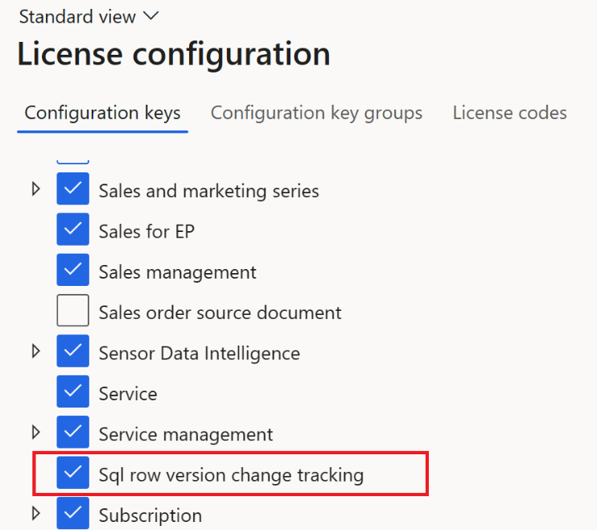
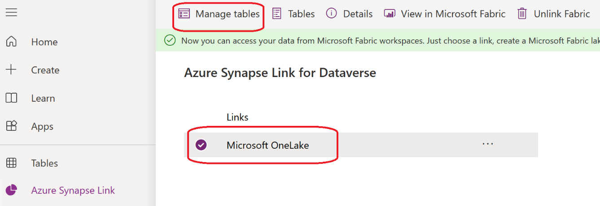
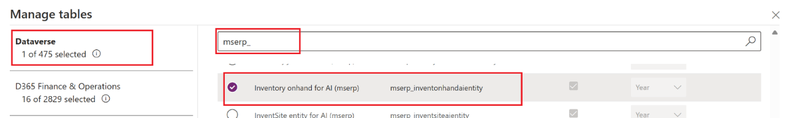
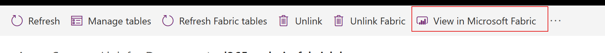
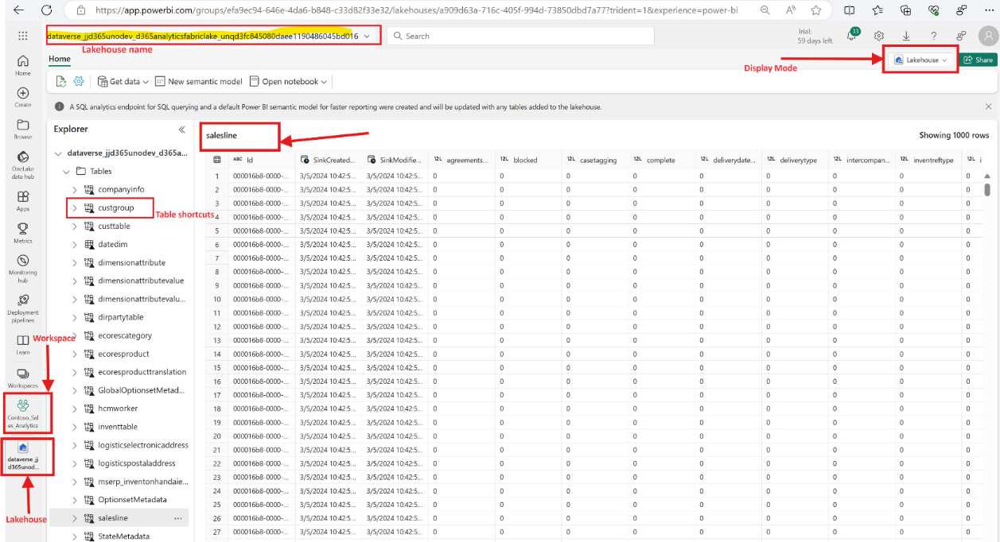
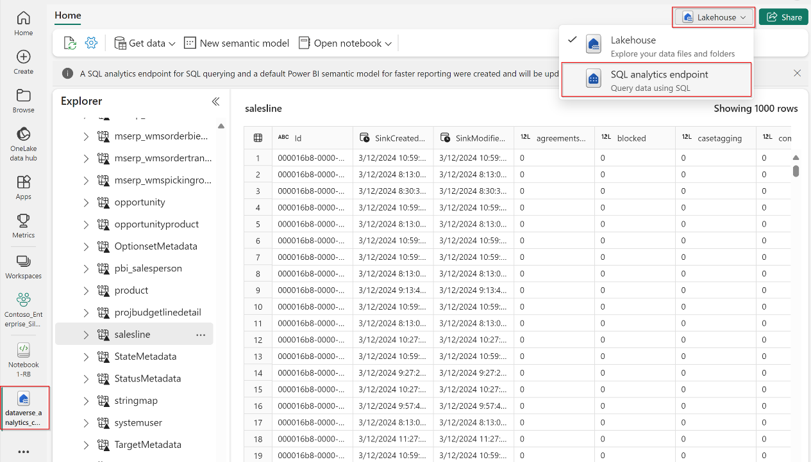


# Dynamics 365 finance and operations apps

Hands on Lab

Link to Fabric from Dynamics 365 finance and operations apps

# Contents {#contents .TOC-Heading}

[Objective [2](#objective)](#objective)

[Module 1: Setting up Fabric link with Dynamics 365 finance and
operations data.
[3](#module-1-setting-up-fabric-link-with-dynamics-365-finance-and-operations-data.)](#module-1-setting-up-fabric-link-with-dynamics-365-finance-and-operations-data.)

[Module 2: Add tables and entities to Microsoft Fabric
[7](#module-2-add-tables-and-entities-to-microsoft-fabric)](#module-2-add-tables-and-entities-to-microsoft-fabric)

[Module 3: Explore Dynamics 365 apps data with Microsoft Fabric.
[10](#module-3-explore-dynamics-365-apps-data-with-microsoft-fabric.)](#module-3-explore-dynamics-365-apps-data-with-microsoft-fabric.)

[Module 4: Creating self-service report using Dynamics 365 data.
[16](#module-4-creating-self-service-report-using-dynamics-365-data.)](#module-4-creating-self-service-report-using-dynamics-365-data.)

[Module 5: Combine Dynamics data with other sources and build Enterprise
data warehouse, Lakehouse with Microsoft Fabric
[20](#module-5-combine-dynamics-data-with-other-sources-and-build-enterprise-data-warehouse-lakehouse-with-microsoft-fabric)](#module-5-combine-dynamics-data-with-other-sources-and-build-enterprise-data-warehouse-lakehouse-with-microsoft-fabric)

[Module 6: Example using BPA
[20](#module-6-build-app-using-the-fabric-virtual-tables)](#module-6-build-app-using-the-fabric-virtual-tables)

# Objective 

To learn how to set up Dataverse Link to Fabric with Dynamics 365
finance and operations apps data and unlock insights using Microsoft
Fabric. By completing all the modules in this document, you will be able
to:

\- Configure Fabric link to enable data integration between Dynamics 365
finance and operations apps and other Microsoft services and
applications.

\- Use Microsoft Fabric to access and analyze finance and operations
apps data.

\- Use Lakehouse, SQL Endpoints and Power BI in Fabric to create
self-service reports and dashboards based on the finance and operations
apps data.

\- Work with Data warehouse in Fabric and combine Dynamics 365 finance
and operations apps data with data from other sources and build combined
reports.

# Module 1: Setting up Fabric link with Dynamics 365 finance and operations data.

In this module, you will learn how to set up Fabric link with Dynamics
365 finance and operations apps. This module requires basic knowledge of
Dynamics 365 finance and operations apps, Dataverse and Power platform.

1.  Depending on your role and objective, the following table shows
    different environment options that can be used to set up and use
    Link to Microsoft Fabric with Dynamics 365 finance and operations
    apps.

+--------------------+---------------+-----------------+--------------+
| **Objective**      | **Finance and | **Finance and   | **Fabric     |
|                    | Operations    | Operations      | re           |
|                    | apps          | requirements**  | quirements** |
|                    | environment   |                 |              |
|                    | type**        |                 |              |
+====================+===============+=================+==============+
| Individual         | Trial         | Trial license,  | Access to    |
| learning           | environments  | Access to       | Microsoft    |
|                    |               | create Power    | Fabric trial |
|                    | [Unified      | platform        | or Paid      |
|                    | admin trials  | environment.    | Fabric       |
|                    | previe       |                 | capacity     |
|                    |w](https://l |                 | from Azure   |
|                    | earn.microsof |                 |              |
|                    | t.com/en-us/p |                 |              |
|                    | ower-platform |                 |              |
|                    | /admin/unifie |                 |              |
|                    | d-experience/ |                 |              |
|                    | admin-trials) |                 |              |
+--------------------+---------------+-----------------+--------------+
|                    | Cloud hosted  | LCS Prospect    |              |
|                    | development   | projects and    |              |
|                    | environment   | Azure           |              |
|                    | (CHE)         | subscription to |              |
|                    |               | deploy CHE      |              |
|                    | [Sign up for  | environments.   |              |
|                    | preview       |                 |              |
|                    | sub           | Power Platform  |              |
|                    | scriptions](h | Integration can |              |
|                    | ttps://learn. | only be set up  |              |
|                    | microsoft.com | at deployment   |              |
|                    | /en-us/dynami | time.           |              |
|                    | cs365/fin-ops |                 |              |
|                    | -core/dev-itp |                 |              |
|                    | ro/dev-tools/ |                 |              |
|                    | sign-up-previ |                 |              |
|                    | ew-subscripti |                 |              |
|                    | on#subscribe) |                 |              |
|                    |               |                 |              |
|                    | [Access       |                 |              |
|                    | development   |                 |              |
|                    | enviro        |                 |              |
|                    | nments](https |                 |              |
|                    | ://learn.micr |                 |              |
|                    | osoft.com/en- |                 |              |
|                    | us/dynamics36 |                 |              |
|                    | 5/fin-ops-cor |                 |              |
|                    | e/dev-itpro/d |                 |              |
|                    | ev-tools/acce |                 |              |
|                    | ss-instances) |                 |              |
+--------------------+---------------+-----------------+--------------+
| Customer/Partner   | Unified       | Administrator   |              |
| organization with  | development   | access to Power |              |
| Dynamics 365       | environments  | platform        |              |
| finance and        |               | environment     |              |
| operations apps    | [Unified      |                 |              |
| license            | developer     |                 |              |
|                    | experience    |                 |              |
|                    | for finance   |                 |              |
|                    | and           |                 |              |
|                    | operations    |                 |              |
|                    | apps](https:  |                 |              |
|                    | //learn.micro |                 |              |
|                    | soft.com/en-u |                 |              |
|                    | s/power-platf |                 |              |
|                    | orm/developer |                 |              |
|                    | /unified-expe |                 |              |
|                    | rience/financ |                 |              |
|                    | e-operations- |                 |              |
|                    | dev-overview) |                 |              |
+--------------------+---------------+-----------------+--------------+
|                    | Sandbox (tier | Administrator   |              |
|                    | 2+) or        | access to Power |              |
|                    | Production    | platform        |              |
|                    | environments  | environment     |              |
+--------------------+---------------+-----------------+--------------+

2.  Create a new or use existing Dynamics 365 finance and operations
    apps environment **Integrated with Power Platform** as one of the
    options described in the table above.

3.  Login to Power Platform Admin center
    (<https://admin.powerplatform.microsoft.com/environments>) select
    the environment connected to the Dynamics 365 finance and operations
    apps environment.

*Tip: The name of the Power platform environment usually matches the
name of the Dynamics 365 finance and operations apps environment. To
learn more about how to use Dynamics 365 finance and operations apps
with Power platform, follow this link: [Enable Power Platform
Integration - Finance & Operations \| Dynamics 365 \| Microsoft
Learn](https://learn.microsoft.com/en-us/dynamics365/fin-ops-core/dev-itpro/power-platform/enable-power-platform-integration)*

You might not have System Administrator access to the environment if you
can\'t view the power platform environment. You can contact the system
administrator and ask them to give you the system administrator role as
a user in the power platform environment. [Add users to an environment
automatically or manually - Power Platform \| Microsoft
Learn](https://learn.microsoft.com/en-us/power-platform/admin/add-users-to-environment#add-users-to-an-environment-that-has-a-dataverse-database)

{width="6.561986001749781in"
height="1.6367541557305336in"}

To check if a Power Platform Environment has a connection to a Dynamics
365 finance and operations app:

-   Select the Power platform environment.

-   Under Details tab, validate the **Finance and Operations URL** is
    populated.

{width="6.057292213473316in"
height="2.661357174103237in"}

4.  Click on the **Finance and Operations URL** to login and validate
    the application and platform versions meet the minimum version
    requirements. **Help & Support** \> **About**

{width="6.336000656167979in"
height="1.4349300087489063in"}

{width="6.135461504811898in"
height="1.1250087489063867in"}

5.  Ensure the Dynamics 365 finance and operations app environment has
    the **License configuration** key **Sql row version change
    tracking** enabled.

    a.  Navigate to **System administration** \> **Setup** \> **License
        configuration**.

    b.  Validate that **Sql row version change tracking** is enabled as
        shown in the image below.

> {width="3.3655457130358704in"
> height="2.9848851706036745in"}

*From platform update 63 / application update 10.0.39, sql row version
change tracking is on by default.*

If the configuration key is turned off, take the following steps to turn
on the license configuration key.

i.  Follow the documentation to turn on maintenance mode for the
    Dynamics 365 finance and operations app environment [Maintenance
    mode - Finance &
    Operations](https://learn.microsoft.com/en-us/dynamics365/fin-ops-core/dev-itpro/sysadmin/maintenance-mode).

ii. Login to the Dynamics 365 finance and operations app using the
    environment URL.

iii. Navigate to **System administration** \> **Setup** \> **License**
     **configuration**.

iv. Select the check box **Sql row version change tracking** and click
    save.

v.  Exit maintenance mode following the above documentation in step 1.

```{=html}
<!-- -->
```
6.  Setup Dataverse Link to Microsoft Fabric

    i.  Login to <https://make.powerapps.com/> and select the
        environment.

    ii. Select **Tables** \> **Analyze** \> **Link to Microsoft
        Fabric.**

    iii. Login to **Create connection.**

    iv. Select **Fabric Workspace.**

    v.  Click **Create** to complete the shortcut creation and initial
        sync.

> {width="5.576634951881015in"
> height="2.3802088801399823in"}
>
> To learn more, follow the documentation at [Link to Microsoft
> Fabric](https://learn.microsoft.com/en-us/power-apps/maker/data-platform/azure-synapse-link-view-in-fabric#link-to-microsoft-fabric)

# Module 2: Add tables and entities to Microsoft Fabric 

Understanding Finance and Operations Tables and Data Entities and what
to use

The table below compares the relevant features of Dynamics 365 finance
and operations apps tables and entities, which are both supported by
Fabric link. Tables are database objects that store data in rows and
columns, while entities are abstractions that combine data from multiple
tables and provide a common interface for querying and manipulating
data. The table lists the pros and cons of using each option with
Fabric. 

+------+-----------+------------+-------------------+----------------+
|      | **Desc    | **Pros**   | **Cons**          | **Re           |
|      | ription** |            |                   | commendation** |
+======+===========+============+===================+================+
| Ta   | Tables    | **Easy     | To create         | Utilize        |
| bles | are       | access to  | dimensional data  | entities where |
|      | n         | data:**    | models, you need  | applicable.    |
|      | ormalized | O          | to join tables in | Use tables to  |
|      | ERP       | OB/Custom/ | Microsoft Fabric  | gain easy      |
|      | tables    | ISV tables | and other tools.  | access to data |
|      |           | with row   |                   | and create     |
|      |           | version    |                   | your own data  |
|      |           | change     |                   | model as       |
|      |           | tracking   |                   | necessary by   |
|      |           | on are     |                   | joining        |
|      |           | available  |                   | relevant       |
|      |           | to choose. |                   | tables.        |
|      |           |            |                   |                |
|      |           | New        |                   |                |
|      |           | columns    |                   |                |
|      |           | added to   |                   |                |
|      |           | table in   |                   |                |
|      |           | the future |                   |                |
|      |           | will be    |                   |                |
|      |           | aut        |                   |                |
|      |           | omatically |                   |                |
|      |           | available  |                   |                |
|      |           | in Link to |                   |                |
|      |           | fabric and |                   |                |
|      |           | Synapse    |                   |                |
|      |           | analytics  |                   |                |
|      |           | .          |                   |                |
+------+-----------+------------+-------------------+----------------+
| Data | Data      | Entities   | Many of the OOB   |                |
| Enti | entities  | can be     | entities e.g.,    |                |
| ties | are       | simpler as | Cust              |                |
|      | den       | they join  | CustomerV3Entity, |                |
|      | ormalized | multiple   | are complex and   |                |
|      | data      | relevant   | don't support row |                |
|      | models    | tables and | version change    |                |
|      | c         | present a  | tracking and      |                |
|      | onsisting | simplified | hence are not     |                |
|      | of one or | schema.    | available in      |                |
|      | more      |            | synapse link.     |                |
|      | tables    |            |                   |                |
|      |           |            | Entities are      |                |
|      |           |            | deve              |                |
|      |           |            | lopment-dependent |                |
|      |           |            | and design time   |                |
|      |           |            | schemas, which    |                |
|      |           |            | means adding new  |                |
|      |           |            | columns requires  |                |
|      |           |            | development and a |                |
|      |           |            | code release.     |                |
+------+-----------+------------+-------------------+----------------+

1.  Now that you have setup Link to Microsoft Fabric, lets add your
    Dynamics 365 finance and operations apps data using [Manage link to
    Fabric.](https://learn.microsoft.com/en-us/power-apps/maker/data-platform/azure-synapse-link-view-in-fabric#manage-link-to-fabric)

    a.  In the power platform maker portal
        (<https://make.powerapps.com/>), select your environment,
        navigate to **Azure Synapse link**, select **Microsoft
        OneLake**, and then click **Manage tables.**

> {width="5.52in" height="1.9075962379702538in"}

b.  To add a finance and operations **table**, click on the **D365
    Finance and Operations** tab, then search by table name, for example
    "salesline", then select the table on the grid, and click **Save.**

> {width="5.673479877515311in"
> height="1.5120002187226598in"}

c.  To add a finance and operations **data entity**, click on the
    **Dataverse** tab and then search for "mserp\_", select the entity,
    and save.

> {width="5.733915135608049in"
> height="0.8673304899387576in"}
>
> *Note: You can enable both finance and operations entities and tables
> in Azure Synapse Link for Dataverse. The process of enabling
> additional finance and operations entities is detailed at* [Choose
> finance and operations data in Azure Synapse Link for Dataverse -
> Power Apps \| Microsoft
> Learn](https://learn.microsoft.com/en-us/power-apps/maker/data-platform/azure-synapse-link-select-fno-data#enable-finance-and-operations-data-entities-in-azure-synapse-link)

d.  On the Synapse link profile page, you will be able to monitor the
    sync process. Click on **Refresh Fabric tables** to update the
    Fabric metadata for newly added tables.

> *Note: Initial sync may take some time.*
>
> {width="5.274278215223097in"
> height="1.1180282152230971in"}

Now that the table and entities are added to Microsoft Fabric, let us
explore the data using Microsoft Fabric in the next section.

*Note: Depending on the data, the initial sync of the data can take a
while and the Tables in Fabric link may show as if the data export is
not complete.*

# Module 3: Explore Dynamics 365 apps data with Microsoft Fabric. 

In this section, you will learn how to add tables and entities from
Dataverse to Microsoft Fabric Link, which enables you to access and
analyze your Dynamics 365 apps data with Microsoft Fabric. You will also
learn how to navigate to the Fabric workspace from Dataverse and explore
your data using the Microsoft Fabric Lakehouse platform.

1.  **Explore data using Microsoft Fabric Lakehouse:** After you connect
    Dataverse to Microsoft Fabric Link, you can go to Fabric workspace
    by following these steps.

    a.  Select **Tables** \> **Analyze** \> **Link to Microsoft Fabric**

> {width="5.529109798775153in"
> height="1.664608486439195in"}

2.  Another option is to click **Azure Synapse Link**, choose
    **Microsoft OneLake** and then click on the **View in Microsoft
    Fabric** button as shown below.

> {width="5.684324146981627in"
> height="0.5036745406824147in"}

3.  Dataverse linked to Fabric Lakehouse will open in a new browser tab.
    To learn more, follow the Microsoft Fabric documentation on
    Lakehouse at [What is a lakehouse? - Microsoft
    Fabric](https://learn.microsoft.com/en-us/fabric/data-engineering/lakehouse-overview).
    The screenshot below highlights the following elements:

    i.  Fabric Workspace: As selected during setup of Link to Microsoft
        Fabric

    ii. Fabric Lakehouse: Automatically generated based on your
        environment name -- cannot be changed.

    iii. Shortcuts created for each table selected (small link icon
         represents the shortcut)

    iv. Sample top 1000 rows loaded for selected table.

    v.  Expand the table to see the column's information for a table.

> {width="5.377918853893263in"
> height="2.9218755468066493in"}

4.  Explore data using Spark notebooks.

    a.  In Lakehouse mode, click on the **Open notebook** and click on
        **New notebook**.

    b.  Rename the notebook.

    c.  Expand the Lakehouse explorer and select the table salesline.

    d.  Click on the ... and select content menu Load data \> Spark. A
        code cell is added to the Spark notebook with pyspark code to
        select top 1000 lines of selected table.

    e.  Click the Play button to execute the notebook cell to execute
        the query. The spark session is started, and result is displayed
        on the grid.

    f.  You can do a lot with this Spark notebook to explore the data.
        Notice other options on the notebook cell output grid such as
        **Chart** and **Inspect** button, try them out.

{width="6.026759623797026in"
height="3.0781255468066493in"}

5.  Explore data using T-SQL

    a.  From your lakehouse, click on the top right corner and switch
        from **Lakehouse** to **SQL analytics endpoint** to visualize
        data using T-SQL. To learn more, follow the documentation page
        [What is the SQL analytics endpoint for a lakehouse?\
        ](https://learn.microsoft.com/en-us/fabric/data-engineering/lakehouse-sql-analytics-endpoint){width="5.75in"
        height="3.282292213473316in"}

    b.  SQL analytics endpoint view lets you visualize table metadata
        and write and execute T-SQL queries in the browser as shown
        below.

> {width="6.168033683289589in"
> height="2.3786023622047243in"}

c.  Click on the gear icon and copy the SQL connection string to connect
    to SQL endpoint with Microsoft Entra ID credentials using the SSMS
    or your favorite client to query the data using TSQL and create
    views, stored procedures, functions etc.

> {width="5.962753718285215in"
> height="5.682292213473316in"}

6.  Explore data using visual query.

    a.  Click on New visual query

    b.  Drag table salesline to canvas

    c.  Click on Manage columns\>Choose columns and select relevant
        columns.

    d.  Click on the + sign on the canvas and select and Group by
        transformation.

    e.  Select the group by column dataareaid and count, data is
        summarized and displays

    f.  Click on visualize result -- to open power BI interface to
        create report visual save report

    g.  Click on download Excel file to download summarized data

{width="6.780302930883639in"
height="2.8645833333333335in"}

7.  To Do: Explore data using Power BI (using semantic models)

    a.  Using Power BI service at <https://app.powerbi.com>, you can
        easily:

        i.  Open the report you saved in 4f above

        ii. Create a new report using the semantic model from the report
            in 4f, or from your lakehouse (Create \> Pick a semantic
            model)

    b.  Using Power BI Desktop, you can do the same thing via New \> Get
        Data \> Power BI semantic models

# Module 4: Creating self-service report using Dynamics 365 data.

This module will teach us how to create self-service reports with
Dynamics 365 data. ERP and CRM data models are complicated and can have
hundreds of tables and lots of columns in each table. This complexity
makes it difficult for non-technical business users or analysts to
analyze data and create reports. In these steps we will learn how to
make simplified data models for business users and build self-service
reports using the data model.

1.  Add the following Finance and Operations tables to Fabric link and
    refresh Fabric tables.

  ----------------------------------------------------------------------------
  Table name                       Description           Use case
  -------------------------------- --------------------- ---------------------
  Companyinfo                      Table that holds      
                                   legal entity list and 
                                   party link            

  Dirpartytable                    Holds customer,       
                                   vendor, employee name 
                                   and other information 

  logisticspostaladdress           Postal address        
                                   information for party 
                                   and transactions.     

  logisticselectronicaddress       Electronic address    
                                   such as phone, email  
                                   address for party and 
                                   transactions          

  Custtable                        Customer table        

  Custgroup                        Customer group/       
                                   segmentation          

  Hcmworker                        Employee master       
                                   record                

  Vendtable                        Supplier master table 

  inventtable                      Released product      
                                   master table          

  ecoresproduct                    Product master table  

  ecoresproducttranslation         Product name and      
                                   translation           

  Salesline                        Sales order line      
                                   details               

  dimensionattributevaluesetitem   Financial dimension   Utilized to define
                                   attribute information additional segments
                                   such as business      for customer,
                                   unit, cost center,    supplier, product,
                                   department            and other dimensions
                                                         for financial
                                                         reporting

  Dimensionattributevalue                                

  Dimensionattribute                                     
  ----------------------------------------------------------------------------

2.  Create a Data flow gen 2 to load date dimension to Lakehouse.

    a.  Open the Lakehouse and click on Get Data \> Create New Dataflow
        Gen 2

    b.  Give a name to Dataflow.

    c.  To make it easier, we can import a template that already has
        steps to create our datedim and load to our lakehouse. Locate
        the template and import by clicking Import from a Power Query
        template.

    d.  Click on the advance editor and analyze the code. If you are not
        familiar with Dataflows note that they use M query as the
        language to define steps. Don't know M query? No worries, you
        can design Dataflow steps visually or using natural language
        with Copilot!

    e.  Publish the data flow. It will start running and when completed,
        you will get a notification on notifications icon.

    f.  Open the Lakehouse and find the datedim table that was created
        and loaded with the Dataflow.

{width="6.460416666666666in"
height="3.6354166666666665in"}

3.  Create self-service views using the SQL endpoint.

    a.  Connect to SQL endpoint.

    b.  Download and open the dimandfacts.sql views in the SQL server
        management studio or any other SQL editor

    c.  Spend some time reading the script and comment section to
        understand the scripts.

This script is to help create a simple dimensional data model on
Dynamics 365 for Finance and Operations tables enabled via Fabric link

Script creates following views that are intended to be used in the final
Semantic data model and Power BI report.

1.\[dbo\].\[customers\]

2.\[dbo\].\[legalentity\]

3.\[dbo\].\[products\]

4.\[dbo\].\[empoyees\]

5.\[dbo\].\[vendors\]

6.\[dbo\].\[salesorderdetails\]

Two additional views and function are created by script as generic
template and used in the views above

\[dbo\].\[defaultfinancialdimension_view\]

\[dbo\].\[dirpartyprimary_view\]

Table-Valued Functions: \[dbo\].\[GetEnumTranslations\]

d.  Execute the script and validate the views are created on the

```{=html}
<!-- -->
```
4.  Use Power BI Desktop to connect to views and create Semantic model

```{=html}
<!-- -->
```
a)  Open Power BI desktop and connect to OneLake data hub, select the
    Lakehouse and connect to SQL endpoint

b)  Select the following views.

  -----------------------------------------------------------------------
  Name                      Type                  Description
  ------------------------- --------------------- -----------------------
  customers                 Dimension             Customer dimension with
                                                  customer id, name and
                                                  address and business
                                                  segmentation

  Legalentity               Dimension             Legal entities
                                                  dimension

  Products                  Dimension             Product dimension with
                                                  product id, name

  Datedim                   Dimension             Date dimension

  Salesorderdetails         Fact                  Sales order details
                                                  fact
  -----------------------------------------------------------------------

c)  Build relationship between tables using the following details.

  -------------------------------------------------------------------------------
  **Name**                    **Type**                          **Description**
  --------------------------- --------------------------------- -----------------
  customers.customerid        Salesorderdetails.customerid      1 to many

  legalentity.legalentityid   Salesorderdetails.legalentityid   1 to many

  products.productid          Salesorderdetails.productid       1 to many

  datedim.date                Salesorderdetails.Order date      1 to many
  -------------------------------------------------------------------------------

d)  Create few basic measures on the salesorderdetails table as outlined
    in this table

  -----------------------------------------------------------------------
  **Name**      **DAX code**
  ------------- ---------------------------------------------------------
  Sales order   Sales order count =
  count         DISTINCTCOUNT(salesorderdetails\[Order Id\])

  Sales amount  Sales amount = Sum(salesorderdetails\[Line Amount\])

  Back-order    Back order days =
  days          DATEDIFF(TODAY(),FIRSTDATE(salesorderdetails\[Order
                Date\]),DAY)
  -----------------------------------------------------------------------

> {width="5.90625in"
> height="3.0297331583552056in"}

e)  Build Power BI visuals

9\. Publish to Power BI report to Microsoft Fabric workspace

# Module 5: Combine Dynamics data with other sources and build Enterprise data warehouse, Lakehouse with Microsoft Fabric

In this module we will explore, to bring data from other sources to
Microsoft Onelake and then transform and combine the data with Dynamics
365 data to build Power BI reports.

In the following example, we are bringing Dynamics AX 2012 data that is
on-premises to Microsoft one lake.

**Load data from On-prem SQL Server to Lakehouse**

1.  Follow the documentation to install on-prem data gateway and create
    connection to AX 2012 database [How to access on-premises data
    sources in Data Factory - Microsoft Fabric \| Microsoft
    Learn](https://learn.microsoft.com/en-us/fabric/data-factory/how-to-access-on-premises-data)

2.  Open Microsoft Fabric workspace and create a Lakehouse -- lets name
    it **Legacy_AX_2012_Data**

3.  Click on **Get data in your lakehouse \>New Dataflow Gen 2** to
    create a new dataflow to load data.

4.  Rename Dataflow to Load_AX2012_Data_Lakehouse and click on **Import
    from Power query template**

5.  Locate Load_AX2012_Data_Lakehouse.pqt and click **Open** on the file
    explorer to load the template. This template have predefined list of
    tables from Dynamics AX 2012 database.

6.  Select the parameters SourceDBServer and SourceDBName and change the
    value as per your environment Database server name and Database
    name.

7.  Click on **Configure connection** and select the connection created
    in step 1.

8.  Connection with the database server and database will be established
    and preview data will be loaded in Power Query.

9.  Select a Table and click on **+ button Data Destination** and select
    **Lakehouse**

10. Create or select a connection to Lakehouse

11. Select Workspace name and destination Lakehouse created in step 2
    **Legacy_AX_2012_Data** and keep the TableName as populated default
    and click **Next**

12. On the Destination setting tabs select the **Use automatic
    settings** and click **Save settings**

13. **Repeat** steps 9-12 for each tables.

14. When all tables destination are mapped, click on the Publish button
    to publish the Dataflow Gen2

15. Publishing will finish and Dataflow will execute to load the data in
    the Lakehouse. Right click on the Dataflow and **Refresh history**
    to validate the refresh history and result.

16. Open the Lakehouse and you will notice all the tables are loaded in
    the Lakehouse

**Transform legacy data for self-service reporting.**

Now that we have loaded the Dynamics AX 2012 legacy data to Lakehouse,
lets create some views on top of these tables to create self-service
reporting data model.

1.  Create self-service views using the SQL endpoint.

    a.  Connect to SQL endpoint.

    b.  Download and open the **ax2012_dimandfacts.sql** views in the
        SQL server management studio or any other SQL editor

    c.  Spend some time reading the scripts,

> You might see that the script used is very close to Dynamics 365
> self-service reporting table. Most of the schema and join are alike,
> this is because Dynamics 365 came from on-premises Dynamics AX. This
> means customers who are switching from on-premises software and know
> the schema and data model or have already built data warehouse can use
> their solution with little effort and apply similar model on D365
> data.

**Combine Dynamics 365 and legacy data.**

1.  Create a Datawarehouse

2.  Connect to SQL Endpoint

3.  Run the gold_dimandfacts_materialize.sql

4.  Spend some time reading the script

5.  Create a pipeline to execute the stored procedure

6.  Configure schedule for the pipeline

**Build Power BI Report using the direct lake**

# Module 6: Build App using the Fabric Virtual Tables

