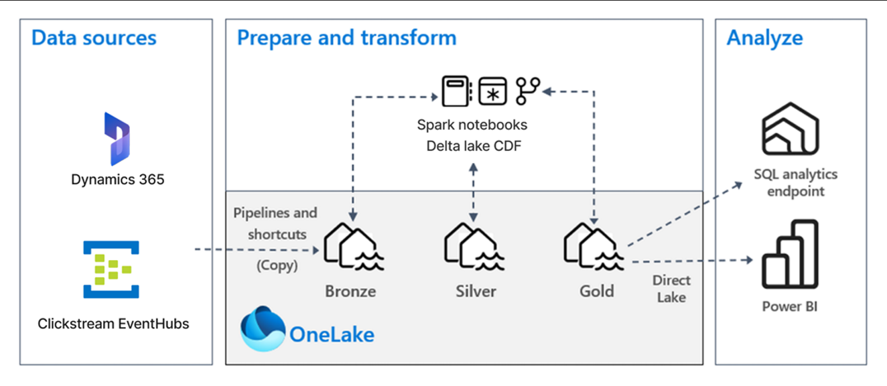
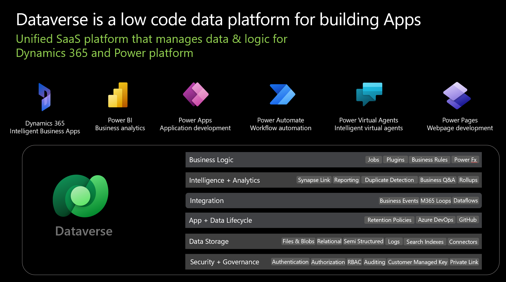
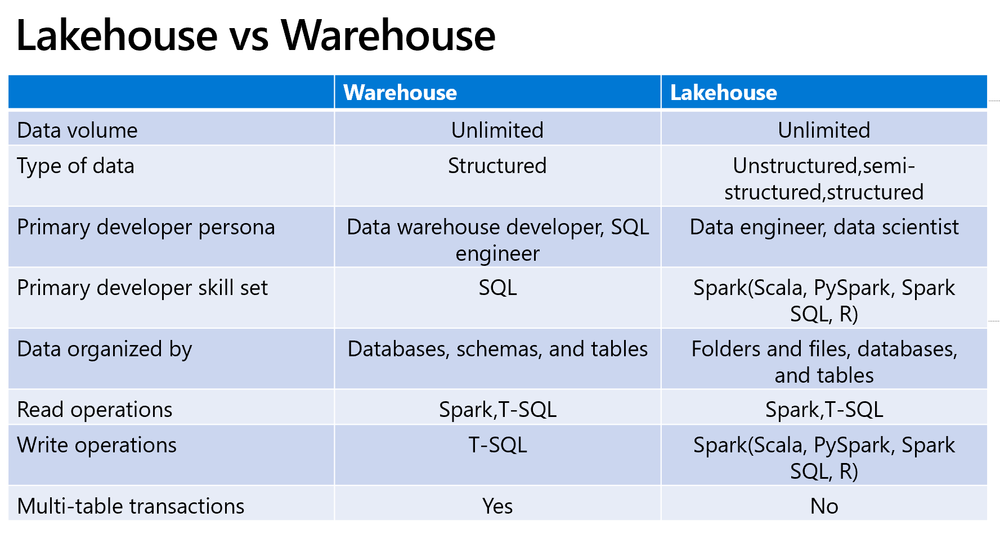
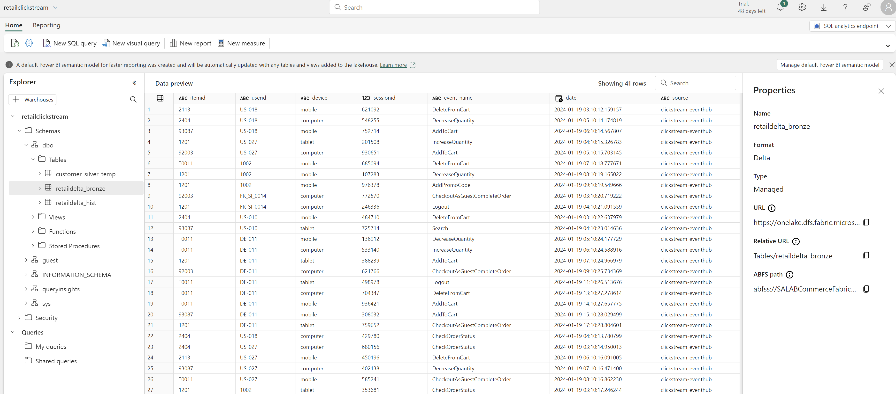
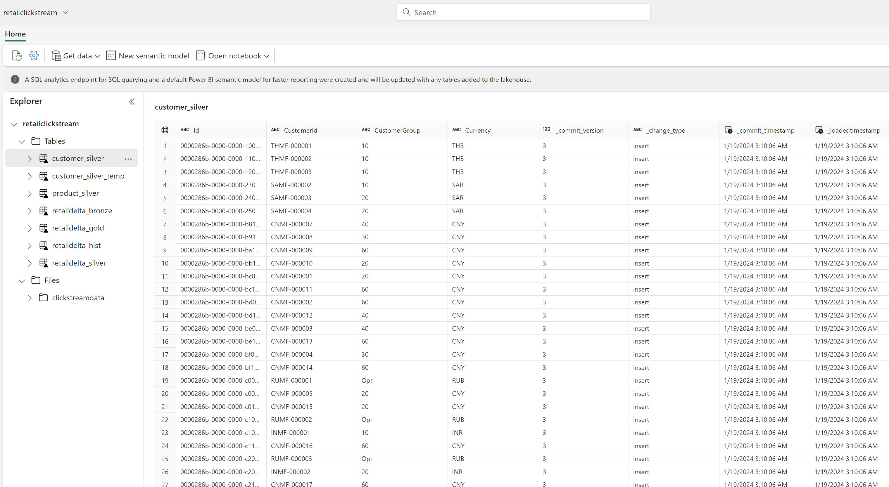
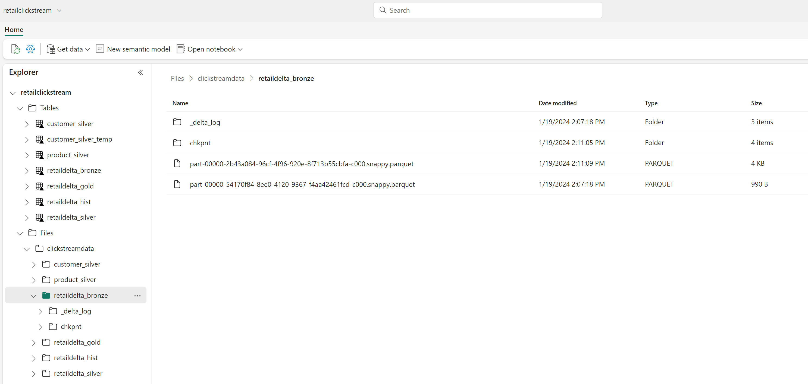
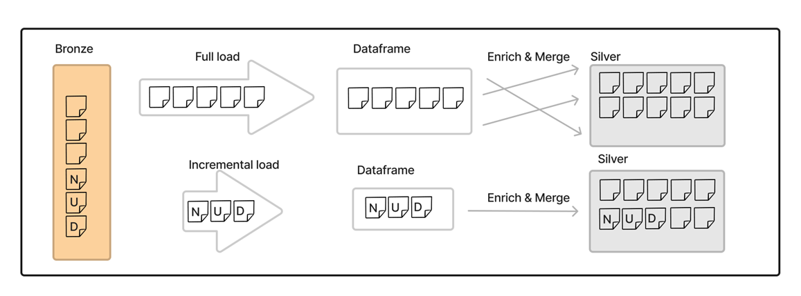
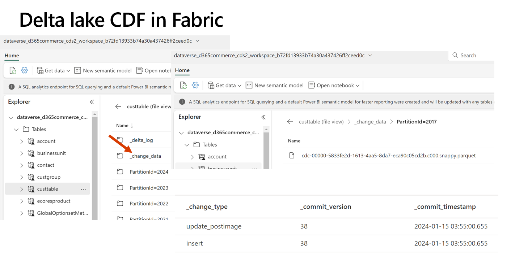
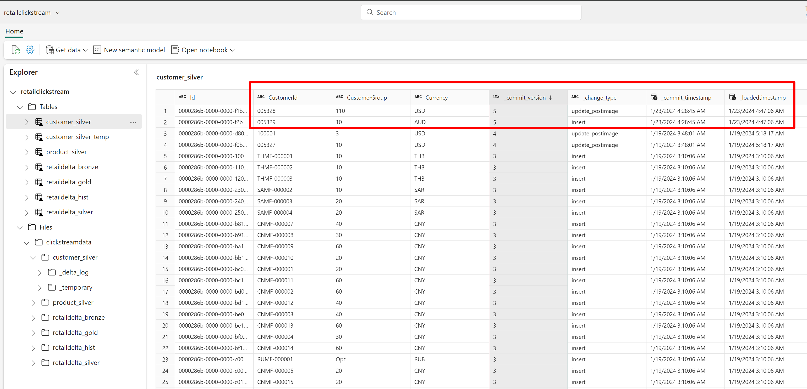

# How to create and maintain Fabric lakehouse for Dynamics 365 - a deep dive

# Table of Contents
1. [Objective](#objective)
2. [Post 1: Export Your Dynamics Data to Microsoft Fabric or Azure Synapse](#post-1-export-your-dynamics-data-to-microsoft-fabric-or-azure-synapse)
3. [Post 2: Setup Synapse link or Fabric link](#post-2-setup-synapse-link-or-fabric-link)
4. [Post 3: Build your data warehouse as lakehouse on Dynamics 365 data in Microsoft Fabric](#post-3-build-your-data-warehouse-as-lakehouse-on-dynamics-365-data-in-microsoft-fabric)
5. [Post 4: Update your Dynamics 365 lakehouse with incremental data updates using Change Data Feed](#post-4-update-your-dynamics-365-lakehouse-with-incremental-data-updates-using-change-data-feed)

For questions and feedback, please reach out to Aman Nain, amnai@microsoft.com

# Objective 
In this series of four posts, I explore the analytical landscape of Microsoft for Dynamics 365, which includes Microsoft Fabric, Azure Synapse, Fabric link, Synapse link, Spark and Delta lake. My intent is to simplify these new technologies and explain their differences. With two sample notebooks, I explore the basics of exporting Dynamics data, setting up a sample lakehouse, and implementing incremental changes using a powerful capability of Delta lake called Change Data Feed (CDF).
 
The best thing here is since data exports go through Dataverse, these posts apply to all Dynamics 365 apps. For example, you can combine Dynamics 365 Finance customer data with Dynamics 365 Sales contact data and save as enriched silver table in the lakehouse.
 
First two posts cover the concepts while last two posts demo a fully functional lakehouse and how to keep it updated using CDF.
 

# Post 1: Export Your Dynamics Data to Microsoft Fabric or Azure Synapse
 
1. **[Post 1: Export Your Dynamics Data to Microsoft Fabric or Azure Synapse](#post-1-export-your-dynamics-data-to-microsoft-fabric-or-azure-synapse)**
2. [Post 2: Setup Synapse link or Fabric link](#post-2-setup-synapse-link-or-fabric-link)
3. [Post 3: Build your data warehouse as lakehouse on Dynamics 365 data in Microsoft Fabric](#post-3-build-your-data-warehouse-as-lakehouse-on-dynamics-365-data-in-microsoft-fabric)
4. [Post 4: Update your Dynamics 365 lakehouse with incremental data updates using Change Data Feed](#post-4-update-your-dynamics-365-lakehouse-with-incremental-data-updates-using-change-data-feed)
 
In the era of ChatGPT, there is renewed focus on enterprise data and accurate and latest data is key to effective management decision-making.
 
Microsoft offers powerful tools such as Azure Synapse and Microsoft Fabric, coupled with features like Synapse link and Link to Microsoft Fabric, that make exporting Dynamics 365 data efficient and effective. In this series, we'll explore the basics of exporting Dynamics data, setting up a lakehouse, and implementing incremental changes using a powerful capability of Delta lake called Change Data Feeds (CDF).
 
In this first post, I touch briefly on different topics and provide links to official documentation. My intent is to bring these topics together so as to bring more clarity to their nuanced differences. There are many concepts and it can be confusing for Dynamics customers when navigating their way through fast paced world of data analytics where Microsoft is a leader and bringing out many advanced apps.
 
In second and third posts, we will see these concepts in action with an implementation of a sample lakehouse for an ecommerce company and a way to efficiently and incrementally update its tables using Change data feeds.
 
  
## Understanding Dataverse's Role
Before delving into the intricacies of exporting Dynamics data, it's essential to understand the role of Dataverse. Dataverse isn't merely a database; it functions as a comprehensive data platform, encompassing logic, integration, and storage. In the context of Azure Synapse and Microsoft Fabric, Dataverse acts as a middleware, facilitating the connection between Dynamics apps and the target apps in Synapse and Fabric.

 
## Azure Synapse and Synapse Link
 
Azure Synapse is an enterprise-level analytics platform designed to host data warehouses and store pipelines and notebooks for data transformation.
 
Synapse Link for Dataverse, enables the integration of various Dynamics 365 and Power Apps data into a unified Azure Synapse workspace. This link ensures seamless access to sales, customer service, field service, marketing, and Finance and Operations data.
Once the initial seeding is complete, Synapse Link supports incremental updates, allowing you to analyze the most recent and relevant data. Notably, D365 Finance tables and entities are fully supported, with no table limits imposed, which was a limitation of previous Export to Data lake service.
 
How to set up Synapse Link: [Choose finance and operations data in Azure Synapse Link for Dataverse - Power Apps | Microsoft Learn](https://learn.microsoft.com/en-us/power-apps/maker/data-platform/azure-synapse-link-select-fno-data)

## Microsoft Fabric and 'Link to Microsoft Fabric' (aka Fabric link)
 
Microsoft Fabric, an all-in-one analytics solution, combines the strengths of Synapse's data engineering and Power BI's data visualization in a unified workspace. This evolution of Azure Synapse and Power BI eliminates the need for Azure portal access, subscriptions, or storage creation. It's a Software as a Service (SaaS) product.
 
Link to Microsoft Fabric, akin to Synapse Link, enables access to Dynamics data within Microsoft Fabric as a lakehouse database. However, a crucial distinction lies in the fact that the exported Dynamics data remains in Dataverse, and Fabric accesses it without actual data movement or copying.
 
How to set up Link to Microsoft Fabric: [Link your Dataverse environment to Microsoft Fabric and unlock deep insights - Power Apps | Microsoft Learn](https://learn.microsoft.com/en-us/power-apps/maker/data-platform/azure-synapse-link-view-in-fabric)

## Synapse Link vs Fabric Link
Both Synapse Link and Fabric Link offer distinct benefits, with the major difference lying in the level of control and maintenance. Fabric Link provides a Software as a Service (SAAS) experience, managing the data for you, while Synapse Link offers a Platform as a Service (PAAS) experience, providing a copy of your data in your storage.
 
Learn more about the differences: [Comparing Link to Fabric with Azure Synapse Link for Dataverse](https://learn.microsoft.com/en-us/power-apps/maker/data-platform/azure-synapse-link-view-in-fabric#comparing-link-to-fabric-with-azure-synapse-link-for-dataverse)

## OneLake and Shortcuts
OneLake is a managed data lake by Microsoft, akin to your OneDrive for data, eliminating the need for individual provisioning. OneLake works as a logical concept, maintaining a single namespace and supporting virtualization across multiple storage accounts.
 
Shortcuts, a key feature of OneLake, act as pointers or links, allowing you to access data in external locations.
 
Fabric Link utilizes shortcuts, enabling access to Dynamics data in Dataverse without actual data movement. **This is a major difference between Synapse and Fabric. While Synapse accesses Dynamics data that is copied over in customer's storage account, Fabric accesses Dynamics data in a Dataverse using shortcuts.**
 
 
Many of you already have existing data lakes stored in ADLS gen2 or in Amazon S3 buckets. With shortcuts, these lakes can continue to exist and be managed externally to Fabric. You just access them in OneLake via shortcuts and work on them, update them. You can also use shortcuts to consolidate data across workspace and domains without changing the ownership of the data. They still have ultimate control over who can access it and how it stays up to date.
 
 
More on OneLake: [What is OneLake? - Microsoft Fabric | Microsoft Learn](https://learn.microsoft.com/en-us/fabric/onelake/onelake-overview)

## Conclusion
In this introductory post, we've explored the fundamentals of exporting Dynamics 365 data to Azure Synapse and Microsoft Fabric.
For data teams new to these tools, the recommendation is to start small and build gradually. Solving one problem at a time is key.
In the next post, I will implement a sample lakehouse. And in the next, we will update its tables using CDF.
 
Stay tuned and thank you for reading.

# Post 2: Setup Synapse link or Fabric link

1. [Post 1: Export Your Dynamics Data to Microsoft Fabric or Azure Synapse](#post-1-export-your-dynamics-data-to-microsoft-fabric-or-azure-synapse)
2. **[Post 2: Setup Synapse link or Fabric link](#post-2-setup-synapse-link-or-fabric-link)**
3. [Post 3: Build your data warehouse as lakehouse on Dynamics 365 data in Microsoft Fabric](#post-3-build-your-data-warehouse-as-lakehouse-on-dynamics-365-data-in-microsoft-fabric)
4. [Post 4: Update your Dynamics 365 lakehouse with incremental data updates using Change Data Feed](#post-4-update-your-dynamics-365-lakehouse-with-incremental-data-updates-using-change-data-feed)

When undertaking a project to implement Synapse link or Fabric link, numerous activities must be considered. These include meeting prerequisites, creating resources, procuring licenses, deploying, and testing, among others. The attached excel file outlines the typical activities necessary for enabling Synapse link and Fabric link. It can serve as a foundational guide to aid decision making and can be adjusted to meet specific project requirements.
 
Download the excel template to aid decision making: [D365 Synapse link & Fabric link migration template.xlsx](https://github.com/microsoft/Dynamics-365-FastTrack-Implementation-Assets/blob/master/Analytics/DataverseLink/Lakehouse/D365%20Synapse%20link%20%26%20Fabric%20link%20migration%20template.xlsx)

# Post 3: Build your data warehouse as lakehouse on Dynamics 365 data in Microsoft Fabric

1. [Post 1: Export Your Dynamics Data to Microsoft Fabric or Azure Synapse](#post-1-export-your-dynamics-data-to-microsoft-fabric-or-azure-synapse)
2. [Post 2: Setup Synapse link or Fabric link](#post-2-setup-synapse-link-or-fabric-link)
3. **[Post 3: Build your data warehouse as lakehouse on Dynamics 365 data in Microsoft Fabric](#post-3-build-your-data-warehouse-as-lakehouse-on-dynamics-365-data-in-microsoft-fabric)**
4. [Post 4: Update your Dynamics 365 lakehouse with incremental data updates using Change Data Feed](#post-4-update-your-dynamics-365-lakehouse-with-incremental-data-updates-using-change-data-feed)

In this post, we will look at few broad concepts that make up a lakehouse and discuss creating an example lakehouse in Microsoft Fabric.

## Delta lake and Spark
 
Before we understand lakehouse, it is important to discuss two underlying concepts to lakehouses, Spark and delta lake file formats.
 
Apache Spark is a parallel processing framework that supports in-memory processing to boost the performance of big data analytic applications. It makes your ETL pipelines capable to handle millions of rows of data. Microsoft has adopted this framework to power its Azure Synapse and Microsoft Fabric notebooks.
[Apache Spark in Azure Synapse Analytics overview - Azure Synapse Analytics | Microsoft Learn](https://learn.microsoft.com/en-us/azure/synapse-analytics/spark/apache-spark-overview)
 
Delta Lake is an open-source storage layer that brings ACID (atomicity, consistency, isolation, and durability) transactions to Apache Spark and big data workloads.
[What is Delta Lake? - Azure Synapse Analytics | Microsoft Learn](https://learn.microsoft.com/en-us/azure/synapse-analytics/spark/apache-spark-what-is-delta-lake)
 
Delta lake file format allows the unstructured data in data lakes to behave in a structured way, needed to enable data warehousing capabilities. Technologies like delta lake and Spark allowed lakehouse to become a dominant method of data warehouses, a modern data warehouse that brings best of both worlds - data warehouses and data lakes: standard DBMS management functions usable directly against low-cost object stores.
 
With the evolution of advanced storage formats such as delta lake which bring ACID properties to parquet files and its native support in big data frameworks such as Spark, it is no wonder that big data tools such as Microsoft Fabric, Azure Synapse and Databricks support lakehouse as the recommended form of data warehouse supported by these technologies.
 
Read more: <https://learn.microsoft.com/en-us/training/modules/work-delta-lake-tables-fabric/>

## Lakehouse
 
When it comes to data warehousing, Microsoft encourages a lakehouse architecture for data warehousing, typically implemented with a medallion architecture consisting of bronze, silver, and gold layers.
 
While loosely defined, lakehouses have gained significance due to factors such as cost-effective storages in data lakes, serverless computes, and notebooks running spark code can handle millions of rows in milli seconds.
 
The idea of a lakehouse architecture within Microsoft Fabric, a Software as a Service (SAAS) experience with a serverless approach, aligns seamlessly. Fabric's serverless nature makes lakehouses the recommended method for building data warehouses.
 
[What is a lakehouse? - Microsoft Fabric | Microsoft Learn](https://learn.microsoft.com/en-us/fabric/data-engineering/lakehouse-overview)

More info: [Fabric decision guide - choose a data store - Microsoft Fabric | Microsoft Learn](https://learn.microsoft.com/en-gb/fabric/get-started/decision-guide-data-store)

## Lakehouse vs warehouse
 
Comparing lakehouse and traditional data warehouses have few distinctions, in case of writing data where TSQL suffices for warehouses, Spark is essential for lakehouses. The choice between them often hinges on the team's skill set, with warehouses catering to SQL development skills and lakehouses geared towards those comfortable with Spark.
 
Mixing and matching approaches is feasible, allowing for the integration of lakehouse for certain aspects and a traditional data warehouse for others, depending on specific business needs and team capabilities.

## Lakehouse implementation - ecommerce example
To demonstrate a lakehouse architecture, I will build an end-to-end ETL pipeline in Microsoft Fabric/Synapse. Using Dynamics products and customer data in a data lake, I will enrich raw data, create refined tables, and finally generate a gold table through aggregation.
 
This lakehouse implementation, utilizing delta lakes and Spark, is geared towards a commerce company analyzing online clickstream data to gain insights into customer behavior.
 
This post provides step-by-step details of the implementation, including the organization of data in Files and Tables within the lakehouse, checkpoint features, and considerations for incremental updates using delta lake change data feed.
 
The data is stored in delta lake format and spark framework using pyspark code is used to execute the notebook.
Please note there are three primary methods to transform data, pipelines, data flows and notebooks.
I use a notebook with few hardcoded variables, that in a production setting could come from parameters configured in a pipeline, scheduled to run on a periodic basis.
 
I have two primary data sources, Dynamics 365 Finance customer and products tables and clickstream data in EventHubs. I also use a historical file of this data stored in EventHubs.
 
## Steps are roughly like this:
- Save clickstream data as RetailDelta_Bronze and RetailDelta_Historical tables
- Extract relevant fields from Dynamics CustTable (Customers) and EcoResProduct (Products) tables and save as silver tables Customer_Silver and Product_Silver (I could also do joins between different Dynamics tables such as CustTable, DirPartyTable to enrich our silver tables)
- Do some joins between Dynamics and clickstream tables and save as RetailDelta_Silver
- Do some aggregates on silver table and save as RetailDelta_Gold
- SQL selects and charts provide built in analytics (see image below)

## Few points:
 
In Fabric lakehouse, data is organized in two storage locations, Tables and Files. I save the data under Files in lakehouse 'retailclickstream'.
 
Note if you load a dataframe and then save the table calling 'SaveAsTable' the table is saved as a Managed table. But if you specify the path of storage, in our case Files section, its saved as an External table.
The difference is slight, external tables give us more control as we can see the underlying storage. Managed tables storage is invisible to us. But only managed tables are visible in SQL Analytics endpoint. Dataverse tables will show as Managed.
[Create delta tables - Training | Microsoft Learn](https://learn.microsoft.com/en-us/training/modules/work-delta-lake-tables-fabric/3-create-delta-tables)

Note that I save the Customer_Silver table with few extra columns (_commit_version, _change_type, _commit_timestamp), this is needed to incrementally update this table using delta lake change data feed. I will show this in the next post.

I also use checkpoint feature of delta lakes, which automatically saves logs in a _checkpoints folder. Checkpoints allows pipelines to recover in case of a failure or intentional shutdown. It allows the pipeline to recover the previous progress and state of a previous query, and continue where it left off. <https://spark.apache.org/docs/latest/structured-streaming-programming-guide.html#recovering-from-failures-with-checkpointing>
 
I implement the lakehouse in one workspace of Fabric, you may decide to dedicate different workspaces for the three layers, which may be convenient if you want to control access to different tables. 
[Implement medallion lakehouse architecture in Microsoft Fabric - Microsoft Fabric | Microsoft Learn](https://learn.microsoft.com/en-us/fabric/onelake/onelake-medallion-lakehouse-architecture)
 
The notebook template in GitHub is provided towards the end.

## Lakehouse tables

The final list of tables in the lakehouse

The delta lake files underneath the tables

## Analytics within lakehouse

Run basic analytics in the notebook

## A note on EventHubs with Apache Kafka for streaming data
 
We are simulating clickstream data using a python script. Note this step is optional as I need to bring data from an external source to combine with my Dynamics data. You can read third party data via regular Spark from some storage locations too.
 
At its core, we use Spark Structured Streaming (readStream) that has built-in support for reading and writing to Apache Kafka.
We define a number of options to configure how we want to read, startingOffsets, latest brings only latest data.
The checkpointPath tracks the Kafka data that’s already been processed, so you don’t need to manually track the data that’s already been ingested into the Delta table.
 
We read the Kafka stream with the trigger to availableNow which allows for periodic processing. If you need Spark Structured Streaming to continuously process new data from the Kafka stream, use something like trigger(processingTime='10 seconds'). For continuous streaming, you need a cluster that’s always running. That is usually more expensive than periodically provisioning a new cluster and incrementally processing the new data. Continuous streaming is good for low-latency data processing pipelines. Incremental processing is good when the latency requirements can be higher.
 
Read more here: <https://learn.microsoft.com/en-us/azure/event-hubs/azure-event-hubs-kafka-overview>

## Conclusion 
 
In conclusion, this post has explored the essential concepts of lakehouse architecture and demonstrated its practical implementation in Microsoft Fabric. The lakehouse approach, with its flexibility and compatibility with serverless environments, emerges as a recommended strategy for building modern data warehouses. In next and last post, lets see how to update its tables using change data feed.
 
Link to GitHub: <https://github.com/microsoft/Dynamics-365-FastTrack-Implementation-Assets/blob/master/Analytics/DataverseLink/Lakehouse/Lakehouse_FL_Commerce_Clickstream_Share.ipynb>

# Post 4: Update your Dynamics 365 lakehouse with incremental data updates using Change Data Feed

1. [Post 1: Export Your Dynamics Data to Microsoft Fabric or Azure Synapse](#post-1-export-your-dynamics-data-to-microsoft-fabric-or-azure-synapse)
2. [Post 2: Setup Synapse link or Fabric link](#post-2-setup-synapse-link-or-fabric-link)
3. [Post 3: Build your data warehouse as lakehouse on Dynamics 365 data in Microsoft Fabric](#post-3-build-your-data-warehouse-as-lakehouse-on-dynamics-365-data-in-microsoft-fabric)
4. **[Post 4: Update your Dynamics 365 lakehouse with incremental data updates using Change Data Feed](#post-4-update-your-dynamics-365-lakehouse-with-incremental-data-updates-using-change-data-feed)**

In this last post of the series, we'll explore a practical Proof of Concept (POC) showcasing how to achieve incremental data loading using Spark and Delta lakes. Leveraging tools like Synapse, Fabric, and Databricks, all Dynamics data becomes available in the industry-standard and open-source Delta Lake format. Following our previous discussion on Microsoft's recommendation to implement a lakehouse for data warehousing, this demo will illustrate a use case of refining data from bronze to silver and loading it incrementally.
 
Note there is another way to get incremental data using csv files. You can setup Synapse link to create timestamped folders with changes as csv files. Read here: [Query and analyze the incremental updates - Power Apps | Microsoft Learn](https://learn.microsoft.com/en-us/power-apps/maker/data-platform/azure-synapse-incremental-updates)

## Incremental vs full
 
Let's start by understanding the two primary approaches to data loading: full load and incremental load. While a full load involves reading the entire dataset and performing a complete push, incremental load only processes the changed records. The latter, depicted in the image, encompasses new, updated, and deleted records, making it faster and more efficient for subsequent loads.

## Why incremental load
 
Dealing with numerous tables and millions of rows, incremental loading emerges as a practical solution. Full reloads should be reserved for rare scenarios, as incremental loading proves to be more efficient, faster, and cost-effective, consuming fewer computational resources and storage. Moreover, it ensures fresh data at regular intervals, making it readily available for analytics.
 
Some customers choose to mix and match, for example use full load for smaller tables like Dimensional tables and incremental loads for larger tables like Fact tables.
 
## How do we achieve incremental - Spark's Change Data Feed (CDF)
 
The Change Data Feed (CDF) feature enables Delta tables to track row-level changes between versions. By recording "change events" for all data written into a Delta table, CDF categorizes rows as inserted, deleted, or updated. This feature is natively supported by Delta Lake and Spark, and it is enabled by default for all Fabric Dataverse tables. Implementing CDF results in reading a lightweight file instead of the entire source, offering faster and cheaper incremental loading. **It also enables a powerful capability to time travel, to read previous versions of data.** Read more: [Change data feed — Delta Lake Documentation](https://docs.delta.io/latest/delta-change-data-feed.html)

## Setup
Delta lake table property delta.enableChangeDataFeed needs to be enabled to use this feature. In Fabric link, dataverse tables have this property already enabled. In case of Azure Synapse or if you bring your own storage to Fabric, you need to enable it.
 
You can retrieve detailed information about a Delta table (for example, number of files, data size) using DESCRIBE DETAIL.

## Reading changed data
In our example, we retrieve changed data from change data feed folders based on starting version and ending version. 'Describe history' gets the latest version of the commit on source table. 'Describe history' has information on the operations, user, timestamp, and so on for each write to a Delta table. The operations are returned in reverse chronological order. By default table history is retained for 30 days.
 
The three columns _change_type, _commit_version and _commit_timestamp get values due to CDF being enabled on the source table. _change_type can be insert or delete or update_preimage or update_postimage. I remove records with values update_preimage as these are before update and not needed for merge. _commit_version is an ever increasing number and crucial for our where clause to read only the changed data.
 
More info: <https://docs.delta.io/latest/delta-change-data-feed.html#what-is-the-schema-for-the-change-data-feed>

## Save changes in a separate table 
The changed data is saved in a table called customer_silver_temp. Note you don’t need to save as a separate table, you can take the dataframe data and merge in target. I save it for demo purpose and it may be useful for auditing and tracking last changes.
 
In Dynamics 365 Finance, I make two changes, add a new customer (Harry James 005329) and update an existing customer's (Berry Jones 005328) Customer Group to 110.

## Quality checks using "Great expectations"
Optionally I validate that certain columns in the dataframe are unique and not null. The validate function will check all the expectations we've set up and return the results.
For example, I want to make sure CustomerId is unique, this can be challenging as you may get multiple copies of same Id when it comes to updates, which can break our merge.
I use an open source library called Great expectations. It has many more capabilities, you can find here. <https://learn.microsoft.com/en-us/fabric/data-science/tutorial-great-expectations>

## Merge
I use Delta lake merge function to merge the changed data in customer_silver table.
 
Note the merge function does an upsert, update, delete or insert. In my code, I use condition with Id and IsDelete. The deleted records in Dataverse/Dynamics 365 come with IsDelete as true and I use that condition to delete them from target. More info: <https://docs.delta.io/latest/delta-update.html>

## Time travel
Change Data Feed files enable time travel, allowing users to access past data versions using versions and timestamps. This powerful capability enhances the flexibility and analytical potential of Delta Lake. You can even restore a table to an earlier version.
 
For more info, read: [Work with delta tables in Spark - Training | Microsoft Learn](https://learn.microsoft.com/en-us/training/modules/work-delta-lake-tables-fabric/4-work-delta-data) and <https://delta.io/blog/2023-02-01-delta-lake-time-travel/>

## Cleanup with Vacuum command 
To remove old data in the temporary table, the Vacuum command is employed. Physically removing files older than the retention period helps optimize storage costs. However, caution is advised, as using the Vacuum command may result in the loss of time travel capabilities.
 
More info: <https://delta.io/blog/remove-files-delta-lake-vacuum-command/>

## Conclusion
In this last post, we've demonstrated a straightforward, efficient, cost-effective, and scalable approach to incrementally updating your lakehouse tables using Delta Lake Change Data Feed. Incremental updates prove to be a valuable solution for keeping your tables consistently updated. Stay tuned for future blogs where we delve into scaling Delta Lakes for optimal performance.

Link to GitHub: <https://github.com/microsoft/Dynamics-365-FastTrack-Implementation-Assets/blob/master/Analytics/DataverseLink/Lakehouse/Lakehouse_FL_Incremental_CDF_Share.ipynb>

 

 
 
