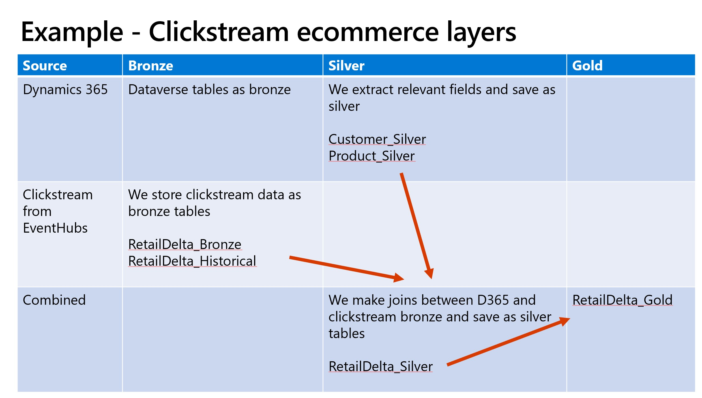

# Lakehouse and loading incremental data

Implementing lakehouses, one challenge data teams face is loading data and loading it in the most efficient manner. A full data load is inefficient, slow, expensive and should not be a regular pattern. Traditionally, teams have designed incremental data loading using watermarks by noting last processed version number or a timestamp of the records processed for loading.

With Apache Spark and Delta lake being the heart of modern data apps, we get many capabilities that can transform data loading tasks and make it more manageable and at enterprise level scale. In this GitHub, we see the power of Delta lake's change data feed to load data incrementally. 

## Create the Lakehouse

We have two notebooks. First notebook shows how to implement a lakehouse. We use example of a retail company that wants to analyse clickstream data of its users and lookup in Dynamics data to create tables. These tables provide insights into company’s userbase. What products they like, what group they belong to, what devices they use to browse.

Link to lakehouse notebook: [Lakehouse ecommerce](Lakehouse_FL_Commerce_Clickstream_Share.ipynb).

## Change data feed

Once we have a lakehouse with bronze, silver and gold tables, we want to maintain the data and update it regularly. In the second accompanying notebook, we explore delta lake's change data feed to help maintain our lakehouse. The notebook shows how we can tap into change data folders of a customer table and read the changed data and merge it into the target silver table.
We use Fabric workspace and utilise the 'Link to Fabric' to read from Dynamics data maintained in the Dataverse lakedatabase.

Change data feed allows to read the changes instead of reading the entire source files, resulting in a pipeline that is quick, efficient and cheaper.

Link to change data feed notebook: [Lakehouse with change data feed](Lakehouse_FL_Incremental_CDF_Share.ipynb).

## Incremental approaches

Another example that shows how delta lake's checkpoint folders can be used to do incremental loading. Checkpoints are another capability that help make pipelines robust. Link to notebook here: [Incremental using checkpoints](Lakehouse_Incremental_Checkpoints_Template.ipynb).

Another example of a notebook that shows how you can enrich data with joins. This was demoed in FastTrack's TechTalk#4 on Lakehouse [Lakehouse using Synapse link](Lakehouse_Synapselink_FactsDims_Template.ipynb)

Transition to Synapse link TechTalk series - https://aka.ms/TransitiontoSynapseLinkVideos

