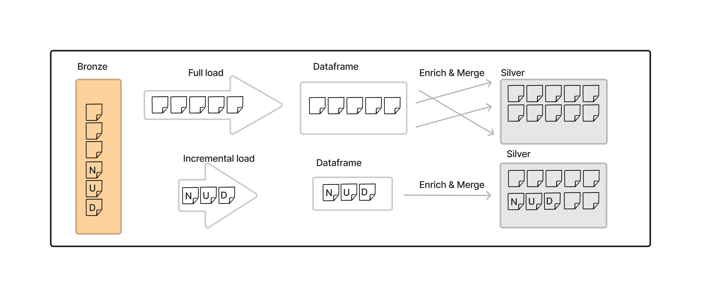

## Lakehouse

Implementing lakehouses, one challenge data teams face is loading data and loading it in the most efficient manner. A full data load is inefficient, slow, expensive and should not be a regular pattern. Traditionally, teams have designed incremental data loading using watermarks by noting last processed version number or a timestamp of the records processed for loading.

With Apache Spark and Delta lake being the heart of modern data apps, we get many capabilities that can transform data loading tasks and make it more manageable and at enterprise level scale. In this GitHub, we explore Spark structured streaming and checkpoints logs to load data incrementally. 

You can find notebook that demonstrates incremental data loading with checkpoints here [Incremental using checkpoints](Lakehouse_Incremental_Checkpoints_Template.ipynb).

Another example of a notebook that shows how you can enrich data with joins. This was demoed in FastTrack's TechTalk#4 on Lakehouse [Lakehouse using Synapse link](Lakehouse_Synapselink_FactsDims_Template.ipynb)

Transition to Synapse link TechTalk series - https://aka.ms/TransitiontoSynapseLinkVideos

