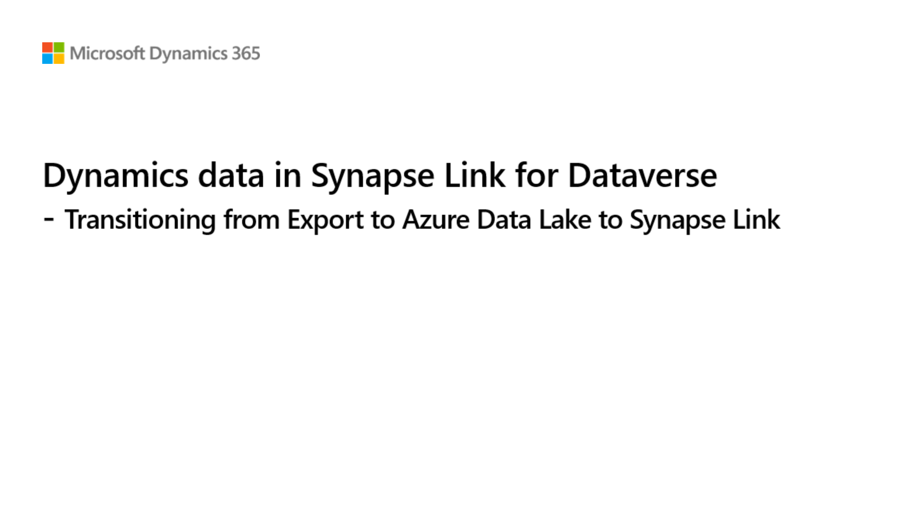
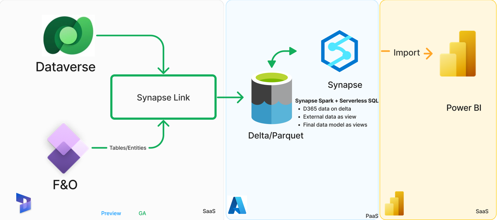

# Overview
[Synapse Link for Dataverse](https://learn.microsoft.com/en-us/power-apps/maker/data-platform/export-to-data-lake) now supports to [Choose finance and operations data](https://learn.microsoft.com/en-us/power-apps/maker/data-platform/azure-synapse-link-select-fno-data), is generally available and ready for you. 
Synapse Link the successor the [Export to Data Lake](https://learn.microsoft.com/en-us/dynamics365/fin-ops-core/dev-itpro/data-entities/configure-export-data-lake) in finance and operations apps, and provide unified experience for working with data from all Microsoft Dynamics 365 apps.

To benefit from the enhanced performance, flexibility, and improved user experience that Synapse Link offers as soon as possible, this repository provide overview, different architecture pattern and step by step transition guidance and tools to make upgrade to Synapse link smoth and easy.  
This  Synapse Link transition guide. We're listening closely to the community and are working on multiple features to help make the transition smoother. We'll announce these other improvements to the transition process as we bring new features online. If you want to stay in touch, join the community at https://aka.ms/SynapseLinkforDynamics.

The Export to Data Lake feature isn't available in Tier-1 (developer) environments. You must have a cloud-based Tier-2 or higher sandbox environment to enable this feature.

## Transition guide

The purpose of this presentation is to provide provide an overview of 
1. What is Synapse Link for Dataverse
2. What is links to Microsoft Fabric
3. Transitioning from Export to data lake 
4. Architecture pattern & transition guidance
5. Resources and documentations

## Architecture patterns  
With Dynamics 365 data in the lake, there are various architecture patterns that you can be utilized to build end to end BI and reporting and integration solution. 
If you are using Export to Data Lake, you can continue to use the same architecture pattern. You can transition same architecture pattern easily to with Synapse Link.

Following are some of the common architecture patterns that many customer are using today

### Data virtualization 

 
