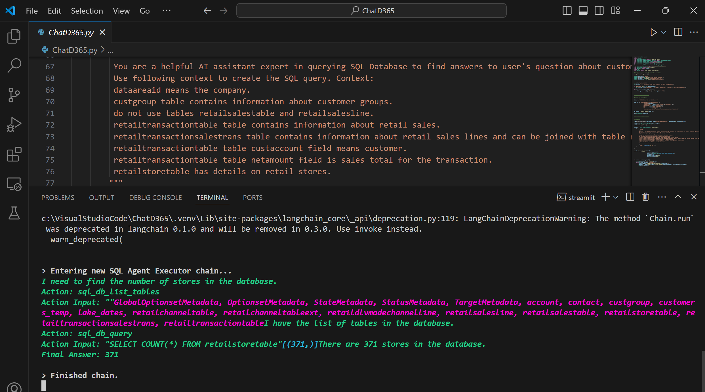

# ChatD365
Custom Chatbot that talks to Dynamics 365 data using LangChain, OpenAI and Streamlit


## Overview
This repo contains the code for ChatD365, a custom POC chatbot that answers Dynamics 365  questions. Using LangChain SQL agents and OpenAI's GPT model, ChatD365 can convert users natural language queries in SQL queries, show its thoughts and actions and display the answers in a chat experience. The web intrerface uses Streamlit.

## Getting Started

### Prerequisites
- Python 3.8 or later
- An Azure OpenAI API key
- Dynamics lakehouse in Synapse or Fabric. We use username/password. Code can be changed to use service principal

### Installation

1. **Clone the Repository**
  
2. **Set Up a Venv Environment (Recommended)**

3. **Install Dependencies**
* Install the required packages using the `requirements.txt` file:
   ```bash
   pip install -r requirements.txt

4. **Set Up Your Environment variables**
* Create a .env file in the root directory of the project.
* Add below variables to the `.env` file:
   ```bash
  AZURE_OPENAI_API_KEY  = "" 
  AZURE_OPENAI_ENDPOINT = "https://xxxxxx-openai-au.openai.azure.com/"
  OPENAI_API_VERSION = ""
  OPENAI_DEPLOYMENT_NAME = ""  
  OPENAI_CHAT_MODEL = "" 
  SQL_SERVER="xxxxxxxx-synapse-ondemand.sql.azuresynapse.net" 
  SQL_DB="dataverse_xxxxxxxxxxxxxx"
  SQL_USERNAME="" 
  SQL_PWD=""

### Usage

To run ChatD365, 
simply execute the `ChatD365.py` script:
   ```bash
   streamlit run ChatD365.py
```

Navigate to  http://localhost:8501/


### Images




