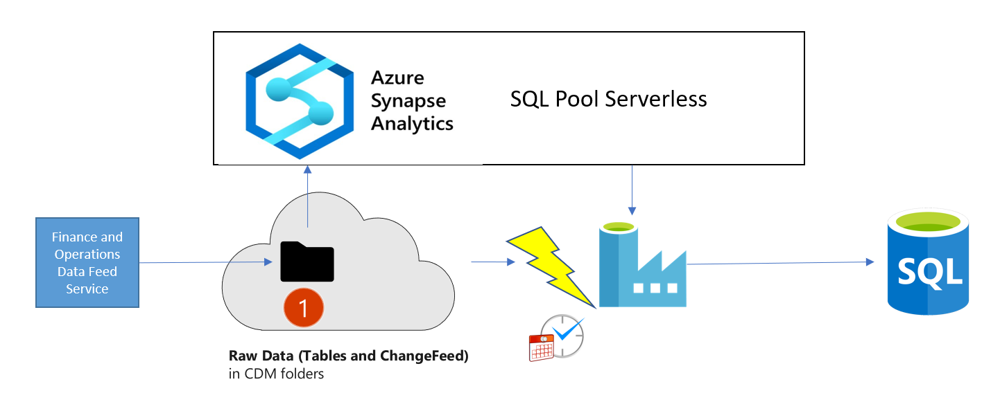

# Synapse To SQL Incremental Data Integration 
## Overview

## Steps 
1. Export Finance and Operations Apps Tables data to Data Lake  
2. Create Synapse Workspace
3. Execute SQL Script SynapseToLake_SourceSetupScript.sql at Source Synapse workspace to create database and credentials and artifacts
4. Run Console Application and create views for Tables (in dbo schema) and ChangeFeed files( CDC schema)  https://github.com/microsoft/Dynamics-365-FastTrack-Implementation-Assets/tree/master/Analytics/CDMUtilSolution#option-1---cdmutil-console-app
5. Prepare and notedown Source synapse database connectionString 
6. Identify destination database connectionString 
7. Connect to Destination database and run SynapseToSQL_DestSetupScript.sql script 
8. Deploy Data Factory ARM Template

## Deploy Data Factory ARM Template
1. Download the [ARM template file](SynapseToSQL_TemplateForDataFactory.json) to your local directory.
2. Click [Template deployment] https://ms.portal.azure.com/#create/Microsoft.Template
3. Click build your own template in the editor option
4. Click load file and locate the ARM template file TemplateForDataFactory.json and click Save.
5. Provide required parameters and review + create.

## Execute pipeline 
1. Validate source and destination SQL connections 
2. Validate triggers and enable and publish 
3. Trigger full export of table manually or via trigger 
4. Validate incremental export trigger  
