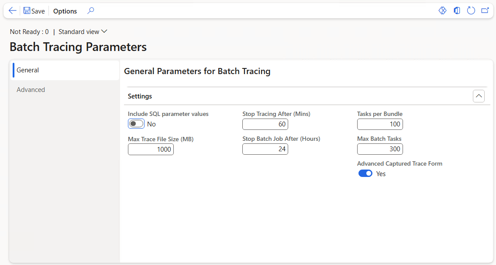

# Batch Tracing Tool
The batch tracing tool provides enhanced functionality for capturing traces during batch processing. 

It supports single to multi-server batch setups. This document describes how to install and use the tool. 

## Revision History
v1.0 - Initial Release

v1.1 - Added enhanced captured traces form

## Disclaimer
This application is freeware and is provided on an "as is" basis without warranties of any kind, whether express or implied, including without limitation warranties that the code is free of defect, fit for a particular purpose or non-infringing.  The entire risk as to the quality and performance of the code is with the end use.
## Installation
Under the Metadata folder download the **SABatchTracing** folder and copy into your **PackagesLocalDirectory** folder (Cloud Hosted Environments) or for UDE (Unified Developer Experience) to the custom metadata folder you specified. 

If you wish you can then also copy the **SABatchTracing** Visual Studio solution and project files from the **Project** folder to your repos folder.

Build and deploy as per your normal release processes.
##  How it Works
The tracing tool is built upon the same framework as the interactive tracing you are familiar with for client traces, however it relies on a batch job to start and stop the traces. 

Due to the batch priority scheduling framework, there is no way to force batch task on each server. To address this, the tracing batch job generates a large number of batch tasks to increase the likelihood of execution on each batch server. Once a tracing task is active on a server, any additional tasks assigned to that server will terminate immediately.

Initially, a bundle of tasks is started. If any batch servers have not picked up a tracing task after this initial bundle, the batch job will create additional bundles of tasks. Once the maximum number of tasks is reached, no further tasks will be created. It is expected that all batch servers will start the tracing task within a few bundles. The bundle size and maximum number of tasks can be configured in the parameters form (see details later in this document).

> [!NOTE]  
> The batch job running does not necessarily indicate that a trace is active. The tracing tasks periodically poll a table to check whether a tracing request has been set to start or stop. 

## Usage
From the Microsoft D365 Finance and Operation click on; **Help and Support (?) > Trace > Batch Tracing**

The **Batch Tracing** form will open. 

### Starting Tracing
Before you can start a trace, you need to start the **Tracing Batch Job**. To do this select the **Batch Tracing  Menu > Start Batch Tracing Batch Job**.

Once the batch job has started, the status will change from **Not Ready** to **Stopped**
> [!NOTE]  
> The status may take some time to change to **Stopped** after the batch job starts, depending on the number of batch servers configured.

With the status in a **Stopped** state, select the **Batch Tracing > Menu Start Tracing**.

This will update the status to **Start Requested**, and shortly after the status will change to **Starting** then **Started** or **Partially Started**. 

> [!NOTE]  
> **Partially Started** indicates that the trace task could not be initiated on some of the batch servers. Refer to the troubleshooting section below for guidance on how to address this issue.

You can refresh the form while the trace is running to see the status and file size.

> [!NOTE]  
> If there is more than one batch server then the file size shown is the average of the traces over the servers.

### Stopping Tracing
You can stop a started or partially started trace by selecting **Batch Tracing  Menu > Stop Tracing**.

This will update the status to **Stop Requested**, and shortly after the status will change to **Stopping** then **Uploading** then **Stopped**.

You can refresh the form while the trace is running to see the status and file size. 
> [!NOTE]  
> If there is more than one batch server then the file size shown is the average of the traces over the servers.

See example below, the trace is stopped and you can note the start and stop times and the average file size:

### Downloading Traces
Completed traces can be viewed and downloaded from: **Batch Tracing  Menu > Captured Traces** or **Help and Support (?) > Trace > Captured Traces**.

> [!NOTE]  
> A trace file will be created for every batch server that is running the tracking task. 

The example below shows the **Advanced Captured Traces** form (see General Parameters for Batch Tracing on how to enable this form), you can see for a capture run, 6 traces were created as the environment had 6 batch servers:

You can select single or multiple traces to delete or download. If you select multiple traces, these will be compressed into a single Zip file for download. 

### Starting and Stopping the Tracing Batch Job
The batch tracing tool relies on a batch job to start and stop the traces, see notes in the **How it Works** section. This batch job must be running before you can start and stop traces. 

To start the batch job: **Batch Tracing  Menu > Start Batch Tracing Batch Job**

To stop the batch job: **Batch Tracing  Menu > Stop Batch Tracing Batch Job**

> [!NOTE]  
> Starting the batch job does not start a trace; it simply sets up the mechanism on the batch servers to start and stop traces as needed.

Once you have finished tracing and no longer require to capture any more traces, then you can stop the batch job.

### Parameters
There are several parameters that can be set for the batch tracing. To open the parameters form **Batch Tracing  Menu > Batch Tracing Parameters**.

The parameters are outlined below:
 
#### General Parameters for Batch Tracing

 - Include SQL parameter values: As per the client tracing, will capture SQL parameter values in the trace.
 - Stop Tracing After (Mins): The trace will stop after the specified time set here.
 - Max Trace File Size (MB): The trace will stop once the specified file size is reached.
 > [!NOTE]  
 > The trace will stop when either the file size or the time limit is reached, whichever occurs first. 

 - Stop Batch Job After (Hours): This will automatically stop the batch tracing job after the specified number of hours, which can be helpful if you forget to stop the job manually.
 - Tasks per Bundle: Specify the number of tasks per bundle that will be created in the batch job. Once a tracing batch task is executing on each batch server, no additional bundles will be necessary.
 - Max Batch Tasks: To prevent the batch job from continuously generating batch tasks, it will stop once this maximum value is reached.
 - Advanced Captured Trace Form: Enables an enhanced version of the captured traces form to allow for multiple selection of traces to delete or download. 
#### Advanced Parameters for Batch Tracing

 - Min Trace File Size Limit (MB): Information only, not adjustable. 
 - Max Trace File Size Limit (MB): Information only, not adjustable.
 - Default Trace File Size (MB): Information only, not adjustable.
 - Delay between bundles (Secs): This is the delay between bundles of tasks being created. 
 - Polling for Start/Stop (Secs): This is the polling frequency for the batch tasks to check when tracing is started or stopped.
 - Scheduling Priority is overridden: Set this on to override the default scheduling priority for the tracing batch job.
 - Scheduling Priority: If **Scheduling Priority is overridden** is enabled, you can adjust the priority to one of the following options: Low, Normal, High, Critical, or Reserved Capacity. This feature can be useful if you have other batch jobs running and need to ensure that the batch tracing job executes. For reserved capacity see: [Priority-based batch scheduling - Set the batch reserved capacity level](https://learn.microsoft.com/en-us/dynamics365/fin-ops-core/dev-itpro/sysadmin/priority-based-batch-scheduling#set-the-batch-reserved-capacity-level)
 - Reset All Setting: If you are experiencing issues with the tracing statuses not updating, you can click this button to reset the tracing data and parameters. 
> [!NOTE]  
> A check is performed to ensure that the tracing batch job is stopped before the **Reset All Settings** option can be executed.
 

## Troubleshooting
### Statuses not Updating
Issue: You find that the statues are not updating as expected in the batch tracing form.

Solution: Stop (if running) the batch tracing job. Go into Batch Tracing Parameters, and in the Advanced tab, click Reset All Settings
### Partially Started Status
Issue: After stating the trace, you find that the status in the batch tracing form only shows Partially Started.

Cause: There can be a couple of causes for this: 
 - A batch server couldn’t start a batch tracing task as it was busy with other tasks.
 - There are old servers still referenced in the Server Configuration for. This issue only occurs if you’ve migrated from D365 On-Premises (LBD), imported data from a development environment or have upgraded from AX 2012.
   
Solutions:
 - Increase the maximum number of tasks, this can be set in the Batch Tracing Parameters in **Max Batch Tasks**
 - Change the priority scheduling. In the Batch Tracing Parameters, on the Advanced tab, turn on the ** Scheduling Priority is overridden** and set the priority in the dropdown to high, critical or reserved capacity. 
 - Check for redundant old servers in the Server Configuration form: Go to – System Administration > Setup > Server configuration. Remove old LBD, Development or AX2012 AOS servers referenced. After removing the servers, run the Reset All Settings in the batch tracing parameters. 

