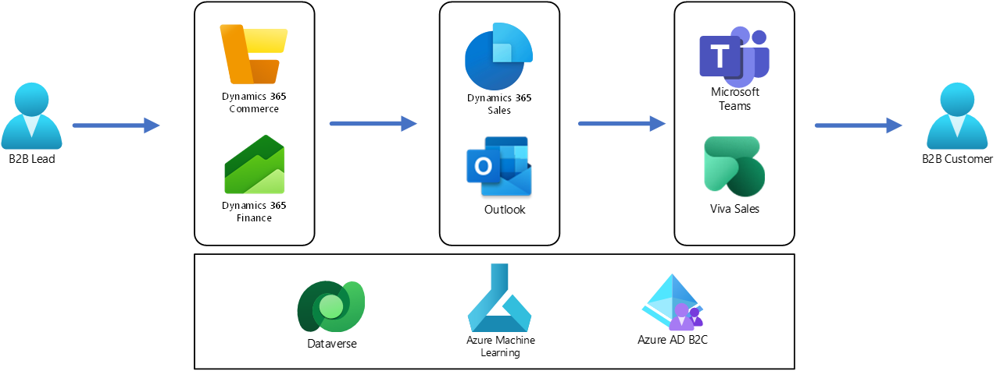

# Better Together – B2B Lead to Cash Experience

This solution combines Dynamics 365 Sales, Dynamics 365 Commerce, Viva Sales and Microsoft Teams to provide a complete B2B Sales experience.

# Architecture

# Dataflow

1.  Customers requests B2B relationship in the Dynamics 365 e-Commerce site.
2.  eCommerce site logs are imported into Dynamics 365 Customer Insights.
 

# Components

-   [Dynamics 365 Commerce](https://dynamics.microsoft.com/commerce/capabilities/) can help retailers to deliver personalized, seamless shopping experiences across physical and digital channels. It’s used here by the end consumer to shop online. It’s also used by the retail merchandizer to create and activate a coupon code.
-   [Dataverse](https://powerplatform.microsoft.com/dataverse/) lets you securely store and manage data that's used by business applications. It’s used here to link customer insights to marketing data.

# Scenario details

The Chief Revenue officer (CRO) wants to increase B2B propects to customers.

Their hypothesis is that prospects need more help before become business partner(customer)

They decide to tackle this challenge with 2 initiatives:

-   Implementing Microsoft Teams chat in Dynamics Sales
-   Using Viva Sales in Dynamics Sales to help with next steps

With personal help from Sales representative and collaboration, they are able to see more customer from B2B E-commerce site .

This showcases how Dynamics 365 Applications - Commerce, Sales, Team, Viva Sales work together seamlessly 

The Chief Revenue Officer is now able to achieve his goal to increase conversion from propects to customer.

# Potential use cases

# Deploying the Scenario

## Pre-requisites

-   Dynamics 365 demo environments 
    - If you do not have demo environment , refer to this page [Get started with a Dynamics 365 free trial](https://dynamics.microsoft.com/dynamics-365-free-trial/)

-   Dyanmics 365 Commerce with E-commerce
    -   Setup guide: [E-commerce site overview - Commerce \| Dynamics 365 \| Microsoft Learn](https://learn.microsoft.com/dynamics365/commerce/online-store-overview)

- Dynamics 365 Sales
- Dual Write
- Viva sales
- Teams
    
## Configuration

### Step 1: 

### Step 2: 

### Step 3:

### Step 4: 

### Step 5: 

