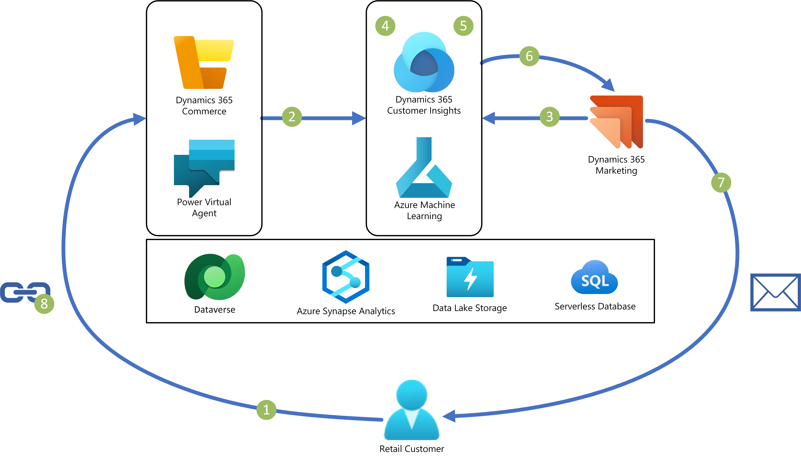
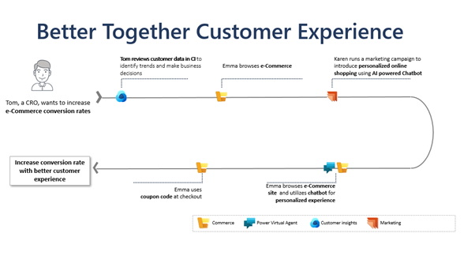

# Better Together – Customer Sales Experience

This solution combines Dynamics 365 Customer insights, Dynamics 365 Marketing, Power Virtual Agent and Dynamics 365 commerce to provide a comprehensive sales experience and provide the best customer experience.

# Architecture

# Dataflow

1.  Customers browse the Dynamics 365 eCommerce site.
2.  eCommerce site logs are imported into Dynamics 365 Customer Insights.
3.  Customers from Dataverse are unified with other data sources in Customer Insights.
4.  Customer Insights links site logs to customers as activities.
5.  Segments are defined in Customer Insights based on business requirements.
6.  Segments are exported from Customer Insights to Dynamics 365 Marketing.
7.  Dynamics 365 Marketing creates and sends marketing emails to segment customers.
8.  Customers interact with the email and browse the eCommerce site.

# Components

-   [Dynamics 365 Customer Insights](https://dynamics.microsoft.com/ai/customer-insights/audience-insights-capability) transforms your customer data to drive understanding, reveal actionable insights, and personalize connected customer experiences. It’s used here to unify, segment, and enrich customer data.
-   [Azure Synapse Analytics](https://azure.microsoft.com/services/synapse-analytics) is an analytics service that brings together data integration, enterprise data warehousing, and big data analytics. It's used here for data ingestion, storage, and processing.
-   [Azure Data Lake Storage](https://azure.microsoft.com/services/storage/data-lake-storage) provides a massively scalable and secure data lake for your high-performance analytics workloads. It’s used here to move data from Dynamics 365 Commerce to Azure Synapse.
-   [Dynamics 365 Commerce](https://dynamics.microsoft.com/commerce/capabilities/) can help retailers to deliver personalized, seamless shopping experiences across physical and digital channels. It’s used here by the end consumer to shop online. It’s also used by the retail merchandizer to create and activate a coupon code.
-   [Dynamics 365 Marketing](https://dynamics.microsoft.com/marketing/capabilities/) helps you unify your customer information, providing marketing automation features, and allowing you to create personalized event-triggered marketing campaigns. It’s used here to create a campaign that sends emails to target customers, giving them coupon code and inviting them to buy from the online channel.
-   [Power Virtual Agent](https://powervirtualagents.microsoft.com/) (PVA) lets you create powerful AI-powered chatbots for a range of requests—from providing simple answers to common questions to resolving issues requiring complex conversations. Here, PVA is used on the online channel to help consumers have a better shopping experience and get all the information they need before they buy a product.
-   [Dataverse](https://powerplatform.microsoft.com/dataverse/) lets you securely store and manage data that's used by business applications. It’s used here to link customer insights to marketing data.

# Scenario details

The Chief Revenue officer (CRO) reviews the sales numbers after the first month of site launch and they are not as high as he was expecting. He connects with his sales analyst who leverages the Dynamics Customer Insights tools to dig into the data to understand what could be happening.

Their hypothesis is that the site may not be providing enough detailed information about these products to allow a customer to feel confident in their purchases.

They decide to tackle this challenge with 2 initiatives:

-   Implementing a Power Virtual Agent chatbot on the site which will help customers who are stuck to get to the next level of engagement. Customers can engage with a virtual assistant to get additional product questions answered and get the information they need to make a final purchase.
-   Create a targeted marketing campaign for a segment of customers who fall into a behavior of dwelling but not buying. A marketing journey designed in Dynamics 365 Marketing to send E-commerce site visitors a follow-up email with a 20% off promotion to encourage them to complete their purchase.

With this marketing campaign, sales increased from site visitors who left originally without placing an order. Data showed that a majority of those customers utilized the chatbot before making a purchase.

This showcases how Dynamics 365 Applications - Commerce, Power Virtual Agent, Customer Insights, and Marketing work together seamlessly to provide more personalized shopping experience to e-Commerce customers.

The Chief Revenue Officer is now able to achieve better customer experience and increase conversion rates and revenue.

# Potential use cases

This solution was created to provide a better sales experience for online customers. It can be applied in industries like retail, financial services, manufacturing, and health care. It can be used by any organization that wants to bring Dynamics 365 apps together to analyze customer data across systems to improve their customer experience.

You can use this solution to:

-   Gain better insights from your customer data.
-   Target prospects to convert them to customer.
-   Provide personalized and in-store-like experience for online customers.
-   Run targeted promotions that are aimed at customer retention or upselling.

# Deploying the Scenario

## Pre-requisites

-   Dynamics 365 demo environments 
    - If you do not have demo environment , refer to this page [Get started with a Dynamics 365 free trial](https://dynamics.microsoft.com/dynamics-365-free-trial/)

-   Dyanmics 365 Commerce with E-commerce
    -   Setup guide: [E-commerce site overview - Commerce \| Dynamics 365 \| Microsoft Learn](https://learn.microsoft.com/dynamics365/commerce/online-store-overview)
    -   Power Virtual Agent embed in E-commerce: [Commerce Chat with Power Virtual Agents module - Commerce \| Dynamics 365 \| Microsoft Learn](https://learn.microsoft.com/dynamics365/commerce/chat-module-pva)
-   Dynamics 365 Marketing
    -   Setup guide: [Get started with Marketing app setup (Dynamics 365 Marketing) \| Microsoft Learn](https://learn.microsoft.com/dynamics365/marketing/get-started)
-   Omnichannel customer service
    -   [Commerce Chat with Omnichannel for Customer Service module - Commerce \| Dynamics 365 \| Microsoft Learn](https://learn.microsoft.com/dynamics365/commerce/commerce-chat-module)
-   Dynamics 365 Customer Insights
    -   [Get started with Dynamics 365 Customer Insights - Dynamics 365 Customer Insights \| Microsoft Learn](https://learn.microsoft.com/dynamics365/customer-insights/get-started)
    -   [Connect to data in a Microsoft Dataverse managed data lake - Dynamics 365 Customer Insights \| Microsoft Learn](https://learn.microsoft.com/dynamics365/customer-insights/connect-dataverse-managed-lake)

## Configuration

### Step 1: Import site logs into Dynamics 365 Customer Insights

1.  Export your site logs to a csv file.
     
     Use Microsoft clarity/Google tag manager to get site logs from E-commerce site.
2.  Import csv file (sessions data) using Power query to customer Insights.

     Power Query offers many different data source options and inline data transformation. It is a great option for bringing in data from external systems. In our scenario, we used Power Query to import cookies data from the E-commerce site.

### Step 2: Unify Customers in Dynamics 365 Customer Insights

[Connect to data in a Microsoft Dataverse managed data lake - Dynamics 365 Customer Insights \| Microsoft Learn](https://learn.microsoft.com/dynamics365/customer-insights/connect-dataverse-managed-lake#connect-to-a-dataverse-managed-lake)

### Step 3: Define Measure(s) and Segments in Customer Insights

This documentation page explain how to define segment [Build segment in Customer Insights](https://learn.microsoft.com/dynamics365/customer-insights/segments?tabs=b2c)

### Step 4: Export Segment from CI to Marketing

This documentation page explains how to [Use segments from Dynamics 365 Customer Insights (Dynamics 365 Marketing) \| Microsoft Learn](https://learn.microsoft.com/dynamics365/marketing/customer-insights-segments)

### Step 5: Create Customer Journey in Marketing

This documentation page explains how to [Create a simple customer journey (Dynamics 365 Marketing) \| Microsoft Learn](https://learn.microsoft.com/dynamics365/marketing/create-simple-customer-journey)

### Step 6: Create a Topic for the Power Virtual Agent

This documentation page explains how to create topics for the PVA chatbot.

[Use topics to design a chatbot conversation - Power Virtual Agents \| Microsoft Learn](https://learn.microsoft.com/power-virtual-agents/authoring-create-edit-topics)

# Demo Video

This video showcases how Dynamics 365 applications(Commerce,Power Virtual Agent, Customer Insights,Marketing) connects seamlessely to provide better shopping experience to our customers.
[Dynamics 365 Sales Experience Video](https://aka.ms/Dynamics365SalesExperienceVideo)

## Additional reference topics

**E-comm with Omnichannel for customer service –** Commerce chat with Omnichannel can be transferred to agent if user want to ask more personalized queries. It provides omnichannel view of customers within CE application to help answer customer specific information. Chat experience is full embedded in our E-Commerce site and works seamlessly between pages.

-   Prerequisites for Omnichannel for Customer Service
    -   Configure chat in the Omnichannel for Customer Service Administration widget and embed parameters within E-comm site. For instructions, see [Configure a chat channel](https://learn.microsoft.com/dynamics365/customer-service/set-up-chat-widget).
-   Steps:
    -   Configure the Commerce chat experience for your e-commerce site
    -   Add Commerce headquarters as an application tab for Omnichannel for Customer Service
    -   Enable a new application tab for customer agents in Dynamics 365 Omnichannel for Customer Service
    -   Add context variables in Dynamics 365 Omnichannel for Customer Service
    -   Update Content Security Policy (CSP) in site builder
    -   Integrate PVA with Commerce Site : [Commerce Chat with Power Virtual Agents module - Commerce \| Dynamics 365 \| Microsoft Learn](https://learn.microsoft.com/dynamics365/commerce/chat-module-pva)

[For detailed steps, see Commerce Chat with Omnichannel for Customer Service module - Commerce \| Dynamics 365 \| Microsoft Learn](https://learn.microsoft.com/dynamics365/commerce/commerce-chat-module)
