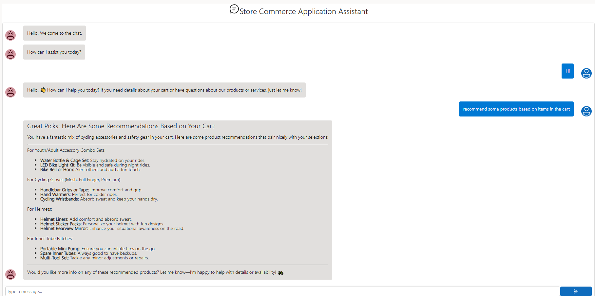

# Chat Assistant - Store Commerce App

Sample for Chat based Store Commerce Assistant within the Dynamics 365 Store Commerce App.

## Overview

The Chat Store Commerce Assistant enables store associates and customers to interact with the Dynamics 365 Store Commerce App using natural language, improving customer service and operational efficiency. This sample demonstrates how to integrate a chat UI component into the Store Commerce application using React components and TypeScript.



## Architecture

The chat UI implementation consists of several key components:

### Frontend Components (POS)

- **React Chat Components**: Modern UI components built with React and Fluent UI
- **TypeScript Views**: Store Commerce view controllers and view models
- **Operations**: Custom operations for handling chat requests

### Backend Components (Commerce Runtime)

- **AI Agent Controller**: REST API controller for handling chat requests
- **AI Agent Service**: Business logic for processing chat interactions
- **Message Models**: Request/response models for chat communication

## Project Structure

```
ChatStoreCommerceApp/
├── POS/                                    # Point of Sale frontend components
│   ├── Views/                             # Store Commerce views
│   │   ├── ChatView.html                  # Chat view HTML template
│   │   ├── ChatView.ts                    # Chat view controller
│   │   └── ChatViewModel.ts               # Chat view model
│   ├── Operations/                        # Custom operations
│   │   ├── ChatOperationRequest.ts       # Operation request model
│   │   ├── ChatOperationRequestFactory.ts # Request factory
│   │   ├── ChatOperationRequestHandler.ts # Request handler
│   │   └── ChatOperationResponse.ts       # Operation response model
│   ├── SrcReact/                          # React components source
│   │   ├── ReactComponents/               # Chat UI components
│   │   │   ├── ChatComponent.tsx          # Main chat component
│   │   │   ├── ChatHeader.tsx             # Chat header component
│   │   │   ├── ChatInput.tsx              # Chat input component
│   │   │   ├── ChatMessages.tsx           # Chat messages display
│   │   │   ├── ChatStyles.ts              # Styling definitions
│   │   │   ├── IMessage.ts                # Message interface
│   │   │   ├── IViewModelChat.ts          # Chat view model interface
│   │   │   ├── MarkdownRenderer.tsx       # Markdown rendering
│   │   │   └── RenderChat.tsx             # Chat renderer
│   │   ├── babel.config.json              # Babel configuration
│   │   ├── package.json                   # React dependencies
│   │   ├── tsconfig.json                  # TypeScript configuration
│   │   └── webpack.config.js              # Webpack build configuration
│   ├── manifest.json                      # Extension manifest
│   └── POS.csproj                         # POS project file
├── CommerceRuntime/                       # Commerce Runtime backend
│   └── Messages/                          # Message handling
│       ├── AIAgentController.cs           # REST API controller
│       ├── AIAgentService.cs              # AI agent business logic
│       ├── AIClientKernel.cs              # AI client kernel
│       ├── AIMessage.cs                   # AI message model
│       ├── AIResponseGenerator.cs         # Response generation
│       ├── GetChatRequest.cs              # Chat request model
│       ├── GetChatResponse.cs             # Chat response model
│       └── CommerceRuntime.csproj         # Commerce Runtime project file
└── Data/
    └── image.png                          # Documentation image
```

## Creating a Chat UI in Store Commerce App

### Prerequisites

- Dynamics 365 Store Commerce SDK
- Node.js and npm
- Visual Studio or VS Code
- TypeScript knowledge
- React development experience

### Setup

- Clone the repository.

- Copy contents into your POS extension folder.

Refer to my earlier blog post on Enhancing Dynamics 365 Store Commerce App with React and Fluent UI

## Key Features

### 1. Real-time Chat Interface

- Modern React-based UI with Fluent UI components
- Real-time message display and user input
- Markdown rendering support for rich responses

### 2. Store Commerce Integration

- Custom operations for chat functionality
- Integration with Store Commerce APIs
- Access to cart and customer data

### 3. AI-Powered Responses

- Configurable AI backend integration
- Support for various AI services
- Context-aware responses based on store data

### 4. Extensible Architecture

- Modular component design
- Easy to customize and extend
- Support for additional features

## Customization Options

### Styling

Modify `ChatStyles.ts` to customize the appearance:

- Colors and themes
- Layout and spacing
- Typography and fonts

### Functionality

Extend the chat capabilities by:

- Adding new message types
- Implementing file upload
- Adding voice input/output
- Integrating with external services

### AI Integration

Customize the AI backend by:

- Modifying `AIAgentService.cs`
- Adding new AI providers
- Implementing custom prompts
- Adding context from Store Commerce data

## Resources

- [POS Extension](https://learn.microsoft.com/en-us/dynamics365/commerce/dev-itpro/pos-extension/pos-extension-overview)
- [Resposible AI Overview](https://learn.microsoft.com/en-us/dynamics365/commerce/responsible-ai/responsible-ai-overview)
