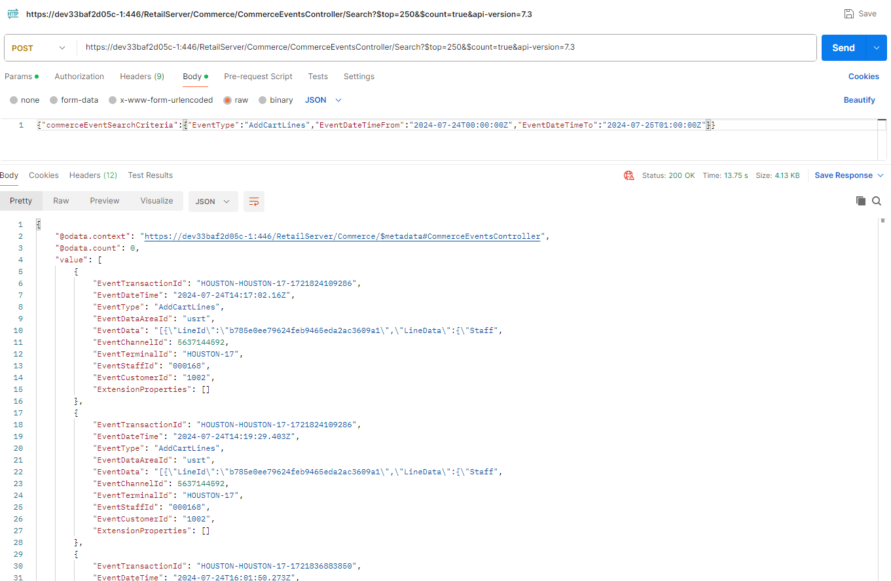

# Dynamics 365 Commerce and Customer Insights Integration Sample

## Table of Contents
1. [Introduction](#introduction)
2. [How It Works](#how-it-works)
3. [Getting Started](#getting-started)
   - [Prerequisites](#prerequisites)
   - [Quick Setup](#quick-setup)
4. [Repository Contents](#repository-contents)
   - [Code and Configuration](#code-and-configuration)
   - [Documentation](#documentation)
5. [High-Level Architecture (Enterprise Approach)](#high-level-architecture-enterprise-approach)
   - [Key Components](#key-components)
   - [Integration Flow](#integration-flow)
   - [Architecture Diagram](#architecture-diagram)
6. [Alternative: Citizen Developer Approach](#alternative-citizen-developer-approach)
   - [Dataverse Integration Diagram](#dataverse-integration-diagram)
7. [Sample API Call for CSU Events](#sample-api-call-for-csu-events)
   - [Event Schema](#event-schema)

---

## Introduction

This repository offers a sample implementation for integrating **Dynamics 365 Commerce** with **Dynamics 365 Customer Insights Journeys (CIJ)** or third-party systems using an event-based architecture. This integration facilitates real-time customer interactions based on commerce activities, enhancing personalization and engagement.

### Intended Audience

This documentation is tailored for **developer-level** professionals who possess experience with **Dynamics 365 Commerce** and **Azure integration development**. It assumes familiarity with Azure services, Dynamics 365 environments, and integration patterns commonly used within these platforms

### Integration Approaches

The solution demonstrates two distinct approaches:

1. **Enterprise Approach**: Utilizes Azure middleware to achieve scalable and reliable integration suitable for large organizations with complex needs.
2. **Citizen Developer Approach**: Leverages **Dataverse Business Events** to enable quick, low-code workflows ideal for users with minimal technical expertise.

---

## How It Works

The integration enables external applications to respond to Commerce events such as `AddCartLines`, `Checkout`, and more. The workflow involves:

- **Polling CSU Events**: Retrieving events from the Commerce Scale Unit (CSU) using APIs.
- **Storing Events**: Persisting events in **Azure Cosmos DB** to ensure data durability and prevent duplication.
- **Processing Events**: Utilizing **Azure Logic Apps** to trigger customer interactions based on the events.

---

## Getting Started

### Prerequisites

- **Azure Subscription**: Access to Azure Functions, Cosmos DB, Service Bus, and Logic Apps.
- **Dynamics 365 Commerce Environment**: Access to CSU APIs for event retrieval.
- **Technical Knowledge**: Basic familiarity with Azure services and Dynamics 365 environments.

---

## Repository Contents

### Code and Configuration

- **Azure Function (PollCSUEvents)**: Polls CSU for events, processes them, and queues them for further handling.
- **Logic App (SendCheckoutEvent)**: Processes events and integrates with CIJ to trigger customer journeys.
- **Sample API Calls**: Demonstrates how to interact with the CSU API to fetch events.

### Documentation

Comprehensive guides for setup, deployment, and extending the solution:

- [Commerce Event Framework](../Docs/commerce_event_framework.md)
- [Azure Function App](../Docs/azure_function_app.md)
- [Azure Cosmos DB](../Docs/azure_cosmos_db.md)
- [Azure Service Bus](../Docs/azure_service_bus.md)
- [Azure Logic App](../Docs/azure_logic_app.md)

---

## High-Level Architecture (Enterprise Approach)

The enterprise-grade architecture leverages Azure services to manage events from CSU and integrate them into Customer Insights Journeys or other platforms, ensuring scalability and reliability.

### Key Components

- **Dynamics 365 Commerce**: Source of commerce events such as orders and cart updates.
- **Commerce Scale Unit (CSU)**: Provides APIs to expose commerce events for integration.
- **Azure Services**:
  - **Azure Functions**: Poll CSU events periodically.
  - **Azure Cosmos DB**: Stores processed events to prevent duplication.
  - **Azure Service Bus**: Queues events for downstream processing.
  - **Azure Logic Apps**: Manages customer record verification and triggers journeys.
- **Customer Insights Journeys (CIJ)**: Destination platform for orchestrating customer communications.

### Integration Flow

1. **CSU Events Generation**: Commerce events (e.g., `AddCartLines`) are generated and logged in CSU.
2. **Event Polling**: **Azure Functions** periodically fetch these events via CSU APIs.
3. **Event Persistence**: Fetched events are stored in **Azure Cosmos DB**.
4. **Message Queueing**: Stored events are sent to **Azure Service Bus** for further processing.
5. **Customer Interaction**:
   - **Azure Logic Apps** processes the queued events.
   - Identifies existing contacts in Dynamics 365 or creates new ones as needed.
   - Triggers corresponding customer journeys in **CIJ**.

### Architecture Diagram

*Figure 1: Enterprise Integration Architecture*

---

## Alternative: Citizen Developer Approach

For simpler integration scenarios, the **Dataverse Business Events** approach allows citizen developers to create event-driven workflows with minimal coding using **Power Automate** or other tools. This approach is ideal for users who require quick setup without extensive technical resources.

### Features

- **Dataverse Business Events**: Triggers workflows based on specific actions in Dynamics 365 Commerce.
- **Low-Code Integration**: Utilize tools like **Power Automate** to design workflows without deep technical knowledge.
- **Flexibility**: Supports various integrations with minimal setup.

### Dataverse Integration Diagram

*Figure 2: Citizen Developer Integration Approach*

---

## Sample API Call for CSU Events

External systems can retrieve events from the CSU using the provided API. Below is an example of how to fetch events:

*Figure 3: Sample API Call to CSU Events*

### Event Schema

The following are example payloads for `AddCartLines` and `Checkout` events:

- **AddCartLines Event Payload**:
  - [Insert AddCartLines JSON payload here]

- **Checkout Event Payload**:
  - [Insert Checkout JSON payload here]
