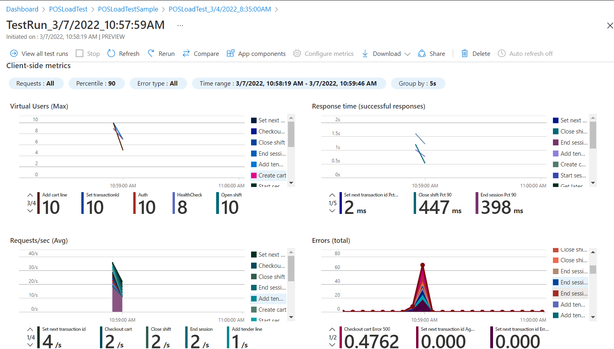

#POS load test sample[WIP]

### Introduction

This is a sample to perfom point of sale api load testing with [Azure load testing service](https://docs.microsoft.com/en-us/azure/load-testing/overview-what-is-azure-load-testing).For more details refer to [Techtalk setting up Dynamics 365 Commerce Performance Testing(POS,eCommerce)](https://community.dynamics.com/365/dynamics-365-fasttrack/b/techtalks/posts/part-5-performance-testing-setting-up-dynamics-365-commerce-performance-test-pos-ecommerce-may-16-19-2022).

### Pre-requisites

1. Download Apache Jmeter
2. Azure subscription

###Configuration

1. Identify the CSU(commerce scale unit) url
2. Prepare the devices and capture the device tokens.For example populate 100 devices in Dynamics 365 HQ if you are planning to simulate 100 devices. Device token can be obtained by using browser dev tools or fiddler.
3. Prepare the products to be used during the pos checkout
4. Modify and finalize the jmeter script and complete the unit test with Apache Jmeter
5. [Create azure load test resource](https://docs.microsoft.com/en-us/azure/load-testing/quickstart-create-and-run-load-test)
6. [Create load test](https://docs.microsoft.com/en-us/azure/load-testing/how-to-create-and-run-load-test-with-jmeter-script) with Jmeter script in ./test folder
7. [Configure the test instances](https://docs.microsoft.com/en-us/azure/load-testing/how-to-high-scale-load) in test configuration.

   

8. [Add environment variables](https://docs.microsoft.com/en-us/azure/load-testing/how-to-parameterize-load-tests#envvars). Refer here for [parameterizing](https://docs.microsoft.com/en-us/azure/load-testing/how-to-parameterize-load-tests) load tests.

   

9. [Upload test csv data files from data folder](https://docs.microsoft.com/en-us/azure/load-testing/how-to-read-csv-data?pivots=experience-azp#add-a-csv-file-to-your-load-test)

### Execute

[Run the load test](https://docs.microsoft.com/en-us/azure/load-testing/tutorial-identify-bottlenecks-azure-portal#run-the-load-test-in-the-azure-portal)

[Compare test runs](https://docs.microsoft.com/en-us/azure/load-testing/how-to-compare-multiple-test-runs)

###Monitor and test results

[Export test results and report in third party tools](https://docs.microsoft.com/en-us/azure/load-testing/how-to-export-test-results)

###Troubleshooting

[Troubleshoot load test errors](https://docs.microsoft.com/en-us/azure/load-testing/how-to-find-download-logs)

###Integration
[Automate with github actions](https://docs.microsoft.com/en-us/azure/load-testing/tutorial-cicd-github-actions)
[Identify performance regressions with Azure Load Testing Preview and Azure Pipelines](https://docs.microsoft.com/en-us/azure/load-testing/tutorial-cicd-azure-pipelines)
[Deploying Azure Load Testing Preview in a virtual network (VNET)](https://docs.microsoft.com/en-us/azure/load-testing/concept-azure-load-testing-vnet-injection)

## Contributing

This project welcomes contributions and suggestions. Most contributions require you to agree to a
Contributor License Agreement (CLA) declaring that you have the right to, and actually do, grant us
the rights to use your contribution. For details, visit https://cla.opensource.microsoft.com.

When you submit a pull request, a CLA bot will automatically determine whether you need to provide
a CLA and decorate the PR appropriately (e.g., status check, comment). Simply follow the instructions
provided by the bot. You will only need to do this once across all repos using our CLA.

This project has adopted the [Microsoft Open Source Code of Conduct](https://opensource.microsoft.com/codeofconduct/).
For more information see the [Code of Conduct FAQ](https://opensource.microsoft.com/codeofconduct/faq/) or
contact [opencode@microsoft.com](mailto:opencode@microsoft.com) with any additional questions or comments.
