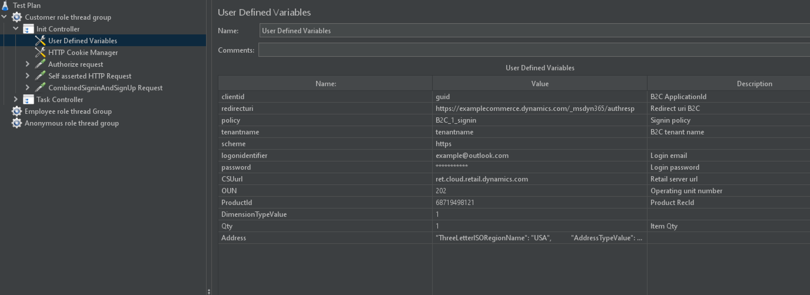
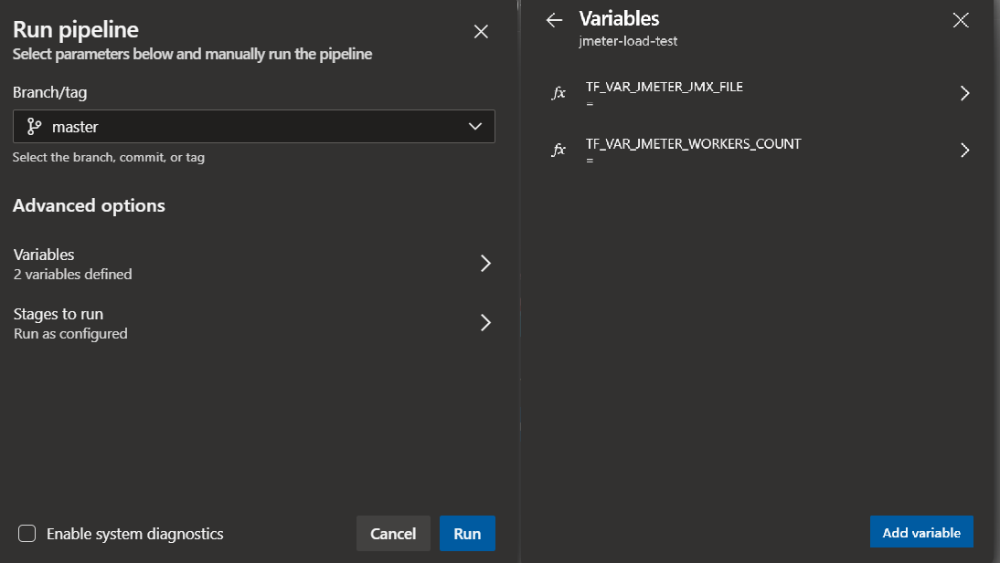
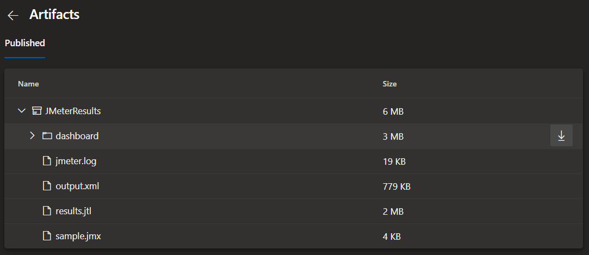

# Ecommerce load Testing Pipeline with JMeter, ACI and Terraform

This project is a Commerce load testing pipeline that leverages [Apache JMeter](https://jmeter.apache.org/) as an open source load and performance testing tool and [Terraform](https://www.terraform.io/) to dynamically provision and destroy the required infrastructure on Azure.

## Commerce perf test suite result


## Key concepts


The flow is triggered and controlled by an [Azure Pipeline](https://azure.microsoft.com/en-us/services/devops/pipelines/) on [Azure DevOps](https://azure.microsoft.com/en-in/services/devops/). The pipeline contains a set of tasks that are organized logically in `SETUP`, `TEST`, `RESULTS` and `TEARDOWN` groups.

| Task group              | Tasks  |
|-------------------------|--------|
| SETUP | <li>Check if the JMeter Docker image exists</li><li>Validate the JMX file that contains the JMeter test definition</li><li>Upload JMeter JMX file to Azure Storage Account File Share</li><li>Provision the infrastructure with Terraform</li> |
| TEST | <li>Run JMeter test execution and wait for completion</li> |
| RESULTS | <li>Show JMeter logs</li><li>Get JMeter artifacts (e.g. logs, dashboard)</li><li>Convert JMeter tests result (JTL format) to JUnit format</li><li>Publish JUnit test results to Azure Pipelines</li><li>Publish JMeter artifacts to Azure Pipelines</li> |
| TEARDOWN | <li>Destroy all ephemeral infrastructure with Terraform</li> |

On the `SETUP` phase, JMeter agents are provisioned as [Azure Container Instance (ACI)](https://azure.microsoft.com/en-us/services/container-instances/) using a [custom Docker image](./docker/Dockerfile) on Terraform. Through a [Remote Testing](https://jmeter.apache.org/usermanual/remote-test.html) approach, JMeter controller is responsible to configure all workers, consolidating all results and generating the resulting artifacts (dashboard, logs, etc).

The infrastructure provisioned by Terraform includes:

* Resource Group
* Virtual Network (VNet)
* Storage Account File Share
* 1 JMeter controller on ACI
* N JMeter workers on ACI

On the `RESULTS` phase, a [JMeter Report Dashboard](https://jmeter.apache.org/usermanual/generating-dashboard.html) and [Tests Results](https://docs.microsoft.com/en-us/azure/devops/pipelines/test/review-continuous-test-results-after-build?view=azure-devops) are published in the end of each load testing execution.

## Prerequisites

You should have the following tools installed:

* Shell
* [Azure CLI](https://docs.microsoft.com/en-us/cli/azure/install-azure-cli?view=azure-cli-latest)
* [Azure DevOps CLI extension](https://docs.microsoft.com/en-us/azure/devops/cli/?view=azure-devops)
* [jq](https://stedolan.github.io/jq/download/)

You should have the following Azure resources:

* [Azure DevOps Project](https://docs.microsoft.com/en-us/azure/devops/organizations/projects/create-project?view=azure-devops&tabs=preview-page)
* [Azure Container Registry (ACR)](https://azure.microsoft.com/en-us/services/container-registry/) with Admin user enabled
* CSU url

## Getting Started

### 1. Importing this repository to Azure DevOps

Log in to Azure through Azure CLI:

```sh
az login
```

> NOTE: Make sure you are using the correct subscription. You can use `az account show` to display what is the current selected one and [`az account set`](https://docs.microsoft.com/en-us/cli/azure/account?view=azure-cli-latest#az-account-set) to change it.

Configure Azure DevOps CLI with your organization/project settings:

```shell
ORGANIZATION_URL=https://dev.azure.com/your-organization
PROJECT_NAME=YourProject

az devops configure --defaults organization=$ORGANIZATION_URL project=$PROJECT_NAME
```

Import this repository on your Azure DevOps project:

```shell
REPOSITORY_NAME=jmeter-load-test
REPOSITORY_URL=https://github.com/Azure-Samples/jmeter-aci-terraform

az repos create --name $REPOSITORY_NAME
az repos import create --git-source-url $REPOSITORY_URL --repository $REPOSITORY_NAME
```

### 2. Configuring Azure credentials

Create an [Azure service principal](https://docs.microsoft.com/en-us/azure/active-directory/develop/app-objects-and-service-principals#service-principal-object):

```shell
SERVICE_PRINCIPAL_NAME=JMeterServicePrincipal

SERVICE_PRINCIPAL=$(az ad sp create-for-rbac --name $SERVICE_PRINCIPAL_NAME)
```

Run the following commands to fill the credentials variables:

```shell
CLIENT_ID=$(echo $SERVICE_PRINCIPAL | jq -r .appId)
CLIENT_SECRET=$(echo $SERVICE_PRINCIPAL | jq -r .password)
TENANT_ID=$(echo $SERVICE_PRINCIPAL | jq -r .tenant)
SUBSCRIPTION_ID=$(az account show | jq -r .id)
SUBSCRIPTION_NAME=$(az account show | jq -r .name)
```

Create an Azure [service connection](https://docs.microsoft.com/en-us/azure/devops/pipelines/library/service-endpoints?view=azure-devops&tabs=yaml) on Azure DevOps:

```shell
SERVICE_CONNECTION_NAME=JMeterAzureConnection

export AZURE_DEVOPS_EXT_AZURE_RM_SERVICE_PRINCIPAL_KEY=$CLIENT_SECRET

SERVICE_ENDPOINT_ID=$(az devops service-endpoint azurerm create --azure-rm-service-principal-id $CLIENT_ID \
                        --azure-rm-subscription-id $SUBSCRIPTION_ID --azure-rm-subscription-name $SUBSCRIPTION_NAME  \
                        --azure-rm-tenant-id $TENANT_ID --name $SERVICE_CONNECTION_NAME | jq -r .id)

az devops service-endpoint update --id $SERVICE_ENDPOINT_ID --enable-for-all true
```

### 3. Creating the Variable Group

Set the following variables according to your Azure Container Registry instance:

```shell
ACR_NAME=
ACR_RESOURCE_GROUP=
```

Run the following commands to create the variable group `JMETER_TERRAFORM_SETTINGS` on Azure DevOps:

```shell
az pipelines variable-group create  --name JMETER_TERRAFORM_SETTINGS --authorize \
                                    --variables TF_VAR_JMETER_ACR_NAME=$ACR_NAME \
                                                TF_VAR_JMETER_ACR_RESOURCE_GROUP_NAME=$ACR_RESOURCE_GROUP \
                                                TF_VAR_JMETER_DOCKER_IMAGE=$ACR_NAME.azurecr.io/jmeter \
                                                AZURE_SERVICE_CONNECTION_NAME="$SERVICE_CONNECTION_NAME" \
                                                AZURE_SUBSCRIPTION_ID=$SUBSCRIPTION_ID
```

### 4. Creating and Running the Docker Pipeline

```shell
PIPELINE_NAME_DOCKER=jmeter-docker-build

az pipelines create --name $PIPELINE_NAME_DOCKER --repository $REPOSITORY_NAME \
    --repository-type tfsgit --branch main \
    --yml-path pipelines/azure-pipelines.docker.yml
```

### 5. Creating the JMeter Pipeline

```shell
PIPELINE_NAME_JMETER=jmeter-load-test

az pipelines create --name $PIPELINE_NAME_JMETER --repository $REPOSITORY_NAME \
    --repository-type tfsgit --branch main --skip-first-run \
    --yml-path pipelines/azure-pipelines.load-test.yml

az pipelines variable create --pipeline-name $PIPELINE_NAME_JMETER --name TF_VAR_JMETER_JMX_FILE --allow-override
az pipelines variable create --pipeline-name $PIPELINE_NAME_JMETER --name TF_VAR_JMETER_WORKERS_COUNT --allow-override
```

### 6. Updating the JMX test definition

APITestEcommerce.jmx contains the series of steps below which are executed when run. It creates and checkouts an ecommerce cart.

(Open jmx file with Jmeter for UI steps)


The JMX file contains a test definition for performing HTTP requests on `azure.microsoft.com` endpoint through the `443` port. You can simply update the it with the test definition of your preference.

Update test plan variables


### 7. Manually Running the JMeter Pipeline

You can choose the JMeter file you want to run and how many JMeter workers you will need for your test. Then you can run the JMeter pipeline using the CLI:

```shell
JMETER_JMX_FILE=sample.jmx
JMETER_WORKERS_COUNT=1

az pipelines run --name $PIPELINE_NAME_JMETER \
                 --variables TF_VAR_JMETER_JMX_FILE=$JMETER_JMX_FILE TF_VAR_JMETER_WORKERS_COUNT=$JMETER_WORKERS_COUNT
```

Or even use the UI to define variables and Run the pipeline:



## Viewing Test Results

JMeter test results are created in a [JTL](https://cwiki.apache.org/confluence/display/JMETER/JtlFiles) file (`results.jtl`) with CSV formatting. A [Python script](https://github.com/Azure-Samples/jmeter-aci-terraform/blob/main/scripts/jtl_junit_converter.py) was created to convert JTL to [JUnit format](https://llg.cubic.org/docs/junit/) and used during the pipeline to have full integration with Azure DevOps test visualization.


Error messages generated by JMeter for failed HTTP requests can also be seen on Azure DevOps.


## Viewing Artifacts

Some artifacts are published after the test ends. Some of them are a static JMeter Dashboard, logs and others.



> You can also download these build artifacts using [`az pipelines runs artifact download`](https://docs.microsoft.com/en-us/cli/azure/ext/azure-devops/pipelines/runs/artifact?view=azure-cli-latest#ext-azure-devops-az-pipelines-runs-artifact-download).

After downloading the dashboard and unzipping it, open `dashboard/index.html` on your browser:


## Pipeline Configuration

All Terraform parameters can be configured using the Variable Group `JMETER_TERRAFORM_SETTINGS`. Please read [JMeter Pipeline Settings](./docs/jmeter-pipeline-settings.md) to know more details about it.

## Limitations

* **Load Test duration**
Please note that for [Microsoft hosted agents](https://docs.microsoft.com/en-us/azure/devops/pipelines/agents/hosted?view=azure-devops#capabilities-and-limitations), you can have pipelines that runs up to 1 hour (private project) or 6 hours (public project). You can have your own agents to bypass this limitation.

* **ACI on VNET regions**
Please note that [not all regions](https://docs.microsoft.com/en-us/azure/container-instances/container-instances-virtual-network-concepts#where-to-deploy) currently support ACI and VNET integration. If you need private JMeter agents, you can deploy it in a different region and use VNET peering between them. Also note that vCPUs and memory limits change based on regions.

## Additional Documentation

* [Implementation Notes](./docs/implementation-notes.md)
* [Adding plugins to JMeter Docker image](./docs/adding-jmeter-plugins.md)
* [JMeter pipeline settings](./docs/jmeter-pipeline-settings.md)
* [Estimating costs](./docs/estimating-costs.md)
* [Integrating with Application Insights](./docs/integrating-application-insights.md)

## External References

* [User Manual: Remote Testing](https://jmeter.apache.org/usermanual/remote-test.html)
* [User Manual: Apache JMeter Distributed Testing Step-by-step](https://jmeter.apache.org/usermanual/jmeter_distributed_testing_step_by_step.html)
* [Azure DevOps CLI reference](https://docs.microsoft.com/en-us/cli/azure/ext/azure-devops/?view=azure-cli-latest)
