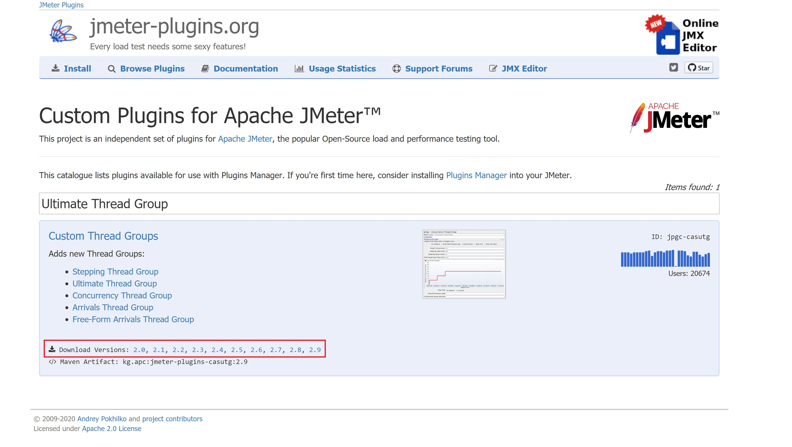

# Adding plugins to JMeter Docker image

JMeter allows the use of custom plugins to improve the load testing experience and execute different load testing scenarios. The [jmeter-plugins.org](https://jmeter-plugins.org/) contains a catalogue with available custom plugins created by the community that can be used with [Plugins Manager](https://jmeter-plugins.org/wiki/PluginsManager/).

By default, this repository uses the [Test Plan Check Tool](https://jmeter-plugins.org/wiki/TestPlanCheckTool/) to automatically check the test plan consistency before running load tests. This validation is done in the load testing pipeline on Azure DevOps to avoid provisioning the infrastructure – VNet + ACI instances – if the JMX file is invalid (e.g. plugins that were not installed on JMeter root folder and invalid test parameters).

Plugins are added on the JMeter Docker container image as you can verify on the `Dockerfile` located on the `docker` folder:

```docker
FROM justb4/jmeter:5.1.1

# https://jmeter-plugins.org/wiki/TestPlanCheckTool/
ENV PLAN_CHECK_PLUGIN_VERSION=2.4
RUN wget https://jmeter-plugins.org/files/packages/jpgc-plancheck-${PLAN_CHECK_PLUGIN_VERSION}.zip
RUN unzip -o jpgc-plancheck-${PLAN_CHECK_PLUGIN_VERSION}.zip -d ${JMETER_HOME}

EXPOSE 1099

ENTRYPOINT ["/entrypoint.sh"]
```

To add new plugins on JMeter, you have to:

1. Access the [jmeter-plugins.org](https://jmeter-plugins.org/) and find the plugin of your preference.
2. Choose the preferred plugin version and copy the download URL.
3. Create a step on `Dockerfile` to download the plugin through `wget`.
4. Create a step on `Dockerfile` to unzip the downloaded plugin on the JMeter root folder.

> Note: Removing the [Test Plan Check Tool](https://jmeter-plugins.org/wiki/TestPlanCheckTool/) installation step on the `Dockerfile` will break the load testing pipeline as it has a task to validate the JMX file. If you want to remove this plugin, update the `azure-pipelines.load-test.yml` by removing the `SETUP: Validate JMX File` step.

Using the [Ultimate Thread Group](https://jmeter-plugins.org/wiki/UltimateThreadGroup/) plugin as an example:



Then new steps are created to add the plugin:

```docker
FROM justb4/jmeter:5.1.1

# https://jmeter-plugins.org/wiki/TestPlanCheckTool/
ENV PLAN_CHECK_PLUGIN_VERSION=2.4
RUN wget https://jmeter-plugins.org/files/packages/jpgc-plancheck-${PLAN_CHECK_PLUGIN_VERSION}.zip
RUN unzip -o jpgc-plancheck-${PLAN_CHECK_PLUGIN_VERSION}.zip -d ${JMETER_HOME}

# https://jmeter-plugins.org/wiki/UltimateThreadGroup/
ENV CUSTOM_PLUGIN_VERSION=2.9
RUN wget https://jmeter-plugins.org/files/packages/jpgc-casutg-${CUSTOM_PLUGIN_VERSION}.zip
RUN unzip -o jpgc-casutg-${CUSTOM_PLUGIN_VERSION}.zip -d ${JMETER_HOME}

EXPOSE 1099

ENTRYPOINT ["/entrypoint.sh"]
```
