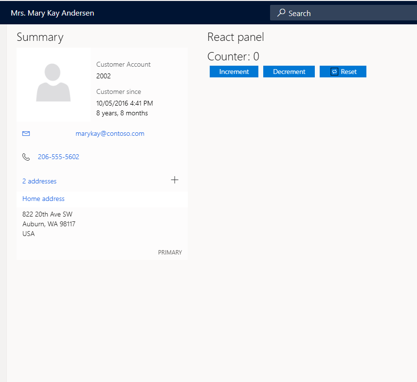

# Enhancing Dynamics 365 Store Commerce with React and Fluent UI

Looking to modernize your Dynamics 365 Store Commerce app with a sleek, responsive user interface? This article guides you through seamlessly integrating React components and Fluent UI into your Store Commerce app to deliver a modern, accessible, and visually consistent experience.

## Why This Matters

The Dynamics 365 Commerce team is evolving the Point of Sale (POS) experience by adopting the React framework alongside Fluent Design. React brings mobile-optimized workflows, simplified extensibility, and broad accessibility support across browsers and all Store Commerce apps. Complementing React, Fluent UI delivers visual clarity and consistency, making the user interface intuitive for users of all abilities and improving accessibility right out of the box.

Together, React and Fluent UI enable you to build modern, scalable, and accessible retail solutions that enhance both usability and developer productivity.

## Introduction

This sample demonstrates how to create and integrate a custom control within the Dynamics 365 Store Commerce app using React and Fluent UI. By following this example, you'll learn how to leverage React's component-based architecture and Fluent UI's design system to build modern, accessible, and visually consistent user interfaces for retail scenarios.

The walkthrough covers the process of developing a React-based control, styling it with Fluent UI components, and embedding it into the Store Commerce app through the extension framework. You'll see how to connect your React control to a specific extension point—such as the Customer Details page—enabling you to deliver rich, interactive experiences.

## Prerequisites

- Dynamics 365 Commerce Store Commerce App
- Nodejs
- npm

## Architecture

This integration uses React and Fluent UI to build modular, accessible UI components for the Dynamics 365 Store Commerce app. React provides a fast, declarative framework for creating responsive interfaces, while Fluent UI ensures consistent design and built-in accessibility.

Webpack bundles and transpiles the React components into optimized JavaScript files, which are referenced in the app’s `manifest.json`. The Commerce app loads these bundles with pos build.

Custom UI extensions are injected into the Commerce app via defined extension points (like the Customer Details page) that bridge React components with the host app.

## Screenshot



## Sample Folder Structure

```plaintext
CommerceReactFluentUISample/
├── manifest.json            # Extension manifest registering React bundle with Commerce app
├── POS.csproj               # .NET project file excluding Src folder from build
├── README.md                # Project overview and instructions
├── tsconfig.json            # Root TypeScript config
├── DistReact/               # Output folder for transpiled and bundled React files (generated)
├── Src/                     # Source files for React and extensions
│   ├── babel.config.json        # Babel config for transpiling TS/JS
│   ├── package.json             # npm dependencies and scripts
│   ├── tsconfig.json            # TypeScript config for React components and .d.ts generation
│   ├── webpack.config.js        # Webpack build configuration
│   ├── index.ts                 # Entry point
│   ├── ReactComponents/         # React UI components
│   │   ├── Counter.tsx              # Example stateful React component
│   │   └── RenderCounter.tsx        # Component renderer / integration helper
├── ViewExtensions/          # Custom UI extensions for Store Commerce app
│   └── ReactExtensions/         # React-based extension controls
│           ├── SampleReactPanel.html    # HTML container for React control
│           └── SampleReactPanel.ts      # Extension integration TypeScript file
```

## Setup Steps

1. Clone the repository locally.
2. Copy the contents into your POS extension folder.
3. Build the project — dependencies will be installed automatically.
4. Webpack will build the React components and output transpiled files to the `DistReact` folder at the root.

## Deep Dive: The `Src` Folder and Key Files

- **`babel.config.json`**  
  Babel configuration for transpiling modern JavaScript/TypeScript to browser-compatible code.

- **`index.ts`**  
  The entry point for webpack build.

- **`package.json`**  
  Manages npm dependencies, scripts, and project metadata for the React/TypeScript build process.

- **`tsconfig.json`**  
  The tsconfig.json file located in the Src folder is used to generate TypeScript declaration (.d.ts) files . TypeScript declaration (.d.ts) files are generated by running: npx tsc -p tsconfig.json.This process ensures that type definitions are available for the React components, supporting better integration and type safety when extending or consuming these components elsewhere in the project.

- **`webpack.config.js`**  
  Webpack configuration file.

- **`ReactComponents/`**  
  Contains individual React components:

  - `Counter.tsx`: Example component demonstrating state management and UI logic.
  - `RenderCounter.tsx`: Handles rendering the `Counter` component and integration with the host app.

- **`ViewExtensions/ReactExtensions/`**
  - `SampleReactPanel.html`: HTML for rendering React components inside the Commerce app.
  - `SampleReactPanel.ts`: Extension integrating the React panel into the Store Commerce app UI.

## About the `ViewExtensions` Folder

The `ViewExtensions` folder hosts custom UI extensions and controls for the Store Commerce app. Within `ReactExtensions`, `SampleReactPanel.ts` defines a custom control that appears on the **Customer Details** page. This control demonstrates embedding a React component styled with Fluent UI, showcasing how React and Fluent Design can deliver rich, interactive user experiences within Dynamics 365 Commerce.

When the Customer Details page loads, this sample control renders a live counter component — a practical example of modern UI extensibility.

## Additional Important Files

- **`manifest.json`**  
  Registers the extension and its assets with the Store Commerce app. It references the transpiled and bundled JavaScript file, ensuring the app loads your React-based UI seamlessly.

- **`.csproj`**  
  Configured to exclude the `Src` folder from the .NET build, so .NET compiles only necessary files while React components are built separately.

## Resources

- [Modern workflows in POS](https://learn.microsoft.com/en-us/dynamics365/commerce/pos-ux-modernization)
- [Fluent UI Documentation](https://developer.microsoft.com/fluentui)
