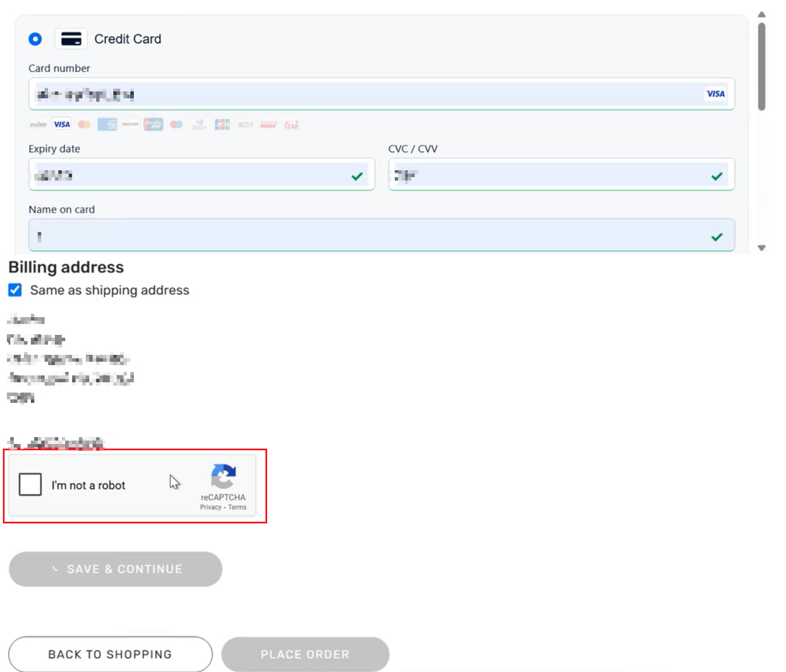

# Dynamics 365 Commerce - CAPTCHA on Checkout - Web Module

## Overview
The content in this focused on the Headless Commerce extensions required to enforce CAPTCHA at key points in the checkout process:  
1) Payment card validation
2) Checkout

The reasoning for these two checkpoints address fraud scenarios where bots may be attempting to use a stolen credit card.  There are attack patterns that hit anonymous checkout pages with the intent of validating a card number and its secondary security data (e.g., expiration date, verification code).  

The custom web module follows the extensibility pattern established in [Create a new module](https://learn.microsoft.com/en-us/dynamics365/commerce/e-commerce-extensibility/create-new-module).  This custom web module surfaces a CAPTCHA challenge which is placed in the checkout experience.

## Contributing

This project welcomes contributions and suggestions. Most contributions require you to agree to a Contributor License Agreement (CLA) declaring that you have the right to, and actually do, grant us the rights to use your contribution. For details, visit <https://cla.opensource.microsoft.com>.

When you submit a pull request, a CLA bot will automatically determine whether you need to provide a CLA and decorate the PR appropriately (e.g., status check, comment). Simply follow the instructions provided by the bot. You will only need to do this once across all repos using our CLA.

This project has adopted the [Microsoft Open Source Code of Conduct](https://opensource.microsoft.com/codeofconduct/). For more information see the [Code of Conduct FAQ](https://opensource.microsoft.com/codeofconduct/faq/) or contact [opencode@microsoft.com](mailto:opencode@microsoft.com) with any additional questions or comments.