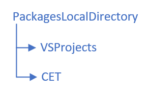
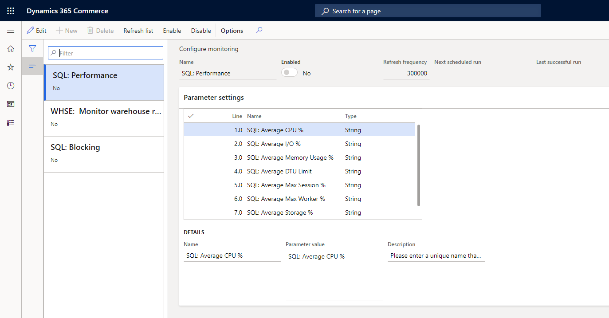
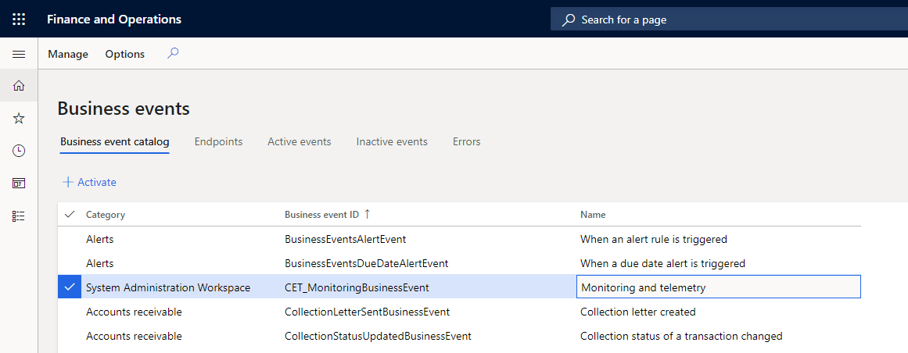

---

---
# Monitoring and Telemetry

## Summary
This extension builds on top of the Monitoring and Telemetring (Preview) framework.  The framework provides a platform mechanism for broadcasting aspects of application (D365FO) performance and session data to to [Application Insights](https://docs.microsoft.com/en-us/azure/azure-monitor/app/app-insights-overview).  There is a wealth of information that the framework tracks and publishes, and this extension focuses on adding additional system health metrics and events that are essential to the operational monitoring of your D365FO  environment.

Use this extension as a proof of concept for establishing your own operational monitoring and metrics.  As this is open source, considering contributing your thoughts and experiences to make these examples better.

> Note that this collection of extensions references the Monitoring and Telemetry model in D365FO which is currently in Private Preview.  It is not included in this repository.  If you would like to gain access to this model, please reach out to your FastTrack solution architect and ask if joining the preview is right for you.

## Folder contents
| File/folder       | Description                                |
|-------------------|--------------------------------------------|
| `Metadata/`        | Dymamics 365 F&O extension metadata folder |
| `Metadata/CET/`        | Dymamics 365 F&O model folder  |
| `Metadata/VSProjects/` | Folder containing the VS 2017 project definition for the F&O extension, including a helper C# library    |
| `resources/` | Resources (images) referenced in this readme file.  The folder and content are not required for the extension.     |
| `README.md`  | This README file.               |
| `LICENSE`    | The license for the sample.     |

## Build the extension
### Build
1. On your dev machine, place the model folder into your AX metadata folder (usually:  `K:\AosService\PackagesLocalDirectory\`).  Also place the VS 2017 project into the folder with your other solutions.  On my environment, the VS project container folder is also under my AX metadata path.  Many different configurations are possible, and yours may vary.



> Note that there is a small C# library included in the solution that is used to serialize data related to monitoring events.  We will compile it in step 3, but be patient until we get there.

2. Once you have the folders on your local environment, open Visual Studio and compile the new model (Dynamics 365 > Build models...). Uncheck "(All solutions)" and scroll down to "CET [Commerce Essentials -Telemetry]".  You should get three build errors related to missing the TelemetryHelper class.  These are expected.

3. Within Visual Studio, open the `Commerce Essentials - Telemetry.sln` solution. This contains two projects -- one X++ and one C# library. (If you skipped step #2, then the X++ project will fail to load.) Go to the main menu and choose Build > Build Solution.  The three errors from step #2 should be gone.

### Synchronize the database
There should not be any X++ compile errors.  The model for this solution should be compiled, and the Visual Studio solution is open.  In the **Solution Explorer** window, right-click on the X++ project `Commerce Essentials - Telemetry` and choose to synchronize the model with the database.

## Configure the solution

### Enable monitoring
In D365, navigate to System Administration > Setup > Monitoring and telemetry parameters.  This is the setup form for the Monitoring and Telemetry solution.  There is a new tab labeled "Monitoring".  Enable the monitoring extension by switching the toggle box to enabled.  You can leave the other options at the default for now.  Save and close the form.

> Note:  If you do not have this form, then your environment does not have the Monitoring and Telemetry (Preview) module installed.  

### Enable monitoring rules
Navigate to System Administration > Setup > Configure monitoring.  If this is the first time you have opened the form, it will be empty.  Click the menu button labeled **Refresh list**.  This will scan the AOT and build a list of monitoring rules and their parameters.  When you build a new monitoring rule, make sure to refresh the list so that it will appear in the list.

| Before       | After (example)                                |
|-------------------|--------------------------------------------|
|||

By default, each rule is disabled.  You can use the menu buttons at the top of the form to enable or disable the rule.  Additionally, you can change how frequently this rule should run.  Once enabled, this form will also show you the next time that 

#### Monitoring rule parameters

### Start the monitoring batch job
The monitoring rules focus on polling the current system health.  This is accomplished through a single batch job that executes the monitoring business rules.  Only one instance is required, and it does not need a recurrence.  The batch job will manage itself and sleep until the next time it needs to run.  Once running, the monitoring batch job will re-scan for changes in settings and business rules.  You can disable the batch job through the Monitoring and Telemetry parameters form if needed.

### Enable extended data tracking with Business Events
Application Insights is meant to track thousands of lightweight metrics and events to give you specific information into the operational and session activity within your application.  We need to use another mechanism if we want to track a larger payload of data related to an application metric or event.  

For example, if a monitoring rule detects elevated blocking in the database, storing the blocking query and the blocking tree would give us essential data points in identifying the root cause of the problem.  Similarly, when a batch job throws an exception, capturing a call stack will help identify the problem.  

The monitoring business rules can log additional event data into an internal table in D365FO.  The [Business Events](https://docs.microsoft.com/en-us/dynamics365/fin-ops-core/dev-itpro/business-events/home-page) feature can be used to publish this information to your IT operations systems.  In order to enable business events for the extensions in this solution, first navigate to the Business Events workspace.  From the top menu, choose Manage -> Rebuild business events catalog.  This will scan the AOT and add the business events components introduced in this solution.   A new row will appear under the category of `System Administration Workspace` with the name `Monitoring and telemetry`.



## Extend the solution

The major goal of this extension is to inspire adoption of the Monitoring and Telemetry feature and to provide an example of extending the framework in order to track relevant operational health metrics and events.

### Add a new rule
A new monitoring rule can be created relatively easily in X++. It begins by creating a new class that extends `CET_MonitoringBase`. 
```csharp
class CET_MonitoringSQLBlocking extends CET_MonitoringBase 
{
}
```

#### Give it a name
```csharp
    public ClassDescription description()
    {
        return "@CETM:SQLMonitoringDesc";
    }
```

#### Define your parameters
```csharp
    public void setContractDefaults()
    {		
        super();
        contract.addParm(
			BlockingMetricOver5SecLabel,						// Line number / position
            literalStr("@CETM:LogMetricSQLBlockedOver5secs"),	// Name
            literalStr("@CETM:LogMetricDescription"),			// Description of this parameters
			"@CETM:LogMetricSQLBlockedOver5secs");				// Default value
																// Type is defaulted to String

        contract.addParm(
            BlockingMetricAvgDurationLabel,						// Line number / position
            literalStr("@CETM:LogMetricSQLBlockedAvgDuration"),	// Name
			literalStr("@CETM:LogMetricDescription"),			// Description of this parameters
            "@CETM:LogMetricSQLBlockedAvgDuration");			// Default value
                                                                // Type is defaulted to String

        contract.addParm(
            BlockingMetricBlockingEventLabel,					// Line number / position
            literalStr("@CETM:LogMetricSQLBlocked"),			// Name
            literalStr("@CETM:LogMetricDescription"),			// Description of this parameters
            "@CETM:LogMetricSQLBlocked");						// Default value
																// Type is defaulted to String

        contract.addParm(
            BlockingMetricBlockingEventTreshold,				// Line number / position
            literalStr("@CETM:LogMetricSQLEventThreshold"),		// Name
            literalStr("@CETM:LogMetricThresholdSec"),			// Description of this parameters
            300, 												// Default value
			CET_MonitoringParameterValueType::Integer,			// Value type
            1000);												// Scale factor (ask for seconds, convert to milliseconds)
	}
```

#### Define the business logic
```csharp
    public void run()
    {
        super(); // Pulls config into contract.

        SysSqlBlockingView view;
        select firstonly count(recid), avg(WaitDurationMs) from view;
                
        this.logMetric(BlockingMetricOver5SecLabel, view.RecId);
        this.logMetric(BlockingMetricAvgDurationLabel, view.WaitDurationMs);
    
        while select view where view.WaitDurationMs > contract.getParmValueInt(BlockingMetricBlockingEventTreshold)
        {
            this.logEvent(BlockingMetricBlockingEventLabel, CET_MonitoringFactory::Record2JSON(view)); // "SQL Sessions Blocked over 5 minutes"
        }
    }
```

#### [Optional] Set a lower limit for recurrence
```csharp
    public int minRefreshInMs()
    {
        return 28800000; // 28.8m ms = 8 hours
    }
```

## Contributing

This project welcomes contributions and suggestions.  Most contributions require you to agree to a Contributor License Agreement (CLA) declaring that you have the right to, and actually do, grant us the rights to use your contribution. For details, visit https://cla.opensource.microsoft.com.

When you submit a pull request, a CLA bot will automatically determine whether you need to provide a CLA and decorate the PR appropriately (e.g., status check, comment). Simply follow the instructions provided by the bot. You will only need to do this once across all repos using our CLA.

This project has adopted the [Microsoft Open Source Code of Conduct](https://opensource.microsoft.com/codeofconduct/). For more information see the [Code of Conduct FAQ](https://opensource.microsoft.com/codeofconduct/faq/) or contact [opencode@microsoft.com](mailto:opencode@microsoft.com) with any additional questions or comments.