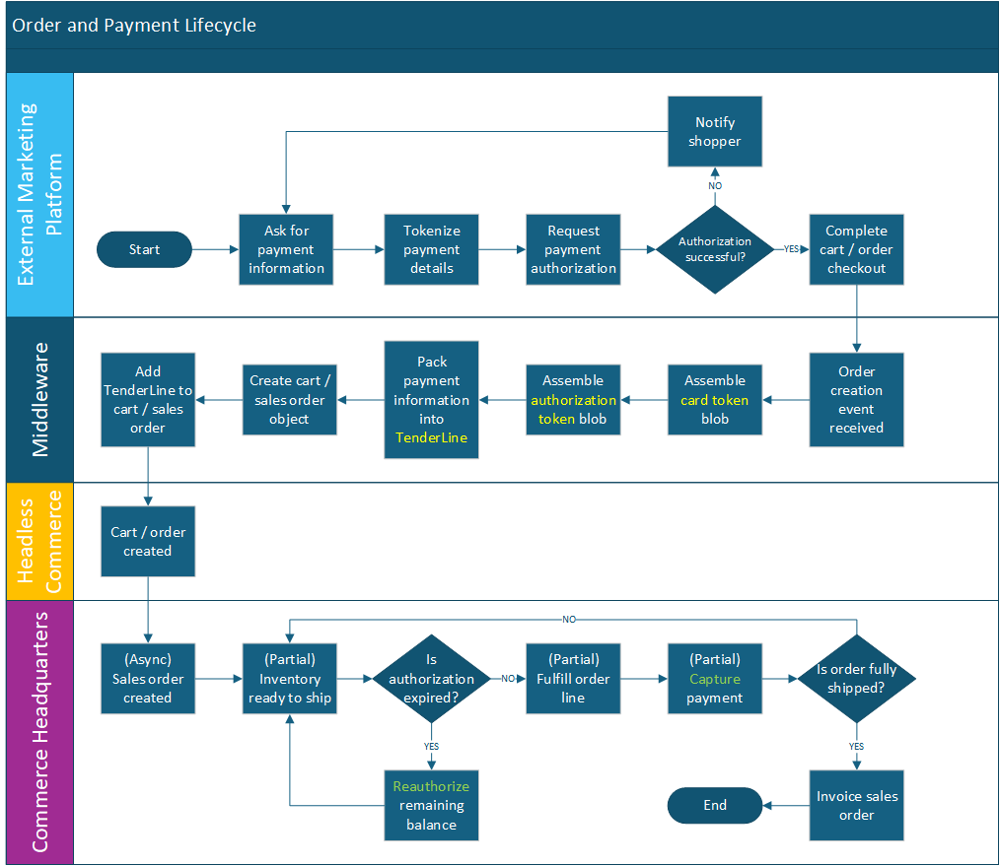

# Payment

[[_TOC_]]

## Overview

Payments are anything but simple. There are more traditional payment instruments like credit and debit cards, but we also have wallet services like PayPal, Google Wallet, and Apple Pay which act as a secure abstraction layer that separates the retailer from the consumer's payment instrument. There are also "Buy Now Pay Later" options like AfterPay and Klarna which extend a new line of credit to the consumer at checkout. Each payment instrument has a backing for-profit financial institution (usually a bank) which has its own set of frameworks, security, and interfaces.

Dynamics 365 Commerce abstracts all of this complexity by introducing the concept of a payment "connector" that interfaces with the payment processor and translates everything into a common data model. We call this framework the [Payment SDK](https://learn.microsoft.com/en-us/dynamics365/commerce/dev-itpro/deploy-payment-connector). Microsoft has an agreement with and has built a connector to Adyen which is a payment broker. Adyen is not a bank but acts as an abstraction layer between multiple payment providers and banks. As a result, this enables Dynamics 365 Commerce direct use of several different payment types across many different geographies.

This article will identify the important properties as well as walk throgh the Payment SDK to bring payment data from an external system into Headless Commerce in such a way that it looks like it was created natively.

### Assumptions

We assume that you have an intermediate or advanced knowledge of payment industry processes, why payment tokens are used, how retailers use different merchand IDs to separate their selling channels, and how to configure payments in Dynamics 365 Commerce.

This article is written with the assumption that you are using the standard Microsoft-built payment connector for Adyen. It is also assumed that the payment is **authorized** when the order is created in the third-party platform.

Dynamics 365 Commerce is assumed to be the payment system of record. It will be responsible for re-authorizing, capturing, and refunding payments based on the order lifecycle. (If your third-party marketing platform is the system of origin and system of record for payments, then there is no point in integrating payments into Dynamics 365.) Below is sample flow for payments (and orders).



We will share what payment properties are essential for successfully reauthorizing and capturing payments through the Adyen payment connector. If you are using a third-party payment connector, you will need to work with your ISV to understand what properties ar required for them to process payments successfully.

The payment processor used on your external system must be the same as the one used in Dynamics 365. It must also be configured to allow sharing of card tokens between merchant accounts of the same tenant.

### Payment SDK

The Dynamics 365 Commerce Payment SDK is a framework designed to make building a payment connector easier. There is an entire [whitepaper](https://download.microsoft.com/download/e/2/7/e2735c65-1e66-4b8d-8a3c-e6ef3a319137/The%20Guide%20to%20Implementing%20Payment%20Connector%20and%20Payment%20Device_update.pdf) targeted at connector development. While this article is not going to walk through connector development, it is important to know what the connector does as we aim to assemble a payment record that resembles what a payment connector would output. Specifically, we will mimick the response from **GenerateCardToken** and **Authorization**.

Always use the Payment SDK to read or modify payment data in Dynamics 365 Commerce. We have enabled a feature that compresses the raw XML which has broken several customizations that attempted direct XML/string manipulation. If we need to change formats (e.g., JSON) or to encrypt the raw payment token, the Payment SDK will always be able to interpret the token correctly and maintain backwards compatibility.

> [!NOTE]
> As of the writing of this article, the Payment SDK stores payment data in an enriched XML format. Never assume that the payment data will always take this format. XML is a very bulky format and consumes excessive storage for the amount of useful data that it stores.

There is a payment device sample implementation using the Payment SDK in the [Commerce SDK sample repository](https://github.com/microsoft/Dynamics365Commerce.InStore/blob/release/9.52/src/HardwareStationSamples/PaymentDevice/README.md). That is a great first step if you are interested in understanding more about payment connector development. As mentioned earlier, this article is focused on simulating the output of a connector for an authorization response which is significantly less complex than the process of obtaining the authorization.

#### PaymentProperty

The primary element of payment data (commonly called a "payment blob" in documentation) is the payment property. It is a simple data structure (class in C#) with the following fields:

| Field             | Type            | Description                                                                                             |
| ----------------- | --------------- | ------------------------------------------------------------------------------------------------------- |
| Namespace         | string          |                                                                                                         |
| Name              | string          |                                                                                                         |
| ValueType         | enum (DataType) | One type is "PropertyList" which allows us to nest properties indefinitely.                             |
| StoredStringValue | string          |                                                                                                         |
| DecimalValue      | decimal         |                                                                                                         |
| DateValue         | datetime        |                                                                                                         |
| SecurityLevel     | enum            | **Deprecated.** Don't use this.                                                                         |
| IsEncrypted       | string          | **Deprecated.** Don't use this. Encryption should happen at the blob level, not an individual property. |
| IsPassword        | bool            |                                                                                                         |
| IsReadOnly        | bool            |                                                                                                         |
| IsHidden          | bool            |                                                                                                         |
| DisplayHeight     | int             | **Unused.** Default to 1.                                                                               |
| SequenceNumber    | int             | **Unused.** Default to 0.                                                                               |

The payment property is designed to hold a single value. For example, it could be the last 4 digits of the credit card, the transaction date, or the authorization amount. These are added to a list of properties and then included in either a card token or authorization object. There can be hundreds of properties which are all outlined in the whitepaper mentioned above.

The following are examples of creating and managing payment properties using the Payment SDK.

```cs
using Microsoft.Dynamics.Retail.PaymentSDK.Portable;
using Microsoft.Dynamics.Retail.PaymentSDK.Portable.Constants;
   // ...  Example  ...
   // Constructing and populating a payment property object
PaymentProperty serviceAccountIdProperty = new PaymentProperty();
serviceAccountIdProperty.Namespace = GenericNamespace.MerchantAccount;
serviceAccountIdProperty.Name = MerchantAccountProperties.ServiceAccountId;
serviceAccountIdProperty.ValueType = DataType.String;
serviceAccountIdProperty.StoredStringValue = "MyServiceGUID";

// Alternatively, you can use the constructor overload and do this in a single line
PaymentProperty serviceAccountIdProperty = new PaymentProperty(GenericNamespace.MerchantAccount, MerchantAccountProperties.ServiceAccountId, "MyServiceGUID");

   // ...  Example  ...
   // Payment property list
List<PaymentProperty> properties = new List<PaymentProperty>();
properties.Add(serviceAccountIdProperty);
properties.Add(new PaymentProperty(GenericNamespace.Connector, ConnectorProperties.ConnectorName, "FriendlyConnectorName"));

  // A property list nested within a property.
    // First, generate the inner property list
List<PaymentProperty> innerProperties = new List<PaymentProperty>();
innerProperties.Add(new PaymentProperty(GenericNamespace.AuthorizationResponse, AuthorizationResponseProperties.AuthorizationResult, AuthorizationResult.Success.ToString()));
innerProperties.Add(new PaymentProperty(GenericNamespace.AuthorizationResponse, AuthorizationResponseProperties.ApprovedAmount, 1.0)); // Use a valid amount.  Very few transactions will be exactly $1.00.

    // Second, pack the inner list into a new payment property
PaymentProperty nestedPropertyList = new PaymentProperty(
    GenericNamespace.AuthorizationResponse,  // Namespace
    AuthorizationResponseProperties.Properties, // Literal name
    innerProperties.ToArray()); // List of properties to include

    // Finally, add this nested property into the main property list.
properties.Add(nestedPropertyList);

  // ...  Example  ...
  // Serialize this into a payment blob.
  // Add as many properties (including property lists) as required.
string paymentBlob = PaymentProperty.ConvertPropertyArrayToXML(properties.ToArray(), compress: true); // Compress is optional, default = false.
```

When working with payment properties, keep the following in mind:

- Payment properties are loosely orderd, so they may appear in a different order than listed here. If you are scanning a list of properties, consider using a has table (example provided below).
- Payment connectors may add additional properties and which are required in order to transact successfully. If you are using a custom or third-party payment connector, check with your partner and ensure that your integration is populating all required properties.
- Payment properties should be unique by Namespace and Name. If a property needs multiple values, consider using a property list.

> [!NOTE]
> The Payment SDK wraps the output in a "CDATA" expression. This is because table data in Dynamics 365 is often serialized as XML and fields that are raw XML will cause problems with encoding. [CDATA (short for 'character data')](https://www.w3.org/TR/REC-xml/#dt-cdsection) is a special XML tag that escapes a block of data that contains characters that might otherwise be interpreted as XML.

The payment connector configuration (often called "merchant properties") is stored using a payment blob as well. If you need to access this data, you will need to call the helper method ConvertXMLToPropertyArray().

```cs
using Microsoft.Dynamics.Retail.PaymentSDK.Portable;
using Microsoft.Dynamics.Retail.PaymentSDK.Portable.Constants;

  // ...  Example  ...
  // Deserialize a packed string into a payment property array
PaymentProperty[] propertiesArray = null;
if (!string.IsNullOrWhiteSpace(merchantPropertiesXmlString))
{
    // Despite the method name, do not assume that the string is
    // in basic XML format.  It might be compressed (binary
    // using base64 encoding), and the Payment SDK will correctly
    // detect, decompress, and deserialize.
    propertiesArray = PaymentProperty.ConvertXMLToPropertyArray(merchantPropertiesXmlString);
}

  // Convert the properties into a hash table for easier lookup
Hashtable merchantPropertiesHash = PaymentProperty.ConvertToHashtable(propertiesArray);
PaymentProperty serviceAccountIdProperty = PaymentProperty.GetPropertyFromHashtable(
    merchantPropertiesHash,
    GenericNamespace.MerchantAccount,
    MerchantAccountProperties.ServiceAccountId); // Returns null if not found
```

#### Common Response Properties

The following properties are present in all payment responses:

| Namespace       | Property name    | Description                                                                                                                                                                                                     |
| --------------- | ---------------- | --------------------------------------------------------------------------------------------------------------------------------------------------------------------------------------------------------------- |
| MerchantAccount | ServiceAccountId | This is the GUID assigned to the payment connector when it is configured in Dynamics 365 Commerce. For POS, this is in the EFT section of the Hardware Profile. For e-commerce, this is in the channel profile. |
| Connector       | ConnectorName    | The friendly name of the payment connector. Either pull from the payment configuration, or give it a custom name to provide clarity that this was created through integration.                                  |

##### Service Account ID

The **ServiceAccountId** field is a random GUID assigned when the payment connector is configured in Dynamics 365 Commerce. Deleting and re-adding the same payment connector will result in a new service account ID. The value used in a payment blob informs which payment connector was used in the tokenization or authorization process. Since payment tokens are specific to a provider, the same connector **must** be used in further payment lifecycle interactions (payment capture, reauth, void auth, etc.). Using an invalid ServiceAccountId will result in processing errors in Dynamics 365 Commerce.

Depending on your channel configuration, payment connectors can be configured in the following three places:

| Menu Path                                                                          | Location                                                    | Notes                                                                                                                                                                                                                                                              |
| ---------------------------------------------------------------------------------- | ----------------------------------------------------------- | ------------------------------------------------------------------------------------------------------------------------------------------------------------------------------------------------------------------------------------------------------------------ |
| Accounts receivable > Payments setup > Payment services                            |  | Look for the **Payment service account** fast tab. This payment setup is primarily used by Call Center which is exclusive to Headquarters and is unavailable through Headless Commerce. For this reason, we discourage using Call Center channels for integration. |
| Retail and Commerce > Online stores                                                |  | Look for the **Payment accounts** fast tab. It might be collapsed when opening the form.                                                                                                                                                                           |
| Retail and Commerce > Channel setup > POS Setup > POS profiles > Hardware Profiles |  | Look for the **EFT service** tab towards the bottom of the list of fast tabs.                                                                                                                                                                                      |

More details on configuration are available on our Learning portal: [Set up Dynamics 365 Payment Connector for Adyen](https://learn.microsoft.com/en-us/dynamics365/commerce/dev-itpro/adyen-connector-setup).

#### Card Token

The card token in Dynamics 365 Commerce is an anonymized list of properties for a payment instrument (e.g., credit card). A card token is required to transact against a payment instrument. For example, it is used in conjunction with an authorization to capture funds.

The following are the default fields expected per the Payment SDK documentation.

| Namespace       | Property name                 | Type                    | Description                                                                                                                                                                                              |
| --------------- | ----------------------------- | ----------------------- | -------------------------------------------------------------------------------------------------------------------------------------------------------------------------------------------------------- |
| MerchantAccount | ServiceAccountId              | string                  | Common property. See [Common Response Properties](#common-response-properties) above.                                                                                                                    |
| Connector       | ConnectorName                 | string                  | Common property. See [Common Response Properties](#common-response-properties) above.                                                                                                                    |
| PaymentCard     | CardType                      | string (enum: CardType) | Unknown, Debit, Visa, MasterCard, Discover, Amex, and GiftCard.                                                                                                                                          |
| PaymentCard     | CardToken                     | string                  | The unique identifier assigned by the payment process. For Adyen, this is the [recurringDetailReference](https://docs.adyen.com/point-of-sale/recurring-payments/#enable-receiving-tokenization-details) |
| PaymentCard     | Last4Digits                   | string                  | The last four digits of the credit/debit card. Undefined (empty string) for wallet services like PayPal.                                                                                                 |
| PaymentCard     | UniqueCardId                  | string                  | If the response from Adyen contains the additionalResponses message with the ShopperReference property, use that. Otherwise, assign a fresh GUID.                                                        |
| PaymentCard     | ExpirationYear                | string                  | Human readable. Displayed to call center and e-commerce user when listing saved cards.                                                                                                                   |
| PaymentCard     | ExpirationMonth               | string                  | Human readable. Displayed to call center and e-commerce user when listing saved cards.                                                                                                                   |
| PaymentCard     | StreetAddress                 | string                  | Human readable. Displayed to call center and e-commerce user when listing saved cards.                                                                                                                   |
| PaymentCard     | City                          | string                  | Human readable. Displayed to call center and e-commerce user when listing saved cards.                                                                                                                   |
| PaymentCard     | State                         | string                  | Human readable. Displayed to call center and e-commerce user when listing saved cards.                                                                                                                   |
| PaymentCard     | PostalCode                    | string                  | Human readable. Displayed to call center and e-commerce user when listing saved cards.                                                                                                                   |
| PaymentCard     | Country                       | string                  | Human readable. Displayed to call center and e-commerce user when listing saved cards.                                                                                                                   |
| PaymentCard     | BankIdentificationNumberStart | string                  | Optional. Commonly called BIN, these are the initial digits of the payment card and often used to determine the card type (Visa, MC, AmEx, etc.).                                                        |

The human readable portions are sometimes included in customer-facing communications for order updates. For example, order creation emails might include the payment instrument details.

The following additional property is used by CreditCardCust (the payment table in Commerce) and is exposed to Call Center and e-commerce users:

| Namespace   | Property name | Type   | Description                                             |
| ----------- | ------------- | ------ | ------------------------------------------------------- |
| PaymentCard | Name          | string | Name of the payment instrument holder, e.g., "John Doe" |

The following properties are used by the Adyen payment connector:

| Namespace   | Property name             | Type   | Description                                                                                                                                                                                                                                                       |
| ----------- | ------------------------- | ------ | ----------------------------------------------------------------------------------------------------------------------------------------------------------------------------------------------------------------------------------------------------------------- |
| PaymentCard | FraudResult               | string | Optional. [Field **fraudResultType**](https://docs.adyen.com/risk-management/handle-risk-rule-notifications/#notification-example) is included in the "additionalData" object from Adyen.                                                                         |
| PaymentCard | Alias                     | string | An alternative ID for the card. From Adyen, this is in the [alias property in the additionalData object](https://docs.adyen.com/development-resources/webhooks/additional-settings/).                                                                             |
| PaymentCard | PaymentMethodVariant      | string | From Adyen, this is in the [paymentMethodVariant property in the additionalData object](https://docs.adyen.com/development-resources/webhooks/additional-settings/).                                                                                              |
| PaymentCard | PaymentMethodName         | string | Same as PaymentMethodVariant (above).                                                                                                                                                                                                                             |
| PaymentCard | AdyenPaymentMethod        | string | The payment method determined by Adyen and in [the additionalData object](https://docs.adyen.com/development-resources/webhooks/additional-settings/) of the tokenization response.                                                                               |
| PaymentCard | CardVerificationValue     | string | The CVV/CVC result, not the actual CVV number. **Never** store the CVV number as this is a PCI compliance issue. From Adyen, this is in the [cvcResult in the additionalData object](https://docs.adyen.com/development-resources/webhooks/additional-settings/). |
| PaymentCard | ShowSameAsShippingAddress | string | Used for e-commerce display.                                                                                                                                                                                                                                      |
| PaymentCard | House                     | string | Optional. Part of the street address: house number or name.                                                                                                                                                                                                       |
| PaymentCard | CustomerId                | string | Contains the Dynamics 365 customer account ID. If unknown (anonymous), use the UniqueCardId.                                                                                                                                                                      |

#### Authorization

As mentioned earlier, the following properties are present in all payment responses:

| Namespace             | Property name    | Description                                                                           |
| --------------------- | ---------------- | ------------------------------------------------------------------------------------- |
| MerchantAccount       | ServiceAccountId | Common property. See [Common Response Properties](#common-response-properties) above. |
| Connector             | ConnectorName    | Common property. See [Common Response Properties](#common-response-properties) above. |
| AuthorizationResponse | Properties       | A **list** of properties.                                                             |

The following are the properties in the **AuthorizationResponse** property list.

| Namespace             | Property name         | Type                               | Description                                                                                                                                                                                                                                  |
| --------------------- | --------------------- | ---------------------------------- | -------------------------------------------------------------------------------------------------------------------------------------------------------------------------------------------------------------------------------------------- |
| AuthorizationResponse | AuthorizationResult   | string (enum: AuthorizationResult) | None, **Success**, Failure, Referral, PartialAuthorization, and ImmediateCaptureFailed.                                                                                                                                                      |
| AuthorizationResponse | ApprovedAmount        | decimal                            | The authorized amount.                                                                                                                                                                                                                       |
| AuthorizationResponse | CashBackAmount        | decimal                            | Optional. Used only with debit cards when cash back is selected at the payment terminal                                                                                                                                                      |
| AuthorizationResponse | AvailableBalance      | string                             | Optional. Only used with gift cards.                                                                                                                                                                                                         |
| AuthorizationResponse | UniqueCardId          | string                             | This should match the value included in the [card token](#card-token).                                                                                                                                                                       |
| AuthorizationResponse | Last4Digits           | string                             | Human readable. Use the same value included in the [card token](#card-token).                                                                                                                                                                |
| AuthorizationResponse | CardType              | string (enum: CardType)            | Unknown, Debit, Visa, MasterCard, Discover, Amex, and GiftCard. Use the same value included in the [card token](#card-token).                                                                                                                |
| AuthorizationResponse | ApprovalCode          | string                             | For non-gift cards, this is the authCode property from Adyen. For gift cards, this is the authorisationMid (British spelling) in the [authorization response](https://docs.adyen.com/api-explorer/Webhooks/1/post/AUTHORISATION) from Adyen. |
| AuthorizationResponse | ProviderTransactionId | string                             | This is the original transaction reference that was supplied to Adyen during the authorization request. This is usually an order or transaction ID.                                                                                          |
| AuthorizationResponse | AVSResult             | string (enum: AVSResult)           | Adyen returns a single result code that needs to be split. Reference Adyen's [Address Verification Service (AVS)](https://docs.adyen.com/risk-management/avs-checks/#avs-mapping-table) mapping table.                                       |
| AuthorizationResponse | AVSDetail             | string (enum: AVSDetail)           |                                                                                                                                                                                                                                              |
| AuthorizationResponse | CVV2Result            | string (enum: CVV2Result)          | You will need to map the cvcResult in the [authorization response](https://docs.adyen.com/api-explorer/Webhooks/1/post/AUTHORISATION) from Adyen.                                                                                            |
| AuthorizationResponse | TransactionType       | string (enum: TransactionType)     | TransactionType.Authorize.ToString()                                                                                                                                                                                                         |
| AuthorizationResponse | CurrencyCode          | string                             | This should match the currency of your channel.                                                                                                                                                                                              |

The following properties are used by the Adyen payment connector:

| Namespace             | Property name              | Type     | Description                                                                                                                                                                                                                          |
| --------------------- | -------------------------- | -------- | ------------------------------------------------------------------------------------------------------------------------------------------------------------------------------------------------------------------------------------ |
| AuthorizationResponse | AdyenPaymentMethod         | string   | This should match the value included in the [card token](#card-token).                                                                                                                                                               |
| AuthorizationResponse | TransactionDateTime        | datetime | Use the current time: DateTime.UtcNow                                                                                                                                                                                                |
| AuthorizationResponse | TerminalId                 | string   | Optional. This is mostly for POS-initiated transactions.                                                                                                                                                                             |
| AuthorizationResponse | FraudResult                | string   | Optional. Similar concept as what was done in the [card token](#card-token).                                                                                                                                                         |
| AuthorizationResponse | Alias                      | string   | Optional. This should match the value included in the [card token](#card-token).                                                                                                                                                     |
| AuthorizationResponse | TransactionId              | string   | The pspReference field from the [authorization response](https://docs.adyen.com/api-explorer/Webhooks/1/post/AUTHORISATION) from Adyen. Note PSP is short for payment service provider.                                              |
| AuthorizationResponse | OriginalPSP                | string   | The same pspReference as TransactionId (above).                                                                                                                                                                                      |
| AuthorizationResponse | BankTransactionId          | string   | The same pspReference as TransactionId (above).                                                                                                                                                                                      |
| AuthorizationResponse | AcquirerReference          | string   | Some gift cards include an additional reference in the [AcquirerReference in the additionalData object](https://docs.adyen.com/development-resources/webhooks/additional-settings/).                                                 |
| AuthorizationResponse | IncrementalOffsetReference | string   | Optional. Used with incremental capture. Only include if [AdjustAuthorisationData is present in the additionalData object](https://docs.adyen.com/development-resources/webhooks/additional-settings/).                              |
| AuthorizationResponse | IsReauthorizationSupported | string   | Optional. Only include if [AdjustAuthorisationData is present in the additionalData object](https://docs.adyen.com/development-resources/webhooks/additional-settings/). When present, the value for this property should be "true". |
| AuthorizationResponse | PaymentReference           | string   | The same pspReference as TransactionId (above).                                                                                                                                                                                      |

Note that many fields are of type string but have a backing enumerated value. Make sure to call the ToString() method when using the enum object.

#### Capture

The workflow for integrating e-commerce and "buy now, pickup later" orders where payment is already captured is extremely complicated as you need to handle partial/full refunds when items are backordered or canceled. You might call this by a different name like "deposit", "downpayment", or "pre-payment". Despite the name, it is an extremely complicated knot to untie when refunds are required. This is beyond the scope of this guidance document (but may be added in the future).

Cash-and-carry transactions (exculding "buy now, pickup later") are a different workflow as the orders are fulfilled, and there is no risk of cancelation. If you have a simpler process and want to integrate orders with payment captures, this section will describe what is included in a payment blob for a capture. Note that the POS does an authorization and capture in the same step, so there are properties in the **capture** payment blob that are repeated from the authorization.

As mentioned earlier, the top two properties are present in all payment responses:

| Namespace       | Property name    | Description                                                                           |
| --------------- | ---------------- | ------------------------------------------------------------------------------------- |
| MerchantAccount | ServiceAccountId | Common property. See [Common Response Properties](#common-response-properties) above. |
| Connector       | ConnectorName    | Common property. See [Common Response Properties](#common-response-properties) above. |
| CaptureResponse | Properties       | A list of properties.                                                                 |

The following are the properties in the **CaptureResponse** property list.

| Namespace       | Property name         | Type                           | Description                                                                                                                                                                                              |
| --------------- | --------------------- | ------------------------------ | -------------------------------------------------------------------------------------------------------------------------------------------------------------------------------------------------------- |
| CaptureResponse | CaptureResult         | string (enum: CaptureResult)   | None, **Success**, and Failure. Remember to convert the enum value to a string: CaptureResult.Success.ToString();                                                                                        |
| CaptureResponse | UniqueCardId          | string                         | This should match the value used in the payment token: If the response from Adyen contains the additionalResponses message with the ShopperReference property, use that. Otherwise, assign a fresh GUID. |
| CaptureResponse | PaymentTrackingId     | string                         | Optional. This is primarily used for duplicate payment prevention.                                                                                                                                       |
| CaptureResponse | Last4Digits           | string                         | This should match the value used in the payment token.                                                                                                                                                   |
| CaptureResponse | CardType              | string (enum: CardType)        | This should match the value used in the payment token.                                                                                                                                                   |
| CaptureResponse | AdyenPaymentMethod    | string                         | This should match the value used in the payment token.                                                                                                                                                   |
| CaptureResponse | ProviderTransactionId | string                         | This should match the value used in the **authorization** token.                                                                                                                                         |
| CaptureResponse | TransactionId         | string                         | This should match the value used in the **authorization** token.                                                                                                                                         |
| CaptureResponse | OriginalPSP           | string                         | This should match the value used in the **authorization** token.                                                                                                                                         |
| CaptureResponse | TransactionType       | string (enum: TransactionType) | This should match the value used in the payment token.                                                                                                                                                   |

## Integration approach

When building the required payment blobs, the recommended best practice is to use the Payment SDK framework to generate the required artifacts. We strongly discourage attempting to generate the blobs through manual string or XML manipulation as minor schema changes in the framework may break your integration.

For all scenarios, we need the blob associated with the [Payment Token](#payment-token). This allows Dynamics 365 to process reauthorizations and payment capture as the authorization blob is not sufficient to do either on its own. Additionally, linked returns are only possible if we have the card token on file. While we use data from the payment capture to reference the original transaction, we need the payment token in order to provide the complete information to the payment provider.

As mentioned in the [architecture overview](../architecture/architecture.md#intgeration-approach), payments are not a base data concept. Instead, payments are attached to a cart or sales order object in Dynamics 365 Commerce using the TenderLine object which maps to the RetailTransactionTenderLine table. This article focuses only on the correct formatting of payment blobs in the TenderLine object. Full order integration guidance is covered in [order overview](../orders/orders.overview.md).

The following **`TenderLine`** fields are relevant for integration:

| Field                       | Type                             | Description                                                                                                                                                                 |
| --------------------------- | -------------------------------- | --------------------------------------------------------------------------------------------------------------------------------------------------------------------------- |
| StoreId                     | string                           | This should align with your integration channel that was configured in Dynamics 365 Commerce.                                                                               |
| ChannelId                   | int                              | This should align with your integration channel that was configured in Dynamics 365 Commerce.                                                                               |
| TerminalId                  | string                           | POS ternimal ID.                                                                                                                                                            |
| TransactionId               | string                           | This should match the unique transaction ID that you assign to your cart/order header.                                                                                      |
| Authorization               | string                           | Serialized [payment authorization](#authorization) blob from the Payment SDK: PaymentProperty.ConvertPropertyArrayToXML() method.                                           |
| CardToken                   | string                           | Serialized [card token](#card-token) blob from the Payment SDK: PaymentProperty.ConvertPropertyArrayToXML() method.                                                         |
| CaptureToken                | string                           | Serialized [payment capture](#capture) blob from the Payment SDK: PaymentProperty.ConvertPropertyArrayToXML() method.                                                       |
| MaskedCardNumber            | string                           | This can be the same as the value supplied to the payment property Last4Digits.                                                                                             |
| TenderDate                  | datetime                         | This could be the actual time of the authorization or capture (TransactionDateTime), or it can be DateTime.UtcNow.                                                          |
| IsPreProcessed              | bool                             | This should be **true** for integrations as the payment activity happened before integration.                                                                               |
| IsDeposit                   | bool                             | ---                                                                                                                                                                         |
| AuthorizationReferenceId    | string                           | Use PaymentReference from your authorization blob (which is the pspReference from Adyen).                                                                                   |
| IsIncrementalCaptureEnabled | bool                             | True if IncrementalOffsetReference is present in your authorization blob.                                                                                                   |
| IsReauthorizationEnabled    | bool                             | True if IsReauthorizationSupported is present in your authorization blob.                                                                                                   |
| IncrementalOffsetAmount     | decimal                          | If this is an incremental reauthorization transaction, indicate the incremental amount.                                                                                     |
| RoundingDifference          | decimal                          | The difference of the amount customer was expected to pay and the amount that the customer actually paid. Theis value is negative if the customer paid more than expected.  |
| Amount                      | decimal                          | Payment amount. This should match what was in your ApprovedAmount authorization property in your channel currency.                                                          |
| Currency                    | string                           | The currency of the payment.                                                                                                                                                |
| TenderTypeId                | string                           | The tender type (e.g., CARD) defined for your channel. Not to be confused with payment method (e.g., VISA).                                                                 |
| SignatureData               | string                           | A base-64 encoded value of a bitmap image. Avoid including signature images as image data is fairly large and will cause storage/performance issues with the payment table. |
| LineNumber                  | decimal                          | A sequence number for ordering your tender lines. This can be a decimal, but try to use integer values.                                                                     |
| GiftCardId                  | string                           | Gift card identifier                                                                                                                                                        |
| GiftCardPin                 | string                           | Gift card PIN                                                                                                                                                               |
| GiftCardExpirationYear      | int                              | Expiration year of the gift card                                                                                                                                            |
| GiftCardExpirationMonth     | int                              | Expiration month of the gift card                                                                                                                                           |
| CustomerId                  | string                           | This is the Dynamics 365 Customer number. If this is an anonymous transaction, use the default customer assigned to the store.                                              |
| CardTypeId                  | string                           | Your card type as configured in Dynamics 365 Commerce HQ.                                                                                                                   |
| IsChangeLine                | bool                             | True if this tender line represents change from a cash/debit payment.                                                                                                       |
| TenderLineStatus            | enum (TenderLineStatus)          | Values include: None, NotProcessed, PendingCommit (payment is **authorized**), Voided, Committed (payment is **captured**), Historical                                      |
| VoidStatus                  | enum (TenderLineVoidStatus)      | Values include: None, NormalVoid, ForceVoided (payment connector issues), ForceVoidReconciled (tender line has been force voided and later reconciled)                      |
| IsHistorical                | bool                             | False. There is no value in importing historical payments.                                                                                                                  |
| IsVoidable                  | bool                             | Indicates if this tender line can be voided.                                                                                                                                |
| AuthorizedAmount            | decimal                          | Payment amount. This should match what was in your ApprovedAmount authorization property in your channel currency.                                                          |
| PaymentRefRecId             | int (RecId)                      | Optional. References the payment record in HQ if created in Call Center.                                                                                                    |
| CardPaymentAccountId        | string                           | This should match the **ServiceAccountId** in your payment blobs                                                                                                            |
| ProcessingTypeValue         | enum (PaymentProcessingType)     | This should be PaymentProcessingType.**Immediate** for integrations.                                                                                                        |
| CardProcessorStatusValue    | enum (CreditCardProcessorStatus) | This should be CreditCardProcessorStatus.**NA** for integrations.                                                                                                           |
| IsPolicyBypassed            | bool                             | Indicates if this tender line bypasses the return policy.                                                                                                                   |

The following are for edge cases and unlikely required for integration secenarios (e.g., payment in different currency than the store).

| Field                       | Type                       | Description                                                                                                                                                                 |
| --------------------------- | -------------------------- | --------------------------------------------------------------------------------------------------------------------------------------------------------------------------- |
| CashBackAmount              | decimal                    | Payment amount. This should match what was in your CashBackAmount authorization property.                                                                                   |
| AmountInTenderedCurrency    | decimal                    | Payment amount. This should match what was in your ApprovedAmount authorization property in your channel currency assuming that it is a different currency than your store. |
| AmountInCompanyCurrency     | decimal                    | Payment amount in store's currency.                                                                                                                                         |
| ExchangeRate                | decimal                    | The exchange rate used to convert from the payment currency to company currency.                                                                                            |
| CompanyCurrencyExchangeRate | decimal                    | The exchange rate used to convert from the company currency to payment currency.                                                                                            |
| ReasonCodeLines             | Collection<ReasonCodeLine> |                                                                                                                                                                             |

The following TenderLine fields are only used with linked (payment) returns. This is unlikely used in an integration as the integration would likely import the order before it was returned or provide a summarized transaction.

| Field                       | Type        | Description                                                                          |
| --------------------------- | ----------- | ------------------------------------------------------------------------------------ |
| LinkedPaymentStore          | string      | The original store associated with the linked payment when doing a return.           |
| LinkedPaymentTerminalId     | string      | The original terminal associated with the linked payment when doing a return.        |
| LinkedPaymentTransactionId  | string      | The original transaction associated with the linked payment when doing a return.     |
| LinkedPaymentLineNumber     | decimal     | The the original line number associated with the linked payment when doing a return. |
| LinkedPaymentCurrency       | string      | The original currency associated with the linked payment when doing a return.        |
| RemainingLinkedRefundAmount | decimal     | Amount remaining on the linked refund original tender.                               |
| LinkedPaymentRefRecId       | int (RecId) | Optional. References the linked payment record in HQ if created in Call Center.      |

### E-commerce and Buy Now, Pickup Later Orders

As mentioned in the [assumptions section](#assumptions), this article assumes that Dynamics 365 Commerce will become the system of record for your orders (and payment lifecycle) once integrated. Additionally, we assume that the payment attached to the order is only authorized and not captured. This is because payments are associated with the order header and not order lines. Partial cancelations become a problem as the process for issuing refunds for downpayments is not well defined in the industry.

Note that most gift cards do not have an "authorization" process, so your only option is to capture payment at the time of order placement.

This integration pattern will need to have the TenderLine populated with the **CardToken** and **Authorization** fields. The **CaptureToken** field should be the empty string. The following fields will likely need the following values:

| Field            | Type                    | Description                                                                                                                       |
| ---------------- | ----------------------- | --------------------------------------------------------------------------------------------------------------------------------- |
| TenderLineStatus | enum (TenderLineStatus) | PendingCommit (payment is **authorized**)                                                                                         |
| AuthorizedAmount | decimal                 | Payment amount. This should match what was in your ApprovedAmount authorization property in your channel currency.                |
| Authorization    | string                  | Serialized [payment authorization](#authorization) blob from the Payment SDK: PaymentProperty.ConvertPropertyArrayToXML() method. |
| CardToken        | string                  | Serialized [card token](#card-token) blob from the Payment SDK: PaymentProperty.ConvertPropertyArrayToXML() method.               |
| CaptureToken     | string                  | Should be the empty string.                                                                                                       |

### Cash and Carry

Orders that are fulfilled in advance of integration with Dynamics 365 Commerce are assumed to follow the cash and carry pattern. This can include online orders that are delivered before integrating with Dynamics 365 Commerce (e.g., digital products).

This integration pattern will need to have the TenderLine populated with the **CardToken** and **CaptureToken** fields. The **Authorization** field is optional and can be the empty string. If populated, it is only for reference and will not be directly used.

Integrating payments for fulfilled orders with Dynamics 365 enables omni-channel scenarios like returns, exchanges, and warranty replacements. The following fields will likely need the following values:

| Field            | Type                    | Description                                                                                                                       |
| ---------------- | ----------------------- | --------------------------------------------------------------------------------------------------------------------------------- |
| TenderLineStatus | enum (TenderLineStatus) | Committed (payment is **captured**)                                                                                               |
| Authorization    | string                  | Serialized [payment authorization](#authorization) blob from the Payment SDK: PaymentProperty.ConvertPropertyArrayToXML() method. |
| CardToken        | string                  | Serialized [card token](#card-token) blob from the Payment SDK: PaymentProperty.ConvertPropertyArrayToXML() method.               |
| CaptureToken     | string                  | Serialized [payment capture](#capture) blob from the Payment SDK: PaymentProperty.ConvertPropertyArrayToXML() method.             |

## Referenced documents

[Set up Dynamics 365 Payment Connector for Adyen](https://learn.microsoft.com/en-us/dynamics365/commerce/dev-itpro/adyen-connector-setup)
[Payment connector whitepaper](https://download.microsoft.com/download/e/2/7/e2735c65-1e66-4b8d-8a3c-e6ef3a319137/The%20Guide%20to%20Implementing%20Payment%20Connector%20and%20Payment%20Device_update.pdf)
[Payment SDK](https://learn.microsoft.com/en-us/dynamics365/commerce/dev-itpro/deploy-payment-connector)
[Commerce SDK sample repository](https://github.com/microsoft/Dynamics365Commerce.InStore/blob/release/9.52/src/HardwareStationSamples/PaymentDevice/README.md)
