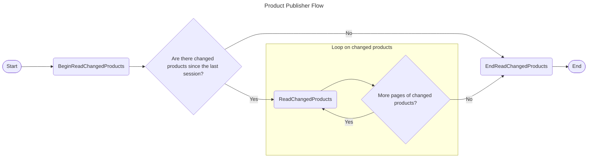

# Publisher flow (mermaid diagram)

```mermaid
---
title: Product Publisher Flow
---
flowchart LR

start1([Start]) 
BRCP(BeginReadChangedProducts)
decision1{Are there changed products since the last session?}
decision2{More pages of changed products?}
RCP(ReadChangedProducts)
ERCP(EndReadChangedProducts)
end1([End])

start1 ---> BRCP
BRCP --> decision1
decision1 -->|Yes| RCP
decision1 -->|No| ERCP
subgraph Loop on changed products
  direction TB
  RCP --> decision2
  decision2 --> |Yes| RCP
end
decision2 --> |No| ERCP
ERCP --> end1

click BRCP href "https://learn.microsoft.com/en-us/dynamics365/commerce/dev-itpro/retail-server-customer-consumer-api#products-controller"
click RCP href "https://learn.microsoft.com/en-us/dynamics365/commerce/dev-itpro/retail-server-customer-consumer-api#products-controller"
click ERCP href "https://learn.microsoft.com/en-us/dynamics365/commerce/dev-itpro/retail-server-customer-consumer-api#products-controller"

```

Also rendered as an image:
