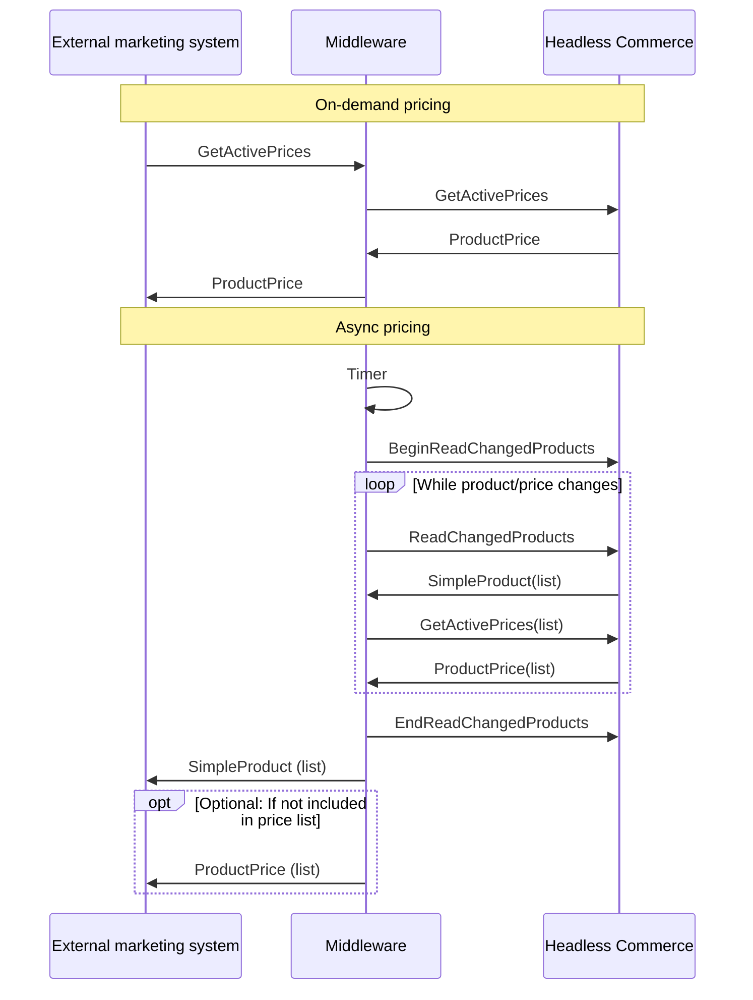

## Synchronizing prices from Dyanmics 365 with an external marketing platform

```mermaid
sequenceDiagram    
    participant A as External marketing system
    participant B as Middleware
    participant C as Headless Commerce   
    Note over A,C: On-demand pricing 
    A ->> B: GetActivePrices
    B ->> C: GetActivePrices
    C ->> B: ProductPrice
    B ->> A: ProductPrice
    Note over A, C: Async pricing 
    B ->> B: Timer
    B ->> C: BeginReadChangedProducts
    loop While product/price changes
      B ->> C: ReadChangedProducts
      C ->> B: SimpleProduct(list)
      B ->> C: GetActivePrices(list)
      C ->> B: ProductPrice(list)
    end
    B ->> C: EndReadChangedProducts
    B ->> A: SimpleProduct (list)
    opt Optional:  If not included in price list
      B ->> A: ProductPrice (list)
    end
```