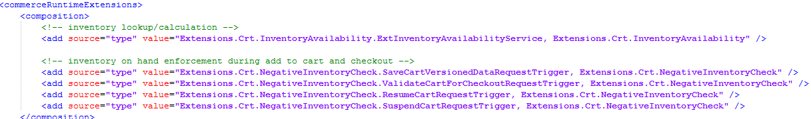

# Negative Inventory check

## Summary

The goal of this extension is to prevent the sale of items that would make the on-hand inventory count to go negative. In many cases, this would indicate a data, accounting or discipline problem in the store or business.

This guide can be used for learning purposes, or as a starting point for a customer&#39;s implementation.

The covered topics include:

- Understand the channel inventory capabilities in Dynamics 365 Commerce
- CRT extension to calculate the current on-hand inventory in the store
- CRT extension to prevent the sale of any item that would cause the on-hand inventory to go below zero

## Channel inventory - Setup

Starting with version 10.0.10 inventory information can be made available in the store without Real-time-service (RTS) calls. In many business cases it is not feasible to check the inventory in real-time as it would impact performance or operations negatively.

The official documentation can be found here: [https://docs.microsoft.com/en-us/dynamics365/commerce/calculated-inventory-retail-channels](https://docs.microsoft.com/en-us/dynamics365/commerce/calculated-inventory-retail-channels)

Follow the documentation closely to setup this feature, especially the part where the Shared parameters are configured.

## Sync job setup

To test this, all jobs can be run manually. However, to automate this in a real-world scenario, it is strongly suggested to chain all jobs together into one new batch job.

## Get familiar with the new Inventory lookup

In POS, use the same view to lookup inventory. However, since the &quot;optimized process for Product Availability job&quot; has been enabled, the RTS call will not occur anymore but the estimation of the on hand is calculated with this formula:

_productAvailability.PhysicalInventory - productAvailability.PhysicalReserved + productAvailability.UnprocessedQty + unpostedQuantity.UnpostedQuantity_

_productAvailability is synced from the HQ_

_unpostedQuantity is calculated on the fly in the channel_

As an example, POS view shows this for item 0001 (normal product):

A variant product works the same:

## Implementing negative Inventory check on Save cart and Checkout

The screen from the available inventory shows that the lookup occurs for all warehouses. This is not desired in the case for single store checkout, mostly for performance reasons.

Also, we do not want to check for inventory when a cart is being suspended or resumed.

| **operation** | **Action** |
| --- | --- |
| Add item to cart | Inventory check of line item |
| Checkout cart | Inventory check of all litem items |
| Suspend cart | No check |
| Resume cart | No check |

**Extension points**

As extension points for this new functionality, I chose these two CRT handler&#39;s PRE-Triggers:

SaveCartVersionedDataRequest: Executed at the end of any add-to-cart operation.

ValidateCartForCheckoutRequestTrigger: Executed during cart checkout

**Preventing multiple executions per CRT request**

There are cases when these triggers fire multiple times during a single request (as can happen with outer CRT handlers as well). We only need to call this inventory check once at the most per &quot;add to cart&quot; or &quot;checkout&quot; operation. We do need to check the inventory for all items that are not voided and are not service items. An easy way to accomplish this is to use an extension property on the CRT&#39;s request context. We can signal downstream code that a certain condition has been met (inventory check has been already carried out) by adding this information to the request context:

context.SetProperty(&quot;SKIP\_INVENTORY\_CHECK&quot;, true);

To match this up, we add a check at the beginning before we check the inventory:

object oSkipValue = context.GetProperty(&quot;SKIP\_INVENTORY\_CHECK&quot;);

bool skipInventoryCheck = (oSkipValue != null ? (bool)oSkipValue : false);

if (!skipInventoryCheck)

{

…

**Preventing the inventory check during suspend and resume of transactions**

It could cause issues if we would check for inventory during suspend and resume. There may be causes where we could not suspend a transaction when there is not enough inventory on hand. That is not what we need. We can use the same mechanism as described above to prevent in the inventory check by adding this in the PRE-triggers for Resume and Suspend transaction handlers:

publicvoid OnExecuting(Request request)

{

request.RequestContext.SetProperty(&quot;SKIP\_INVENTORY\_CHECK&quot;, true);

}

**Calculating the inventory**

The channel is aware of the last time the on-hand count from the Headquarter has been synced. The channel also has all information what occurred since then locally in the channel. These two pieces of information need to be combined to arrive at the correct current on-hand value for a certain item in this channel.

For details see the source code in ExtInventoryAvailabilityService.cs

**Preventing the sale**

If the ExtInventoryAvailabilityService.cs returns information that the on-hand is not enough for the current item sale, the same must be prevented. For this purpose, we throw CommerceException that is automatically used in POS to show a dialog:

Note:

Instead of the prevention of a sale, other possible implementations can be envisioned, for example:

-collect the information for later intervention

- creating an alert

- collection of information for reporting, etc.

## CRT implementation high-level discussion

1. CRT extension 1: A new CRT handler was written in class Extensions.Crt.InventoryAvailability. ExtInventoryAvailabilityService. It carries out the calculation as mentioned above.
2. CRT extension 2: 4 triggers are added to add or prevent the inventory check.

## Variations of implementation

There may be cases where simply throwing a CommerceException is not good enough. There could be a more advanced UI flow, view or operation in POS to carry out a more complex business process. The CRT extension will be similar, but, possibly, it would have to be exposed via a new RetailServer api.

## Evaluating this on a development environment

A quick way to test this and see it in action is to "hand-drop" the necessary files. 

1. Copy the binaries into the location where RetailServer is installed, into the subfolder bin\Ext.  Often those files are located at K:\RetailServer\WebRoot\bin\Ext
2. Edit and save the CommerceRuntime.Ext.config file in the same location in order to register these 2 extension DLLs with the runtime. Alternatively, you can just copy the config file from the github project.

                                <!-- inventory lookup/calculation -->
                                <add source="type" value="Extensions.Crt.InventoryAvailability.ExtInventoryAvailabilityService, Extensions.Crt.InventoryAvailability" />

                                <!-- inventory on hand enforcement during add to cart and checkout -->
                                <add source="type" value="Extensions.Crt.NegativeInventoryCheck.SaveCartVersionedDataRequestTrigger, Extensions.Crt.NegativeInventoryCheck" />
                                <add source="type" value="Extensions.Crt.NegativeInventoryCheck.ValidateCartForCheckoutRequestTrigger, Extensions.Crt.NegativeInventoryCheck" />
                                <add source="type" value="Extensions.Crt.NegativeInventoryCheck.ResumeCartRequestTrigger, Extensions.Crt.NegativeInventoryCheck" />
                                <add source="type" value="Extensions.Crt.NegativeInventoryCheck.SuspendCartRequestTrigger, Extensions.Crt.NegativeInventoryCheck" />

3. Browse to the RetailServer endpoint. A positive response (Alive!) indicates that the DLLs are loaded and runtime is happy. Now, the DLLs are properly deployed. Assuming all the above mentioned configuration steps are carried out, you should see an error message when an item is added to the cart with no on-hand inventory.

