# Copilots extensibility in Dynamics 365 Finance - low code plugins

Copilots have changed the landscape of business and productivity apps and made AI the new UX. Lets see how copilots work in Dynamics 365 Finance and how these can be extended. This article will explore few copilot samples. With Power automate, we will build some low code but very powerful capabilities. When it comes to extensibility, Dynamics 365 for Finance offers three type of plugins, that extend the capabilities of copilot. 

1. **Low code plugins** –Microsoft Copilot Studio provides the orchestration of the AI capabilities for Copilot for finance and operations apps. Therefore, it enables a low-code maker experience for customizing the Copilot capabilities. You can utilize Power automate and its vast number of connectors to build some powerful capabilities.  

2. **Client plugins** - Client plugins, or client actions, are Microsoft Copilot plugins that invoke client code and are available for users in the context of client experiences for finance and operations apps. Developers can extend the Copilot chat capabilities in finance and operations apps by defining plugins that convert the functionality, operations, and business logic of the X++ code base into actions that users can invoke through natural language. For more information about client plugins and syntax, see [Create client plugins for Copilot in finance and operations apps](https://learn.microsoft.com/en-us/dynamics365/fin-ops-core/dev-itpro/copilot/copilot-client-plugins). 

3. **AI plugins** - AI plugins also extend the capabilities of copilot experiences in Microsoft Copilot Studio by using business logic in finance and operations X++ code. These plugins are headless operations that don't require specific application context in the finance and operations client. They can be added to Copilot for finance and operations apps to extend the in-app chat experience, or they can be added to other custom copilots. For more information, see [Create AI plugins for copilots with finance and operations business logic](https://learn.microsoft.com/en-us/dynamics365/fin-ops-core/dev-itpro/copilot/copilot-ai-plugins). 

This document will focus on low code plugins and create three fully functional samples step by step. 
For questions and feedback, please reach out to Aman Nain, amnai@microsoft.com

# Table of Contents
1. [Post 1: Summarise sales order](#post-1-summarise-sales-order)
2. [Post 2: Summarise customer](#post-2-summarise-customer)
3. [Post 3: Get stock on hand](#post-3-get-stock-on-hand)

# Pre-requisites
Enable Copilot in Finance and Operations apps in your environment. For instructions, see [Enable Copilot capabilities in finance and operations apps](https://learn.microsoft.com/en-us/dynamics365/fin-ops-core/dev-itpro/copilot/enable-copilot)

# Post 1: Summarise sales order

The scenario is that as a user one can desire a summary of a sales order. This can be handy as you don’t need to open different forms and tabs inside a sales order form to get the details. Such a topic in Copilot studio will be triggered when user types phrase like “summarise sales order”. Copilot will request for a sales order number. Please note in next example “summarise customer” we will automate so the copilot can use the page context/user context info to fetch the customer number, company ID as copilot have page and user contexts available. See for more: [Use application context with Copilot - Finance & Operations | Dynamics 365 | Microsoft Learn](https://learn.microsoft.com/en-us/dynamics365/fin-ops-core/dev-itpro/copilot/copilot-application-context)
Next the summarise sales order topic will call a Power automate action to retrieve data entity record for the sales order. Then another action will use the record information and call an AI prompt to summarise the record into human readable paragraph. We use the power of GPT LLM models available in Power automate to read data entity record details (JSON) and come up with a human readable natural language summary. The summary is not perfect but shows the potential of such copilots. The final summarised paragraph is returned to the user.
1.	Create topic in copilot studio. Go to copilot studio and select environment associated with your Dynamics 365 Finance.
2.	Make sure Generative AI setting is set to Classic. Generative option can randomly choose topics, actions and knowledge to progress a chat.   
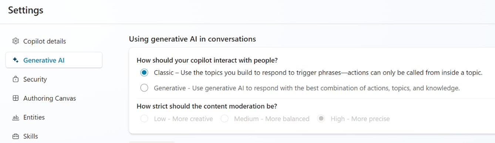

3.	Create a new topic and give it a name like “SummariseSalesOrderTopic”
4.	Add trigger phrases like “summarise sales order”

5.	Next node, add a question with text “I can provide summary for a sales order number. What Sales order number should I use for the summary?”
We need to capture the response in a variable of type integer or string. You can create new or use existing, I use Age.
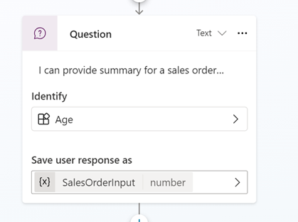

6.	For next step, we need to create a Power automate flow that will retrieve sales order data entity record using connection to a Dynamics 365 environment. This flow will be called from copilot using an Action, which we call “GetSalesOrderRecord”.

6.1 In Power automate portal, you build following sequence.

6.2 Lets go into each step. Define a string variable to accept the sales order number.

6.3 Next we call Dynamics 365, using “list items present in table” action and use a sales order entity. Specify parameters as below.

6.4 We use Compose to test the output, select body/value-item

6.5 Finally, respond to copilot with the previous output.

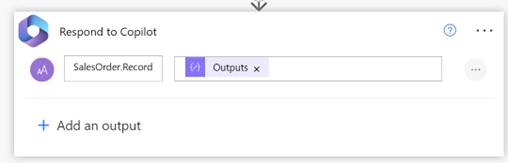

7.  Back in copilot studio, we choose the action “GetSalesOrderRecord” we just created above and specify the inputs and outputs variables.
   

8.  Next we define another flow to get a summary based on this data entity record we fetched using first flow. We call it, “SummarizeSalesOrder”. This will use AI capabilities of Power Automate, creating a summary using GPT model.
   
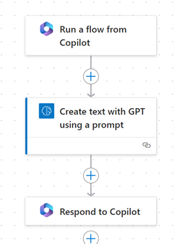

8.1 First accept input as a variable, “SalesOrderRecord”.

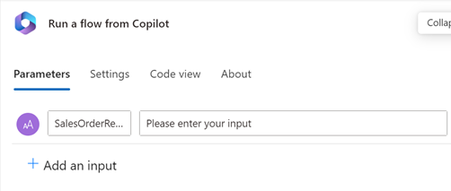

8.2 Next call “Create text with GPT using a prompt”, use the “AI Summarise” prompt and input text as the sales order variable of previous step. Optionally, in AdditionalContext, specify prompt instructions to guide the GPT model.

8.3 Finally return the output to copilot

9.  Back in Copilot studio, select the just created flow and set the inputs/outputs.

10.  Return the response as a Message to user.

11.  Save and Publish the copilot. And test the copilot in Dynamics 365 Finance. Since we don’t use any page context, and manually type sales order number we can use this topic on any screen in FO.

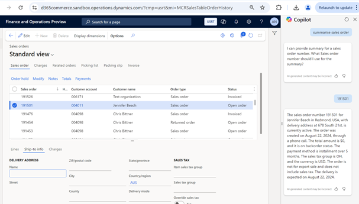

# Post 2: Summarise customer
In the next scenario, lets summarise customer given its customer account number but this time, we will take customer account number from the context info available inside copilot studio. Trigger can be something like “summarise customer”. 
Similar to above example, this scenario will have a copilot topic that will call a Power automate action to retrieve data entity record for the customer and pass that to an AI prompt to summarise the record into human readable paragraph. The final summarised paragraph is returned to the user.
1.	Create a new topic and call it SummariseCustomer and add few trigger phrases similar to “summarise customer”.

2.	Next node, add a condition that variable “Global.PA_Copilot_ServerForm_PageContext.rootTableName” is equal to CustTable. This variable stores tables names. We will use context info available to get the necessary values for our topic.

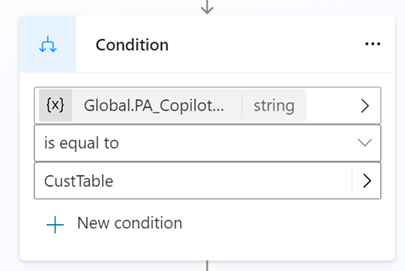

3.	For all other conditions, you return a message like “I am sorry, it doesn't look like you are focussed on a specific customer. Please select a customer in the list or click on a field in a card to summarise a customer and ask the question again.” We need these conditions to manage all kinds of situations and be able to progress the chat.

4.	Under the main node, add another condition, that variable “Global.PA_Copilot_ServerForm_PageContext.rootTableRecId” is not blank. And all other conditions, a message “I see you're on the customer but I don't know the record. Please try again”.

5.	Again, under the main node, we create our flow, lets call it “FTAppCopilot.SummariseCustomer”. You will be taken to Power automate portal. You should end up with a flow like below.

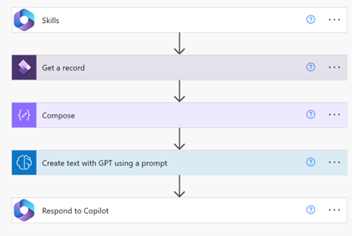

5.1 First specify two variables to get the company ID (DataAreaId) and account number (AccountNum) of the customer

5.2	Next call Dynamics 365 Finance instance, CustomersV3 entity to get the data entity record. In object id, specify the DataAreaId,AccountNum variables. With no spaces in between both.

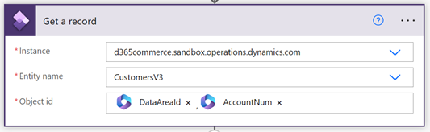

5.3	Next a compose action to save the returned body 

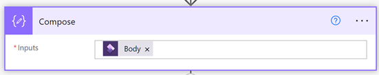

5.4	Then “Create text with GPT using a prompt” function

5.5	Finally, respond to copilot with the previous output

6.	Choose the just created flow, under the main node.

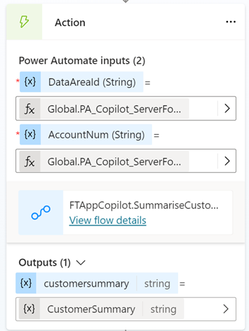

7.	Finally return the message to user

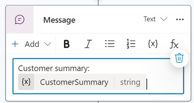

8.	Save and Publish the copilot. And test the copilot in Dynamics 365 Finance. Since we use context of the record, we need to be on a particular customer record (either list or details) to make this work.

# Post 3: Get stock on hand 

In the next scenario, lets see how we can call external APIs and use that information. We will get stock on hand for a product using the Inventory visibility service. This scenario requires the service to be already configured. Please see this page for more information on public APIs available [Inventory Visibility public APIs - Supply Chain Management | Dynamics 365 | Microsoft Learn](https://learn.microsoft.com/en-us/dynamics365/supply-chain/inventory/inventory-visibility-api). The page has sample code to call the API, get the AAD token and access token etc. We use the same guidance when calling HTTP actions in Power automate.
In copilot studio, we will design the topic to use some information already available in the page context/user context and rest we will ask the user to provide. Trigger can be something like “check stock” or “check onhand”. 

1.	Create a new topic and call it “CheckStockFromIVS” and add few trigger phrases like “check stock”, “check onhand”.

2.	Next, add a node “Variable management > Set a variable value”  and call it “Set Product variable” and store the value from “Global.PA_Copilot_ServerForm_PageContext.titleField1Value” in a variable called “ProductNo”.

3.	Likewise save legal entity value using variable “Global.PA_Copilot_ServerForm_UserContext.dataAreaId”

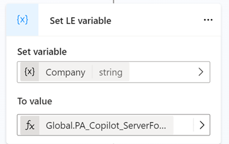

4.	Next we need site id, so we add a question and save the response in variable “SiteId”.

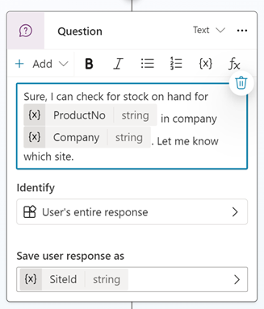

5.	And the location id and save the response in “LocationId”.

6.	Next we create a flow called “GetIVSStockOnHandByProduct” and design it in Power Automate as below.

6.1 Define the input variables as below.

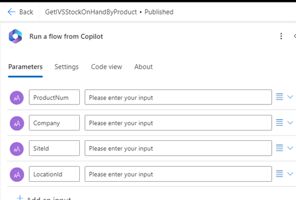

6.2 Add a HTTP action to get AAD token. URI has the tenant ID and Body needs IVS service client ID and client secret. Please see this on how to formulate these. [Inventory Visibility public APIs - Supply Chain Management | Dynamics 365 | Microsoft Learn](https://learn.microsoft.com/en-us/dynamics365/supply-chain/inventory/inventory-visibility-api)

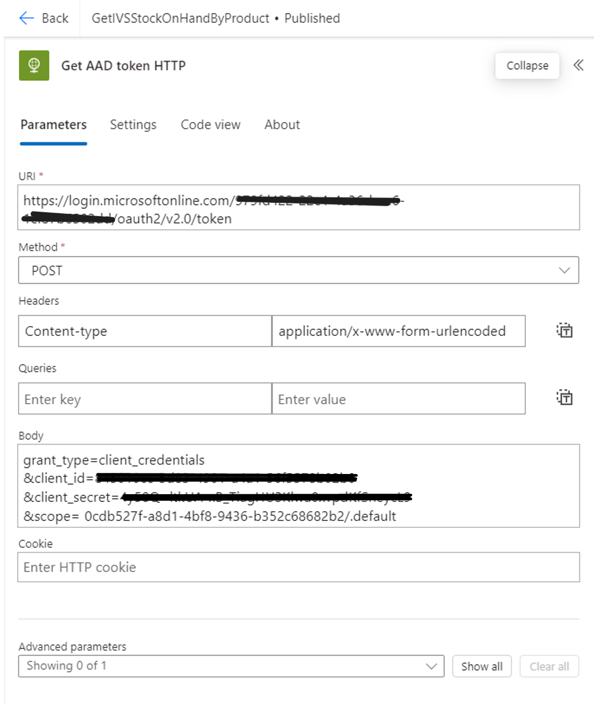

6.3 Add a Parse JSON to fetch the token. For schema, test the flow till previous step, retrieve the JSON output and paste in the sample payload to generate the schema as below.

6.4 Another HTTP action to get the API service access token. We use AAD token value variable fetched using previous Parse JSON step as input in Body parameters. “Context” has the FO environment ID.

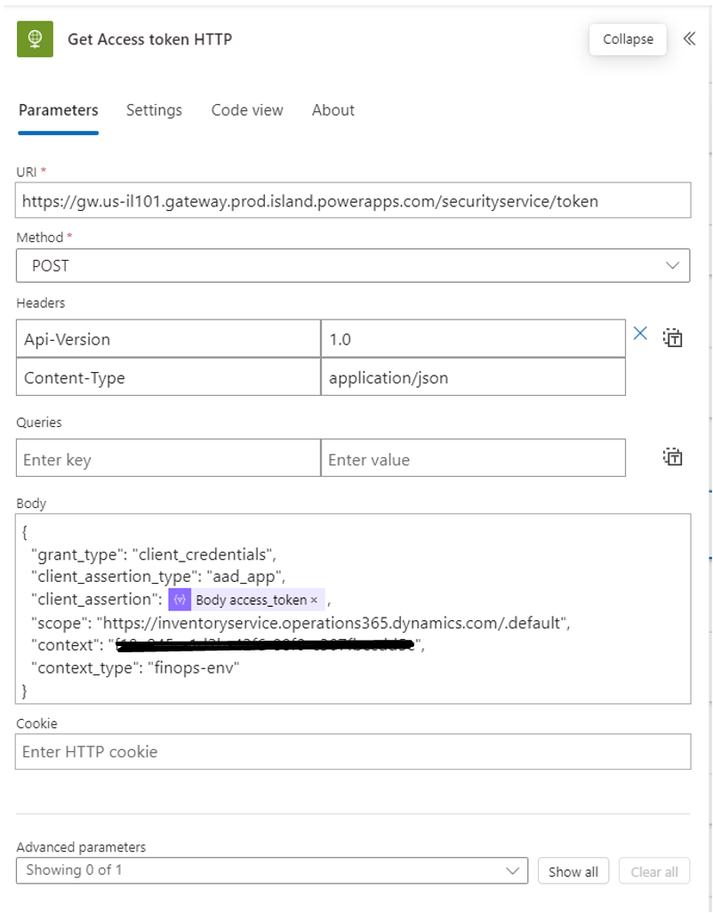

6.5 A Parse JSON to fetch API service access token. For schema, test the flow till previous step, retrieve the JSON output and paste in the sample payload to generate the schema as below.

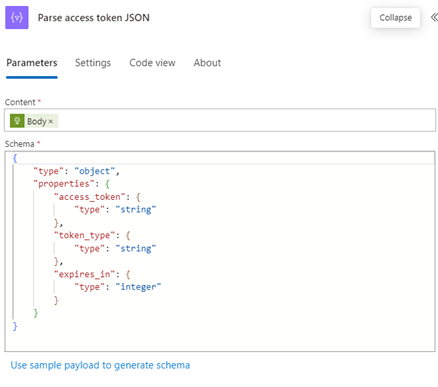

6.6 Next call HTTP to call the onhand API. Headers has the access token variable and Body has the Dynamics inputs, Company, Product, siteId and locationId.

6.7 Next Compose to save the body response.

6.8 Final compose to retrieve the available physical qty. We need a function as we read a nested json and first element of array. Use - outputs('Compose')[0].quantities.fno.availphysical

6.9 Return the output to copilot

7.	Back in Copilot studio, call the same flow.

8.	Output to user the available physical qty.

9.	Save and Publish the copilot. And test the copilot in Dynamics 365 Finance. Since we use context of the record, we need to page on a particular product to make this work.

# Conclusion
We built three simple topics that extend the power of copilots in Dynamics 365 Finance using the low code experience of Copilot studio and Power automate.

   
    
