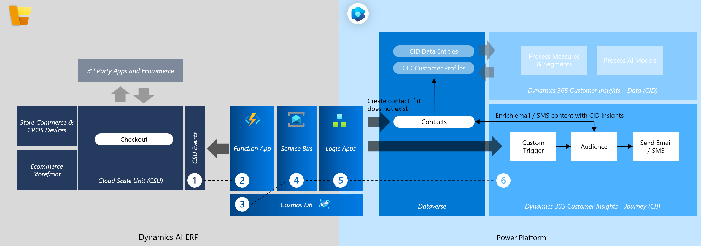

# Azure Cosmos DB Component for Dynamics 365 Commerce Integration

## Table of Contents

- [Overview](#overview)
- [Further Learning](#further-learning)
- [Features](#features)
- [Architecture](#architecture)
- [Prerequisites](#prerequisites)
- [Deployment](#deployment)
- [Configuration](#configuration)
- [Integration](#integration)
- [Monitoring](#monitoring)
- [Security](#security)
- [Troubleshooting](#troubleshooting)

## Overview

The Azure Cosmos DB component serves as a critical bridge between **Dynamics 365 Commerce**, the **Events Framework**, and **Customer Insights Journeys**. It handles state management for event processing, ensuring reliable and efficient data handling across your commerce solutions.

## Further Learning

For a deep dive and further learning on Cosmos DB, refer to [Azure Cosmos DB](https://learn.microsoft.com/en-us/azure/cosmos-db/).

## Features

- **Idempotency**
  - Ensures each event is processed only once by tracking events using unique identifiers.
  
- **Partitioning for Efficiency**
  - Utilizes channel IDs as partition keys for optimized storage and querying.
  - Facilitates effective scaling and concurrency management.

- **Retry and State Tracking**
  - Monitors the status of each event (e.g., new, processing, processed, failed).
  - Supports retry mechanisms for failed events, enhancing workflow reliability.

## Architecture

The component integrates seamlessly with Dynamics 365 Commerce, leveraging Azure Cosmos DB for robust state management. It interacts with the Events Framework to process and track events and connects with Customer Insights Journeys to enhance customer engagement strategies.

## Prerequisites

- **Azure Subscription**: Ensure you have an active Azure subscription.
- **Azure CLI or Azure Portal Access**: For deploying ARM templates.
- **Permissions**: Appropriate permissions to create and manage Azure Cosmos DB resources.
- **Dynamics 365 Commerce Setup**: Integrated with the Events Framework and Customer Insights Journeys.

## Deployment

To deploy the Azure Cosmos DB component, follow the [Azure Resource Manager (ARM) template deployment guide](https://learn.microsoft.com/en-us/azure/azure-resource-manager/templates/quickstart-create-templates-use-the-portal).

## Configuration

The ARM template sets up the following resources:

- **Azure Cosmos DB Account**
  - **Name**: `d365bettertogethecosmos` (modifiable via parameters)
  - **Location**: Central US
  - **Capabilities**: Serverless enabled
  - **Consistency Level**: Session

- **SQL Database**: `EventTrackingDB`

- **Role Definitions**
  - **Data Reader**: `Cosmos DB Built-in Data Reader`
  - **Data Contributor**: `Cosmos DB Built-in Data Contributor`

- **Containers**
  - **ProcessedEvents**
    - **Partition Key**: `/EventChannelId`
    - **Unique Key**: `/EventTransactionId`
    - **Conflict Resolution**: Last Writer Wins

### Parameters

| Parameter Name                                   | Description                            | Default Value               |
|--------------------------------------------------|----------------------------------------|-----------------------------|
| `databaseAccounts_d365bettertogethecosmos_name`  | Name of the Cosmos DB account          | `d365bettertogethecosmos`    |

## Integration

### Dependencies

Before integrating the Azure Service Bus component, Start at the beginning of the documentation [README](../README.md)

Before integrating the Azure Cosmos DB component, ensure that the [Commerce Events Framework](../Docs/commerce_event_framework.md) document is followed. This document outlines the necessary steps and configurations required for the Events Framework to function correctly with Azure Cosmos DB.

## Monitoring

Azure Cosmos DB offers comprehensive monitoring capabilities:

- **Azure Monitor**: Track metrics like request units (RUs), latency, and throughput.
- **Alerts**: Configure alerts for key performance indicators and failure conditions.
- **Diagnostics Logs**: Enable logging for detailed insights into operations.

## Security

- **Network Access**
  - Public network access is enabled.
  - IP rules can be configured as needed.

- **Authentication**
  - Uses built-in role definitions for data access.
  - Roles:
    - **Data Reader**
    - **Data Contributor**

- **Data Encryption**
  - Data at rest and in transit is encrypted using industry-standard protocols.

- **Access Control**
  - Role-Based Access Control (RBAC) ensures least privilege access.

## Troubleshooting

- **Deployment Issues**
  - Verify ARM template syntax.
  - Ensure you have the necessary permissions.
  - Check Azure service status for any outages.

- **Performance Bottlenecks**
  - Monitor RU consumption and scale accordingly.
  - Optimize partition keys to ensure even data distribution.

- **Connectivity Problems**
  - Ensure network rules and IP restrictions are correctly configured.
  - Verify firewall settings and virtual network integrations.
