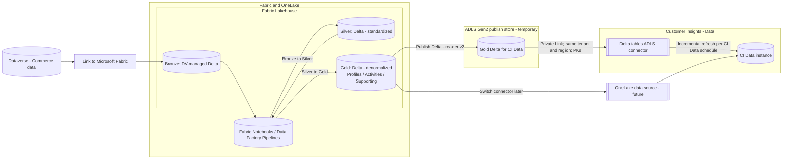
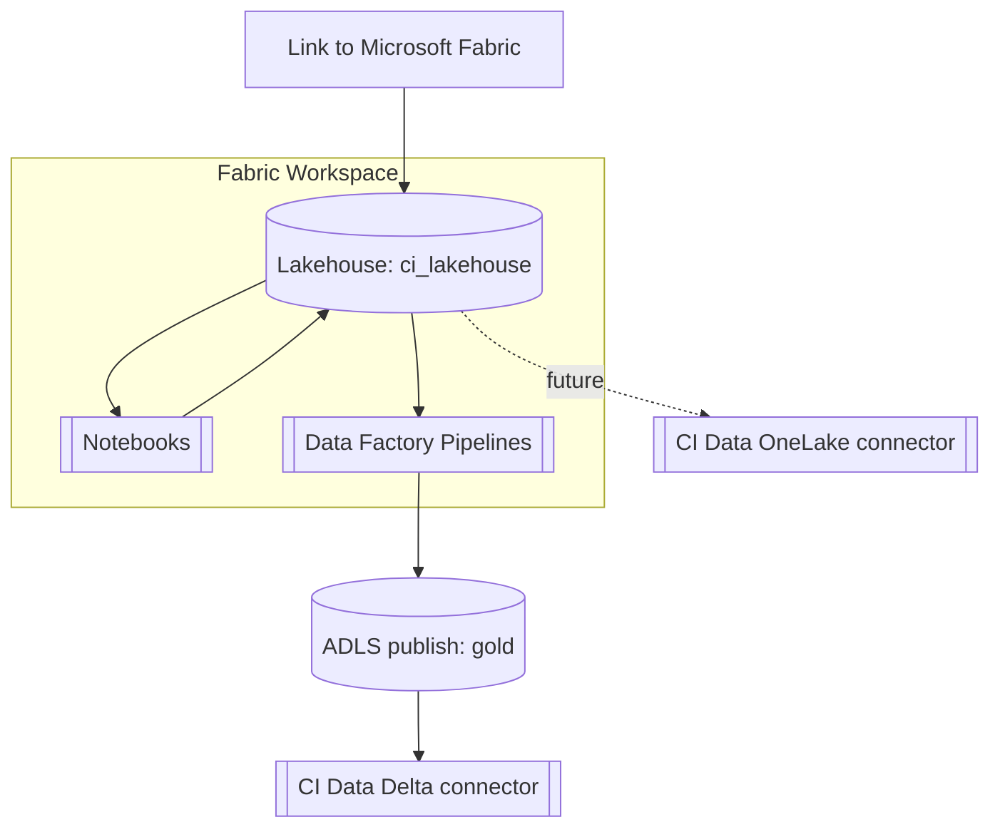

# Target architecture (Fabric-first)

## Overview

This solution uses Link to Microsoft Fabric to replicate selected Dataverse (Commerce) tables into OneLake (Delta Bronze). Fabric notebooks (PySpark) curate Silver and Gold tables. Until Dynamics 365 Customer Insights - Data (CI Data) supports OneLake as a source, Gold is published to ADLS Gen2 (Delta) and consumed via the CI Data Delta connector. When the OneLake connector is available, switch CI Data to OneLake and stop the ADLS publish step.

### Logical flow

### Deployment view

### Guardrails

- Delta min reader version 2 for all Gold tables (and ADLS copies).
- Deletion vectors disabled; no liquid clustering.
- Maintain about 15 days of `_delta_log` retention for CI Data incremental refresh safety.
- Same tenant and region across Dataverse, Fabric, and CI Data. Private Link enforced on the temporary ADLS account.
- No Power Query and no Fabric SQL Endpoint for CI Data ingestion.

## Naming and paths

- Workspace (example): `cicd-fabric-refarch`
- Lakehouse (as used in notebooks): `ci_lakehouse` (tables registered under `Tables/`)
- Silver root: `Files/Tables_silver/<table_name>` (tables include the `_silver` suffix, for example `customer_silver`)
- Gold root: `Files/Tables_gold/<table_name>` (for example `profiles_Customer`, `activities_Orders`)
- Optional analytics: `Files/Tables_gold/analytics_CustomerMetrics`
- Optional loyalty: `Files/Tables_gold/activities_LoyaltyPoints`, `Files/Tables_gold/supporting_LoyaltyRewardPoints`, `Files/Tables_gold/supporting_LoyaltyPrograms`
- ADLS account (example, temporary): `stcicdrefarch<region>` (HNS enabled), container `gold`
- ADLS Delta paths (recommended): `abfss://gold@stcicdrefarch<region>.dfs.core.windows.net/<table_name>/`
