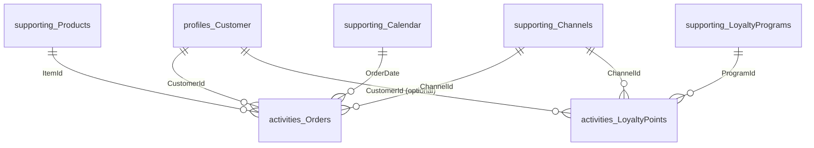

# Gold data model (CI Data friendly)

The following describes the consumer-facing Gold model produced by the notebooks. Types are indicative; refer to the Lakehouse schema if your environment differs.

CI Data refers to Dynamics 365 Customer Insights - Data.

> Protocol and retention. All tables are written with Delta reader v2, deletion vectors disabled, and about 15 days of `_delta_log` history.

## Profiles

### `profiles_Customer` (PK: `CustomerId`)

| Column | Type | Notes |
| --- | --- | --- |
| CustomerId | string | `lower(data_area_id + '_' + account_num)` |
| DataAreaId | string | Company |
| AccountNum | string | Source customer account |
| PartyType | string | Person or organization |
| Name | string | Party name |
| KnownAs | string | Nickname or alias |
| LanguageId | string | Preferred language |
| PrimaryEmail | string | Optional |
| PrimaryPhone | string | Optional |
| PersonFirstName | string | Optional |
| PersonMiddleName | string | Optional |
| PersonLastName | string | Optional |
| AddressLine | string | Optional |
| Street | string | Optional |
| StreetNumber | string | Optional |
| City | string | Optional |
| State | string | Optional |
| County | string | Optional |
| PostalCode | string | Optional |
| CountryRegionId | string | Optional |
| Latitude | double/decimal | Optional |
| Longitude | double/decimal | Optional |
| PartyRecordId | long | `dirparty` join key |
| PrimaryAddressLocationId | long | From `postal_address_silver` |
| RowModifiedUtc | timestamp | Audit |

## Activities

### `activities_Orders` (PK: `OrderLineId`) - partitioned by `OrderDate`

| Column | Type | Notes |
| --- | --- | --- |
| OrderLineId | string | `sales_id + '_' + line_recid` |
| OrderId | string | Source order header ID |
| CustomerId | string | FK -> `profiles_Customer.CustomerId` |
| ChannelId | string | FK -> `supporting_Channels.ChannelId` |
| ItemId | string | FK -> `supporting_Products.ProductId` |
| ProductName | string | Optional |
| OrderDate | date | Partition column |
| OrderTimestamp | timestamp | Event timestamp (UTC) |
| SalesQty | decimal(18,4) | Optional |
| UnitPrice | decimal(18,4) | Optional |
| LineDiscount | decimal(18,4) | Optional |
| LineAmount | decimal(18,4) | Calculated when missing |
| CostPrice | decimal(18,4) | Optional |
| CurrencyCode | string | Optional |
| SalesUnit | string | Optional |
| PriceUnit | string | Optional |
| SalesStatus | string | Source status |
| DataAreaId | string | Company |
| RowModifiedUtc | timestamp | Audit |

### `activities_LoyaltyPoints` (PK: `LoyaltyEventId`) - partitioned by `EventDate` (optional)

| Column | Type | Notes |
| --- | --- | --- |
| LoyaltyEventId | string | Hash of card, reward point, sales, transaction, rec id |
| CustomerId | string | From loyalty card when available |
| CardNumber | string | Loyalty card identifier |
| RewardPointId | string | Reward point identifier |
| PointsDelta | decimal | Points delta (earn or redeem) |
| RemainingBalance | decimal | Balance after transaction |
| ProgramId | string | Loyalty program identifier |
| LoyaltyTier | string | Loyalty tier when available |
| OrderId | string | Sales order reference |
| ChannelId | string | Retail channel |
| StoreId | string | Store identifier |
| TerminalId | string | POS terminal identifier |
| TransactionId | string | Transaction identifier |
| StaffId | string | Staff identifier |
| LoyaltyTransactionType | string | Transaction type |
| DataAreaId | string | Company |
| EventTimestamp | timestamp | Event timestamp (UTC) |
| EventDate | date | Partition column |
| ExpirationDate | timestamp | Reward expiration |
| RowModifiedUtc | timestamp | Audit |

## Supporting

### `supporting_Products` (PK: `ProductId`)

`ProductId`, `ProductName`, `RowModifiedUtc`.

### `supporting_Channels` (PK: `ChannelId`)

`ChannelId`, `ChannelRecId`, `RowModifiedUtc`.

### `supporting_Calendar` (PK: `Date`)

`Date`, `Year`, `Quarter`, `Month`, `Day`, `WeekOfYear`, `DayOfWeek`, `RowModifiedUtc`.

### `supporting_LoyaltyRewardPoints` (PK: `RewardPointId`) (optional)

Schema-only placeholder table for CI Data compatibility.

| Column | Type | Notes |
| --- | --- | --- |
| RewardPointId | string | Reward point identifier |
| RewardPointType | string | Reward point type |
| Redeemable | boolean | Redeemable flag |
| RewardPointCurrency | string | Currency or unit |
| RowModifiedUtc | timestamp | Audit |

### `supporting_LoyaltyPrograms` (PK: `ProgramId`) (optional)

| Column | Type | Notes |
| --- | --- | --- |
| ProgramId | string | Program identifier |
| ProgramName | string | Program name |
| AffiliationType | string | Program affiliation type |
| PoolRelatedCards | boolean | Pool related cards flag |
| HideInChannels | boolean | Hide in channels flag |
| DataAreaId | string | Company |
| RowModifiedUtc | timestamp | Audit |

## Optional analytics

### `analytics_CustomerMetrics` (PK: `CustomerId`, `AsOfDate`)

- Optional snapshot table for BI or agent consumption; not required by CI Data connectors.
- Aggregates customer-level KPIs (revenue, gross margin, order cadence, loyalty engagement).
- Partitioned by `AsOfDate`; see `customer-metrics.md` for detailed calculations.

## Entity relationships

