Introduction

The purpose of Optimize25 is to provide resources that help optimize the Dynamics 365 implementation experience.

This document outlines the required steps to configure and simulate out Digital Contact Center, Customer Service Workspace, Channel Integration Framework v2.0 with voice channel.

Prerequisites

Please refer the prerequisite and system requirements –

[https://learn.microsoft.com/en-us/dynamics365/customer-service/channel-integration-framework/v2/system-requirements-channel-integration-framework-v2](https://learn.microsoft.com/en-us/dynamics365/customer-service/channel-integration-framework/v2/system-requirements-channel-integration-framework-v2)

Setup

  1. Dynamics 365 Solution import

The solution to be imported is DCCPChannelIntegrationFramework

    1. Choosing a default account and contact

The Simulator has the following defaults:

- Account
  - Name: A Datum Corporation
  - Id: a16b3f4b-1be7-e611-8101-e0071b6af231
- Contact
  - Name: Abraham McCormick
  - Id: 25a17064-1ae7-e611-80f4-e0071b661f01

If you want or have to choose another default Account for your environment, select it and click on Email a link:

Pick the Name and the Id:

Use the same actions to choose a default Contact

    1. Change the HTML page to reflect the chosen default account and contact

Edit the code changing the onChangeCustomerEntityName() function with the picked values:

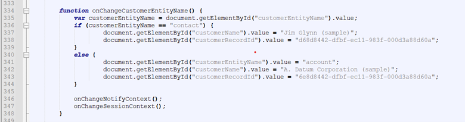

Edit the default value for the Customer Name textbox, with the chosen Account name:

Edit the default value for the Customer Record Id (GUID) textbox, with the chosen Account id:

  1. Customer Service admin center configuration

    1. Notification Templates

Navigate to Agent experience -\> Workspaces -\> Notification Templates and click Manage

Create these Notification Templates:

      1. DCCP Voice Notification

Name: DCCP Voice Notification

Unique Name: extn\_voice\_notification

Title: {customerName}

Icon:

Include also the extn\_phonenumber notification field:

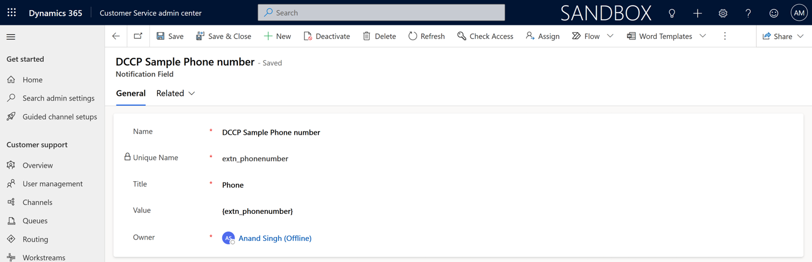

    1. Application tabs

Navigate to Agent experience -\> Workspaces -\> Application tab templates and Manage

Create these Application tabs:

      1. DCCP Global Search

Name: Global Search

Unique Name: extn\_global\_search

Page Type: Search

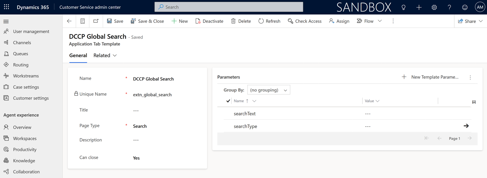

      1. DCCP Case Form

Name: DCCP Case Form

Unique Name: extn\_case\_tab

Page Type: Entity Record

Parameters:

data: {"customerid":"{customerRecordId}", "customeridtype":"{customerEntityName}", "customeridname":"{customerName}", "caseorigincode":"{extn\_media\_type}", "description":"Phone: {extn\_phonenumber} / Email: {extn\_email\_address} / InteractionId: {extn\_interactionid}", "title":"{extn\_subject}"}

entityName: incident

      1. DCCP Customer Form

Name: DCCP Customer Form

Unique Name: extn\_customer\_tab

Title: {customerName}

Page Type: Entity Record

Parameters:

entityId: {customerRecordId}

entityName: {customerEntityName}

    1. Session Templates

Navigate to Agent experience -\> Workspaces -\> Session templates and click Manage

Create these Session Templates:

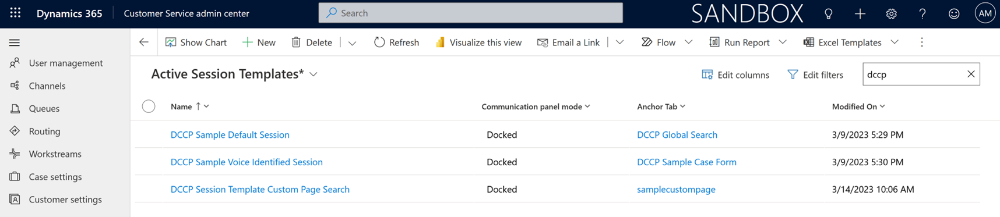

      1. DCCP Default Session

Name: DCCP Default Session

Unique Name: extn\_default\_session

Type: Generic

Title: CIF 2.0 Simulator Home

Communication panel mode: Docked

Anchor Tab: Global Search

      1. DCCP Voice Identified Session

Name: DCCP Voice Identified Session

Unique Name: extn\_voice\_identified\_session

Type: Generic

Title: Voice-{customerName}

Communication panel mode: Docked

Anchor Tab: DCCP Case Form

Additional Tabs:

DCCP Customer Form

  1. Channel Provider

Navigate to Agent experience -\> Workspaces -\> Third Party voice channel provider and click Manage

Create the following channel provider:

    1. CIF2 Simulartor

Name: CIF2\_Simulator

Unique Name: extn\_cif2simulator

Label: CIF2 Simulator

Channel URL: https://\<EnvironmentURL\>//WebResources/extn\_/sample/vnb\_cif\_support\_html

Enable Out Bound: Yes

Channel Order: 1

Api Version: 2

Enable Analytics: Yes

  1. Agent experience profiles

Navigate to Agent experience -\> Workspaces -\> Agent experience profiles and click Manage

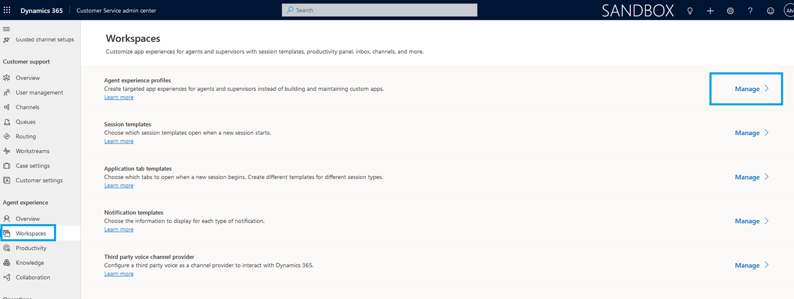

Create the following App profile:

    1. CIF2 Simulator

Name: CIF2\_Simulator

Unique Name: extn\_cif2simulator

Label: CIF2 Simulator

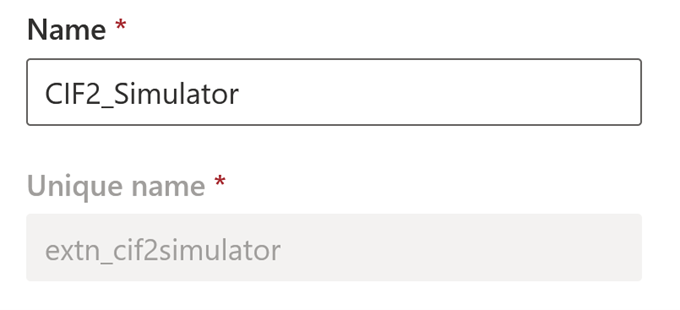

    1. Under Channels Tab

Add Voice Channel provider: CIF2\_Simulator

All active channels: Off

    1. Assign Users

Click on Edit to Assign Users

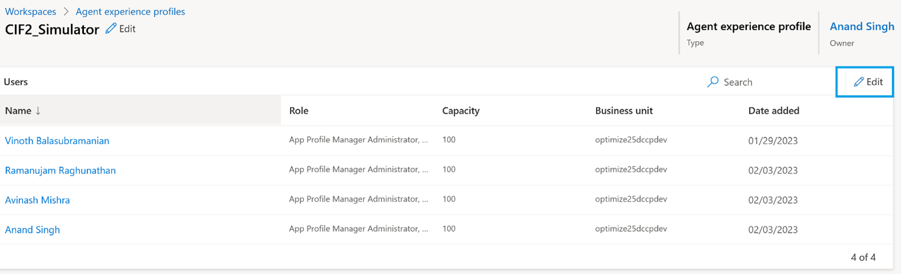

Add the users that will work with the Simulator to this list:

  1. Using the Simulator

    1. Inbound Interaction

These are the parameters that you can configure to simulate a inbound interaction:

- Media Type – Channel of the interaction. It will fill the {extn\_media\_type} custom slug ([https://docs.microsoft.com/en-us/dynamics365/customer-service/channel-integration-framework/v2/automation-dictionary-keys-cif#slugs](https://docs.microsoft.com/en-us/dynamics365/customer-service/channel-integration-framework/v2/automation-dictionary-keys-cif#slugs))
- Notify Template – Read-only. It will change according to the Media Type
- Session Template – Read-only. It will change according to the Media Type
- Telephone – It would be the "calling number" and. It will fill the {extn\_phonenumber} custom slug
- E-mail Address – It would be the "E-mail Address" for Email and Chat channels. It will fill the {extn\_email\_address} custom slug
- Subject – It is a simple text that will fill the {extn\_subject} custom slug.
- Interaction/Call Id (extn\_interactionid) – It is the unique identifier of the interaction/call id in the 3rd party channel provider. In the Simulator, it is a random GUID and it will fill the {extn\_interactionid} custom slug.
- Customer Data: You can change the default values for these fields, but you should choose an existing account or contact
  - Customer Name – Name of the account (name) or contact (fullname). It will fill the {customerName} slug.
  - Customer Entity Name – account or contact. It will fill the {customerEntityName} slug.

Customer Record Id (GUID) – accountid or contactid of the customer. It will fill the {customerRecordId} slug

    1. Notify

After choosing the Media Type and filling the Parameters form, click on Notify, accept \> create session || reject \> create task:

It will pop-up the Notification alert.

    1. Accepting the Notification

When you accept the notification, a new Session will be created, opening:

- New Case form filling:
  - Origin: value from {extn\_media\_type}
  - Case Title: value from {extn\_subject}
  - Customer: values from {customerEntityName}, {customerRecordId} and {customerName}
  - Description: concatenation of {extn\_phonenumber}, {extn\_email\_address} and {extn\_interactionid}
- Customer tab: account or contact form according to Customer Data: {customerEntityName}, {customerRecordId} and {customerName}

    1. Rejecting or Timing Out the Notification

If you Reject or let the Notification Timeout, it will alert that a new Task was created:

The Tasks are created as presented below:

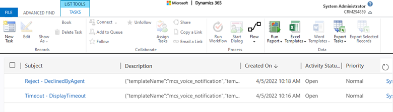

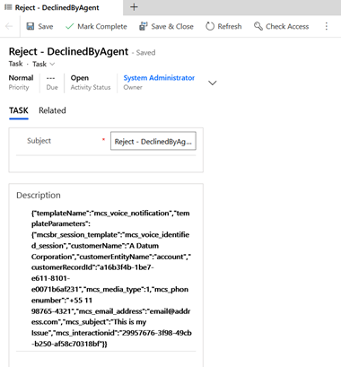

    1. Multi-session experience

You can create multiple sessions by customer and channel:

  1. Outbound (click-to-call / click-to-act) Interaction

Select the Customer form under a Session and click in the Phone icon:

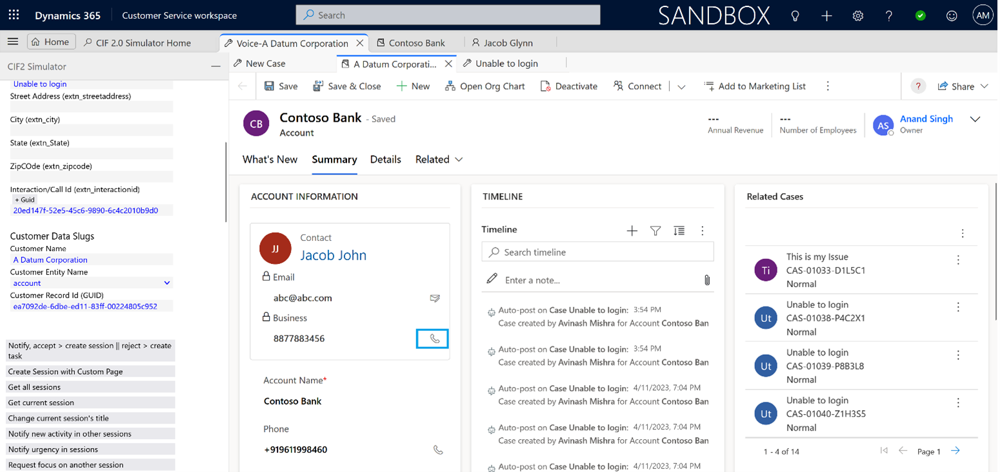

It will trigger the CIF 2.0 onclicktoact event ([https://docs.microsoft.com/en-us/dynamics365/customer-service/channel-integration-framework/v2/enable-outbound-communication-clicktoact](https://docs.microsoft.com/en-us/dynamics365/customer-service/channel-integration-framework/v2/enable-outbound-communication-clicktoact)):

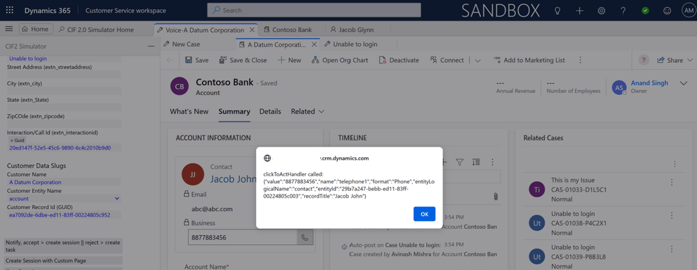

  1. Miscellaneous CIF API Calls

The simulator has some buttons to call CIF 2.0 API ([https://docs.microsoft.com/en-us/dynamics365/customer-service/channel-integration-framework/v2/reference/microsoft-ciframework-v2](https://docs.microsoft.com/en-us/dynamics365/customer-service/channel-integration-framework/v2/reference/microsoft-ciframework-v2)):

    1. Get all sessions:

It calls Microsoft.CIFramework.getAllSessions

    1. Get current session:

It calls Microsoft.CIFramework.getFocusedSession

    1. Change current session's title:

It calls Microsoft.CIFramework.setSessionTitle

    1. Notify new activity in other sessions:

It calls Microsoft.CIFramework.notifyNewActivity

    1. Notify urgency in sessions:

It calls Microsoft.CIFramework.notifyKpiBreach

    1. Request focus on another session:

It calls Microsoft.CIFramework.requestFocusSession

    1. Set presence status as Away:

It calls Microsoft.CIFramework.setPresence

    1. Create case:

It calls Microsoft.CIFramework.createRecord

    1. Close current Tab:

It calls Microsoft.CIFramework.closeTab

  1. Extending the Simulator

The Simulator code is under the extn\_/sample/vnb\_cif\_support\_html web resource. It is an HTML file containing the page definition and the Javascripts.

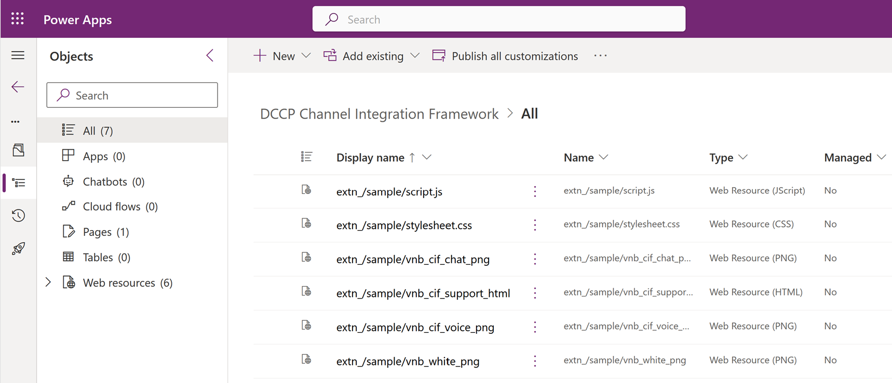

If you need, for instance, to add new slugs / attributes, you should:

- Include them in the form, for instance, after the Interaction/Call Id
- Include them in the Notification by adding them to the onChangeNotifyContext function
- Include them in the Session Context by adding them to the onChangeSessionContext function

If you want, for instance, to perform some actions in Dynamics after creating a session, you should add them to \_createSession function.

    1. Adding the {comment} slug to the form:

In this example, we are including the {comment} field below the Subject field inside the HTML \<body\>:

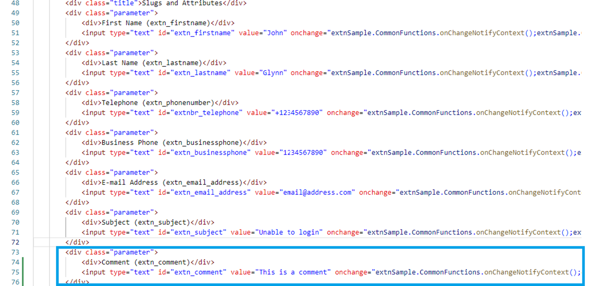

    1. Adding the {comment} slug to the Notification input object:

The changes should be made to onChangeNotifyContext function:

    1. Adding the {comment} slug to the Session creation input object:

The changes should be made to onChangeSessionContext function: 

    1. Adding the {comment} slug to the Notification template:

Add the Comment notification field for {comment} slug as follows:

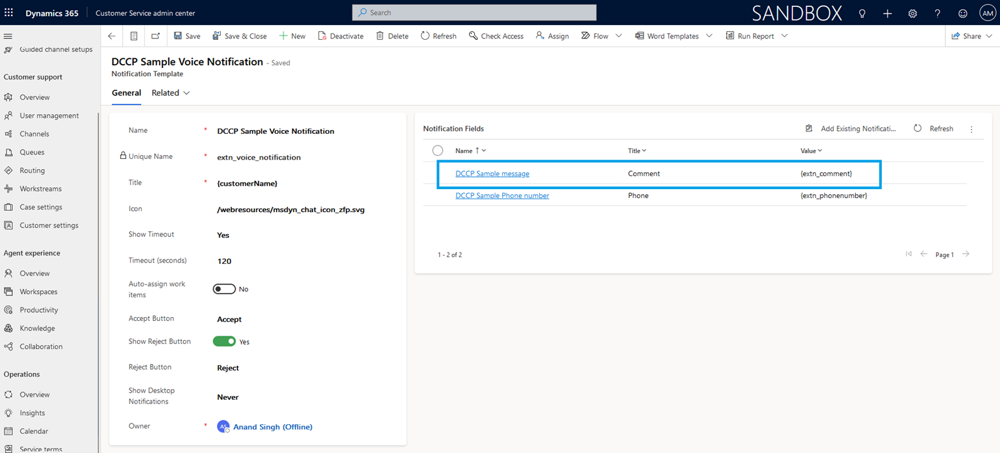

It will be presented to the user like this:

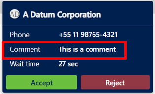

    1. Using the {comment} slug in the Case form:

Create a new JavaScript Web Resource with the following function and include it to the Case form Onload event:

function extn\_CaseForm (executionObj) {

var formContext = null;

if (executionObj !== null && executionObj.getFormContext !== null)

formContext = executionObj.getFormContext();

else

formContext = executionObj;

Microsoft.Apm.getFocusedSession().getContext().then(

function (session\_context) {

if (session\_context.parameters["comment"] != null && session\_context.parameters["comment"] != undefined && session\_context.parameters["comment"] != "") {

alert("Comment for the user: " + session\_context.parameters["comment"]);

}

}

);

}

This function will present an alert message to the user like this:

  1. Reference and Documentation

    1. Channel Integration Framework 2.0

[https://docs.microsoft.com/en-us/dynamics365/customer-service/channel-integration-framework/v2/overview-channel-integration-framework](https://docs.microsoft.com/en-us/dynamics365/customer-service/channel-integration-framework/v2/overview-channel-integration-framework)

Expand Version 2.0 in the left hand side navigation pane to all related documentation:

