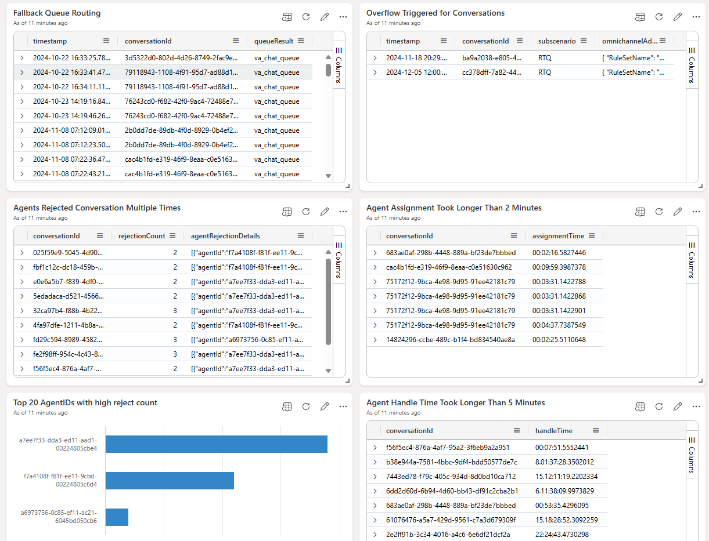
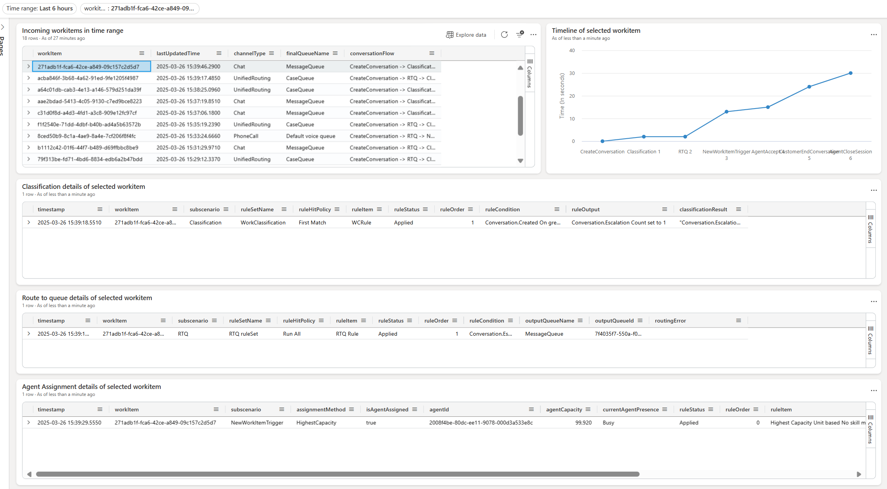

# Conversation Diagnostics Dashboard
This dashboard contains two pages.  
- Conversation Diagnostics Page, shows information about Conversation diagnostics and different erroneous scenarios. Using this dashboard, it is possible to identify:
  - Conversation state flow for different conversation IDs. 
  - Fallback Queue routing telemetry
  - Overflow triggred conversations
  - Conversations which were rejected by multiple agents
  - Top Agent IDs with high reject count.
  - Conversations where Agent assignment took more than 2 minutes
  - Conversations where Agent Handle time was more than 5 minutes
- Unified Routing Diagnostics Page, show the conversations in a time range and with the right click on selected workItem and clicking on Cross-filter option all the tiles will be load with the workItem related data. 

## Dashboard overview

### Conversation Diagnostics Page

### Unified Routing Diagnostics Page

  

## Steps to import the sample dashboard:
  1. Import the file "dashboard-CSAppInsights.json".
  
  

  2. Name the dashboard appropriately and then click to select datasources
  
  

  
  
  3. In the Datasource selection pane you have to put your Azure Application Insights subscriptionID in the placeholder .
  
  

  

  4. After updating the correct subscriptionID. click on connect.

  5. You will get a list of databases. Select your ApplicationInsights name from that list and save changes.

  6. your dashboard should have data now. Feel free to edit the queries to suit your needs. 
