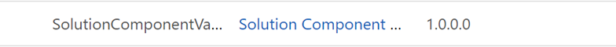

# Solution Component Validator

### Overview

Solution management is the core design tenet of any Dataverse/Dynamics 365 CE Implementation. Often, medium-to-complete engagements require multi-solution models where solutions are horizontally segmented, which involves dividing solutions based on the type of components they contain, such as plugins, flows, and PCF controls, with the goal of developer isolation. It is important that developers adhere to the segmentation otherwise it can often lead to solution layering issues and dependency conflicts requiring fixes, post facto, that take months to finish and may require support tickets/resolve layering issues.

This tool is built to provide proactive alerts on such deviations from the horizontal segmentation intended in solutions and to help Devs, Leads, DevOps team maintain the agreed solution structures, while in the development stage itself, for Healthy ALM. 

#### Target Audience
+ Non-Technical reviewer can also check the report.
+ Reviewer
+ Deployment manager

#### Benefits from the Tool
+ Proactive alerts to the Devs, leads during Development itself.
+ Saves manual efforts of fixing layering issues on Upstream environments.
+ Helps avoid addition delays due to support requests to resolve layering issues

### Installation

This tool is a managed solution that includes the following components:

|Name |Type |
|----------------- |:---|
|Component Auto Mailer |Entity|
|msft_recordguide	| Web Resource|
|Solution Auto Mailer Admin|	Security Role|
|Solution Auto Mailer User|	Security Role|
|Solution Component Auto Mailer V2|	Power Automate|

#### Installation Steps
1.	Install the managed solution “Solution Component Validator Auto Mailer” in respective environment.
2.	Open Target environment, Go to Settings- > Solutions.
3.	Click on the Import Button and choose file, then import.

4.  The solution will appear like the below

##### Configuration Steps
1.	For each solution you would like to monitor create a “Component Auto Mailer” record by creating new record.
2.	Add Solution Name, Solution Guid Id (you can get this by opening the solution in the maker portal)

3.	White List the componets by Object Type Id ([solutioncomponent EntityType (Microsoft.Dynamics.CRM) | Microsoft Learn](https://learn.microsoft.com/en-us/power-apps/developer/data-platform/webapi/reference/solutioncomponent?view=dataverse-latest)) which you are expecting to be included in the solution. The report will include all other components types if they are added incorrectly to the solution. 
4.	Finally use a semi-colon delimited list of email addresses to recieve the report.

#### Sample Output

