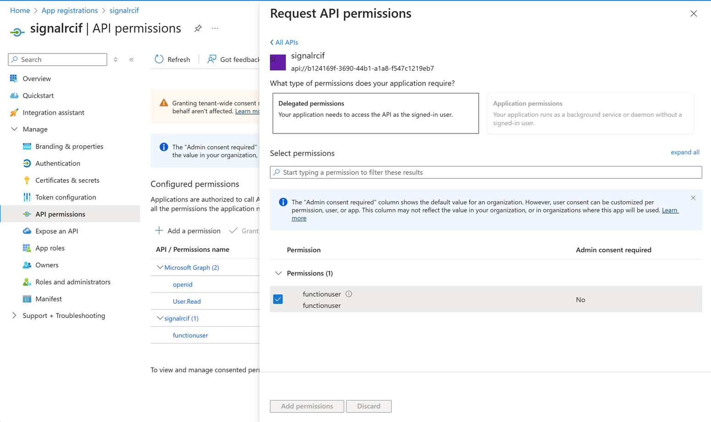
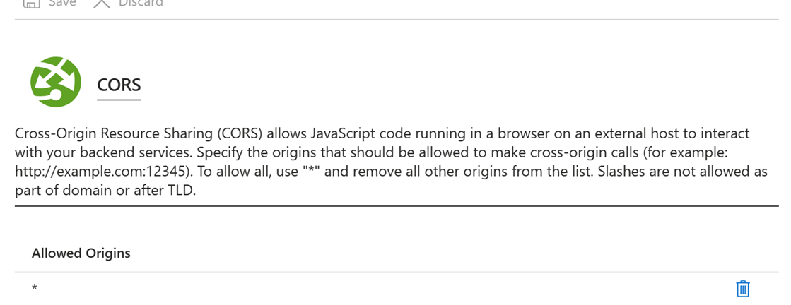

# Sample Adaptor for Channel Integration Framework

## Introduction

This article outlines guide on configuring and setting up an adaptor for Channel Integration Framework to receive notifications from external applications.

The sample adaptor included in this guide demonstrates how an external application can notify a user about incoming notifications using the Channel Integration Framework API V2.0. By showcasing the adaptor code as a sample, this document offers insights into integrating an existing application seamlessly with the Channel Integration Framework, making it easier for developers to understand a one of the patterns to integrate with Channel Integration Framework. 

## Prerequisites

Please refer the prerequisite and system requirements – 

The sample requires for [Dynamics 365 Channel Integration Framework | Microsoft Learn](https://learn.microsoft.com/en-us/dynamics365/channel-integration-framework/v2/administer/system-requirements-channel-integration-framework-v2)

Microsoft Azure components – 

Azure Active Directory App Registration [Quickstart: Register an app in the Microsoft identity platform - Microsoft identity platform | Microsoft Learn](https://learn.microsoft.com/en-us/entra/identity-platform/quickstart-register-app)

Azure Function [Azure Functions Overview | Microsoft Learn](https://learn.microsoft.com/en-us/azure/azure-functions/functions-overview?pivots=programming-language-csharp)

Azure Storage Table [Introduction to Table storage - Object storage in Azure | Microsoft Learn](https://learn.microsoft.com/en-us/azure/storage/tables/table-storage-overview)

Azure Singal R [Real-time apps with Azure SignalR Service and Azure Functions | Microsoft Learn](https://learn.microsoft.com/en-us/azure/azure-signalr/signalr-concept-azure-functions)

## Architecture
The Sample Adaptor uses the SignalR Serverless Component with Azure Functions. When a client signs in to Dynamics, the Channel Integration Framework connects to SignalR. Users are authorized by Azure AD, and their connection details are stored in Azure Storage Table. 

The SignalR Client manages user connection and disconnection events, keeping a list of active users for notifications. External applications like softphones or Telephony Servers can send messages to Azure Function, which uses the SignalR API to send messages based on SignalR connection IDs. Notifications received through SignalR are shown to agents for acceptance or rejection using CIF V2.0 API

Communication Flow Sequence

When the user signs in, CIF Simulator tells the Azure function to create a link between the user and Signal R. An indicator shows gray or green depending on the status of the connection. 

The user’s active connection is stored in Azure storage with the interface through Azure Function. The system will use the recorded connection information to send a message to the user who is connected when a call comes in on the Telephony system.

## Deployment and Configuration Steps

Create an Azure App Registration

Register a Client Application in Microsoft Entra[Quickstart: Register an app in the Microsoft identity platform - Microsoft identity platform | Microsoft Learn](https://learn.microsoft.com/en-us/entra/identity-platform/quickstart-register-app)
	
Once Application registration is created, we need to update redirect url with Azure Function Url and Update other settings as below

Expose API Refer the document below [Quickstart: Register and expose a web API - Microsoft identity platform | Microsoft Learn](https://learn.microsoft.com/en-us/entra/identity-platform/quickstart-configure-app-expose-web-apis). Sample below 

Add API permission by searching for Above API scope

Create SignalR Resource in Azure
	Refer document to create Signal R server [Quickstart to learn how to use Azure SignalR Service | Microsoft Learn](https://learn.microsoft.com/en-us/azure/azure-signalr/signalr-quickstart-dotnet-core#create-an-azure-signalr-resource).
	Change the settings to Serverless   Click Signal R Service -> Settings

Add Cors within signal R Service. Click Signal R Service -> . For Sample we have allowed all orgins. we can confgiure the sepcific Urls

Enable SignalR service identity with system Managed. Click Signal R Service -> Identity.

Create a Azure Table Storage Container. [Create a table in the Azure portal - Azure Storage | Microsoft Learn](https://learn.microsoft.com/en-us/azure/storage/tables/table-storage-quickstart-portal). We need to update storage connection information and table name in azure function configuration.

Deploy Azure Function from Code\SignalRCIFAdaptor Folder in Github.

Enable Authentication in Azure Function Add Identity Provider as App Registration at part of the earlier step.

Update the Configuration of Azure function in Azure portal

| Configuration Key | Description | Sample values |
|:-|:-|:-|
| ApiScope | API Permission Provided for App registration .Its Created as part of App Registration Step. | Ex functionuser |
| APPLICATIONINSIGHTS_CONNECTION_STRING | Appinsights for azure function. Connection string of Appinsights ||
| Authority | For AD authentication Url | https://login.microsoftonline.com/<<Tenantid>> |
| AzureAd:ClientId | Client Id value from APP Registration  ||
| AzureAd:ClientSecret | Client Secret from App Registration ||
| AzureAd:TenantId | TenantId from App Registration ||
| AzureSignalRConnectionString | Connection string from Signal R service created above ||
| AzureWebJobsStorage | Connection string of Azure Table Storage created above ||
| HubName | Signal R Hub Name | Ex myhub |
| StorageUserTable | Table Name of the storage container | Ex ConnectionEntity |

Update Upstream settings in SignalR .[Upstream endpoints in Azure SignalR Service | Microsoft Learn](https://learn.microsoft.com/en-us/azure/azure-signalr/concept-upstream) . sample screenshot below azure function url <<Azure function URl>>/runtime/webhooks/signalr?code=<<API KEY>> . API key can be found in azure function . Deployed  Azure Functions->App Keys sample screenshot below

Download the package from Solution Folder.

Import a Solution in Dataverse

Enviroment Variables to be Updated dusring solution import

| Name | Value |
|:-|:-|
| ClientId | Client Id used to get the auth token. |
| AdaptorFunctionUrl | SingnalRCIFAdaptorFunction App url . Created as part eariler deployment steps |
| Authority | Authority URL. |
| Scope | Scope of Name. Specifed during App Registeration as part Expose API step.|

## Sample adapter Azure Function implementation details

List of Methods used in Azure Function

| Function Name | Description | Trigger | Authorization | Parameters | Returns |
|:-|:-|:-|:-|:-|:-|
| negotiate | Manages the negotiation of a SignalR connection | HTTP GET request | Requires authentication | req: HttpRequest object, connectionInfo: SignalRConnectionInfo object, log: ILogger object | SignalRConnectionInfo object |
| userclient | Stores connection information for a user client | HTTP POST request | Requires authentication | req: HttpRequest object, log: ILogger object | IActionResult |
| SendMessageToUser | Sends a message to a specific user | HTTP POST request | Requires authentication | req: HttpRequest object, signalRMessages: IAsyncCollector object, connectionInfo: SignalRConnectionInfo object, log: ILogger object | IActionResult |
| OnClientConnected | Manages the event when a client is connected | SignalR connection event || invocationContext: InvocationContext object, log: ILogger object | IActionResult |
| OnClientDisconnect | Manages the event when a client is disconnected | SignalR connection event || invocationContext: InvocationContext object, log: ILogger object | IActionResult |
| SendMessageAcknowlegement | Acknowledges receipt of a message sent by a client, Can extended to tailor the business requirement. | SignalR message event || invocationContext: InvocationContext object, content: Content of the message, log: ILogger object | void |
| StoreUserInformation | Stores user connection information in Azure Table Storage || Requires authentication | userId: User ID, connectionId: Connection ID, hubName: Name of the SignalR hub, table: CloudTable object, connectionStatus: Status of the connection, log: ILogger object | SignalRConnectionInfo object |

Client-side signalRadaptor.js

This JavaScript file sets up a SignalR client for communication with a SignalR hub using Azure AD authentication. Here is a summary of its key components and functionalities.

Configuration: It defines constants like functionUrl, clientId, authority, scopes, and redirectUri for Azure AD authentication and SignalR connection.

MSAL Setup: It configures Microsoft Authentication Library (MSAL) with the provided settings for authentication.

Method in signalRAdaptor

SignalR Client Initialization:

It initializes the SignalR client and defines methods within an Actions object for various actions related to SignalR communication.

Authentication:

It provides a method acquireTokenSilent to acquire authentication tokens silently using MSAL, handling scenarios where users are already authenticated or need to be prompted for authentication.

SignalR Connection Management:

It includes functions to start and manage the SignalR connection, such as startConnection, which initiates the connection, and connectToSignalR, which manages the negotiation process with Azure Function and connects to the SignalR hub.

Message Handling: 

It defines methods to manage sending messages to the server (acknowledgeMessageReceived) and registering the client with the server (registerClient).
