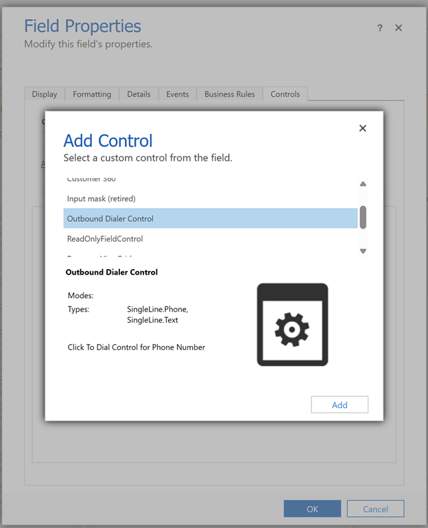
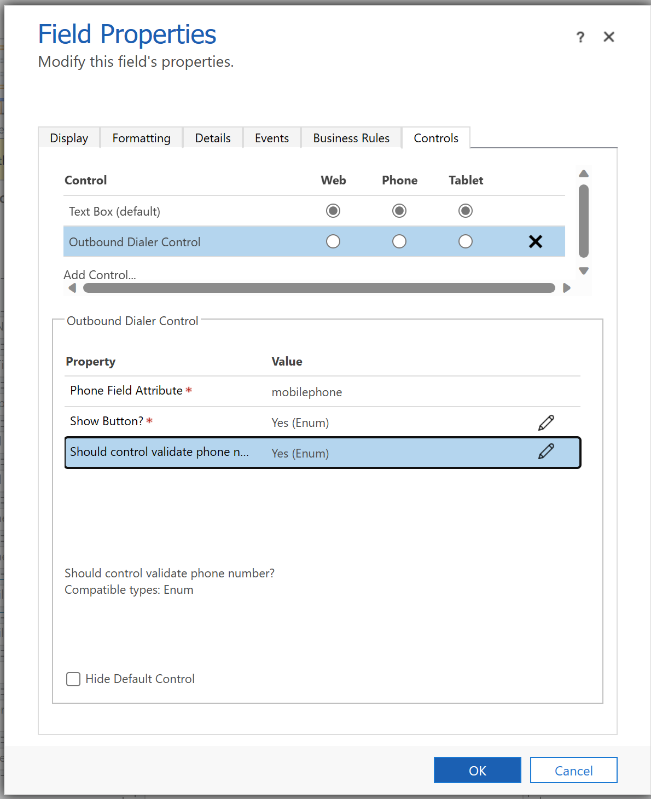
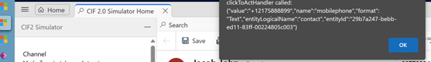

# Click to Dial Outbound Call

## Introduction

Custom Control is a functionality that enables users to make outbound calls from a CIF (Customer Interaction Center) provider within the Dynamics Customer Service apps. This control provides the capability to format a phone number and initiate an outbound call from a text or phone number field.

It's important to note that Custom Control utilizes the Omnichannel method for making outbound calls. The CIF provider doesn't offer any specific support method for outbound calls, so Custom Control leverages the Omnichannel capabilities to facilitate this functionality.

By leveraging Custom Control, users can conveniently format phone numbers and initiate outbound calls directly from relevant fields, enhancing their overall experience and improving efficiency in handling customer interactions within the Dynamics Customer Service apps.

## Deployment

Import Solution Outbound Dialer Control from Solution Folder.

Import a Solution : [Import solutions - Power Apps | Microsoft Learn](https://learn.microsoft.com/en-us/power-apps/maker/data-platform/import-update-export-solutions)

Successfully imports of solution to your environment.

Configuration of Control

Configure the custom control to desire field in the entity. This sample below shows control added in contact form.

Click Add Component if Component not listed switch classic and add the control

Click Ok and Save Publish the Form.

Test the control.

Navigate the desire app where the Form is configured with the Control

Open Contact Form

Information passed to CIF Provider

# Technical Document

Code Component can be accessed from GitHub

## ControlMainfest.Input.Xml

This XML file represents a manifest for a control called "ClickToDialControl." Let's go through its structure and explain each element:

- The XML declaration `\<?xml version="1.0" encoding="utf-8" ?\>` specifies the XML version and encoding used.

- The root element `\<manifest\>` encapsulates the entire manifest content.

- The `\<control\>` element represents the definition of the control. It has the following attributes:

- `namespace`: Specifies the namespace of the control (in this case, "ClickToDialControl").

- `constructor`: Indicates the constructor name of the control ("ClickToDialControl").

- `version`: Specifies the version of the control ("0.0.3").

- `display-name-key`: Provides a key for the display name of the control ("Outbound Dialer Control").

- `description-key`: Provides a key for the description of the control ("Click To Dial Control for Phone Number").

- `control-type`: Specifies the type of the control ("standard").

- The `\<property\>` elements define properties of the control. In this case, there are three properties:

1. `phoneNumber`: Represents a phone number field attribute. It has the following attributes:

- `name`: Specifies the name of the property.

- `display-name-key`: Provides a key for the display name of the property ("Phone Field Attribute").

- `description-key`: Provides a key for the description of the property ("Phone Number Attribute").

- `usage`: Indicates how the property is used ("bound" means it is bound to a value).

- `required`: Specifies if the property is required (in this case, "true").

- `of-type-group`: Refers to a type group named "PhoneFields" (defined later).

2. `showButton`: Represents a property to determine if a button should be shown. It has attributes similar to `phoneNumber`, along with child `\<value\>` elements that define the options ("Yes" and "No") with their respective display names and default value.

3. `validatePhoneNumber`: Represents a property to determine if the control should validate the phone number. It also has attributes similar to `phoneNumber`, and the child `\<value\>` elements provide options for "Yes" and "No," with "No" set as the default value.

- The `\<type-group\>` element defines a group of types. In this case, the group is named "PhoneFields," and it contains two types: "SingleLine.Phone" and "SingleLine.Text."

- The `\<resources\>` element lists the resources used by the control. It includes:

- A TypeScript code file specified by the `code` element with a path of "index.ts" and an order of "1".

- Two CSS files specified by the `css` elements with paths "css/Flags.css" and "css/Icons.css," both having an order of "2."

- There are commented-out lines that demonstrate how to add more resources, including additional CSS files and a .resx (resource) file.

- The `\<feature-usage\>` element lists the features that the control requires. Each feature is specified by a `\<uses-feature\>` element with the following attributes:

- `name`: Specifies the name of the feature.

- `required`: Indicates if the feature is required (in this case, all features are set as "true").

## Index.ts

This code is a TypeScript implementation of a control called "ClickToDialControl." Let's break down the code and explain its functionality:

- The import statements at the beginning import necessary modules and dependencies.

- The class `ClickToDialControl` implements the `ComponentFramework.StandardControl` interface, which is the standard interface for custom controls in the Power Apps component framework.

- Within the class, there are several member variables including `container`, `notifyOutputChanged`, `phoneValue`, and `showButton`.

- The constructor is empty, meaning it doesn't have any specific implementation.

- The `init` method is called during the initialization phase of the control. It sets up the control's initial state, retrieves input values, and renders the control.

- The `updateView` method is called when any value in the property bag has changed. It triggers a re-rendering of the control.

- There are several helper methods:

- `formatPhoneNumber`: Formats a phone number by adding a "+" sign if the number starts with a digit.

- `preparePhoneInput`: Prepares the phone input by formatting the phone value retrieved from the property bag.

- `prepareOutputPhoneNumber`: Prepares the phone number for output by ensuring it is not undefined.

- `isPhoneEmpty`: Checks if the phone number is empty by removing special characters and trimming the string.

- The `renderControl` method is responsible for rendering the appropriate React component based on the control's configuration and parameters.

- The `getOutputs` method returns the control's outputs in the form of an object.

- The `destroy` method is called when the control is being destroyed. It unmounts the React component from the container.

Overall, this code defines a control that renders a phone number input component based on different parameters and configurations. The control allows for formatting the phone number, handling value changes, and triggering events based on user actions.

## CountrySettings.ts

TypeScript module that exports an interface called `CountrySetting` and an array of objects called `CountrySettings`.

The `CountrySetting` interface defines the structure of an object representing the settings for a specific country. It has the following properties:

- `country`: A string representing the name of the country.

- `countryCode`: A string representing the country code for the country.

- `mask`: A string representing a mask pattern for formatting phone numbers in that country.

- `codeExtension`: A string representing the international dialing code for the country.

- `default` (optional): A boolean indicating if this is the default country setting. Only one country can be marked as the default.

The `CountrySettings` array contains multiple objects, each representing the settings for a specific country. Each object has the properties defined by the `CountrySetting` interface, such as `country`, `countryCode`, `mask`, `codeExtension`, and `default`.

The code is exporting both the `CountrySetting` interface and the `CountrySettings` array so that they can be imported and used in other parts of the application. Other modules can import and access the array of country settings to retrieve specific country information or perform operations based on the country settings.

For example, you could import the `CountrySettings` array in another module and use it to populate a dropdown menu with country options or to validate and format phone numbers based on the selected country's settings.

## PhoneNumberInputControl

TypeScript file that defines a React component called `PhoneNumberInputControl`. It is used to render a phone number input field with an optional call button.

Here is a breakdown of the code:

1. Import statements:

- The code imports various components and styles from the `@fluentui/react` library, as well as other dependencies like `libphonenumber-js` and a custom `CountrySetting` class.

- The `import * as React from 'react'` statement imports the React library and assigns it to the variable `React`.

2. `initializeIcons()` function is called to initialize Fluent UI icons.

3. The `stackTokens` constant defines the gap between child elements in a stack layout.

4. `IPhoneNumberInputControlProps` interface defines the props (properties) that can be passed to the `PhoneNumberInputControl` component. These props include:

- `phone` (optional): The initial phone number value.

- `disabled`: A boolean indicating whether the input field should be disabled.

- `onValueChanged`: A callback function that will be called when the phone number value changes. It takes the new value as an argument.

- `formatPhoneNumber`: A function that formats the phone number.

- `onCallClicked`: A callback function that will be called when the call button is clicked.

- `showButton`: A boolean indicating whether the call button should be shown.

5. `IPhoneNumberInputControlState` interface defines the state of the `PhoneNumberInputControl` component. It contains a single property `phoneNumber` which represents the current phone number value.

6. The `getState` function takes a phone number string and returns an object representing the component state with the `phoneNumber` property set to the provided phone number.

7. The `PhoneNumberInputControl` class is defined as a React component that extends the `React.Component` class. It takes two type parameters: `IPhoneNumberInputControlProps` for the props and `IPhoneNumberInputControlState` for the state.

- In the constructor, it initializes the component state by calling the `getState` function with the initial `phone` prop value.

- The `render` method renders the component's UI.

- Inside the `render` method, the `outterStack` constant defines the styles for the outer `Stack` component.

- The component renders a `Stack` component with a horizontal layout and custom styles.

- Inside the `Stack` component, a `TextField` component is rendered with various props:

- `defaultValue` and `value` are set to the `phoneNumber` value from the component's state.

- `disabled` is set to the `disabled` prop value.

- `styles` is set to the `phoneFieldStyle` function, which returns custom styles for the `TextField` component.

- `onChange` is a callback function that handles the input change event. It updates the component's state with the formatted phone number value.

- `onBlur` is a callback function that handles the blur event, calling the `onValueChanged` prop function with the current phone number value.

- `onRenderSuffix` is a callback function that renders the call button if the `showButton` prop is `true`.

- The `componentDidUpdate` method is called when the component updates. It checks if the `phone` prop value has changed and updates the component's state accordingly.

8. The `labelStyle` constant defines partial styles for a label component.

9. The `phoneFieldStyle` and `extensionFieldStyle` functions return custom styles for the `TextField` component.

10. The `commonFieldStyles` function takes a `minWidth`

## PhoneNumberInputValidationControl.ts

This code is a TypeScript/React component that represents a phone number validation input control. It uses the Fluent UI library (`@fluentui/react`) for UI components and the `libphonenumber-js` library for parsing and validating phone numbers.

Let's go through the code step by step:

1. The code starts with importing the necessary dependencies and initializing icons from the Fluent UI library.

2. Several interfaces are defined to describe the props and state of the `PhoneNumberValidationInputControl` component.

3. The `unknownCountry` constant represents a default country setting for cases where the country cannot be determined.

4. The `getCountryAndIsValid` function takes a phone number and returns an object containing the parsed country and a boolean indicating whether the phone number is valid. It uses the `parsePhoneNumberWithError` function from the `libphonenumber-js` library to parse the phone number and match it with a country code from the `CountrySettings` array.

5. The `getState` function takes a phone number and returns the initial state for the component. It calls `getCountryAndIsValid` to determine the country and validity of the phone number.

6. The `TryFindCountryCode` function is similar to `getCountryAndIsValid` but is used to find the country code without validating the phone number.

7. The `PhoneNumberValidationInputControl` class is defined as a React component. It takes the props and initializes the state using the `getState` function.

8. The `render` method contains the JSX code for rendering the component. It uses the `MaskedTextField` component from Fluent UI to display the input field with a mask based on the selected country. The input field is controlled by the `currentValue` state, and the `onChange` event handler updates the state based on user input. The `onBlur` event handler calls the `onValueChanged` callback with the normalized phone number value.

9. The `componentDidUpdate` lifecycle method is used to update the component state when the `phone` prop changes. If the new `phone` prop is different from the current `currentValue` state, the state is updated using the `getState` function.

10. Some helper functions and styles are defined at the end of the code to customize the appearance of the input control.

Overall, this component provides a masked input field for phone numbers with validation and country code selection functionality.

# Microsoft Reference Document

Build a control : [Create and build a code component - Power Apps | Microsoft Learn](https://learn.microsoft.com/en-us/power-apps/developer/component-framework/create-custom-controls-using-pcf)

Package a Control : [Package a code component - Power Apps | Microsoft Learn](https://learn.microsoft.com/en-us/power-apps/developer/component-framework/import-custom-controls)

Debug a control : [Debug code components - Power Apps | Microsoft Learn](https://learn.microsoft.com/en-us/power-apps/developer/component-framework/debugging-custom-controls)

Add a Component to Modern Driven app: [Add code components to a column or table in model-driven apps - Power Apps | Microsoft Learn](https://learn.microsoft.com/en-us/power-apps/developer/component-framework/add-custom-controls-to-a-field-or-entity)