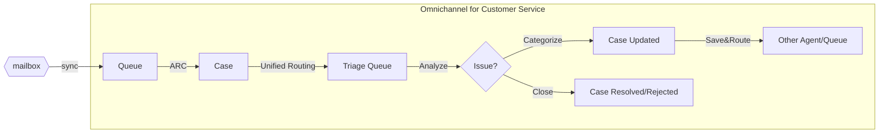
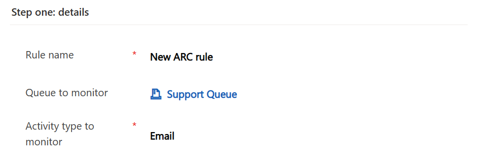
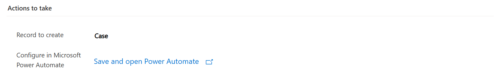
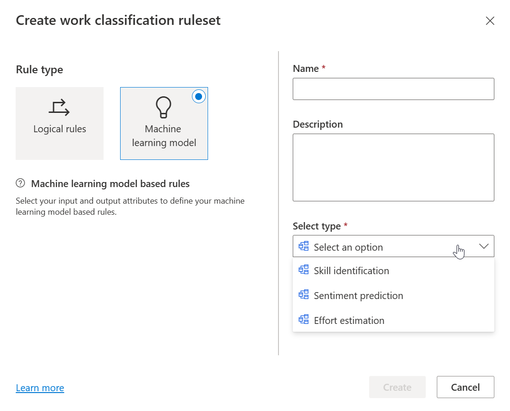
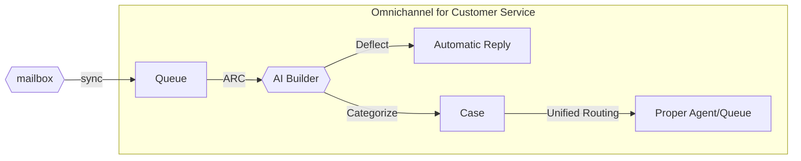
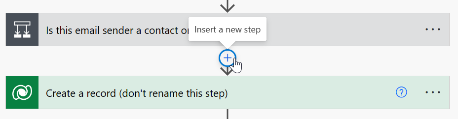
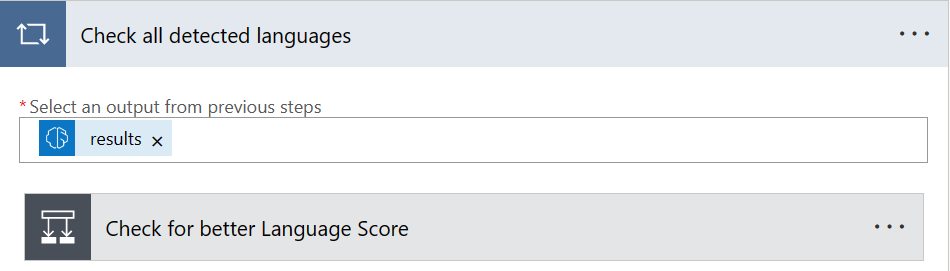
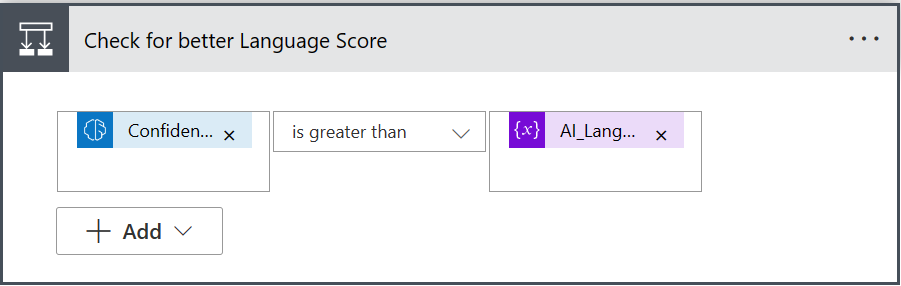
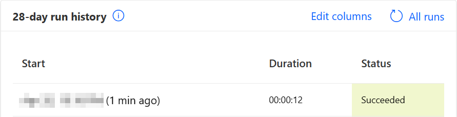
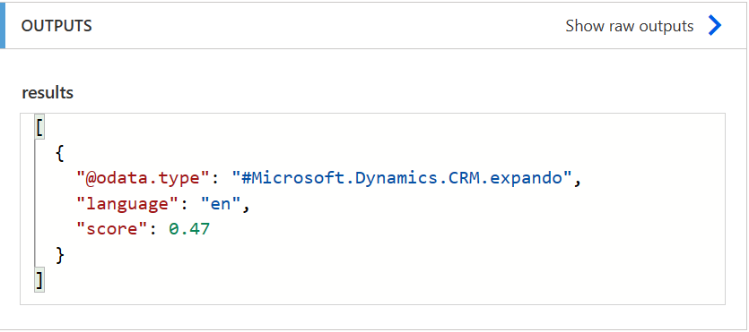

# Route or deflect cases using AI Builder
Case management is the core of any customer service solution.  
Dynamics 365 Customer Service offers many features to collect customer support inquiries, track them as cases and allow agents to work on a resolution.  

In particular, when working with Omnichannel for Customer Service, it is common to receive requests from multiple sources.  While some of these channels imply a direct interaction with the customer (e.g. chatbot, direct call) and therefore allow the collection of detailed information through scoping questions, other channels are asynchronous in nature, like for example emails.  
  
Working with unstructured data, as emails are by nature, may imply additional effort when processing the resulting case, in order to:
- Analyze the original message
- Define the nature of the request
- Understand how the case needs to be assigned and resolved

## Email-to-case process with ARC and Unified Routing
Let's consider a typical scenario like the following:

An organization would probably have a support mailbox (i.e. ``support@contoso.com``) which external contacts will use to forward their support requests.

When this mailbox is associated to a queue in Customer Service, and the queue is configured to [convert incoming emails to activities](https://learn.microsoft.com/en-us/dynamics365/customer-service/set-up-queues-manage-activities-cases?tabs=customerserviceadmincenter#create-a-queue), every new incoming message will be created as an email activity and registered as a queue item.

By leveraging [Automatic Rercord Creation rules](https://learn.microsoft.com/en-us/dynamics365/customer-service/automatically-create-update-records) these activities can be transformed automatically into new cases.

Then, through [Record Routing](https://learn.microsoft.com/en-us/dynamics365/customer-service/set-up-record-routing?tabs=customerserviceadmincenter), the newly created cases can be delivered to agents for resolution.

Since the case description was populated automatically with the email body, the actual request for the case could be hard to identify. Also, the customer could be sending the request to a wrong mailbox (e.g. a support request to an "info" mailbox).

For cases originating from emails, the organization may then need to have one or more agents dedicated to manually sorting through those cases, to triage and categorize them, and eventually route again the request to have it assigned to the proper owner.  

This could imply a significant effort in dedicated resources, and it might be a good idea to apply some automation in this scenario.

## AI capabilities in Unified Routing
Unified Routing provides capabilities to apply machine learning model based rules during the [work classification](https://learn.microsoft.com/en-us/dynamics365/customer-service/configure-work-classification) phase:  

While these are some powerful options at our disposal, there are still a few scenarios that might not be covered:
- There is currently not an option to invoke a different additional model, for example a custom model 
- The work classification rules are applied at worksteam level, there is not an option to apply machine learning at an early stage, for example before the routing actually takes place

> Always check product documentation and roadmap to be aware of all latest available features

## Power Automate and AI Builder
By looking at the above definition of the ARC actions, we can notice the link "Configure in Microsoft Power Automate".
Modern ARC actions are in fact implemented as a Power Automate flow. The automatically generated flow will have some predefined steps, like recognizing the email sender and create the case record, but can be further edited to add addtional steps:

> Please note that some of the predefined steps are restricted for editing. Changing or moving these steps in unsupported ways could prevent the ARC rule to work properly.

One of the exciting features of Power Automate, is the capability to [use AI Builder models](https://learn.microsoft.com/en-us/ai-builder/use-in-flow-overview) within a flow.

AI BUilder offers many prebuilt models: sentiment analysis, category clasification, language detection, entity extraction, and many more. It is also possible to create and train a custom model.

## Better email-to-case process with AI Builder
By leveraging the capabilities of Power Automate and AI Builder, it's possible to evolve the initial scenario:

Adding AI Builder actions to the ARC flow, we can analyze the original text of the email, extract relevant information, categorize the case during initial creation, and allow the routing engine to identify the proper destination.

## Adding AI Builder actions in ARC flow
To demonstrate this apporach, we'll use two of the prebuilt AI Builder models:
- [Language detection](https://learn.microsoft.com/en-us/ai-builder/flow-language-detection)
- [Category extraction](https://learn.microsoft.com/en-us/ai-builder/prebuilt-category-classification-pwr-automate)

> Prebuilt models are a great way to start with AI Builder. However, to fit your organization's requirements, you may want to consider the creation of a custom model, to define custom categories and train the model with the history of real customer interactions.

Our flow will be integrated with the following logic:
- Detect the language used by the customer in the original email
- Identify the category of the request
- Store the extracted information in the new case

When looking at what these models declare as output, we notice that we'll receive a `string` value for both Language/Classification, along with a Confidence score, which is a `float`. 

We therefore need to define some new columns in the case table, to store these values after we invoke the AI model:

It's also a good idea to add these new columns to the case form, so we'll be able to see their values during our test later.

Now that the datamodel is ready, we can start editing the flow in Power Automate. We'll want to position our new steps just after the check on the email sender, and right before of the case creation:

The first step we're adding is the language detection. To do that we filter the available operations by selecting AI Builder:

Then we search for the desiderd action:

The step is added to our flow, and we just need to set the email description as the input parameter:

We'll now define variables to store the outputs of the language detection:

Since the result of the language detection is potentially an array, we process all results with a "for each" step, to find the result with best confidence score:

This is a demonstration of how we can process multiple results from any model. You could decide for example to store all results in a related table for further use.

Another approach would be to always get the first element from the results by using the `first(...)` expression, directly in variable initialization or even during case creation. 

> Please always check the definition of the model you choose, to understand how the output is structured and what's the best way to read result values.

Once we have the language detection set, we can repeat the same with the category classification. Please note that in this case we also have to provide a language code as input, so we can reuse the output from the previous model:

We'll read the outputs of the category classification model in the same way we did before for language detection.

After that, we're ready to infer these values during case creation, by editing the "Create a record" step:

With these changes, everytime the ARC flow will transform a new email, our logic will be executed and the new case columns will be filled with the results from AI Builder models.

## Testing the process
Now that we implemented all the changes, we're ready to perform a test. As a prerequisite, of course, we need to have correctly configured server-side-sync on a mailbox associated with the queue where the ARC rule will trigger, otherwise we won't be able to receive any emails.

Let's compose a new email, simulating the feedback from a dissatisfied customer, and send it to the queue we configured:

After a few minutes we can see that the mail is synchronized in Dynamics 365 and registered as a new activity:

Let's check our Power Automate flow and we'll see it was correctly triggered:

If we open the details of this execution, we can check the results of the language detection and category extraction models:

Finally, going back into Customer Service to see the generated case, we can see the values stored in the record:

With these values, we can enter the configuration of the workstream, and define new routing rules to divert the case to a specific queue, basing on the predicted category:

## Final thoughts
We saw how, with a low code / no code approach, it is really simple to enhance a typical email-to-case process with the addition of AI automation, enhancing and simplifying case routing.

AI Builder offers many capabilities, and opens the opportunity to achieve interesting results when used in combination with Customer Service.

We could for example implement a flow recognizing customers requesting instructions to reset their credentials, and generate an automated response with a link to a KB explaining self-service procedures.

Again, we could implement a flow to detect a customer asking for the status of a shipment. The flow could extract the unique number of the shipment, call an external API to check the status, and provide an answer to the customer automatically, resolving the case without human intervention.

With the announcement of exciting [new Open AI capabilities in AI Builder](https://learn.microsoft.com/en-us/ai-builder/prebuilt-azure-openai), it will be possible to implement many additional scenarios.
