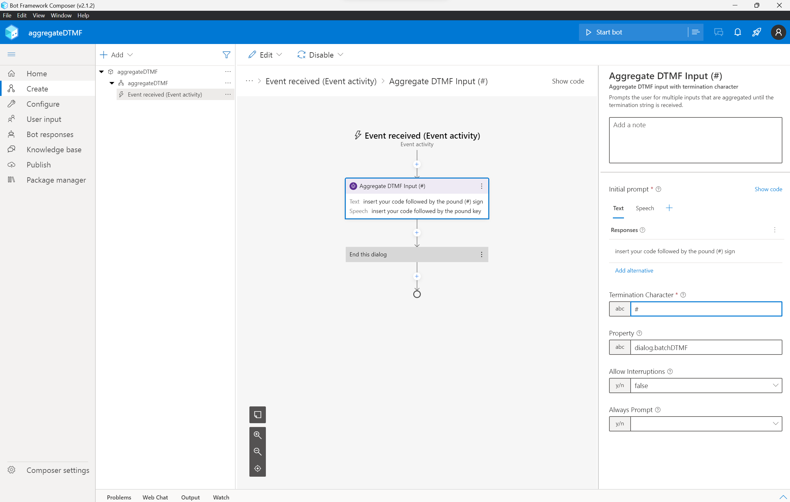
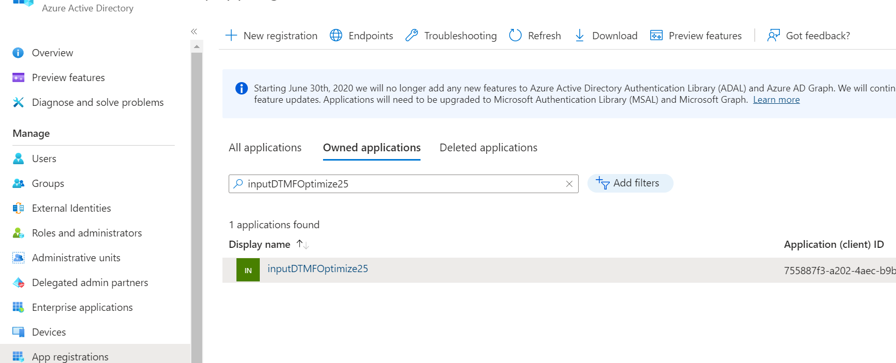
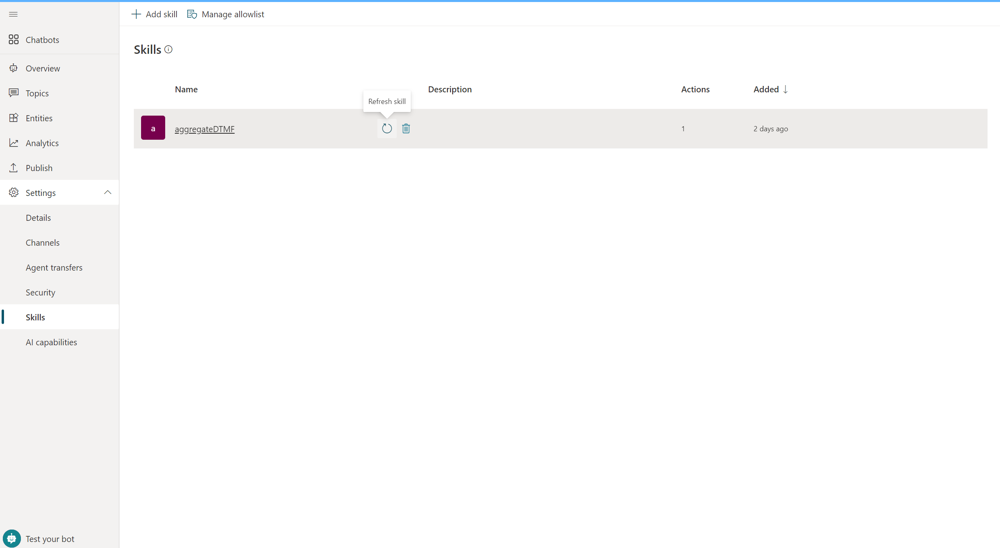
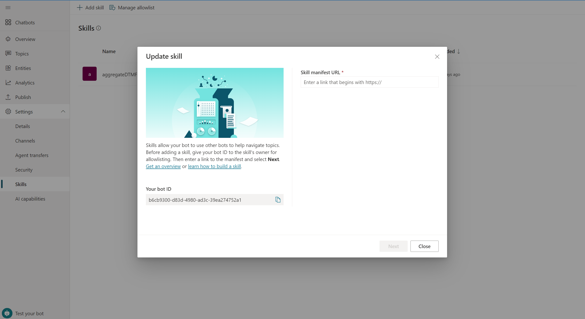
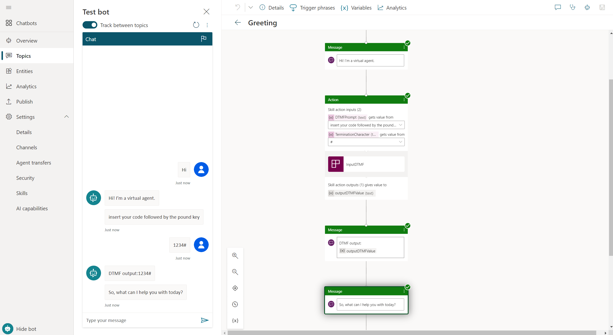

# Using Bot Framework Composer skill to add DTMF aggregation to Power Virtual Agents

> Note: For brevity, `Microsoft.Bot.Components.Telephony` will be referred to as _Telephony Extensions_.

For DTMF aggregation on PVA, Bot Framework Skills are required.​  
It is needed to develop Semi-pro-code solutions that leverage the Bot Framework Composer, and the Bot Framework Telephony Package.  
In the following link [**https://aka.ms/pvavoiceskills**](https://aka.ms/pvavoiceskills) you can find a whole full guide to develop a skill by Bot Framework Composer and add the custom skill to Power Virtual Agent Bot; and
in the [learn Microsoft page](https://learn.microsoft.com/en-us/power-virtual-agents/configuration-add-skills) you find link thatincludes the errors you may get when adding your skill to PVA bot.  

The intent of this article is to provide a sample code of the custom skill that use [Aggregate DTMF Input (#)](https://github.com/microsoft/botframework-components/tree/main/packages/Telephony#aggregate-dtmf-input-) included in the _Telephony Extensions_.  
**Aggregate DTMF Input (#)** Prompts the user for multiple inputs that are aggregated until the *Termination Character*  is received.  
  

## Sample code
In the following link you can find the [Bot Framework Skill](./artifacts/aggregateDTMFSkill.zip) the zip file contains the  a sample Bot Framework Skill project.  

In the following link you can find the [PVA bot solution](./artifacts/AggregateDTMF_1_0_0_0.zip) the zip flle is the PowerApps solution that contains the Power Virtual Agents bot.  

## Setting up the environment
To work on the bot framework skill sample code, you'll need a set of things to be successful:

- An [Azure Account](https://azure.microsoft.com/free/)
- The [Bot Framework Composer](https://aka.ms/bf-composer-download-win) (optional, but assumed for this document)
- A PVA Bot integrated with Dynamics 365 Customer Service Omnichannel Voice

For PVA integrated in Omnichannel Voice you can import the sample solution [PVA bot solution](./artifacts/AggregateDTMF_1_0_0_0.zip) in your D365 Customer Service Omnichannel environment.
As soon as the solution is imported you can open the PVA Bot.  
  
From the bot you need to take the Bot Id that will be used in the Skill publishing step.  
  

Assuming you have the items listed in the requirements above, our basic flow will be to open the sample project with Bot Framework Composer; author a basic skill; and then publish the skill to Azure.  

First up, given you've installed Composer, open it up and open the Skill Sample project.  

After this, you'll be taken to the composer authoring canvas, which you'll find is relatively similar to that in Power Virtual Agents. In this sample, the Telephony Package extension is used. From the left nav of the Composer UI, choose **Package Manager**, and from within that UI go to Installed tab.  

After you got familiar with the Bot Framework Composer, authoring the skill, it is time to publish the Skill, please flow the guide in the link posted at the begining of this document.
[Publishing to Azure including creating Azure resources](https://github.com/microsoft/botframework-components/blob/main/packages/Telephony/UsingComposerToBuildPVAVoiceSkills.md#publishing-to-azure-including-creating-azure-resources).  
Once the skill is published, a last step before leaving Azure. To further ensure security, PVA requires that a skill be in the same AAD Tenant as the PVA Bot. First go to the Azure Portal in the browser at (https://portal.azure.com). Log in, and navigate to the App Registration section.
  
Within here, search for the app registration using the name for the skill. Once found, click on the Branding and Properties element in the left hand menu. From here, either the Home Page URL must match the domain of the skill or the Publisher Domain must match the AAD tenant of the PVA Bot. The latter is the more secure solution.
   

## Skill in PVA
In the PVA Bot included in the solution the skill is already added, so you need to refresh that one 
  
inserting the Skill Manifest url you got after the skill publishing.  

## Test your Skill

You are now ready to interact with the bot on the test canvas. If all has gone well, the skill should be executed as a step just like any other dialog step in the bot.

